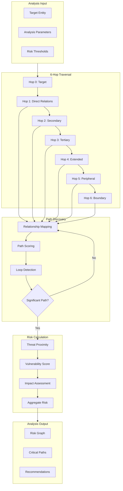
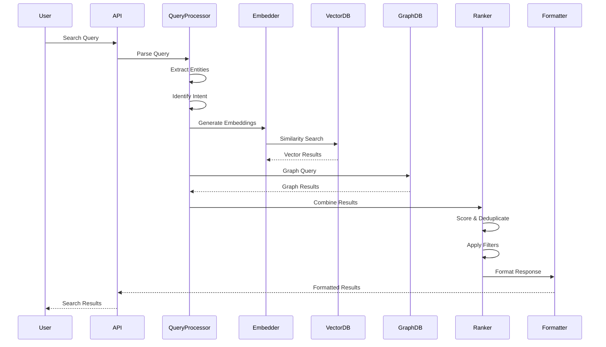
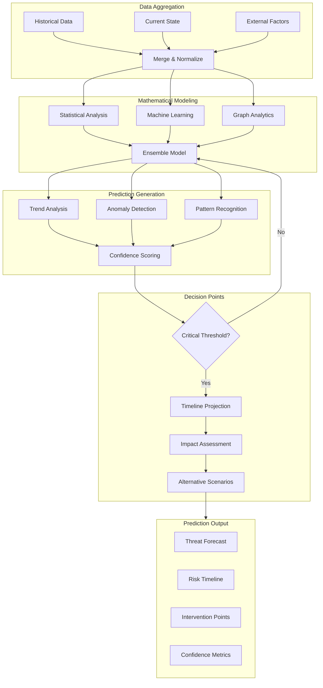
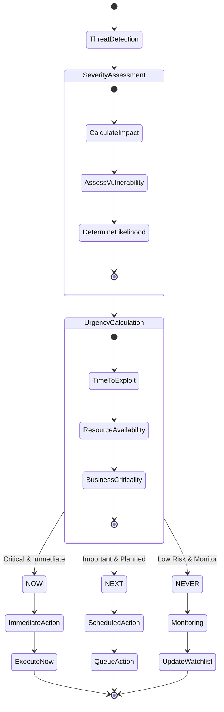
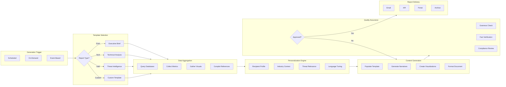
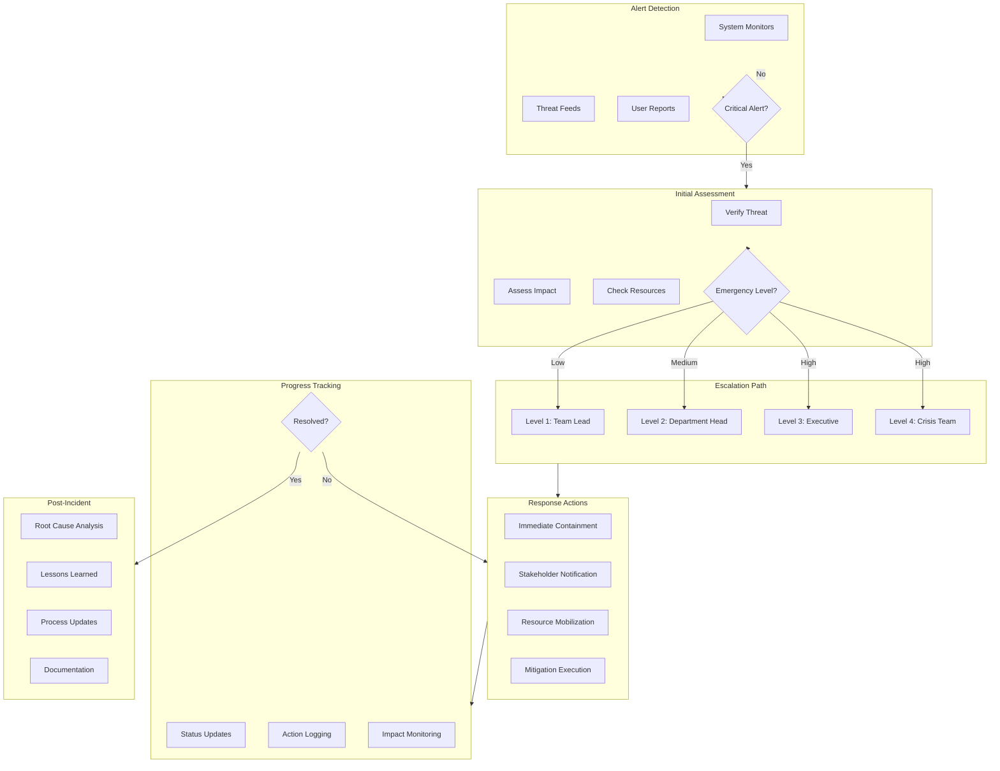
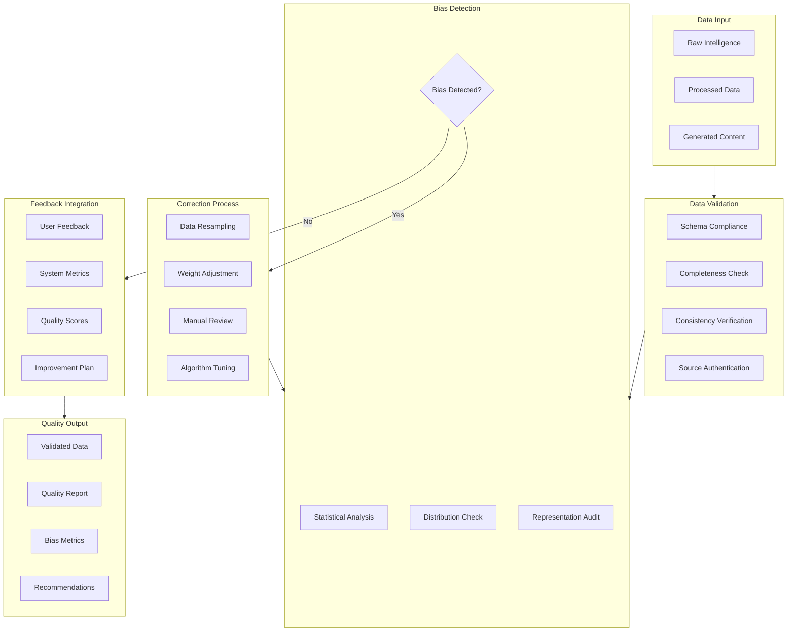
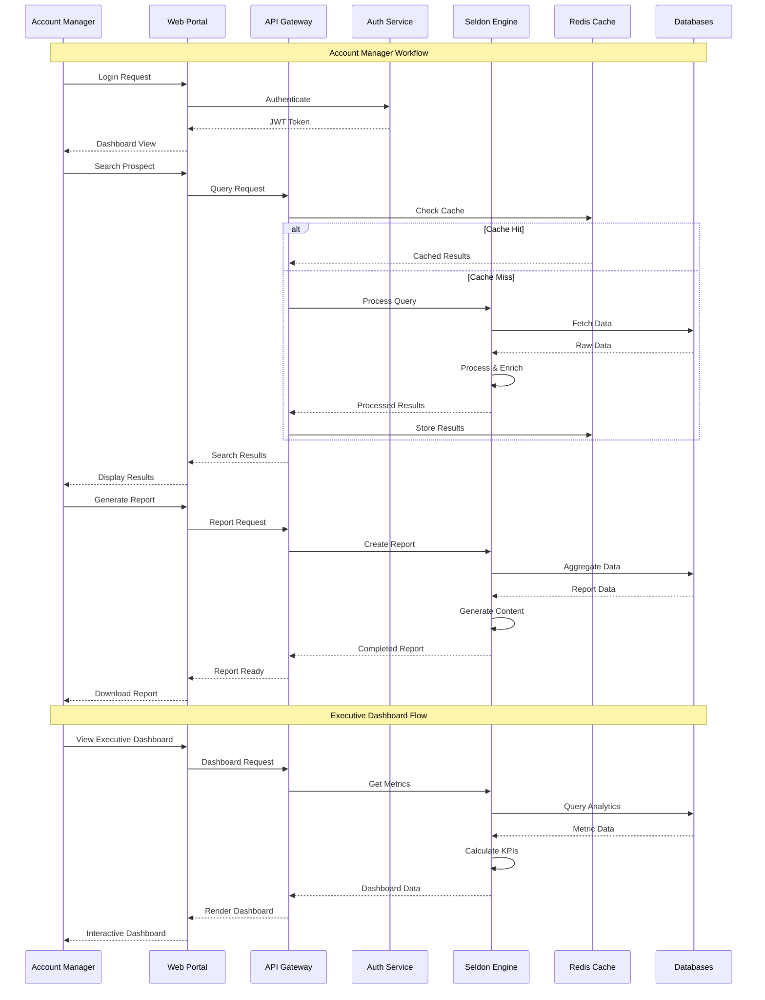

# Project Seldon Master Process Flow Diagrams

## Document Overview
This document provides comprehensive process flow diagrams for all major components and workflows within Project Seldon. Each diagram illustrates data flows, decision points, and system interactions using Mermaid notation.

---

## 1. Master System Architecture Flow

The end-to-end data flow showing how intelligence moves from sources through processing to actionable insights.

```mermaid
flowchart TB
    subgraph Sources ["Intelligence Sources"]
        S1[CISA Advisories]
        S2[GitHub Repositories]
        S3[Annual Reports]
        S4[MITRE ATT&CK]
        S5[Dark Web Intel]
        S6[Industry Feeds]
    end

    subgraph Ingestion ["Ingestion Layer"]
        I1[Real-time Collectors]
        I2[Batch Processors]
        I3[API Integrators]
        I4[Web Scrapers]
    end

    subgraph Processing ["Processing Engine"]
        P1[Data Validation]
        P2[Entity Extraction]
        P3[Enrichment Pipeline]
        P4[Graph Construction]
        P5[Embedding Generation]
    end

    subgraph Storage ["Data Storage"]
        D1[(Neo4j Graph DB)]
        D2[(Pinecone Vector DB)]
        D3[(PostgreSQL)]
        D4[(Redis Cache)]
    end

    subgraph Analysis ["Analysis Layer"]
        A1[6-Hop Analyzer]
        A2[Semantic Search]
        A3[Psychohistory Engine]
        A4[Risk Calculator]
    end

    subgraph Decision ["Decision Layer"]
        DEC1[NOW/NEXT/NEVER]
        DEC2[Priority Matrix]
        DEC3[Action Recommender]
    end

    subgraph Output ["Output Layer"]
        O1[Executive Reports]
        O2[AM Playbooks]
        O3[Attack Briefs]
        O4[API Responses]
    end

    Sources --> Ingestion
    Ingestion --> Processing
    Processing --> Storage
    Storage --> Analysis
    Analysis --> Decision
    Decision --> Output
```

### Component Interactions
- **Service Boundaries**: Each layer operates independently with defined APIs
- **Data Flow**: Unidirectional flow with feedback loops for quality improvement
- **Error Handling**: Each layer includes retry logic and fallback mechanisms

---

## 2. Intelligence Collection Process

Multi-source intelligence gathering with validation and enrichment pipelines.

```mermaid
flowchart LR
    subgraph Collection ["Collection Phase"]
        C1[Schedule Trigger]
        C2[Manual Trigger]
        C3[Event Trigger]
    end

    subgraph Sources ["Source Management"]
        S1[Source Registry]
        S2[Credential Manager]
        S3[Rate Limiter]
    end

    subgraph Ingestion ["Ingestion Pipeline"]
        I1{Source Type?}
        I2[API Collector]
        I3[Web Scraper]
        I4[File Parser]
        I5[Stream Processor]
    end

    subgraph Validation ["Validation Layer"]
        V1[Schema Validator]
        V2[Content Verifier]
        V3[Duplicate Checker]
        V4{Valid?}
    end

    subgraph Enrichment ["Enrichment Pipeline"]
        E1[Entity Recognition]
        E2[Relationship Extraction]
        E3[Metadata Addition]
        E4[Classification]
    end

    subgraph Storage ["Storage Router"]
        ST1{Data Type?}
        ST2[Graph Store]
        ST3[Vector Store]
        ST4[Document Store]
    end

    Collection --> Sources
    Sources --> I1
    I1 -->|API| I2
    I1 -->|Web| I3
    I1 -->|File| I4
    I1 -->|Stream| I5
    I2 & I3 & I4 & I5 --> V1
    V1 --> V2 --> V3 --> V4
    V4 -->|Yes| E1
    V4 -->|No| Sources
    E1 --> E2 --> E3 --> E4
    E4 --> ST1
    ST1 -->|Graph| ST2
    ST1 -->|Embeddings| ST3
    ST1 -->|Documents| ST4
```

### Processing Modes
- **Real-time Processing**: For CISA advisories and critical alerts
- **Batch Processing**: For annual reports and large datasets
- **Hybrid Mode**: Intelligent switching based on source characteristics

---

## 3. 6-Hop Analysis Workflow

Graph traversal visualization showing relationship discovery and risk propagation.

### Traversal Strategy
- **Breadth-First Search**: For comprehensive coverage
- **Weighted Paths**: Prioritize high-risk relationships
- **Dynamic Pruning**: Skip low-value paths to optimize performance

---

## 4. Semantic Search Pipeline

Query processing and result ranking workflow.

### Search Optimization
- **Multi-Index Search**: Parallel queries across vector and graph databases
- **Result Fusion**: Intelligent combination of different result sets
- **Personalization**: User context influences ranking

---

## 5. Psychohistory Prediction Engine

Mathematical modeling and decision point identification workflow.

### Prediction Methodology
- **Multi-Model Approach**: Combines statistical, ML, and graph-based predictions
- **Confidence Intervals**: All predictions include uncertainty quantification
- **Scenario Planning**: Multiple future paths with probability weights

---

## 6. NOW/NEXT/NEVER Decision Flow

Threat assessment and action recommendation pipeline.

### Decision Criteria
- **NOW**: Exploits in the wild, critical infrastructure at risk
- **NEXT**: Known vulnerabilities, patches available, scheduled maintenance
- **NEVER**: Low impact, mitigated risks, false positives

---

## 7. Report Generation Workflow

Automated report creation with personalization and quality checks.

### Report Quality Standards
- **Accuracy**: All data points verified against source
- **Relevance**: Content tailored to recipient's context
- **Timeliness**: Reports generated within SLA windows

---

## 8. Emergency Response Process

Critical alert handling and escalation workflow.

### Response Priorities
- **Life Safety**: Human safety takes precedence
- **Critical Infrastructure**: Protect essential services
- **Data Protection**: Prevent exfiltration or destruction
- **Business Continuity**: Maintain operations

---

## 9. Quality Assurance Pipeline

Data validation and bias detection workflow.

### Quality Metrics
- **Accuracy Rate**: >99% for critical data points
- **Bias Score**: <5% variance from baseline
- **Completeness**: 100% required fields populated
- **Timeliness**: Processing within defined SLAs

---

## 10. User Interaction Flows

Account Manager workflows and executive dashboard interactions.

### User Experience Principles
- **Response Time**: <2 seconds for searches, <10 seconds for reports
- **Intuitive Navigation**: Maximum 3 clicks to any feature
- **Progressive Disclosure**: Show relevant information based on context
- **Accessibility**: WCAG 2.1 AA compliance

---

## Process Integration Points

### Cross-Process Communication
- All processes communicate via standardized APIs
- Event-driven architecture enables real-time updates
- Centralized logging for process monitoring
- Circuit breakers prevent cascade failures

### Performance Optimization
- Caching strategies at multiple levels
- Parallel processing where applicable
- Resource pooling for expensive operations
- Auto-scaling based on load patterns

### Security Considerations
- End-to-end encryption for sensitive data
- Role-based access control (RBAC)
- Audit logging for all actions
- Regular security assessments

---

## Conclusion

These process flow diagrams provide a comprehensive view of Project Seldon's operational workflows. Each process is designed for scalability, reliability, and security while maintaining the flexibility to adapt to evolving intelligence requirements.

For implementation details and API specifications, refer to the corresponding technical documentation in the Architecture section.