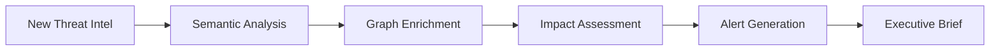
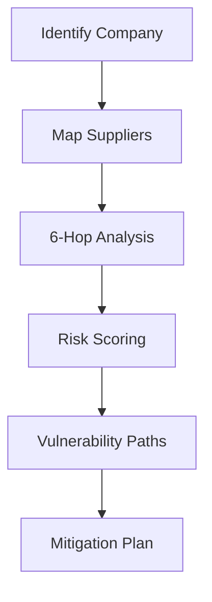
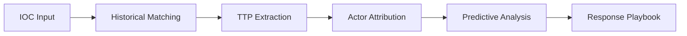

# Project Seldon Quick Start Guide
## Get Operational in 30 Minutes or Less

Welcome to Project Seldon! This guide will have you discovering threats and analyzing supply chains within 30 minutes. Let's dive right in!

---

## Prerequisites Checklist (5 minutes)

### Required Software
- [ ] **Neo4j Desktop** (v5.0+) or Neo4j AuraDB instance
- [ ] **Python 3.9+** with pip
- [ ] **Pinecone Account** (free tier works)
- [ ] **Git** for cloning repositories
- [ ] **Text Editor** (VS Code recommended)

### Required Access
- [ ] Neo4j database credentials (username/password)
- [ ] Pinecone API key
- [ ] Read access to Project Nightingale data sources

### Required Knowledge
- Basic command line usage
- Understanding of graph databases (helpful but not required)
- Familiarity with security concepts (CVEs, MITRE ATT&CK)

---

## Installation Process (5 minutes)

### Step 1: Clone the Repository
```bash
git clone https://github.com/your-org/project-seldon.git
cd project-seldon
```

### Step 2: Install Dependencies
```bash
pip install -r requirements.txt
```

### Step 3: Configure Environment Variables
Create a `.env` file in the project root:
```bash
# Neo4j Configuration
NEO4J_URI=bolt://localhost:7687
NEO4J_USER=neo4j
NEO4J_PASSWORD=your-password-here

# Pinecone Configuration
PINECONE_API_KEY=your-api-key-here
PINECONE_ENVIRONMENT=us-east-1-aws
PINECONE_INDEX_NAME=seldon-threats

# Optional: Project Nightingale Integration
NIGHTINGALE_DATA_PATH=/path/to/nightingale/data
```

### Step 4: Initialize Databases
```bash
python scripts/init_databases.py
```

This will:
- Create Neo4j schema and indexes
- Initialize Pinecone index with proper dimensions
- Load initial threat intelligence data

---

## Your First Queries (10 minutes)

### Example 1: Find All Threats to Energy Infrastructure
This query showcases the power of 6-hop reasoning combined with semantic search.

#### Neo4j Query (Graph Relationships)
```cypher
// Find all threats targeting energy infrastructure
MATCH path = (t:ThreatActor)-[:USES]->(m:Malware)-[:TARGETS]->(s:Sector {name: 'Energy'})
RETURN t.name as ThreatActor, 
       collect(DISTINCT m.name) as Malware, 
       count(DISTINCT path) as AttackPaths
ORDER BY AttackPaths DESC
LIMIT 10
```

#### Pinecone Query (Semantic Search)
```python
from seldon import SemanticSearch

# Initialize semantic search
search = SemanticSearch()

# Find similar threats
results = search.find_similar(
    query="ransomware attacks on power grid SCADA systems",
    top_k=5,
    filters={"sector": "energy", "severity": "critical"}
)

for result in results:
    print(f"Threat: {result.name}")
    print(f"Similarity: {result.score:.2f}")
    print(f"Description: {result.description}\n")
```

### Example 2: Supply Chain Attack Discovery (6-Hop Reasoning)
This demonstrates the unique 6-hop capability that traditional systems can't match.

```cypher
// Discover supply chain attack paths
MATCH path = (attacker:ThreatActor)-[:COMPROMISES*1..6]->(target:Company {sector: 'Energy'})
WHERE ALL(r in relationships(path) WHERE r.confidence > 0.7)
WITH path, attacker, target, 
     [n in nodes(path) | n.name] as attack_chain,
     reduce(risk = 1.0, r in relationships(path) | risk * r.confidence) as path_risk
WHERE path_risk > 0.3
RETURN attacker.name as Attacker,
       target.name as Target,
       attack_chain as SupplyChainPath,
       path_risk as RiskScore
ORDER BY path_risk DESC
LIMIT 5
```

### Example 3: Real-Time Vulnerability Impact Analysis
Combine graph traversal with semantic understanding:

```python
from seldon import ThreatIntelligence

ti = ThreatIntelligence()

# Analyze a new CVE's potential impact
impact_analysis = ti.analyze_cve_impact(
    cve_id="CVE-2024-12345",
    max_hops=6,
    sectors=["energy", "water", "food"]
)

print(f"Affected Companies: {impact_analysis['affected_count']}")
print(f"Critical Paths: {len(impact_analysis['critical_paths'])}")
print(f"Recommended Actions: {impact_analysis['mitigations']}")
```

---

## Basic Use Cases (10 minutes)

### Use Case 1: Threat Actor Profile Enrichment
```python
# Get comprehensive threat actor intelligence
actor_profile = ti.get_actor_profile(
    name="VOLT TYPHOON",
    include_ttps=True,
    include_infrastructure=True,
    max_depth=4
)

# Visualize the threat network
ti.visualize_threat_network(actor_profile, output="volt_typhoon_network.html")
```

### Use Case 2: Sector-Specific Threat Discovery
```cypher
// Find emerging threats to manufacturing sector
MATCH (t:Threat)-[:EMERGED_IN]->(timeframe:TimeWindow {year: 2024})
MATCH (t)-[:TARGETS]->(s:Sector {name: 'Manufacturing'})
MATCH (t)-[:USES]->(technique:Technique)
WHERE NOT EXISTS((t)-[:MITIGATED_BY]->(:Control))
RETURN t.name as EmergingThreat,
       collect(DISTINCT technique.name) as Techniques,
       t.first_seen as FirstSeen,
       t.severity as Severity
ORDER BY t.severity DESC
```

### Use Case 3: Executive Risk Dashboard Query
```python
# Generate executive-ready risk summary
risk_summary = ti.generate_executive_summary(
    company="Consumers Energy",
    timeframe="last_30_days",
    focus_areas=["ransomware", "supply_chain", "insider_threat"]
)

print(risk_summary.formatted_output())
```

---

## Common Workflows

### Workflow 1: Daily Threat Monitoring


### Workflow 2: Supply Chain Risk Assessment


### Workflow 3: Incident Response Support


---

## Troubleshooting First Steps

### Neo4j Connection Issues
```bash
# Test connection
python -c "from seldon import test_neo4j_connection; test_neo4j_connection()"

# Common fixes:
# 1. Check if Neo4j is running: sudo systemctl status neo4j
# 2. Verify credentials in .env file
# 3. Check firewall rules for port 7687
```

### Pinecone Index Errors
```python
# Verify Pinecone configuration
from seldon.utils import verify_pinecone_setup
verify_pinecone_setup()

# Rebuild index if needed
python scripts/rebuild_pinecone_index.py
```

### Performance Issues
```cypher
// Check Neo4j index usage
EXPLAIN MATCH (t:ThreatActor)-[:USES]->(m:Malware)
WHERE t.name = 'APT29'
RETURN t, m

// Create missing indexes
CREATE INDEX threat_actor_name IF NOT EXISTS FOR (t:ThreatActor) ON (t.name);
CREATE INDEX company_sector IF NOT EXISTS FOR (c:Company) ON (c.sector);
```

---

## Where to Get Help

### Documentation
- **Full Documentation**: `/docs/index.html`
- **API Reference**: `/docs/api/`
- **Schema Guide**: `/10_Project_Seldon/01_Architecture/PSYCHOHISTORY_SCHEMA.md`

### Support Channels
- **Slack**: #project-seldon
- **Email**: seldon-support@company.com
- **Office Hours**: Tuesdays 2-3 PM EST

### Quick References
- [Neo4j Cypher Cheat Sheet](https://neo4j.com/docs/cypher-cheat-sheet/)
- [Pinecone Best Practices](https://docs.pinecone.io/docs/best-practices)
- [MITRE ATT&CK Navigator](https://mitre-attack.github.io/attack-navigator/)

---

## Advanced "Wow" Queries

### The Power of 6-Hop Reasoning
This query finds hidden connections that traditional 2-3 hop systems would miss:

```cypher
// Discover hidden threat connections through 6 degrees of separation
MATCH path = (start:Company {name: 'Colonial Pipeline'})
              -[:SUPPLIES|DEPENDS_ON|PARTNERS_WITH|SHARES_INFRASTRUCTURE*1..6]-
              (end:Company)
WHERE start <> end
WITH path, end,
     [rel in relationships(path) | type(rel)] as relationship_types,
     length(path) as hop_count
MATCH (t:ThreatActor)-[:TARGETS]->(end)
RETURN DISTINCT t.name as ThreatActor,
       end.name as VulnerableCompany,
       hop_count as DegreesOfSeparation,
       relationship_types as ConnectionPath
ORDER BY hop_count ASC
LIMIT 10
```

### Semantic + Graph Magic
Combine natural language understanding with graph traversal:

```python
# Ask a complex question in plain English
question = "Which energy companies in the Midwest could be affected if a ransomware attack hit their shared SCADA system vendors?"

# Get intelligent response combining both systems
response = ti.answer_question(
    question=question,
    use_semantic_search=True,
    max_graph_depth=6,
    include_evidence=True
)

print(f"Answer: {response.summary}")
print(f"\nEvidence:")
for evidence in response.evidence:
    print(f"- {evidence.source}: {evidence.detail}")
```

---

## Next Steps

1. **Explore More Queries**: Check out `/10_Project_Seldon/06_Prompt_Library/` for advanced examples
2. **Custom Integrations**: See `/10_Project_Seldon/10_MCPs/` for integration patterns
3. **Build Dashboards**: Use `/10_Project_Seldon/08_Implementations/` templates
4. **Contribute**: Add your own threat intelligence sources

---

## Quick Command Reference

```bash
# Start all services
./scripts/start_seldon.sh

# Run daily intelligence update
python scripts/daily_intel_update.py

# Generate executive report
python scripts/generate_executive_report.py --company "Your Company" --output pdf

# Check system health
python scripts/health_check.py
```

---

**Congratulations!** You're now ready to leverage the full power of Project Seldon's 6-hop reasoning and semantic search capabilities. Remember, the magic happens when you combine graph traversal with semantic understanding - something only Seldon can do at this scale.

For questions or feedback, reach out to the Seldon team. Happy threat hunting!

---

*Last Updated: January 2025*
*Version: 1.0*