# ETL Architecture Overview
## Project Seldon - Intelligence Data Pipeline

**Version**: 1.0  
**Date**: December 6, 2025  
**Classification**: Production Architecture Document

## Executive Summary

This document outlines the comprehensive ETL (Extract, Transform, Load) architecture for Project Seldon's intelligence data pipeline, processing 100,406+ sources into Neo4j knowledge graph and Pinecone vector databases for advanced threat intelligence and prospect analysis.

## Table of Contents

1. [Architecture Overview](#architecture-overview)
2. [Data Flow Diagrams](#data-flow-diagrams)
3. [Collection Stage](#collection-stage)
4. [Transformation Stage](#transformation-stage)
5. [Loading Stage](#loading-stage)
6. [Parallel Processing](#parallel-processing)
7. [Error Handling](#error-handling)
8. [Monitoring & Alerting](#monitoring--alerting)
9. [Performance Optimization](#performance-optimization)
10. [Security Considerations](#security-considerations)

## Architecture Overview

### Core Components

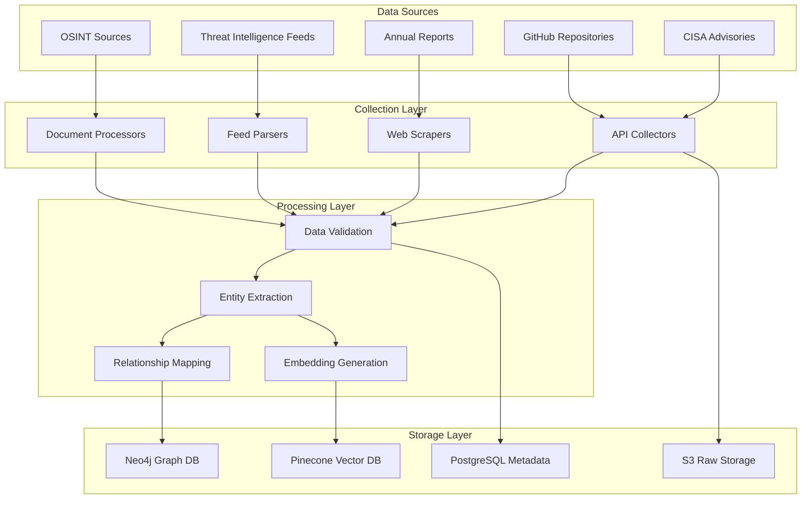

## Data Flow Diagrams

### Primary Data Pipeline

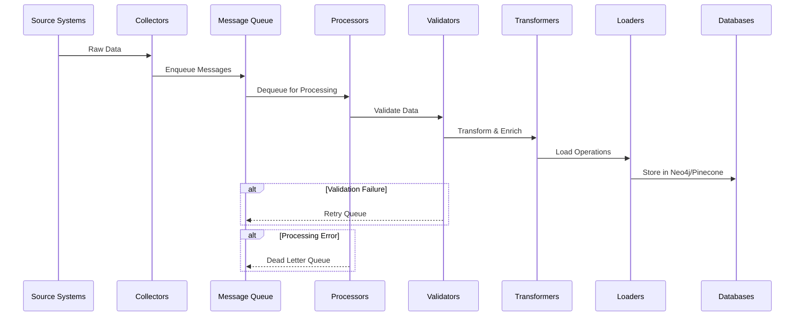

### Real-time Intelligence Pipeline

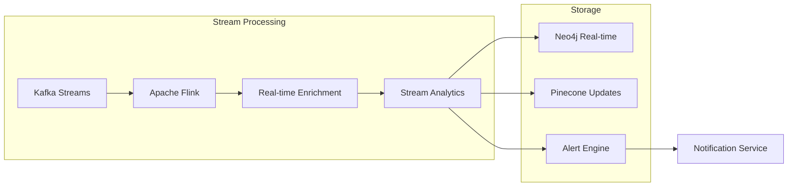

## Collection Stage

### 1. Source Configuration

```yaml
sources:
  cisa:
    type: api
    endpoint: https://www.cisa.gov/api/v1/
    rate_limit: 100/min
    retry_policy:
      max_retries: 3
      backoff: exponential
    
  github:
    type: api
    endpoints:
      - search: https://api.github.com/search/repositories
      - content: https://api.github.com/repos/{owner}/{repo}/contents
    auth: bearer_token
    rate_limit: 5000/hour
    
  annual_reports:
    type: scraper
    targets:
      - pattern: "*.pdf"
      - pattern: "*.html"
    parallel_workers: 10
```

### 2. Collection Architecture

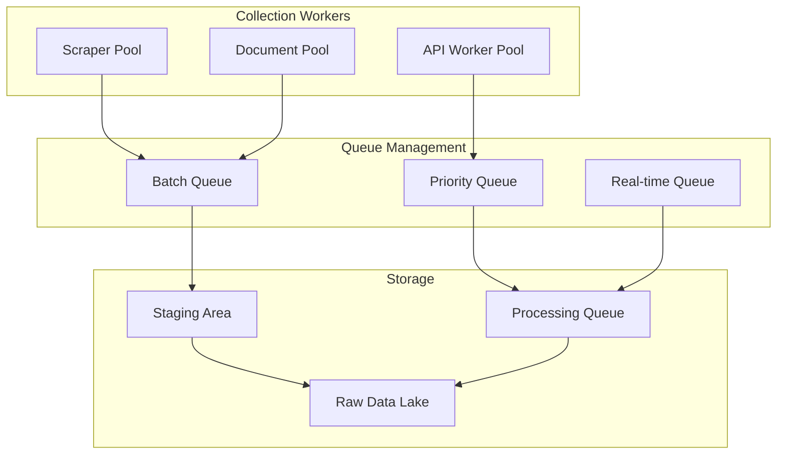

### 3. Collector Implementation

```python
class IntelligenceCollector:
    def __init__(self, source_config):
        self.config = source_config
        self.rate_limiter = RateLimiter(source_config.rate_limit)
        self.retry_policy = RetryPolicy(source_config.retry_policy)
        
    async def collect(self):
        async with aiohttp.ClientSession() as session:
            tasks = []
            for endpoint in self.config.endpoints:
                task = self.collect_endpoint(session, endpoint)
                tasks.append(task)
            
            results = await asyncio.gather(*tasks, return_exceptions=True)
            return self.process_results(results)
```

## Transformation Stage

### 1. Data Processing Pipeline

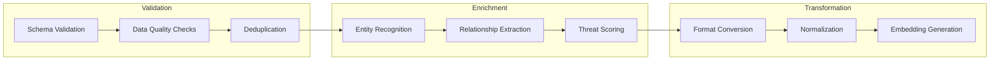

### 2. Entity Extraction Pipeline

```python
class EntityExtractor:
    def __init__(self):
        self.nlp = spacy.load("en_core_web_trf")
        self.custom_patterns = self.load_patterns()
        
    def extract_entities(self, text):
        doc = self.nlp(text)
        
        entities = {
            'organizations': [],
            'threat_actors': [],
            'vulnerabilities': [],
            'technologies': [],
            'locations': []
        }
        
        # NER extraction
        for ent in doc.ents:
            if ent.label_ == "ORG":
                entities['organizations'].append(ent.text)
                
        # Custom pattern matching
        for pattern in self.custom_patterns:
            matches = pattern.findall(text)
            entities[pattern.category].extend(matches)
            
        return entities
```

### 3. Relationship Mapping

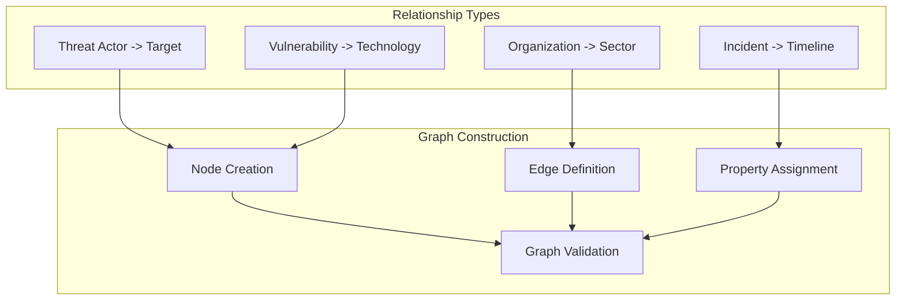

## Loading Stage

### 1. Neo4j Graph Loading

```python
class Neo4jLoader:
    def __init__(self, uri, auth):
        self.driver = GraphDatabase.driver(uri, auth=auth)
        
    async def load_batch(self, entities, relationships):
        async with self.driver.async_session() as session:
            # Create nodes
            await session.run("""
                UNWIND $entities AS entity
                MERGE (n:Entity {id: entity.id})
                SET n += entity.properties
            """, entities=entities)
            
            # Create relationships
            await session.run("""
                UNWIND $relationships AS rel
                MATCH (a:Entity {id: rel.source})
                MATCH (b:Entity {id: rel.target})
                MERGE (a)-[r:RELATED {type: rel.type}]->(b)
                SET r += rel.properties
            """, relationships=relationships)
```

### 2. Pinecone Vector Loading

```python
class PineconeLoader:
    def __init__(self, api_key, environment):
        pinecone.init(api_key=api_key, environment=environment)
        self.index = pinecone.Index("intelligence-vectors")
        
    async def load_embeddings(self, documents):
        batch_size = 100
        
        for i in range(0, len(documents), batch_size):
            batch = documents[i:i+batch_size]
            
            vectors = []
            for doc in batch:
                vector = {
                    'id': doc['id'],
                    'values': doc['embedding'],
                    'metadata': {
                        'source': doc['source'],
                        'timestamp': doc['timestamp'],
                        'entity_type': doc['entity_type']
                    }
                }
                vectors.append(vector)
            
            await self.index.upsert(vectors=vectors)
```

## Parallel Processing

### 1. Worker Pool Architecture

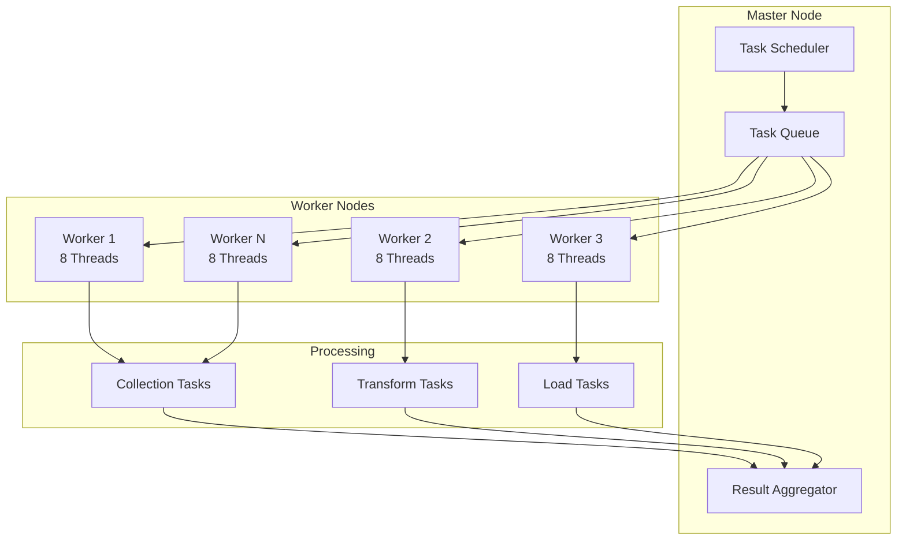

### 2. Distributed Processing Implementation

```python
from celery import Celery
from kombu import Queue

app = Celery('intelligence_etl')

app.conf.task_routes = {
    'etl.collect.*': {'queue': 'collection'},
    'etl.transform.*': {'queue': 'transformation'},
    'etl.load.*': {'queue': 'loading'}
}

app.conf.task_queues = (
    Queue('collection', routing_key='collect.#'),
    Queue('transformation', routing_key='transform.#'),
    Queue('loading', routing_key='load.#'),
)

@app.task(bind=True, max_retries=3)
def process_source(self, source_id, source_config):
    try:
        # Collection
        data = collect_data(source_config)
        
        # Transformation
        transformed = transform_data(data)
        
        # Loading
        load_to_databases(transformed)
        
    except Exception as exc:
        raise self.retry(exc=exc, countdown=60)
```

## Error Handling

### 1. Error Handling Strategy

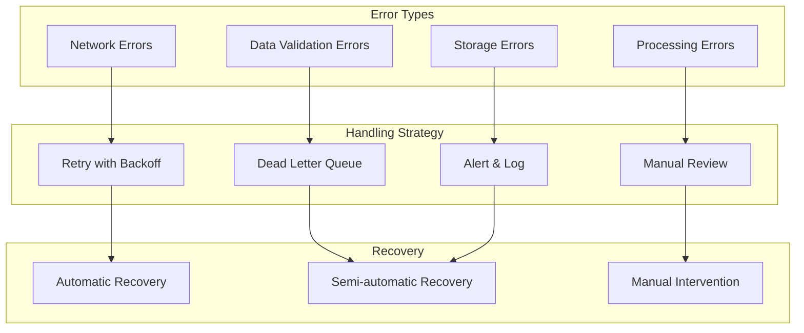

### 2. Retry Logic Implementation

```python
class RetryHandler:
    def __init__(self, max_retries=3, base_delay=1):
        self.max_retries = max_retries
        self.base_delay = base_delay
        
    async def execute_with_retry(self, func, *args, **kwargs):
        last_exception = None
        
        for attempt in range(self.max_retries):
            try:
                return await func(*args, **kwargs)
                
            except RetriableError as e:
                last_exception = e
                delay = self.base_delay * (2 ** attempt)
                
                logger.warning(
                    f"Attempt {attempt + 1} failed: {e}. "
                    f"Retrying in {delay} seconds..."
                )
                
                await asyncio.sleep(delay)
                
            except NonRetriableError as e:
                logger.error(f"Non-retriable error: {e}")
                raise
                
        raise MaxRetriesExceeded(last_exception)
```

### 3. Dead Letter Queue Processing

```python
class DeadLetterProcessor:
    def __init__(self, dlq_config):
        self.dlq = DeadLetterQueue(dlq_config)
        self.analyzer = ErrorAnalyzer()
        
    async def process_failed_items(self):
        while True:
            failed_items = await self.dlq.get_batch(size=100)
            
            for item in failed_items:
                analysis = self.analyzer.analyze(item)
                
                if analysis.is_recoverable:
                    await self.requeue_for_processing(item)
                else:
                    await self.send_for_manual_review(item)
                    
            await asyncio.sleep(300)  # Process every 5 minutes
```

## Monitoring & Alerting

### 1. Monitoring Architecture

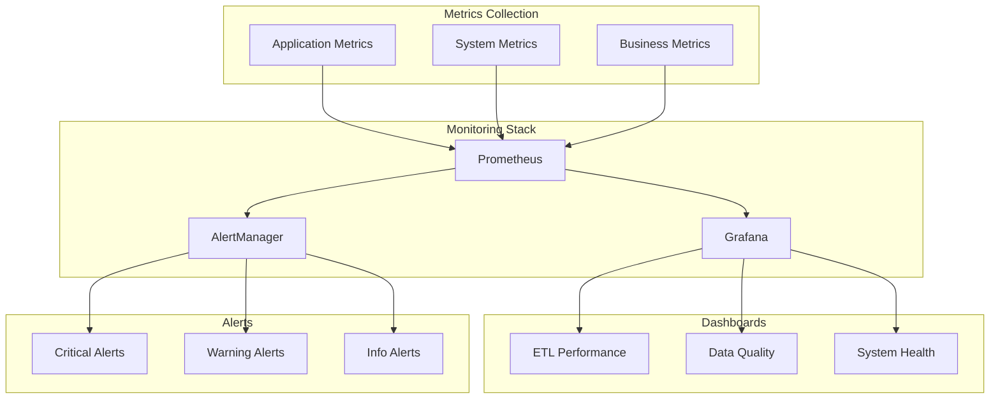

### 2. Key Performance Indicators

```yaml
kpis:
  throughput:
    - records_per_second: 10000
    - bytes_per_second: 100MB
    
  latency:
    - p50: 100ms
    - p95: 500ms
    - p99: 1000ms
    
  quality:
    - validation_success_rate: 99.5%
    - duplicate_rate: < 0.1%
    - enrichment_rate: > 95%
    
  availability:
    - uptime: 99.9%
    - error_rate: < 0.1%
```

### 3. Alert Configuration

```python
class AlertingSystem:
    def __init__(self):
        self.rules = self.load_alert_rules()
        self.channels = self.configure_channels()
        
    def configure_alerts(self):
        return {
            'critical': {
                'etl_pipeline_down': {
                    'condition': 'up{job="etl_pipeline"} == 0',
                    'duration': '5m',
                    'severity': 'critical',
                    'channels': ['pagerduty', 'slack']
                },
                'high_error_rate': {
                    'condition': 'rate(errors[5m]) > 0.1',
                    'duration': '10m',
                    'severity': 'critical',
                    'channels': ['email', 'slack']
                }
            },
            'warning': {
                'slow_processing': {
                    'condition': 'avg(processing_time) > 1000',
                    'duration': '15m',
                    'severity': 'warning',
                    'channels': ['slack']
                }
            }
        }
```

## Performance Optimization

### 1. Optimization Strategies

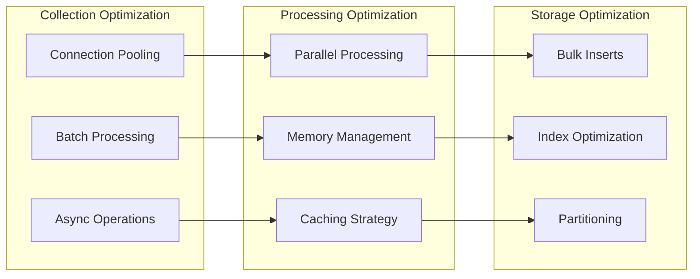

### 2. Caching Implementation

```python
class IntelligenceCache:
    def __init__(self):
        self.redis = Redis(
            host='localhost',
            port=6379,
            decode_responses=True
        )
        self.ttl = 3600  # 1 hour
        
    async def get_or_compute(self, key, compute_func):
        # Check cache
        cached = await self.redis.get(key)
        if cached:
            return json.loads(cached)
            
        # Compute if not cached
        result = await compute_func()
        
        # Store in cache
        await self.redis.setex(
            key,
            self.ttl,
            json.dumps(result)
        )
        
        return result
```

## Security Considerations

### 1. Security Architecture

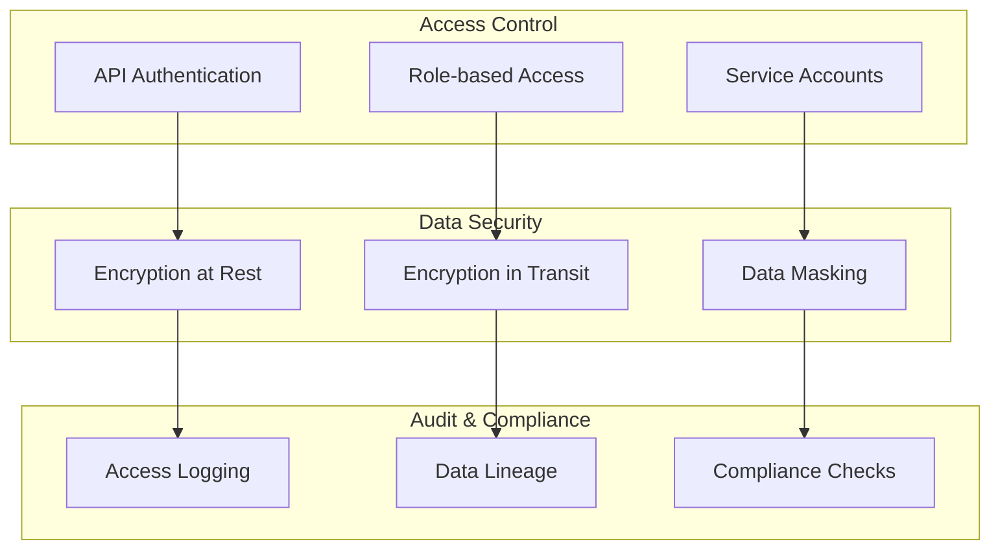

### 2. Security Implementation

```python
class SecurityManager:
    def __init__(self):
        self.encryptor = DataEncryptor()
        self.auth_manager = AuthenticationManager()
        self.audit_logger = AuditLogger()
        
    async def secure_pipeline_operation(self, operation, user, data):
        # Authentication
        if not await self.auth_manager.verify_user(user):
            raise UnauthorizedError()
            
        # Authorization
        if not await self.auth_manager.check_permission(user, operation):
            raise ForbiddenError()
            
        # Encryption
        encrypted_data = self.encryptor.encrypt(data)
        
        # Audit logging
        await self.audit_logger.log_operation(
            user=user,
            operation=operation,
            timestamp=datetime.utcnow(),
            data_hash=hashlib.sha256(data).hexdigest()
        )
        
        return encrypted_data
```

## Implementation Checklist

- [ ] Set up development environment
- [ ] Configure source connections
- [ ] Implement collectors for each source type
- [ ] Build transformation pipeline
- [ ] Set up Neo4j and Pinecone instances
- [ ] Implement loading mechanisms
- [ ] Configure monitoring and alerting
- [ ] Conduct security review
- [ ] Performance testing and optimization
- [ ] Documentation and training
- [ ] Production deployment

## Conclusion

This ETL architecture provides a robust, scalable, and secure foundation for processing 100,406+ intelligence sources into actionable insights. The design emphasizes parallel processing, comprehensive error handling, and real-time monitoring to ensure reliable operation at scale.