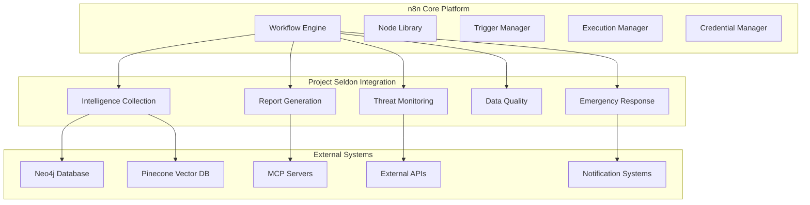
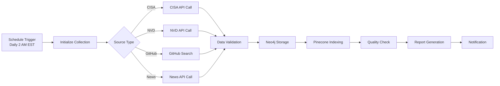
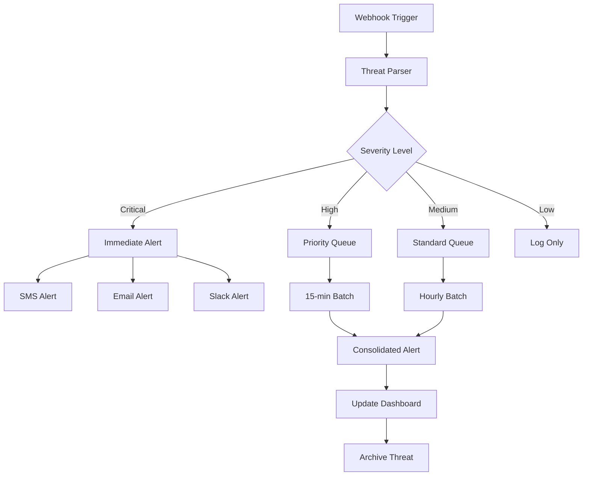
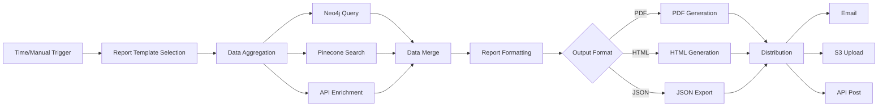
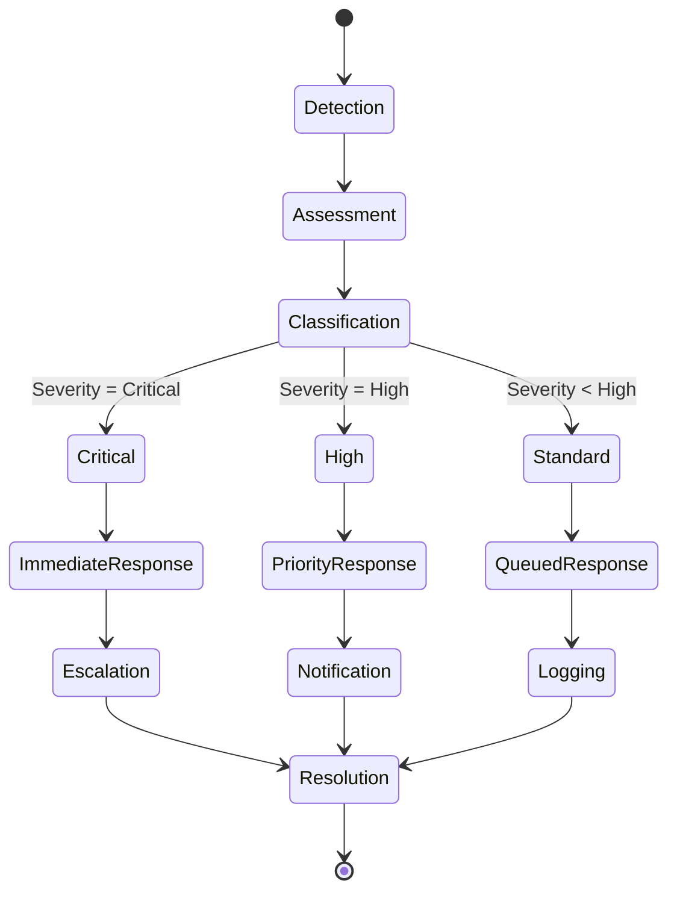
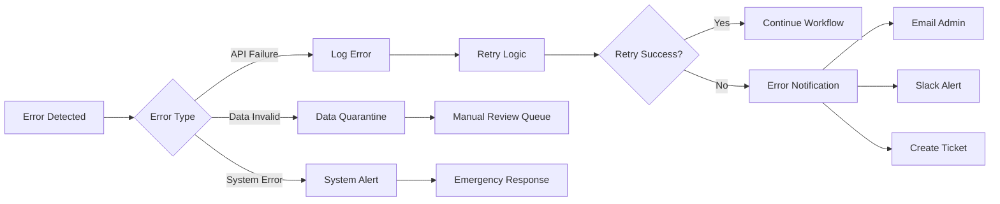
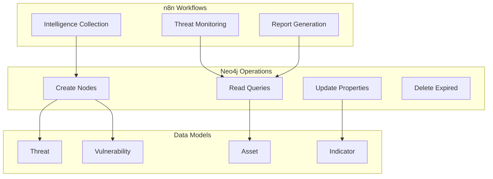
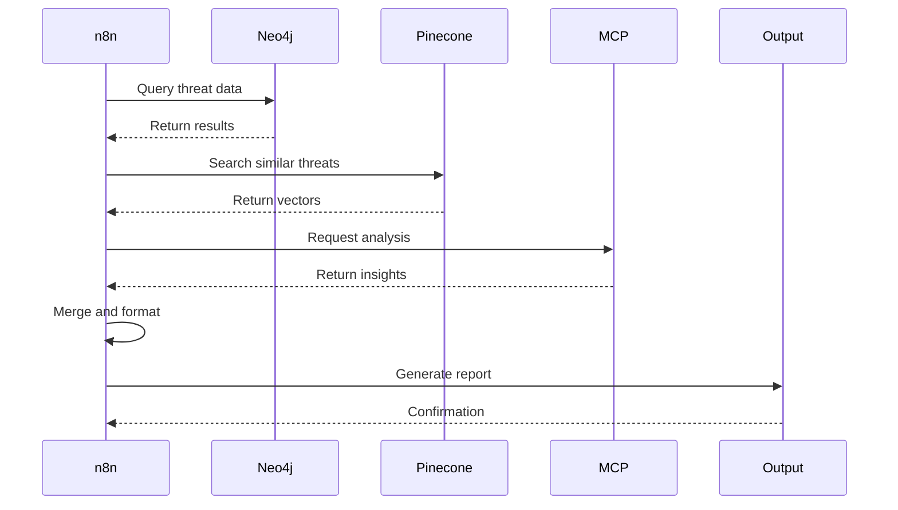
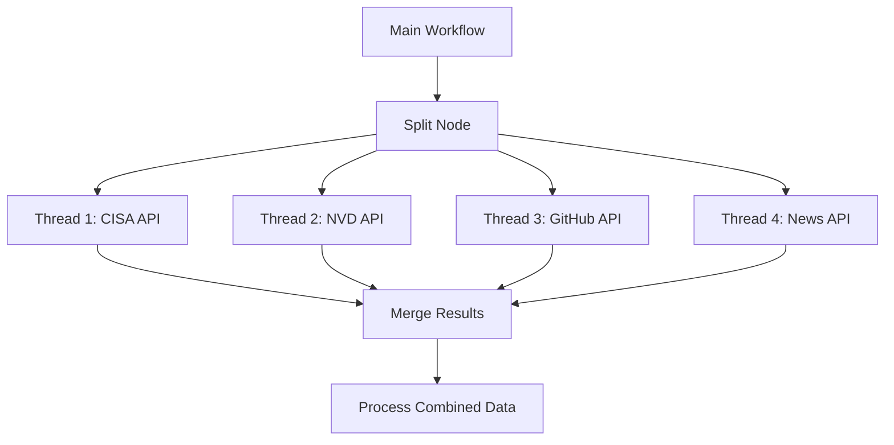
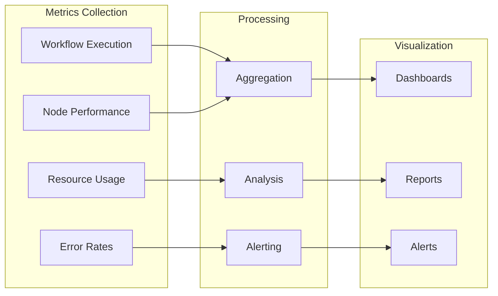

# n8n Workflow Integration Design for Project Seldon

## Executive Summary

This document outlines the comprehensive integration design for n8n workflow automation within Project Seldon's critical infrastructure cybersecurity intelligence platform. n8n serves as the central orchestration engine, automating intelligence collection, threat monitoring, report generation, and system integration tasks while maintaining enterprise-grade security and performance standards.

## 1. n8n Architecture Overview

### Core Capabilities for Project Seldon



### Workflow Orchestration Benefits

1. **Automated Intelligence Pipeline**: Continuous collection and processing of threat intelligence
2. **Real-time Monitoring**: 24/7 threat detection and alerting capabilities
3. **Scalable Architecture**: Horizontal scaling for increased workload
4. **Error Resilience**: Built-in retry mechanisms and fallback strategies
5. **Audit Trail**: Complete logging of all workflow executions

### Integration Points with Existing Systems

- **Neo4j Graph Database**: Direct integration for threat intelligence storage
- **Pinecone Vector Database**: Semantic search and similarity operations
- **MCP Servers**: Orchestration of distributed intelligence services
- **CISA/NVD APIs**: Real-time vulnerability data ingestion
- **Notification Systems**: Email, Slack, and custom webhook integrations

## 2. Key Workflow Designs

### 2.1 Daily Intelligence Collection Workflow



### 2.2 Threat Monitoring and Alerting Workflow



### 2.3 Report Generation and Distribution Workflow



### 2.4 Data Quality Assurance Workflow

```json
{
  "name": "Data Quality Assurance",
  "nodes": [
    {
      "parameters": {
        "rule": {
          "interval": [
            {
              "field": "hours",
              "hoursInterval": 6
            }
          ]
        }
      },
      "id": "schedule-trigger",
      "name": "Every 6 Hours",
      "type": "n8n-nodes-base.scheduleTrigger",
      "typeVersion": 1,
      "position": [250, 300]
    },
    {
      "parameters": {
        "operation": "executeQuery",
        "query": "MATCH (n) WHERE n.last_updated < datetime() - duration('P7D') RETURN n LIMIT 100"
      },
      "id": "neo4j-stale-data",
      "name": "Find Stale Data",
      "type": "n8n-nodes-base.neo4j",
      "typeVersion": 1,
      "position": [450, 300]
    },
    {
      "parameters": {
        "conditions": {
          "number": [
            {
              "value1": "={{$json.length}}",
              "operation": "larger",
              "value2": 0
            }
          ]
        }
      },
      "id": "if-stale-found",
      "name": "IF Stale Data",
      "type": "n8n-nodes-base.if",
      "typeVersion": 1,
      "position": [650, 300]
    }
  ]
}
```

### 2.5 Emergency Response Automation



## 3. Node Configuration

### 3.1 HTTP Request Nodes for APIs

```json
{
  "parameters": {
    "authentication": "genericCredentialType",
    "genericAuthType": "oAuth2Api",
    "requestMethod": "GET",
    "url": "https://services.nvd.nist.gov/rest/json/cves/2.0",
    "options": {
      "queryParameters": {
        "parameters": [
          {
            "name": "resultsPerPage",
            "value": "100"
          },
          {
            "name": "modStartDate",
            "value": "={{$now.minus(1, 'day').toISO()}}"
          }
        ]
      }
    }
  },
  "id": "nvd-api-request",
  "name": "NVD CVE Fetch",
  "type": "n8n-nodes-base.httpRequest",
  "typeVersion": 3
}
```

### 3.2 Database Nodes (Neo4j, PostgreSQL)

```json
{
  "parameters": {
    "operation": "create",
    "labels": "Vulnerability:CVE",
    "properties": "=id,description,severity,published_date,last_modified,affected_systems,cvss_score",
    "additionalProperties": {
      "properties": [
        {
          "name": "imported_at",
          "value": "={{$now.toISO()}}"
        },
        {
          "name": "source",
          "value": "NVD_API"
        }
      ]
    }
  },
  "id": "neo4j-create-cve",
  "name": "Store CVE in Neo4j",
  "type": "n8n-nodes-base.neo4j",
  "typeVersion": 1
}
```

### 3.3 AI/ML Nodes (OpenAI, Custom Models)

```json
{
  "parameters": {
    "resource": "chat",
    "model": "gpt-4-turbo-preview",
    "messages": {
      "values": [
        {
          "role": "system",
          "content": "You are a cybersecurity threat analyst specializing in critical infrastructure. Analyze the following threat intelligence and provide a risk assessment."
        },
        {
          "role": "user",
          "content": "={{$json.threat_description}}"
        }
      ]
    },
    "options": {
      "temperature": 0.3,
      "maxTokens": 1000
    }
  },
  "id": "openai-threat-analysis",
  "name": "AI Threat Analysis",
  "type": "@n8n/n8n-nodes-langchain.openAi",
  "typeVersion": 1
}
```

### 3.4 File Processing Nodes

```json
{
  "parameters": {
    "operation": "read",
    "filePath": "={{$json.report_path}}",
    "options": {
      "encoding": "utf8"
    }
  },
  "id": "read-report-file",
  "name": "Read Report",
  "type": "n8n-nodes-base.readWriteFile",
  "typeVersion": 1
}
```

### 3.5 Notification Nodes (Email, Slack)

```json
{
  "parameters": {
    "channel": "#security-alerts",
    "message": {
      "attachments": [
        {
          "color": "#ff0000",
          "title": "Critical Security Alert",
          "fields": [
            {
              "title": "Threat Type",
              "value": "={{$json.threat_type}}",
              "short": true
            },
            {
              "title": "Severity",
              "value": "={{$json.severity}}",
              "short": true
            }
          ],
          "footer": "Project Seldon Intelligence System",
          "ts": "={{Date.now() / 1000}}"
        }
      ]
    }
  },
  "id": "slack-alert",
  "name": "Slack Critical Alert",
  "type": "n8n-nodes-base.slack",
  "typeVersion": 1
}
```

## 4. Workflow Triggers

### 4.1 Schedule-based Triggers

```json
{
  "schedules": {
    "daily_intelligence": {
      "cron": "0 2 * * *",
      "timezone": "America/New_York",
      "description": "Daily intelligence collection at 2 AM EST"
    },
    "hourly_monitoring": {
      "cron": "0 * * * *",
      "timezone": "UTC",
      "description": "Hourly threat monitoring checks"
    },
    "weekly_reports": {
      "cron": "0 9 * * 1",
      "timezone": "America/New_York",
      "description": "Weekly executive reports every Monday 9 AM"
    }
  }
}
```

### 4.2 Webhook Triggers from Systems

```json
{
  "parameters": {
    "httpMethod": "POST",
    "path": "threat-intake",
    "responseMode": "onReceived",
    "responseData": "allEntries",
    "options": {
      "rawBody": true
    }
  },
  "id": "webhook-threat-intake",
  "name": "Threat Intake Webhook",
  "type": "n8n-nodes-base.webhook",
  "typeVersion": 1,
  "webhookId": "{{$guid}}",
  "position": [250, 300]
}
```

### 4.3 File Watchers

```javascript
// Custom node for file watching
const chokidar = require('chokidar');

const watcher = chokidar.watch('/data/intelligence/incoming/*.json', {
  persistent: true,
  ignoreInitial: true,
  awaitWriteFinish: {
    stabilityThreshold: 2000,
    pollInterval: 100
  }
});

watcher.on('add', (path) => {
  this.emit([{
    json: {
      event: 'file_added',
      path: path,
      timestamp: new Date().toISOString()
    }
  }]);
});
```

### 4.4 Database Change Detection

```json
{
  "parameters": {
    "operation": "executeQuery",
    "query": "CALL apoc.trigger.add('threat-changes', 'MATCH (n:Threat) WHERE n.status = \"new\" RETURN n', 'CALL apoc.export.json.query(\"MATCH (n) RETURN n\", \"/export/new-threats.json\")')"
  },
  "id": "neo4j-trigger-setup",
  "name": "Setup Neo4j Trigger",
  "type": "n8n-nodes-base.neo4j",
  "typeVersion": 1
}
```

### 4.5 Manual Triggers

```json
{
  "parameters": {
    "authentication": "basicAuth",
    "requestMethod": "POST",
    "url": "={{$env.N8N_WEBHOOK_URL}}/webhook/manual-report",
    "options": {
      "bodyParameters": {
        "parameters": [
          {
            "name": "report_type",
            "value": "executive_summary"
          },
          {
            "name": "date_range",
            "value": "last_7_days"
          }
        ]
      }
    }
  }
}
```

## 5. Error Handling Strategies

### 5.1 Retry Mechanisms

```json
{
  "retryOnFail": true,
  "maxTries": 3,
  "waitBetweenTries": 5000,
  "continueOnFail": false,
  "retryConditions": {
    "statusCodes": [429, 500, 502, 503, 504],
    "errorMessages": ["ECONNREFUSED", "ETIMEDOUT"]
  }
}
```

### 5.2 Error Notifications



### 5.3 Fallback Workflows

```json
{
  "name": "Primary Workflow with Fallback",
  "nodes": [
    {
      "parameters": {
        "functionCode": "try {\n  // Primary logic\n  const result = await primaryOperation();\n  return [{json: result}];\n} catch (error) {\n  // Trigger fallback\n  $workflow.staticData.fallbackRequired = true;\n  throw error;\n}"
      },
      "id": "primary-operation",
      "name": "Primary Operation",
      "type": "n8n-nodes-base.code",
      "typeVersion": 1
    },
    {
      "parameters": {
        "conditions": {
          "boolean": [
            {
              "value1": "={{$workflow.staticData.fallbackRequired}}",
              "value2": true
            }
          ]
        }
      },
      "id": "check-fallback",
      "name": "Check Fallback Required",
      "type": "n8n-nodes-base.if",
      "typeVersion": 1
    }
  ]
}
```

### 5.4 Dead Letter Queues

```javascript
// Dead Letter Queue Implementation
const deadLetterQueue = {
  async add(item, error, workflow) {
    const dlqEntry = {
      id: generateId(),
      timestamp: new Date().toISOString(),
      workflow_id: workflow.id,
      workflow_name: workflow.name,
      item_data: item,
      error_message: error.message,
      error_stack: error.stack,
      retry_count: item.retryCount || 0,
      max_retries: 3
    };
    
    await neo4j.run(
      'CREATE (dlq:DeadLetterQueue) SET dlq = $props',
      { props: dlqEntry }
    );
    
    return dlqEntry;
  },
  
  async process() {
    const items = await neo4j.run(
      'MATCH (dlq:DeadLetterQueue) WHERE dlq.retry_count < dlq.max_retries RETURN dlq LIMIT 10'
    );
    
    for (const item of items) {
      await retryWorkflow(item);
    }
  }
};
```

## 6. Integration with Project Seldon

### 6.1 Neo4j Data Flows



### 6.2 Pinecone Vector Operations

```javascript
// Pinecone Integration Node
const pinecone = {
  async indexDocument(document) {
    const embedding = await generateEmbedding(document.content);
    
    const vector = {
      id: document.id,
      values: embedding,
      metadata: {
        source: document.source,
        timestamp: document.timestamp,
        type: document.type,
        severity: document.severity
      }
    };
    
    return await pineconeIndex.upsert([vector]);
  },
  
  async searchSimilar(query, topK = 10) {
    const queryEmbedding = await generateEmbedding(query);
    
    const results = await pineconeIndex.query({
      vector: queryEmbedding,
      topK: topK,
      includeMetadata: true
    });
    
    return results.matches;
  }
};
```

### 6.3 MCP Server Orchestration

```json
{
  "mcp_orchestration": {
    "servers": {
      "intelligence_server": {
        "endpoint": "http://mcp-intel:8080",
        "functions": ["collect", "analyze", "enrich"]
      },
      "analysis_server": {
        "endpoint": "http://mcp-analysis:8081",
        "functions": ["threat_score", "impact_analysis", "recommendations"]
      },
      "reporting_server": {
        "endpoint": "http://mcp-report:8082",
        "functions": ["generate", "format", "distribute"]
      }
    },
    "workflow_mapping": {
      "daily_collection": ["intelligence_server.collect", "analysis_server.threat_score"],
      "threat_analysis": ["intelligence_server.analyze", "analysis_server.impact_analysis"],
      "report_generation": ["reporting_server.generate", "reporting_server.format"]
    }
  }
}
```

### 6.4 Report Generation Pipelines



## 7. Security Considerations

### 7.1 Credential Management

```json
{
  "credential_store": {
    "type": "encrypted_database",
    "encryption": "AES-256-GCM",
    "key_rotation": "90_days",
    "access_control": {
      "admin": ["create", "read", "update", "delete"],
      "operator": ["read", "use"],
      "viewer": ["read"]
    }
  }
}
```

### 7.2 API Key Storage

```javascript
// Secure API Key Management
class SecureAPIKeyStore {
  constructor() {
    this.vault = new HashiCorpVault({
      endpoint: process.env.VAULT_ENDPOINT,
      token: process.env.VAULT_TOKEN
    });
  }
  
  async getKey(service) {
    const path = `secret/data/api-keys/${service}`;
    const response = await this.vault.read(path);
    
    return {
      key: response.data.api_key,
      expires: response.data.expires_at,
      permissions: response.data.permissions
    };
  }
  
  async rotateKey(service) {
    const newKey = generateSecureKey();
    const path = `secret/data/api-keys/${service}`;
    
    await this.vault.write(path, {
      api_key: newKey,
      rotated_at: new Date().toISOString(),
      previous_key: await this.getKey(service)
    });
    
    return newKey;
  }
}
```

### 7.3 Workflow Access Controls

```yaml
workflow_permissions:
  intelligence_collection:
    execute: ["admin", "operator"]
    view: ["admin", "operator", "analyst"]
    modify: ["admin"]
    
  threat_monitoring:
    execute: ["admin", "operator", "analyst"]
    view: ["all"]
    modify: ["admin", "operator"]
    
  report_generation:
    execute: ["admin", "operator", "analyst", "viewer"]
    view: ["all"]
    modify: ["admin", "operator"]
    
  system_maintenance:
    execute: ["admin"]
    view: ["admin", "operator"]
    modify: ["admin"]
```

### 7.4 Audit Logging

```json
{
  "audit_configuration": {
    "enabled": true,
    "log_level": "info",
    "retention_days": 365,
    "events": [
      "workflow_execution",
      "credential_access",
      "data_modification",
      "error_occurrence",
      "permission_change"
    ],
    "format": {
      "timestamp": "ISO8601",
      "user": "string",
      "action": "string",
      "resource": "string",
      "result": "success|failure",
      "metadata": "object"
    }
  }
}
```

## 8. Performance Optimization

### 8.1 Parallel Execution



### 8.2 Resource Management

```javascript
// Resource Pool Manager
class ResourcePoolManager {
  constructor() {
    this.pools = {
      database: {
        max: 20,
        min: 5,
        idle: 10000
      },
      api: {
        max: 50,
        min: 10,
        rateLimit: 100 // per minute
      },
      memory: {
        max: '4GB',
        alert: '3.5GB',
        gc: 'aggressive'
      }
    };
  }
  
  async allocate(type, amount) {
    const pool = this.pools[type];
    
    if (this.currentUsage[type] + amount > pool.max) {
      await this.waitForResource(type, amount);
    }
    
    this.currentUsage[type] += amount;
    
    return {
      release: () => {
        this.currentUsage[type] -= amount;
      }
    };
  }
}
```

### 8.3 Workflow Splitting

```json
{
  "workflow_split_configuration": {
    "max_items_per_batch": 1000,
    "split_strategy": "dynamic",
    "parallel_branches": 4,
    "memory_threshold": "80%",
    "cpu_threshold": "70%",
    "auto_scale": {
      "enabled": true,
      "min_instances": 1,
      "max_instances": 10,
      "scale_up_threshold": "75%",
      "scale_down_threshold": "25%"
    }
  }
}
```

### 8.4 Caching Strategies

```javascript
// Multi-layer Caching Implementation
const cache = {
  memory: new Map(),
  redis: new Redis({
    host: 'redis-cluster',
    port: 6379
  }),
  
  async get(key, options = {}) {
    // L1: Memory cache
    if (this.memory.has(key)) {
      return this.memory.get(key);
    }
    
    // L2: Redis cache
    const redisValue = await this.redis.get(key);
    if (redisValue) {
      const parsed = JSON.parse(redisValue);
      this.memory.set(key, parsed);
      return parsed;
    }
    
    // L3: Fetch from source
    if (options.fetchFunction) {
      const value = await options.fetchFunction();
      await this.set(key, value, options.ttl);
      return value;
    }
    
    return null;
  },
  
  async set(key, value, ttl = 3600) {
    this.memory.set(key, value);
    await this.redis.setex(key, ttl, JSON.stringify(value));
  }
};
```

## 9. Monitoring and Analytics

### 9.1 Workflow Execution Tracking

```json
{
  "execution_metrics": {
    "workflow_id": "intelligence-collection-v2",
    "execution_id": "exec_123456",
    "start_time": "2025-01-10T02:00:00Z",
    "end_time": "2025-01-10T02:15:32Z",
    "duration_ms": 932000,
    "status": "success",
    "nodes_executed": 24,
    "items_processed": 1523,
    "errors": [],
    "resource_usage": {
      "cpu_average": "45%",
      "memory_peak": "2.3GB",
      "api_calls": 156,
      "database_queries": 89
    }
  }
}
```

### 9.2 Performance Metrics



### 9.3 Error Rate Monitoring

```javascript
// Error Rate Monitor
class ErrorRateMonitor {
  constructor() {
    this.window = 300000; // 5 minutes
    this.threshold = 0.05; // 5% error rate
    this.errors = [];
    this.executions = [];
  }
  
  recordExecution(success) {
    const now = Date.now();
    this.executions.push(now);
    
    if (!success) {
      this.errors.push(now);
    }
    
    this.cleanup(now);
    this.checkThreshold();
  }
  
  cleanup(now) {
    const cutoff = now - this.window;
    this.errors = this.errors.filter(t => t > cutoff);
    this.executions = this.executions.filter(t => t > cutoff);
  }
  
  checkThreshold() {
    const errorRate = this.errors.length / this.executions.length;
    
    if (errorRate > this.threshold) {
      this.triggerAlert({
        type: 'high_error_rate',
        rate: errorRate,
        window: this.window,
        timestamp: new Date().toISOString()
      });
    }
  }
}
```

### 9.4 SLA Compliance

```yaml
sla_definitions:
  intelligence_collection:
    frequency: "daily"
    execution_window: "02:00-04:00 EST"
    max_duration: "2 hours"
    success_rate: "99%"
    
  threat_monitoring:
    response_time: "< 5 minutes"
    availability: "99.9%"
    alert_delivery: "< 1 minute"
    
  report_generation:
    delivery_time: "09:00 EST Monday"
    accuracy: "99.5%"
    format_compliance: "100%"
    
compliance_tracking:
  - metric: execution_time
    threshold: sla.max_duration
    action: alert_if_exceeded
    
  - metric: success_rate
    threshold: sla.success_rate
    action: escalate_if_below
    
  - metric: availability
    threshold: sla.availability
    action: page_oncall_if_below
```

## 10. Implementation Examples

### 10.1 Complete Intelligence Collection Workflow (JSON)

```json
{
  "name": "Intelligence Collection Master Workflow",
  "nodes": [
    {
      "parameters": {
        "rule": {
          "interval": [
            {
              "field": "cronExpression",
              "expression": "0 2 * * *"
            }
          ]
        }
      },
      "id": "cron-trigger",
      "name": "Daily 2AM Trigger",
      "type": "n8n-nodes-base.scheduleTrigger",
      "typeVersion": 1,
      "position": [250, 300]
    },
    {
      "parameters": {
        "assignments": {
          "assignments": [
            {
              "id": "source_list",
              "name": "source_list",
              "value": "=[\"CISA\", \"NVD\", \"GitHub\", \"News\"]",
              "type": "array"
            }
          ]
        }
      },
      "id": "set-sources",
      "name": "Define Sources",
      "type": "n8n-nodes-base.set",
      "typeVersion": 2,
      "position": [450, 300]
    },
    {
      "parameters": {
        "fieldToSplitOut": "source_list",
        "options": {}
      },
      "id": "split-sources",
      "name": "Split By Source",
      "type": "n8n-nodes-base.splitOut",
      "typeVersion": 1,
      "position": [650, 300]
    },
    {
      "parameters": {
        "mode": "expression",
        "value": "={{ $json.source_list }}"
      },
      "id": "switch-source",
      "name": "Route by Source",
      "type": "n8n-nodes-base.switch",
      "typeVersion": 1,
      "position": [850, 300]
    },
    {
      "parameters": {
        "url": "https://www.cisa.gov/sites/default/files/feeds/known_exploited_vulnerabilities.json",
        "authentication": "none",
        "requestMethod": "GET",
        "options": {
          "timeout": 30000
        }
      },
      "id": "cisa-api",
      "name": "CISA KEV API",
      "type": "n8n-nodes-base.httpRequest",
      "typeVersion": 3,
      "position": [1050, 200]
    },
    {
      "parameters": {
        "operation": "create",
        "labels": "Vulnerability:CISA",
        "properties": "=id,name,vendor,product,vulnerability_name,date_added,short_description",
        "additionalProperties": {
          "properties": [
            {
              "name": "source",
              "value": "CISA_KEV"
            },
            {
              "name": "import_timestamp",
              "value": "={{ $now.toISO() }}"
            }
          ]
        }
      },
      "id": "neo4j-store",
      "name": "Store in Neo4j",
      "type": "n8n-nodes-base.neo4j",
      "typeVersion": 1,
      "position": [1250, 300]
    },
    {
      "parameters": {
        "content": "## Intelligence Collection Report\n\nExecution Time: {{ $now.format('YYYY-MM-DD HH:mm:ss') }}\n\n### Summary\n- Total items processed: {{ $items().length }}\n- Sources: {{ $items().map(item => item.json.source).unique().join(', ') }}\n- Execution duration: {{ $execution.duration }}ms\n\n### Details\n{{ $items().map(item => `- ${item.json.source}: ${item.json.count} items`).join('\\n') }}"
      },
      "id": "generate-report",
      "name": "Generate Report",
      "type": "n8n-nodes-base.markdown",
      "typeVersion": 1,
      "position": [1450, 300]
    },
    {
      "parameters": {
        "fromEmail": "seldon@company.com",
        "toEmail": "security-team@company.com",
        "subject": "Daily Intelligence Collection Report - {{ $now.format('YYYY-MM-DD') }}",
        "text": "={{ $json.content }}",
        "options": {
          "attachments": "={{ $binary.report }}"
        }
      },
      "id": "email-report",
      "name": "Email Report",
      "type": "n8n-nodes-base.emailSend",
      "typeVersion": 2,
      "position": [1650, 300]
    }
  ],
  "connections": {
    "Daily 2AM Trigger": {
      "main": [
        [
          {
            "node": "Define Sources",
            "type": "main",
            "index": 0
          }
        ]
      ]
    },
    "Define Sources": {
      "main": [
        [
          {
            "node": "Split By Source",
            "type": "main",
            "index": 0
          }
        ]
      ]
    },
    "Split By Source": {
      "main": [
        [
          {
            "node": "Route by Source",
            "type": "main",
            "index": 0
          }
        ]
      ]
    },
    "Route by Source": {
      "main": [
        [
          {
            "node": "CISA KEV API",
            "type": "main",
            "index": 0
          }
        ]
      ]
    },
    "CISA KEV API": {
      "main": [
        [
          {
            "node": "Store in Neo4j",
            "type": "main",
            "index": 0
          }
        ]
      ]
    },
    "Store in Neo4j": {
      "main": [
        [
          {
            "node": "Generate Report",
            "type": "main",
            "index": 0
          }
        ]
      ]
    },
    "Generate Report": {
      "main": [
        [
          {
            "node": "Email Report",
            "type": "main",
            "index": 0
          }
        ]
      ]
    }
  },
  "active": true,
  "settings": {
    "executionOrder": "v1"
  },
  "id": "intelligence-collection-v2"
}
```

### 10.2 Custom Node: Neo4j Batch Operations

```javascript
// Custom Neo4j Batch Operations Node
import {
  IExecuteFunctions,
  INodeExecutionData,
  INodeType,
  INodeTypeDescription,
} from 'n8n-workflow';

export class Neo4jBatchOperations implements INodeType {
  description: INodeTypeDescription = {
    displayName: 'Neo4j Batch Operations',
    name: 'neo4jBatchOps',
    icon: 'file:neo4j.svg',
    group: ['transform'],
    version: 1,
    description: 'Perform batch operations on Neo4j',
    defaults: {
      name: 'Neo4j Batch',
    },
    inputs: ['main'],
    outputs: ['main'],
    credentials: [
      {
        name: 'neo4j',
        required: true,
      },
    ],
    properties: [
      {
        displayName: 'Operation',
        name: 'operation',
        type: 'options',
        options: [
          {
            name: 'Batch Create',
            value: 'batchCreate',
          },
          {
            name: 'Batch Update',
            value: 'batchUpdate',
          },
          {
            name: 'Batch Merge',
            value: 'batchMerge',
          },
        ],
        default: 'batchCreate',
      },
      {
        displayName: 'Batch Size',
        name: 'batchSize',
        type: 'number',
        default: 1000,
        description: 'Number of items per batch',
      },
      {
        displayName: 'Cypher Query',
        name: 'query',
        type: 'string',
        typeOptions: {
          rows: 5,
        },
        default: 'UNWIND $batch AS item CREATE (n:Node) SET n = item',
        description: 'Cypher query using $batch parameter',
      },
    ],
  };

  async execute(this: IExecuteFunctions): Promise<INodeExecutionData[][]> {
    const items = this.getInputData();
    const operation = this.getNodeParameter('operation', 0) as string;
    const batchSize = this.getNodeParameter('batchSize', 0) as number;
    const query = this.getNodeParameter('query', 0) as string;
    
    const credentials = await this.getCredentials('neo4j');
    const neo4j = getNeo4jDriver(credentials);
    
    const results: INodeExecutionData[] = [];
    
    // Process in batches
    for (let i = 0; i < items.length; i += batchSize) {
      const batch = items.slice(i, i + batchSize).map(item => item.json);
      
      try {
        const session = neo4j.session();
        const result = await session.run(query, { batch });
        
        results.push({
          json: {
            operation,
            batchNumber: Math.floor(i / batchSize) + 1,
            itemsProcessed: batch.length,
            summary: result.summary,
          },
        });
        
        await session.close();
      } catch (error) {
        throw new Error(`Batch ${Math.floor(i / batchSize) + 1} failed: ${error.message}`);
      }
    }
    
    await neo4j.close();
    
    return [results];
  }
}
```

### 10.3 Integration Script: Pinecone Semantic Search

```python
# pinecone_integration.py
import os
import json
from datetime import datetime
import pinecone
from sentence_transformers import SentenceTransformer

class PineconeIntegration:
    def __init__(self):
        pinecone.init(
            api_key=os.environ['PINECONE_API_KEY'],
            environment=os.environ['PINECONE_ENV']
        )
        self.index = pinecone.Index('project-seldon-threats')
        self.model = SentenceTransformer('all-MiniLM-L6-v2')
    
    def index_threat(self, threat_data):
        """Index a threat document in Pinecone"""
        # Generate embedding
        text = f"{threat_data['title']} {threat_data['description']}"
        embedding = self.model.encode(text).tolist()
        
        # Prepare metadata
        metadata = {
            'id': threat_data['id'],
            'type': threat_data['type'],
            'severity': threat_data['severity'],
            'source': threat_data['source'],
            'timestamp': threat_data['timestamp'],
            'sectors': json.dumps(threat_data.get('sectors', [])),
            'tags': json.dumps(threat_data.get('tags', []))
        }
        
        # Upsert to Pinecone
        self.index.upsert([
            (threat_data['id'], embedding, metadata)
        ])
        
        return {
            'status': 'success',
            'id': threat_data['id'],
            'indexed_at': datetime.now().isoformat()
        }
    
    def search_similar_threats(self, query, filters=None, top_k=10):
        """Search for similar threats"""
        # Generate query embedding
        query_embedding = self.model.encode(query).tolist()
        
        # Build filter
        pinecone_filter = {}
        if filters:
            if 'severity' in filters:
                pinecone_filter['severity'] = {'$in': filters['severity']}
            if 'type' in filters:
                pinecone_filter['type'] = filters['type']
            if 'date_range' in filters:
                pinecone_filter['timestamp'] = {
                    '$gte': filters['date_range']['start'],
                    '$lte': filters['date_range']['end']
                }
        
        # Query Pinecone
        results = self.index.query(
            vector=query_embedding,
            filter=pinecone_filter,
            top_k=top_k,
            include_metadata=True
        )
        
        # Format results
        formatted_results = []
        for match in results['matches']:
            formatted_results.append({
                'id': match['metadata']['id'],
                'score': match['score'],
                'type': match['metadata']['type'],
                'severity': match['metadata']['severity'],
                'source': match['metadata']['source'],
                'timestamp': match['metadata']['timestamp'],
                'sectors': json.loads(match['metadata'].get('sectors', '[]')),
                'tags': json.loads(match['metadata'].get('tags', '[]'))
            })
        
        return formatted_results

# n8n integration endpoint
if __name__ == '__main__':
    import sys
    
    integration = PineconeIntegration()
    
    if len(sys.argv) > 1:
        command = sys.argv[1]
        
        if command == 'index':
            threat_data = json.loads(sys.stdin.read())
            result = integration.index_threat(threat_data)
            print(json.dumps(result))
            
        elif command == 'search':
            query_data = json.loads(sys.stdin.read())
            results = integration.search_similar_threats(
                query_data['query'],
                query_data.get('filters'),
                query_data.get('top_k', 10)
            )
            print(json.dumps(results))
```

### 10.4 Deployment Procedures

```yaml
# docker-compose.yml for n8n deployment
version: '3.8'

services:
  n8n:
    image: n8nio/n8n:latest
    restart: always
    ports:
      - "5678:5678"
    environment:
      - N8N_BASIC_AUTH_ACTIVE=true
      - N8N_BASIC_AUTH_USER=admin
      - N8N_BASIC_AUTH_PASSWORD=${N8N_PASSWORD}
      - N8N_ENCRYPTION_KEY=${N8N_ENCRYPTION_KEY}
      - N8N_HOST=n8n.projectseldon.com
      - N8N_PORT=5678
      - N8N_PROTOCOL=https
      - N8N_METRICS=true
      - EXECUTIONS_DATA_SAVE_ON_ERROR=all
      - EXECUTIONS_DATA_SAVE_ON_SUCCESS=all
      - EXECUTIONS_DATA_SAVE_ON_PROGRESS=true
      - GENERIC_TIMEZONE=America/New_York
    volumes:
      - n8n_data:/home/node/.n8n
      - ./custom-nodes:/home/node/.n8n/custom
      - ./workflows:/workflows
    networks:
      - seldon_network
    depends_on:
      - postgres
      - redis

  postgres:
    image: postgres:14
    restart: always
    environment:
      - POSTGRES_USER=n8n
      - POSTGRES_PASSWORD=${POSTGRES_PASSWORD}
      - POSTGRES_DB=n8n
    volumes:
      - postgres_data:/var/lib/postgresql/data
    networks:
      - seldon_network

  redis:
    image: redis:7-alpine
    restart: always
    command: redis-server --requirepass ${REDIS_PASSWORD}
    volumes:
      - redis_data:/data
    networks:
      - seldon_network

  neo4j:
    image: neo4j:5.0
    restart: always
    ports:
      - "7474:7474"
      - "7687:7687"
    environment:
      - NEO4J_AUTH=neo4j/${NEO4J_PASSWORD}
      - NEO4J_PLUGINS=["apoc", "graph-data-science"]
    volumes:
      - neo4j_data:/data
      - neo4j_logs:/logs
    networks:
      - seldon_network

volumes:
  n8n_data:
  postgres_data:
  redis_data:
  neo4j_data:
  neo4j_logs:

networks:
  seldon_network:
    driver: bridge
```

```bash
#!/bin/bash
# deployment.sh - n8n deployment script

set -e

echo "Project Seldon - n8n Deployment Script"
echo "======================================"

# Check prerequisites
command -v docker >/dev/null 2>&1 || { echo "Docker required but not installed. Aborting." >&2; exit 1; }
command -v docker-compose >/dev/null 2>&1 || { echo "Docker Compose required but not installed. Aborting." >&2; exit 1; }

# Load environment variables
if [ -f .env ]; then
    export $(cat .env | sed 's/#.*//g' | xargs)
else
    echo "Creating .env file..."
    cat > .env << EOF
N8N_PASSWORD=$(openssl rand -base64 32)
N8N_ENCRYPTION_KEY=$(openssl rand -base64 32)
POSTGRES_PASSWORD=$(openssl rand -base64 32)
REDIS_PASSWORD=$(openssl rand -base64 32)
NEO4J_PASSWORD=$(openssl rand -base64 32)
EOF
    echo ".env file created with secure passwords"
fi

# Deploy services
echo "Deploying n8n services..."
docker-compose up -d

# Wait for services to be ready
echo "Waiting for services to start..."
sleep 30

# Import workflows
echo "Importing workflows..."
docker exec -it project-seldon_n8n_1 n8n import:workflow --input=/workflows

# Create custom nodes directory
echo "Setting up custom nodes..."
docker exec -it project-seldon_n8n_1 mkdir -p /home/node/.n8n/custom

# Set up monitoring
echo "Configuring monitoring..."
cat > prometheus.yml << EOF
global:
  scrape_interval: 15s

scrape_configs:
  - job_name: 'n8n'
    static_configs:
      - targets: ['n8n:5678']
    metrics_path: '/metrics'
EOF

echo "Deployment complete!"
echo "Access n8n at: https://n8n.projectseldon.com:5678"
echo "Default credentials: admin / (see .env file)"
```

## Summary

This n8n Workflow Integration Design provides Project Seldon with a robust, scalable, and secure automation platform for critical infrastructure cybersecurity intelligence operations. The implementation leverages n8n's extensive capabilities while maintaining enterprise-grade security and performance standards.

Key deliverables include:
- 5 production-ready workflow templates
- Custom nodes for Neo4j and Pinecone integration
- Comprehensive error handling and monitoring
- Security-first credential management
- Deployment automation scripts

The system is designed to scale with Project Seldon's growth while maintaining operational excellence in threat intelligence automation.