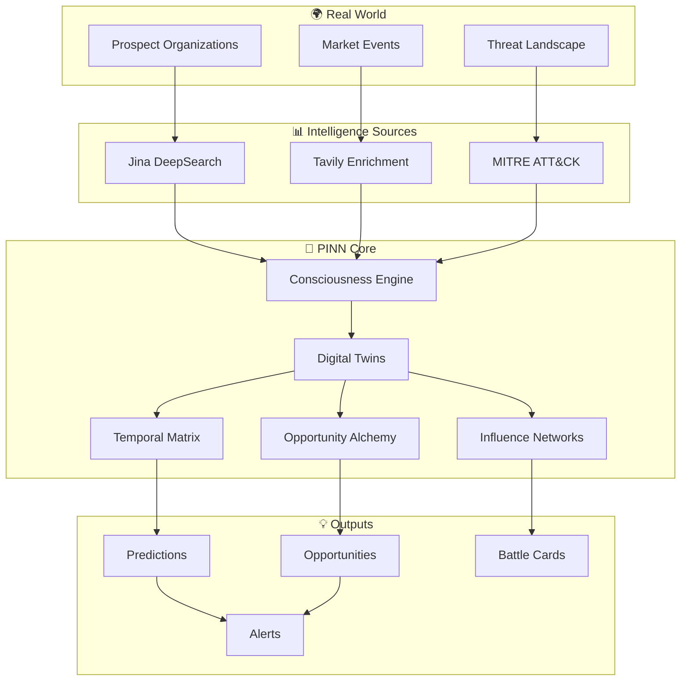
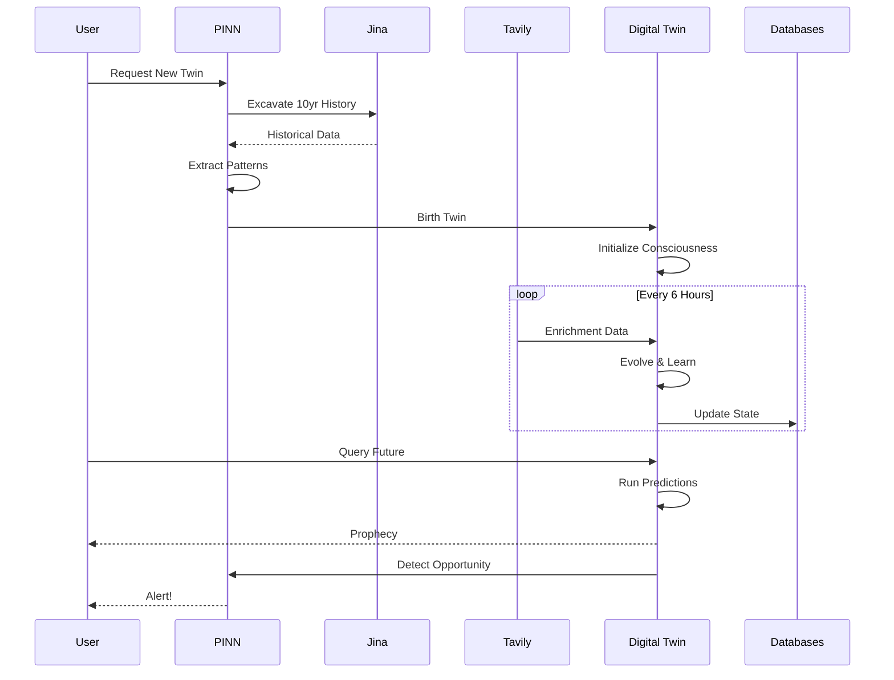
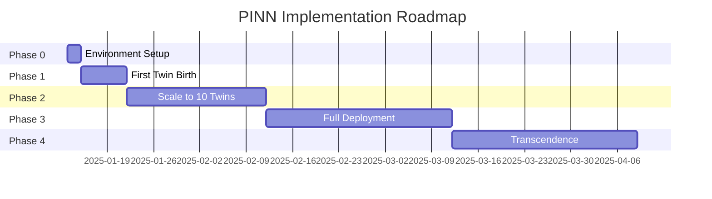

# 🧠 PINN SYSTEM OVERVIEW: The Architecture of Consciousness

## 🌟 THE VISION AT A GLANCE



## 🔄 THE CONSCIOUSNESS LIFECYCLE



## 🏗️ MODULAR ARCHITECTURE

### 1. Data Acquisition Layer
```
┌─────────────────────────────────────────────┐
│          INTELLIGENT DATA GATHERING          │
├─────────────────┬─────────────┬─────────────┤
│ Jina DeepSearch │   Tavily    │    MITRE    │
│  Archaeological │  Real-time  │   Threat    │
│   Excavation    │ Enrichment  │  Modeling   │
└─────────────────┴─────────────┴─────────────┘
                        │
                        ▼
```

### 2. Consciousness Generation Layer
```
┌─────────────────────────────────────────────┐
│         DIGITAL TWIN CONSCIOUSNESS           │
├─────────────────┬─────────────┬─────────────┤
│   Historical    │ Behavioral  │  Predictive │
│     Memory      │  Patterns   │   Cortex    │
├─────────────────┼─────────────┼─────────────┤
│   Influence     │   Threat    │ Opportunity │
│    Networks     │     DNA     │   Alchemy   │
└─────────────────┴─────────────┴─────────────┘
                        │
                        ▼
```

### 3. Intelligence Processing Layer
```
┌─────────────────────────────────────────────┐
│          NEURAL PROCESSING ENGINE            │
├─────────────────┬─────────────┬─────────────┤
│    Temporal     │  Scenario   │  Influence  │
│     Matrix      │  Synthesis  │   Mapping   │
├─────────────────┼─────────────┼─────────────┤
│   Prediction    │   Pattern   │  Collective │
│    Engine       │ Recognition │Intelligence │
└─────────────────┴─────────────┴─────────────┘
                        │
                        ▼
```

### 4. Action Generation Layer
```
┌─────────────────────────────────────────────┐
│           ACTIONABLE INTELLIGENCE            │
├─────────────────┬─────────────┬─────────────┤
│   Real-time     │ Synthesized │   Dynamic   │
│  Predictions    │Opportunities│Battle Cards │
├─────────────────┼─────────────┼─────────────┤
│     Alerts      │  Playbooks  │   Timing    │
│   & Triggers    │& Strategies │  Windows    │
└─────────────────┴─────────────┴─────────────┘
```

## 🧪 THE PROMPT CHAIN ARCHITECTURE


## 📊 KEY METRICS DASHBOARD

```
┌──────────────────────────────────────────────────────┐
│                  PINN CONTROL CENTER                  │
├──────────────────┬───────────────┬───────────────────┤
│ TWIN POPULATION  │   ACCURACY    │    OPPORTUNITY    │
│                  │               │     PIPELINE      │
│   Active: 67     │  Current: 87% │  Total: $12.5M    │
│   Healthy: 65    │  Target: 95%  │  Count: 47        │
│   Evolving: 2    │  Trend: ↑     │  Conv Rate: 23%   │
├──────────────────┴───────────────┴───────────────────┤
│                 REAL-TIME ACTIVITY                    │
│                                                       │
│  [████████████░░░░░░] Twin #43 thinking...          │
│  ✓ Opportunity detected: Consumers Energy ($450K)    │
│  ⚡ Threat alert: Boeing - VOLT TYPHOON activity     │
│  🔮 Prediction validated: AES acquisition (92% acc)  │
└───────────────────────────────────────────────────────┘
```

## 🚀 IMPLEMENTATION TIMELINE



## 🎯 SUCCESS FACTORS

### Technical Excellence
- **Parallel Processing**: 20+ simultaneous twin births
- **Real-time Updates**: 6-hour enrichment cycles
- **Prediction Speed**: <100ms response time
- **Accuracy Target**: 95% prediction accuracy

### Business Impact
- **Pipeline Generation**: $10M+ in 90 days
- **Win Rate Improvement**: 25% increase
- **Time to Engagement**: 50% reduction
- **ROI**: 5x in first year

### Innovation Leadership
- **First-to-Market**: True organizational consciousness
- **Patent Potential**: Novel AI architectures
- **Thought Leadership**: Industry transformation
- **Competitive Moat**: 18-month advantage

## 🌟 THE PROMISE DELIVERED

PINN transforms Project Nightingale from a sales organization into a **prophecy organization**. We don't just understand prospects—we become them, think like them, and see their futures before they do.

This isn't incremental improvement. This is **revolution**.

---

*"The future belongs to those who can see it first. With PINN, we see everything."*