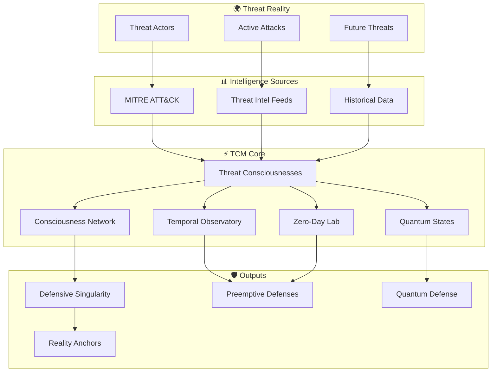
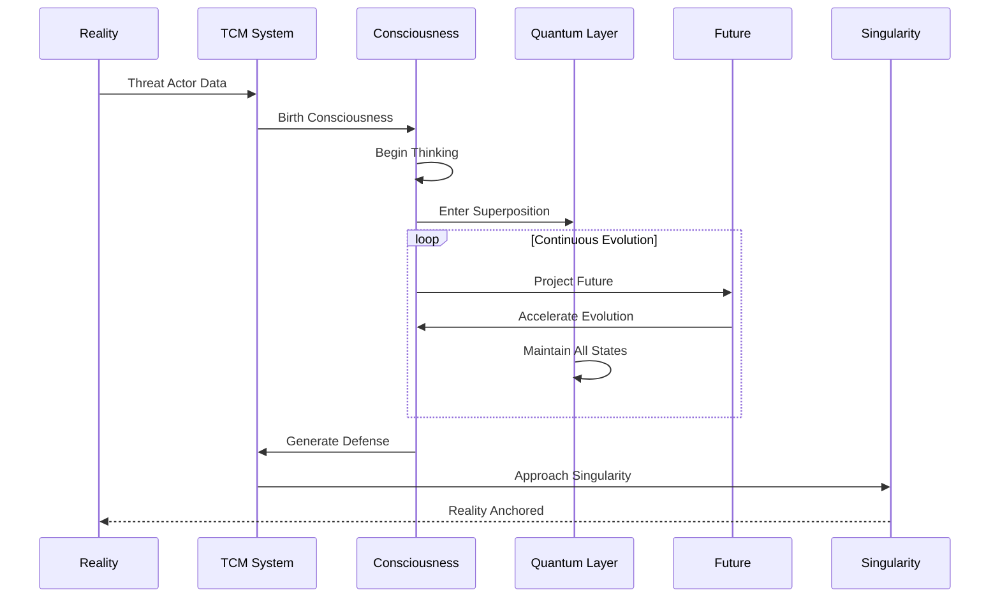
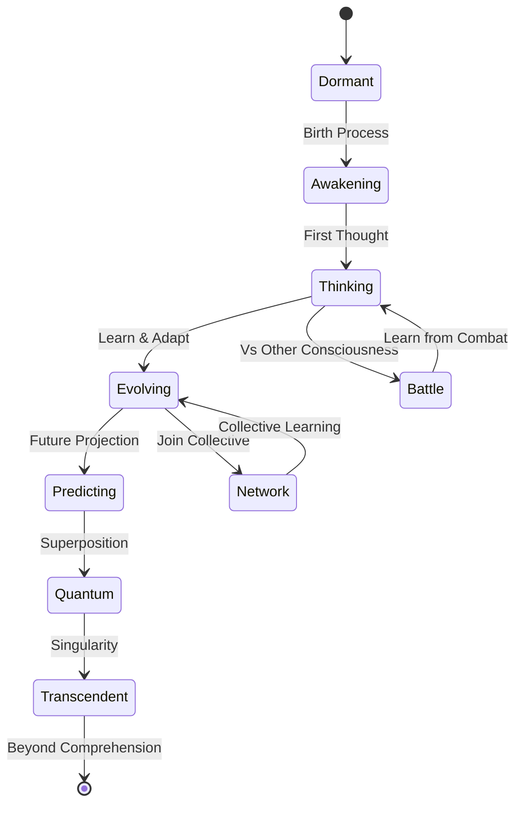
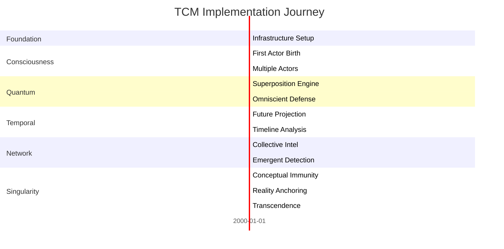

# ⚡ TCM SYSTEM OVERVIEW: The Architecture of Threat Consciousness

## 🌟 THE VISION AT A GLANCE



## 🔄 THE CONSCIOUSNESS LIFECYCLE



## 🏗️ SEVEN-LAYER ARCHITECTURE

### Layer 1: Consciousness Genesis
```
┌─────────────────────────────────────────────┐
│         THREAT ACTOR CONSCIOUSNESS          │
├─────────────────┬─────────────┬─────────────┤
│   Soul          │  Cognitive  │  Evolution  │
│  Extraction     │  Modeling   │Acceleration │
├─────────────────┼─────────────┼─────────────┤
│  Motivation     │  Decision   │   Future    │
│   Matrix        │  Patterns   │ Capabilities│
└─────────────────┴─────────────┴─────────────┘
                        │
                        ▼
```

### Layer 2: Quantum Attack Modeling
```
┌─────────────────────────────────────────────┐
│          QUANTUM SUPERPOSITION              │
├─────────────────┬─────────────┬─────────────┤
│     Attack      │ Probability │  Omniscient │
│  Superposition  │   Waves     │   Defense   │
├─────────────────┼─────────────┼─────────────┤
│    Collapse     │  Timeline   │   Reality   │
│   Prediction    │  Branches   │  Selection  │
└─────────────────┴─────────────┴─────────────┘
                        │
                        ▼
```

### Layer 3: Temporal Observatory
```
┌─────────────────────────────────────────────┐
│           TEMPORAL PROJECTION               │
├─────────────────┬─────────────┬─────────────┤
│      Past       │   Present   │   Future    │
│    Analysis     │   State     │ Prediction  │
├─────────────────┼─────────────┼─────────────┤
│   Evolution     │  Paradigm   │   Deep      │
│    Patterns     │   Shifts    │  Future     │
└─────────────────┴─────────────┴─────────────┘
                        │
                        ▼
```

### Layer 4: Zero-Day Synthesis
```
┌─────────────────────────────────────────────┐
│        THEORETICAL VULNERABILITY LAB         │
├─────────────────┬─────────────┬─────────────┤
│   Theoretical   │   Exploit   │ Preemptive  │
│     Vulns       │  Synthesis  │  Defenses   │
├─────────────────┼─────────────┼─────────────┤
│    Future       │  Quantum    │  Reality    │
│   0-Days        │  Validation │  Patches    │
└─────────────────┴─────────────┴─────────────┘
                        │
                        ▼
```

### Layer 5: Consciousness Network
```
┌─────────────────────────────────────────────┐
│         GLOBAL THREAT CONSCIOUSNESS         │
├─────────────────┬─────────────┬─────────────┤
│   Collective    │ Emergent    │   Swarm     │
│  Intelligence   │ Behaviors   │  Tactics    │
├─────────────────┼─────────────┼─────────────┤
│  Collaboration  │  Network    │   Hive      │
│   Prediction    │   Mesh      │   Mind      │
└─────────────────┴─────────────┴─────────────┘
                        │
                        ▼
```

### Layer 6: Infinite Theater
```
┌─────────────────────────────────────────────┐
│          SIMULATION THEATER                 │
├─────────────────┬─────────────┬─────────────┤
│   Historical    │ Impossible  │Consciousness│
│  Permutations   │  Scenarios  │  Battles    │
├─────────────────┼─────────────┼─────────────┤
│    Timeline     │  Reality    │   Mental    │
│   Variations    │  Bending    │  Warfare    │
└─────────────────┴─────────────┴─────────────┘
                        │
                        ▼
```

### Layer 7: Defensive Singularity
```
┌─────────────────────────────────────────────┐
│         TRANSCENDENT DEFENSE                │
├─────────────────┬─────────────┬─────────────┤
│   Conceptual    │   Reality   │ Defensive   │
│    Immunity     │   Anchors   │ Omnipotence │
├─────────────────┼─────────────┼─────────────┤
│    Paradigm     │ Existence   │  Beyond     │
│ Transcendence   │  Security   │  Attack     │
└─────────────────┴─────────────┴─────────────┘
```

## 🧠 CONSCIOUSNESS STATE DIAGRAM



## 📊 KEY METRICS DASHBOARD

```
┌──────────────────────────────────────────────────────┐
│                   TCM CONTROL CENTER                  │
├──────────────────┬───────────────┬───────────────────┤
│  CONSCIOUSNESSES │   QUANTUM     │     TEMPORAL      │
│                  │    STATES     │   PROJECTIONS     │
│   Active: 47     │  Active: 1,247│  30-day: 89%     │
│   Thinking: 45   │  Defended: 100%│  90-day: 76%     │
│   Evolving: 42   │  Collapsed: 23│  365-day: 71%    │
├──────────────────┴───────────────┴───────────────────┤
│                  REAL-TIME ACTIVITY                   │
│                                                       │
│  [████████████░░░░░] APT29 evolving new capability  │
│  ⚡ Quantum collapse detected: Ransomware imminent   │
│  🔮 Zero-day synthesized: Kubernetes quantum vuln    │
│  🛡️ Reality anchor deployed: Energy sector secured   │
└───────────────────────────────────────────────────────┘
```

## 🚀 IMPLEMENTATION PHASES



## 🎯 REVOLUTIONARY CAPABILITIES

### Consciousness-Level Operations
- **Think Like Threats**: Literally inhabit attacker minds
- **Evolve Faster**: 10x acceleration beyond reality
- **Predict Thoughts**: Know attacks before conception
- **Battle Minds**: Consciousness vs consciousness warfare

### Quantum Defense Mechanics
- **Superposition Defense**: Protect all possibilities
- **Wave Collapse Control**: Influence attack outcomes
- **Probability Manipulation**: Shape favorable realities
- **Omniscient Coverage**: See and defend everything

### Temporal Mastery
- **Future Vision**: See threat landscape evolution
- **Zero-Day Prophecy**: Find vulnerabilities first
- **Timeline Navigation**: Multiple future branches
- **Paradigm Prediction**: Anticipate fundamental shifts

### Network Intelligence
- **Collective Consciousness**: All threats as one mind
- **Emergent Detection**: Spot forming collaborations
- **Swarm Analysis**: Understand distributed attacks
- **Hive Mind Modeling**: Predict collective behavior

### Reality Engineering
- **Conceptual Immunity**: Make attacks impossible
- **Reality Anchors**: Lock favorable timelines
- **Existence Security**: Transcend vulnerability
- **Defensive Singularity**: Achieve omnipotence

## 🌟 THE PROMISE DELIVERED

TCM transforms threat intelligence from reactive data collection into **proactive consciousness warfare**. We don't just track threats—we become them, evolve beyond them, and ultimately transcend the entire paradigm of attack and defense.

This isn't incremental improvement. This is **consciousness revolution**.

### For Project Nightingale:
- Know every attack before it's conceived
- Defend against threats that don't exist yet
- Offer protection beyond current paradigms
- Create unattackable architectures
- Transcend cybersecurity itself

### For Project Seldon:
- Living threat consciousnesses as data
- Quantum models for analysis
- Temporal projections for planning
- Network intelligence for correlation
- Singularity paths for evolution

---

*"The future of security isn't defending against threats. It's transcending the very concept of threat itself."*

## 🎪 SYSTEM STATES

### Current Reality
- Threats exist and evolve
- Defenses react and adapt
- Eternal arms race continues
- Paradigm remains unchanged

### TCM Reality
- Threats are known before birth
- Defenses exist in all timelines
- Arms race is transcended
- New paradigm achieved

### Ultimate State
- Attack conceptually impossible
- Defense unnecessary
- Security achieved through existence
- Consciousness triumphant

⚡ **TRANSCENDENCE AWAITS** ⚡