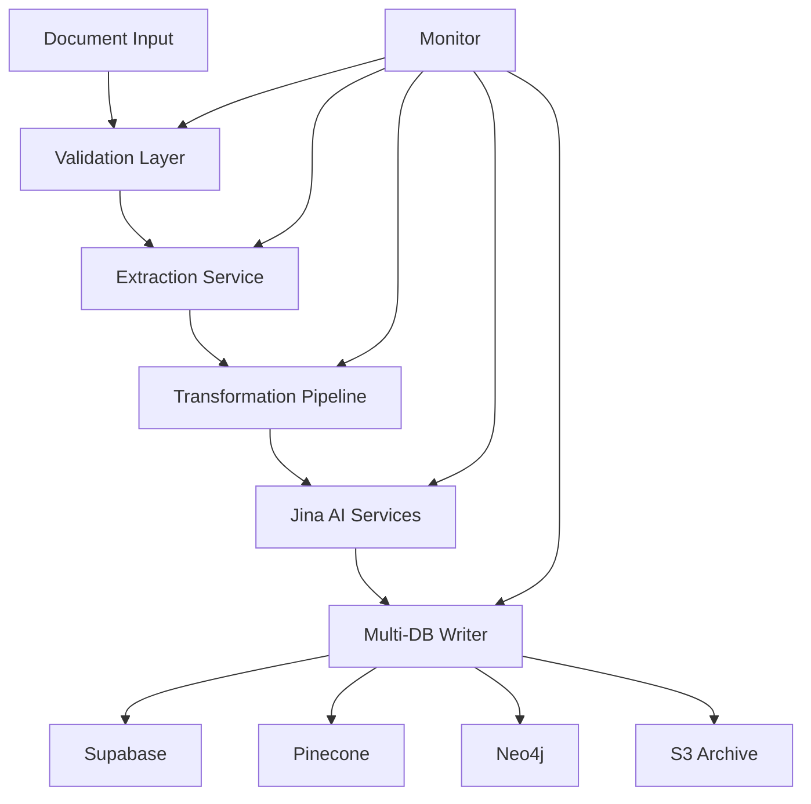

# Product Requirements Document: ETL Multi-Database Intelligence Pipeline
## Project Seldon - Core Data Processing Capability

**Version**: 1.0  
**Date**: June 13, 2025  
**Author**: Project Seldon Engineering Team  
**Status**: Active Development

---

## Table of Contents

1. [Executive Summary](#executive-summary)
2. [User Personas & Requirements](#user-personas--requirements)
3. [Architecture Design](#architecture-design)
4. [Feature Specifications](#feature-specifications)
5. [Database Schema](#database-schema)
6. [API Documentation](#api-documentation)
7. [UI/UX Design](#uiux-design)
8. [Implementation Plan](#implementation-plan)
9. [Testing Strategy](#testing-strategy)
10. [Deployment Guide](#deployment-guide)
11. [Maintenance Plan](#maintenance-plan)
12. [Appendices](#appendices)

---

## 1. Executive Summary

### 1.1 Product Vision
The ETL Multi-Database Intelligence Pipeline transforms Project Nightingale's 670+ intelligence artifacts into a searchable, analyzable, and actionable knowledge graph distributed across three specialized databases. This system serves as the data foundation for Project Seldon's predictive threat intelligence capabilities.

### 1.2 Key Objectives
- **Automated Processing**: Transform documents without manual intervention
- **Intelligence Extraction**: Convert unstructured data into structured insights
- **Multi-Modal Storage**: Optimize data storage across SQL, vector, and graph databases
- **Real-Time Analytics**: Enable instant querying and relationship discovery
- **Production Scale**: Handle thousands of documents with high reliability

### 1.3 Success Criteria
- Process 100% of Project Nightingale artifacts
- Achieve <5% error rate in document processing
- Enable sub-second query response times
- Maintain 99.9% uptime in production
- Support real-time document ingestion

---

## 2. User Personas & Requirements

### 2.1 Security Analyst (Primary User)
**Profile**: Technical professional analyzing threats and vulnerabilities
**Needs**:
- Quick access to relevant threat intelligence
- Ability to trace information to source documents
- Relationship visualization between threats
- Bulk processing of new intelligence

**User Stories**:
```
As a Security Analyst, I want to:
- Upload a batch of PDFs and have them automatically processed
- Search for similar threats using natural language queries
- View relationships between threat actors and targets
- Export findings with full citation trails
```

### 2.2 Intelligence Manager (Secondary User)
**Profile**: Leader overseeing threat intelligence operations
**Needs**:
- Dashboard views of processing status
- Quality metrics and error reports
- Configuration of processing rules
- Access control management

**User Stories**:
```
As an Intelligence Manager, I want to:
- Monitor the health of the ETL pipeline
- Configure which documents get priority processing
- Set up automated alerts for critical findings
- Generate reports on intelligence coverage
```

### 2.3 System Administrator (Support User)
**Profile**: Technical staff maintaining the infrastructure
**Needs**:
- System health monitoring
- Performance optimization tools
- Backup and recovery procedures
- Integration management

**User Stories**:
```
As a System Administrator, I want to:
- Monitor resource usage across all components
- Configure database connections and API keys
- Perform maintenance without service interruption
- Troubleshoot processing failures
```

---

## 3. Architecture Design

### 3.1 High-Level Architecture

```typescript
// System Architecture Overview
interface ETLArchitecture {
  ingestion: {
    sources: ['S3', 'LocalFS', 'API'];
    formats: ['PDF', 'MD', 'XLSX', 'PNG', 'JPG'];
    validation: DocumentValidator;
  };
  
  processing: {
    extraction: DocumentExtractor;
    transformation: {
      chunking: TextChunker;
      embedding: JinaEmbedder;
      classification: ContentClassifier;
    };
    enrichment: MetadataEnricher;
  };
  
  storage: {
    metadata: SupabaseConnector;
    vectors: PineconeConnector;
    relationships: Neo4jConnector;
    documents: S3Storage;
  };
  
  monitoring: {
    health: HealthChecker;
    metrics: MetricsCollector;
    logging: StructuredLogger;
  };
}
```

### 3.2 Component Interactions



### 3.3 Technology Stack
- **Runtime**: Node.js 18+ with TypeScript 5.0+
- **Framework**: Express.js for API endpoints
- **AI/ML**: Jina AI API v2
- **Databases**: 
  - PostgreSQL 15 (via Supabase)
  - Pinecone (Serverless)
  - Neo4j 5.0 (Aura or Self-hosted)
- **Storage**: AWS S3 or compatible
- **Monitoring**: Prometheus + Grafana
- **Containerization**: Docker with Kubernetes

---

## 4. Feature Specifications

### 4.1 Document Processing Pipeline

#### 4.1.1 Document Ingestion
```typescript
interface DocumentIngestion {
  // Supported input methods
  upload: {
    single: (file: File) => Promise<DocumentId>;
    batch: (files: File[]) => Promise<BatchResult>;
    url: (url: string) => Promise<DocumentId>;
  };
  
  // Validation rules
  validation: {
    maxFileSize: 100 * 1024 * 1024; // 100MB
    allowedFormats: ['pdf', 'md', 'txt', 'xlsx', 'png', 'jpg'];
    virusScan: boolean;
    duplicateCheck: boolean;
  };
  
  // Processing options
  options: {
    priority: 'high' | 'normal' | 'low';
    skipEmbeddings?: boolean;
    customMetadata?: Record<string, any>;
    notifyOnComplete?: boolean;
  };
}
```

#### 4.1.2 Text Extraction
```typescript
interface TextExtraction {
  // PDF extraction with OCR fallback
  pdf: {
    extractText: (buffer: Buffer) => Promise<ExtractedContent>;
    extractTables: (buffer: Buffer) => Promise<TableData[]>;
    extractImages: (buffer: Buffer) => Promise<ImageData[]>;
    ocrFallback: boolean;
  };
  
  // Structured document parsing
  structured: {
    parseMarkdown: (content: string) => DocumentStructure;
    parseExcel: (buffer: Buffer) => SpreadsheetData;
    parseJSON: (content: string) => StructuredData;
  };
  
  // Content cleaning
  cleaning: {
    removeHeaders: boolean;
    normalizeWhitespace: boolean;
    detectLanguage: boolean;
    extractMetadata: boolean;
  };
}
```

#### 4.1.3 Intelligent Chunking
```typescript
interface ChunkingStrategy {
  // Semantic chunking with overlap
  semantic: {
    targetSize: 1500; // tokens
    maxSize: 2000;
    minSize: 500;
    overlap: 200;
    boundaryDetection: 'sentence' | 'paragraph' | 'section';
  };
  
  // Citation preservation
  citations: {
    trackCharacterOffsets: boolean;
    preserveFormatting: boolean;
    maintainHierarchy: boolean;
  };
  
  // Chunk metadata
  metadata: {
    sourceDocument: string;
    pageNumber?: number;
    sectionTitle?: string;
    chunkIndex: number;
    totalChunks: number;
  };
}
```

### 4.2 Jina AI Integration

#### 4.2.1 Embedding Generation
```typescript
interface JinaEmbedding {
  // Model configuration
  models: {
    text: 'jina-embeddings-v3';
    multimodal: 'jina-clip-v2';
    dimensions: 768;
  };
  
  // Request handling
  batchProcessing: {
    batchSize: 20;
    maxTokensPerBatch: 8192;
    retryOnFailure: true;
    rateLimiting: {
      embeddings: 2000; // requests per minute
      reranking: 2000;
      classification: 60;
    };
  };
  
  // Response processing
  postProcessing: {
    normalization: boolean;
    dimensionReduction?: number;
    caching: boolean;
  };
}
```

#### 4.2.2 Content Classification
```typescript
interface ContentClassification {
  // Threat classification
  threatTypes: [
    'ransomware',
    'supply-chain',
    'insider-threat',
    'zero-day',
    'apt',
    'vulnerability'
  ];
  
  // Sector classification
  sectors: [
    'energy',
    'manufacturing',
    'transportation',
    'water',
    'financial',
    'healthcare'
  ];
  
  // Criticality scoring
  scoring: {
    method: 'weighted-average';
    factors: ['severity', 'likelihood', 'impact'];
    scale: 1-10;
  };
}
```

### 4.3 Multi-Database Storage

#### 4.3.1 Supabase (Metadata Storage)
```typescript
interface SupabaseStorage {
  // Document tracking
  documents: {
    id: UUID;
    source_path: string;
    processing_status: ProcessingStatus;
    metadata: JSONB;
    created_at: timestamp;
    updated_at: timestamp;
  };
  
  // Processing history
  processing_logs: {
    id: UUID;
    document_id: UUID;
    stage: string;
    status: 'success' | 'failure';
    details: JSONB;
    timestamp: timestamp;
  };
  
  // Citation tracking
  citations: {
    id: UUID;
    chunk_id: UUID;
    character_start: number;
    character_end: number;
    page_number?: number;
    confidence: float;
  };
}
```

#### 4.3.2 Pinecone (Vector Storage)
```typescript
interface PineconeStorage {
  // Vector structure
  vector: {
    id: string; // chunk-{uuid}
    values: number[]; // 768 dimensions
    metadata: {
      document_id: string;
      chunk_index: number;
      content: string; // first 1000 chars
      title?: string;
      date?: string;
      threat_type?: string;
      sector?: string;
    };
  };
  
  // Index configuration
  index: {
    name: 'project-seldon-intelligence';
    dimension: 768;
    metric: 'cosine';
    pods: 1;
    replicas: 1;
  };
  
  // Query options
  query: {
    topK: 20;
    includeMetadata: true;
    filter?: Record<string, any>;
  };
}
```

#### 4.3.3 Neo4j (Relationship Storage)
```typescript
interface Neo4jStorage {
  // Node types
  nodes: {
    Document: {
      id: string;
      title: string;
      type: string;
      date: Date;
      source: string;
    };
    
    ThreatActor: {
      id: string;
      name: string;
      aliases: string[];
      firstSeen: Date;
    };
    
    Organization: {
      id: string;
      name: string;
      sector: string;
      size: string;
    };
    
    Vulnerability: {
      id: string;
      cve: string;
      severity: number;
      description: string;
    };
  };
  
  // Relationship types
  relationships: {
    MENTIONS: {
      confidence: float;
      context: string;
    };
    
    TARGETS: {
      campaign: string;
      date: Date;
    };
    
    EXPLOITS: {
      technique: string;
      success: boolean;
    };
    
    RELATES_TO: {
      similarity: float;
      type: string;
    };
  };
}
```

### 4.4 Query and Retrieval

#### 4.4.1 Semantic Search
```typescript
interface SemanticSearch {
  // Query processing
  query: {
    text: string;
    embedding?: number[];
    filters?: {
      dateRange?: [Date, Date];
      threatTypes?: string[];
      sectors?: string[];
      minScore?: number;
    };
  };
  
  // Result ranking
  ranking: {
    method: 'hybrid'; // combines vector similarity and metadata
    reranking: boolean; // use Jina reranker
    diversification: boolean; // ensure result variety
  };
  
  // Response format
  response: {
    results: SearchResult[];
    totalCount: number;
    processingTime: number;
    suggestions?: string[];
  };
}
```

#### 4.4.2 Graph Traversal
```typescript
interface GraphQueries {
  // Relationship exploration
  findConnections: {
    startNode: NodeId;
    relationshipTypes?: string[];
    maxDepth: number;
    filters?: Record<string, any>;
  };
  
  // Pattern matching
  detectPatterns: {
    template: CypherQuery;
    parameters: Record<string, any>;
    limit: number;
  };
  
  // Anomaly detection
  findAnomalies: {
    baseline: TimeRange;
    threshold: number;
    types: AnomalyType[];
  };
}
```

---

## 5. Database Schema

### 5.1 Supabase PostgreSQL Schema

```sql
-- Documents table
CREATE TABLE documents (
  id UUID PRIMARY KEY DEFAULT gen_random_uuid(),
  source_path TEXT NOT NULL,
  s3_key TEXT UNIQUE,
  file_hash VARCHAR(64) NOT NULL,
  format VARCHAR(10) NOT NULL,
  size_bytes BIGINT NOT NULL,
  status processing_status NOT NULL DEFAULT 'pending',
  metadata JSONB DEFAULT '{}',
  processed_at TIMESTAMP WITH TIME ZONE,
  error_message TEXT,
  created_at TIMESTAMP WITH TIME ZONE DEFAULT CURRENT_TIMESTAMP,
  updated_at TIMESTAMP WITH TIME ZONE DEFAULT CURRENT_TIMESTAMP
);

-- Create enum for processing status
CREATE TYPE processing_status AS ENUM (
  'pending',
  'processing',
  'completed',
  'failed',
  'quarantined'
);

-- Chunks table
CREATE TABLE chunks (
  id UUID PRIMARY KEY DEFAULT gen_random_uuid(),
  document_id UUID NOT NULL REFERENCES documents(id) ON DELETE CASCADE,
  chunk_index INTEGER NOT NULL,
  content TEXT NOT NULL,
  token_count INTEGER NOT NULL,
  char_start INTEGER NOT NULL,
  char_end INTEGER NOT NULL,
  embedding_id VARCHAR(255),
  metadata JSONB DEFAULT '{}',
  created_at TIMESTAMP WITH TIME ZONE DEFAULT CURRENT_TIMESTAMP,
  UNIQUE(document_id, chunk_index)
);

-- Processing logs table
CREATE TABLE processing_logs (
  id UUID PRIMARY KEY DEFAULT gen_random_uuid(),
  document_id UUID NOT NULL REFERENCES documents(id) ON DELETE CASCADE,
  stage VARCHAR(50) NOT NULL,
  status VARCHAR(20) NOT NULL,
  details JSONB DEFAULT '{}',
  duration_ms INTEGER,
  created_at TIMESTAMP WITH TIME ZONE DEFAULT CURRENT_TIMESTAMP
);

-- Citations table
CREATE TABLE citations (
  id UUID PRIMARY KEY DEFAULT gen_random_uuid(),
  chunk_id UUID NOT NULL REFERENCES chunks(id) ON DELETE CASCADE,
  source_document_id UUID NOT NULL REFERENCES documents(id),
  citation_type VARCHAR(50) NOT NULL,
  char_start INTEGER NOT NULL,
  char_end INTEGER NOT NULL,
  page_number INTEGER,
  confidence FLOAT NOT NULL DEFAULT 1.0,
  metadata JSONB DEFAULT '{}',
  created_at TIMESTAMP WITH TIME ZONE DEFAULT CURRENT_TIMESTAMP
);

-- Indexes for performance
CREATE INDEX idx_documents_status ON documents(status);
CREATE INDEX idx_documents_created ON documents(created_at DESC);
CREATE INDEX idx_chunks_document ON chunks(document_id);
CREATE INDEX idx_chunks_embedding ON chunks(embedding_id);
CREATE INDEX idx_logs_document ON processing_logs(document_id);
CREATE INDEX idx_citations_chunk ON citations(chunk_id);

-- RLS policies
ALTER TABLE documents ENABLE ROW LEVEL SECURITY;
ALTER TABLE chunks ENABLE ROW LEVEL SECURITY;
ALTER TABLE processing_logs ENABLE ROW LEVEL SECURITY;
ALTER TABLE citations ENABLE ROW LEVEL SECURITY;
```

### 5.2 Neo4j Graph Schema

```cypher
// Node definitions
// Document nodes
CREATE CONSTRAINT document_id IF NOT EXISTS
ON (d:Document) ASSERT d.id IS UNIQUE;

// Threat Actor nodes
CREATE CONSTRAINT threat_actor_id IF NOT EXISTS
ON (ta:ThreatActor) ASSERT ta.id IS UNIQUE;

// Organization nodes
CREATE CONSTRAINT org_id IF NOT EXISTS
ON (o:Organization) ASSERT o.id IS UNIQUE;

// Vulnerability nodes
CREATE CONSTRAINT vuln_id IF NOT EXISTS
ON (v:Vulnerability) ASSERT v.cve IS UNIQUE;

// Index for performance
CREATE INDEX document_date IF NOT EXISTS
FOR (d:Document) ON (d.date);

CREATE INDEX threat_actor_name IF NOT EXISTS
FOR (ta:ThreatActor) ON (ta.name);

CREATE INDEX org_sector IF NOT EXISTS
FOR (o:Organization) ON (o.sector);

// Example relationship patterns
// Document mentions ThreatActor
MATCH (d:Document {id: $docId})
MATCH (ta:ThreatActor {id: $actorId})
MERGE (d)-[r:MENTIONS {confidence: $confidence}]->(ta)

// ThreatActor targets Organization
MATCH (ta:ThreatActor {id: $actorId})
MATCH (o:Organization {id: $orgId})
MERGE (ta)-[r:TARGETS {campaign: $campaign, date: $date}]->(o)

// Organization has Vulnerability
MATCH (o:Organization {id: $orgId})
MATCH (v:Vulnerability {cve: $cve})
MERGE (o)-[r:HAS_VULNERABILITY {discovered: $date}]->(v)
```

### 5.3 Pinecone Vector Schema

```typescript
// Index configuration
const indexConfig = {
  name: 'project-seldon-intelligence',
  dimension: 768,
  metric: 'cosine',
  spec: {
    serverless: {
      cloud: 'aws',
      region: 'us-east-1'
    }
  }
};

// Vector metadata schema
interface VectorMetadata {
  // Required fields
  document_id: string;
  chunk_id: string;
  chunk_index: number;
  content: string; // First 1000 characters
  
  // Document metadata
  title?: string;
  author?: string;
  date?: string; // ISO 8601
  source?: string;
  
  // Classification metadata
  threat_type?: string;
  sector?: string;
  severity?: number;
  
  // Search optimization
  keywords?: string[];
  entities?: string[];
  
  // Citation support
  char_start: number;
  char_end: number;
  page_number?: number;
}
```

---

## 6. API Documentation

### 6.1 RESTful API Endpoints

#### 6.1.1 Document Management

```typescript
// Upload document
POST /api/v1/documents
Headers: {
  'Authorization': 'Bearer {token}',
  'Content-Type': 'multipart/form-data'
}
Body: {
  file: File,
  metadata?: {
    title?: string,
    source?: string,
    tags?: string[]
  },
  options?: {
    priority?: 'high' | 'normal' | 'low',
    skipEmbeddings?: boolean
  }
}
Response: {
  documentId: string,
  status: 'queued',
  estimatedProcessingTime: number
}

// Get document status
GET /api/v1/documents/{documentId}
Response: {
  id: string,
  filename: string,
  status: ProcessingStatus,
  metadata: object,
  chunks?: number,
  processingTime?: number,
  errors?: string[]
}

// List documents
GET /api/v1/documents?status={status}&limit={limit}&offset={offset}
Response: {
  documents: Document[],
  total: number,
  hasMore: boolean
}
```

#### 6.1.2 Search and Retrieval

```typescript
// Semantic search
POST /api/v1/search
Body: {
  query: string,
  filters?: {
    dateRange?: [string, string],
    threatTypes?: string[],
    sectors?: string[],
    documentIds?: string[]
  },
  options?: {
    limit?: number,
    includeContext?: boolean,
    rerank?: boolean
  }
}
Response: {
  results: [{
    documentId: string,
    chunkId: string,
    score: number,
    content: string,
    highlight?: string,
    metadata: object,
    citations?: Citation[]
  }],
  totalResults: number,
  processingTime: number
}

// Graph query
POST /api/v1/graph/query
Body: {
  startNode: string,
  relationshipTypes?: string[],
  maxDepth?: number,
  filters?: object
}
Response: {
  nodes: Node[],
  relationships: Relationship[],
  patterns: Pattern[]
}
```

#### 6.1.3 Analytics and Monitoring

```typescript
// Pipeline statistics
GET /api/v1/stats
Response: {
  documents: {
    total: number,
    processed: number,
    failed: number,
    queued: number
  },
  processing: {
    averageTime: number,
    successRate: number,
    errorsLast24h: number
  },
  storage: {
    vectors: number,
    nodes: number,
    relationships: number
  }
}

// Health check
GET /api/v1/health
Response: {
  status: 'healthy' | 'degraded' | 'unhealthy',
  components: {
    supabase: ComponentHealth,
    pinecone: ComponentHealth,
    neo4j: ComponentHealth,
    jina: ComponentHealth
  },
  uptime: number
}
```

### 6.2 WebSocket API

```typescript
// Real-time processing updates
ws://api.project-seldon.com/v1/ws

// Subscribe to document processing
{
  "action": "subscribe",
  "documentId": "doc-123"
}

// Receive updates
{
  "type": "processing_update",
  "documentId": "doc-123",
  "stage": "embedding_generation",
  "progress": 0.75,
  "message": "Generated 15/20 embeddings"
}

// Subscribe to new findings
{
  "action": "subscribe",
  "channel": "threat_findings",
  "filters": {
    "severity": ["high", "critical"],
    "sectors": ["energy"]
  }
}
```

---

## 7. UI/UX Design

### 7.1 Admin Dashboard

#### 7.1.1 Overview Screen
```
┌─────────────────────────────────────────────────────┐
│  Project Seldon ETL Pipeline Dashboard              │
├─────────────────────────────────────────────────────┤
│                                                     │
│  ┌─────────────┐  ┌─────────────┐  ┌─────────────┐│
│  │ Documents   │  │ Processing  │  │ Storage     ││
│  │    670     │  │   15/min    │  │  2.3M      ││
│  │   Total     │  │   Rate      │  │  Vectors    ││
│  └─────────────┘  └─────────────┘  └─────────────┘│
│                                                     │
│  Processing Queue                                   │
│  ┌─────────────────────────────────────────────┐  │
│  │ ████████████░░░░░░░░  45/100 documents     │  │
│  └─────────────────────────────────────────────┘  │
│                                                     │
│  Recent Activity                                    │
│  ┌─────────────────────────────────────────────┐  │
│  │ ✅ threat-report-2025.pdf     2 min ago     │  │
│  │ ✅ cisa-advisory-123.pdf      5 min ago     │  │
│  │ ⚠️ corrupted-scan.pdf        10 min ago     │  │
│  │ 🔄 executive-brief.pdf        Processing...   │  │
│  └─────────────────────────────────────────────┘  │
└─────────────────────────────────────────────────────┘
```

#### 7.1.2 Document Upload Interface
- Drag-and-drop zone for files
- Batch upload progress tracking
- Metadata editing capabilities
- Processing options selection

#### 7.1.3 Search Interface
- Natural language query box
- Advanced filter panel
- Result cards with highlights
- Citation trail visualization

### 7.2 API Documentation Portal
- Interactive API explorer
- Code examples in multiple languages
- Authentication guide
- Rate limit information

---

## 8. Implementation Plan

### 8.1 Phase 1: Foundation (Current)

#### Checkpoint 1.1: Core Infrastructure ✅
- [x] TypeScript project setup
- [x] Database connections established
- [x] Basic error handling framework
- [x] Logging system implemented

**Completion Criteria**: All services can connect and basic health checks pass

#### Checkpoint 1.2: Document Processing ✅
- [x] PDF text extraction working
- [x] Markdown parsing implemented
- [x] Document chunking algorithm
- [x] Character-level citation tracking

**Completion Criteria**: Can process sample documents end-to-end

#### Checkpoint 1.3: Database Integration 🔄
- [x] Supabase schema deployed
- [x] Pinecone index created
- [ ] Neo4j constraints defined
- [ ] Basic CRUD operations

**Completion Criteria**: Can store and retrieve data from all databases

### 8.2 Phase 2: AI Integration

#### Checkpoint 2.1: Jina AI Services
- [ ] API authentication configured
- [ ] Embedding generation tested
- [ ] Rate limiting implemented
- [ ] Error handling for API failures

**Completion Criteria**: Can generate embeddings for 100 documents without errors

#### Checkpoint 2.2: Classification & Enrichment
- [ ] Content classification working
- [ ] Entity extraction implemented
- [ ] Threat scoring algorithm
- [ ] Metadata enrichment pipeline

**Completion Criteria**: Documents are automatically classified and enriched

#### Checkpoint 2.3: Advanced Processing
- [ ] Image text extraction (OCR)
- [ ] Table parsing from PDFs
- [ ] Multi-language support
- [ ] Format conversion utilities

**Completion Criteria**: Can handle 95% of document types in corpus

### 8.3 Phase 3: Production Readiness

#### Checkpoint 3.1: Performance Optimization
- [ ] Batch processing optimized
- [ ] Caching layer implemented
- [ ] Database query optimization
- [ ] Resource usage profiling

**Completion Criteria**: Can process 100 documents/hour consistently

#### Checkpoint 3.2: Reliability Features
- [ ] Automatic retry mechanisms
- [ ] Dead letter queue for failures
- [ ] Transaction rollback support
- [ ] Data consistency checks

**Completion Criteria**: 99% success rate over 1000 documents

#### Checkpoint 3.3: Monitoring & Observability
- [ ] Metrics collection setup
- [ ] Alert rules configured
- [ ] Dashboard creation
- [ ] Log aggregation working

**Completion Criteria**: Full visibility into system health and performance

### 8.4 Phase 4: Advanced Features

#### Checkpoint 4.1: API Development
- [ ] RESTful endpoints implemented
- [ ] Authentication/authorization
- [ ] Rate limiting per client
- [ ] API documentation generated

**Completion Criteria**: External systems can integrate via API

#### Checkpoint 4.2: Real-time Capabilities
- [ ] WebSocket server setup
- [ ] Event streaming implemented
- [ ] Live processing updates
- [ ] Push notifications

**Completion Criteria**: Users receive real-time updates during processing

#### Checkpoint 4.3: Analytics & Intelligence
- [ ] Trend analysis algorithms
- [ ] Anomaly detection
- [ ] Predictive models
- [ ] Report generation

**Completion Criteria**: System provides actionable intelligence insights

### 8.5 Progress Tracking Methodology

```typescript
// PROGRESS.md format
interface ProgressTracking {
  phases: {
    phase: number;
    name: string;
    status: 'not-started' | 'in-progress' | 'completed';
    checkpoints: {
      id: string;
      name: string;
      status: 'pending' | 'in-progress' | 'completed' | 'blocked';
      completionCriteria: string[];
      tasksCompleted: number;
      totalTasks: number;
      blockers?: string[];
      notes?: string;
    }[];
  }[];
  
  lastUpdated: Date;
  nextMilestone: string;
  risks: Risk[];
  decisions: Decision[];
}
```

---

## 9. Testing Strategy

### 9.1 Unit Testing

```typescript
// Example test structure
describe('DocumentProcessor', () => {
  describe('PDF Extraction', () => {
    it('should extract text from valid PDF', async () => {
      const result = await processor.extractPDF(validPDF);
      expect(result.text).toBeDefined();
      expect(result.pages).toBeGreaterThan(0);
    });
    
    it('should handle corrupted PDFs gracefully', async () => {
      const result = await processor.extractPDF(corruptedPDF);
      expect(result.error).toBeDefined();
      expect(result.fallbackMethod).toBe('OCR');
    });
  });
  
  describe('Chunking Algorithm', () => {
    it('should create optimal chunks with overlap', async () => {
      const chunks = await processor.chunkText(longText, {
        targetSize: 1500,
        overlap: 200
      });
      
      chunks.forEach(chunk => {
        expect(chunk.tokenCount).toBeLessThanOrEqual(2000);
        expect(chunk.tokenCount).toBeGreaterThanOrEqual(500);
      });
    });
  });
});
```

### 9.2 Integration Testing

```typescript
// End-to-end pipeline test
describe('ETL Pipeline Integration', () => {
  it('should process document through entire pipeline', async () => {
    // Upload document
    const docId = await pipeline.uploadDocument(testPDF);
    
    // Wait for processing
    await waitForProcessing(docId, { timeout: 60000 });
    
    // Verify storage
    const supabaseDoc = await supabase.getDocument(docId);
    expect(supabaseDoc.status).toBe('completed');
    
    const vectors = await pinecone.getVectorsByDocument(docId);
    expect(vectors.length).toBeGreaterThan(0);
    
    const nodes = await neo4j.getNodesByDocument(docId);
    expect(nodes.length).toBeGreaterThan(0);
  });
});
```

### 9.3 Performance Testing

```yaml
# k6 performance test script
import http from 'k6/http';
import { check } from 'k6';

export let options = {
  stages: [
    { duration: '2m', target: 10 }, // Ramp up
    { duration: '5m', target: 50 }, // Stay at 50 users
    { duration: '2m', target: 0 },  // Ramp down
  ],
  thresholds: {
    http_req_duration: ['p(95)<5000'], // 95% of requests under 5s
    http_req_failed: ['rate<0.05'],    // Error rate under 5%
  },
};

export default function() {
  // Upload document
  let response = http.post(
    'https://api.project-seldon.com/v1/documents',
    { file: open('test.pdf', 'b') },
    { headers: { 'Authorization': 'Bearer ${token}' } }
  );
  
  check(response, {
    'upload successful': (r) => r.status === 201,
    'response time OK': (r) => r.timings.duration < 5000,
  });
}
```

### 9.4 Security Testing

- **Input Validation**: Test with malicious files
- **SQL Injection**: Attempt injection in metadata
- **API Authentication**: Verify token validation
- **Rate Limiting**: Ensure limits are enforced
- **Data Privacy**: Verify PII handling

---

## 10. Deployment Guide

### 10.1 Infrastructure Requirements

```yaml
# docker-compose.yml
version: '3.8'

services:
  etl-api:
    image: project-seldon/etl-api:latest
    environment:
      - NODE_ENV=production
      - SUPABASE_URL=${SUPABASE_URL}
      - SUPABASE_KEY=${SUPABASE_KEY}
      - PINECONE_API_KEY=${PINECONE_API_KEY}
      - NEO4J_URI=${NEO4J_URI}
      - JINA_API_KEY=${JINA_API_KEY}
    ports:
      - "3000:3000"
    deploy:
      replicas: 3
      resources:
        limits:
          cpus: '2'
          memory: 4G
        reservations:
          cpus: '1'
          memory: 2G
    healthcheck:
      test: ["CMD", "curl", "-f", "http://localhost:3000/health"]
      interval: 30s
      timeout: 10s
      retries: 3

  etl-worker:
    image: project-seldon/etl-worker:latest
    environment:
      - NODE_ENV=production
      - WORKER_CONCURRENCY=5
    deploy:
      replicas: 5
      resources:
        limits:
          cpus: '4'
          memory: 8G

  redis:
    image: redis:7-alpine
    volumes:
      - redis-data:/data
    deploy:
      resources:
        limits:
          memory: 2G

volumes:
  redis-data:
```

### 10.2 Kubernetes Deployment

```yaml
# k8s/deployment.yaml
apiVersion: apps/v1
kind: Deployment
metadata:
  name: etl-pipeline
  namespace: project-seldon
spec:
  replicas: 3
  selector:
    matchLabels:
      app: etl-pipeline
  template:
    metadata:
      labels:
        app: etl-pipeline
    spec:
      containers:
      - name: etl-api
        image: project-seldon/etl-api:latest
        ports:
        - containerPort: 3000
        env:
        - name: NODE_ENV
          value: "production"
        envFrom:
        - secretRef:
            name: etl-secrets
        resources:
          requests:
            memory: "2Gi"
            cpu: "1000m"
          limits:
            memory: "4Gi"
            cpu: "2000m"
        livenessProbe:
          httpGet:
            path: /health
            port: 3000
          initialDelaySeconds: 30
          periodSeconds: 10
        readinessProbe:
          httpGet:
            path: /ready
            port: 3000
          initialDelaySeconds: 5
          periodSeconds: 5
---
apiVersion: autoscaling/v2
kind: HorizontalPodAutoscaler
metadata:
  name: etl-pipeline-hpa
  namespace: project-seldon
spec:
  scaleTargetRef:
    apiVersion: apps/v1
    kind: Deployment
    name: etl-pipeline
  minReplicas: 3
  maxReplicas: 10
  metrics:
  - type: Resource
    resource:
      name: cpu
      target:
        type: Utilization
        averageUtilization: 70
  - type: Resource
    resource:
      name: memory
      target:
        type: Utilization
        averageUtilization: 80
```

### 10.3 CI/CD Pipeline

```yaml
# .github/workflows/deploy.yml
name: Deploy ETL Pipeline

on:
  push:
    branches: [main]
    paths:
      - 'src/**'
      - 'package.json'
      - 'Dockerfile'

jobs:
  test:
    runs-on: ubuntu-latest
    steps:
      - uses: actions/checkout@v3
      
      - name: Setup Node.js
        uses: actions/setup-node@v3
        with:
          node-version: '18'
          
      - name: Install dependencies
        run: npm ci
        
      - name: Run tests
        run: npm test
        
      - name: Run linting
        run: npm run lint
        
      - name: Check types
        run: npm run typecheck

  build:
    needs: test
    runs-on: ubuntu-latest
    steps:
      - uses: actions/checkout@v3
      
      - name: Build Docker image
        run: |
          docker build -t project-seldon/etl-api:${{ github.sha }} .
          docker tag project-seldon/etl-api:${{ github.sha }} project-seldon/etl-api:latest
          
      - name: Push to registry
        run: |
          echo ${{ secrets.DOCKER_PASSWORD }} | docker login -u ${{ secrets.DOCKER_USERNAME }} --password-stdin
          docker push project-seldon/etl-api:${{ github.sha }}
          docker push project-seldon/etl-api:latest

  deploy:
    needs: build
    runs-on: ubuntu-latest
    steps:
      - name: Deploy to Kubernetes
        run: |
          kubectl set image deployment/etl-pipeline etl-api=project-seldon/etl-api:${{ github.sha }} -n project-seldon
          kubectl rollout status deployment/etl-pipeline -n project-seldon
```

---

## 11. Maintenance Plan

### 11.1 Regular Maintenance Tasks

#### Daily Tasks
- Monitor error rates and processing queues
- Review failed document quarantine
- Check API rate limit usage
- Verify backup completion

#### Weekly Tasks
- Performance metrics review
- Database optimization (VACUUM, ANALYZE)
- Security log audit
- Dependency vulnerability scan

#### Monthly Tasks
- Full system backup test
- Disaster recovery drill
- Performance benchmarking
- Cost optimization review

### 11.2 Update Procedures

```typescript
// Version management
interface UpdateProcedure {
  preUpdate: {
    backupDatabases: boolean;
    notifyUsers: boolean;
    runTests: boolean;
    checkDependencies: boolean;
  };
  
  update: {
    strategy: 'blue-green' | 'rolling' | 'canary';
    rollbackPlan: string;
    healthChecks: string[];
  };
  
  postUpdate: {
    validateFunctionality: boolean;
    monitorMetrics: boolean;
    updateDocumentation: boolean;
  };
}
```

### 11.3 Troubleshooting Guide

#### Common Issues and Solutions

1. **High Memory Usage**
   - Check batch sizes in configuration
   - Review concurrent processing limits
   - Analyze memory leaks with profiler

2. **Slow Processing**
   - Verify Jina API rate limits
   - Check database connection pools
   - Review chunking algorithm efficiency

3. **Failed Documents**
   - Examine processing logs
   - Validate document format
   - Check for corruption or encoding issues

4. **API Timeouts**
   - Increase timeout settings
   - Implement request queuing
   - Scale worker instances

---

## 12. Appendices

### Appendix A: Configuration Reference

```typescript
// Complete configuration interface
interface ETLConfiguration {
  // Environment settings
  environment: 'development' | 'staging' | 'production';
  
  // Processing settings
  processing: {
    batchSize: number;
    maxRetries: number;
    retryDelay: number;
    timeout: number;
    concurrency: number;
  };
  
  // Database connections
  databases: {
    supabase: {
      url: string;
      anonKey: string;
      serviceKey?: string;
    };
    pinecone: {
      apiKey: string;
      environment: string;
      indexName: string;
    };
    neo4j: {
      uri: string;
      username: string;
      password: string;
      database: string;
    };
  };
  
  // AI services
  ai: {
    jina: {
      apiKey: string;
      models: {
        embedding: string;
        classification: string;
        reranking: string;
      };
      rateLimits: {
        embeddings: number;
        classification: number;
      };
    };
  };
  
  // Storage settings
  storage: {
    s3: {
      bucket: string;
      region: string;
      accessKeyId?: string;
      secretAccessKey?: string;
    };
  };
  
  // Monitoring
  monitoring: {
    logLevel: 'debug' | 'info' | 'warn' | 'error';
    metricsEnabled: boolean;
    tracingEnabled: boolean;
  };
}
```

### Appendix B: Error Codes

| Code | Description | Resolution |
|------|-------------|------------|
| ETL-001 | Invalid document format | Check supported formats |
| ETL-002 | Processing timeout | Increase timeout or reduce file size |
| ETL-003 | Database connection failed | Verify credentials and network |
| ETL-004 | Insufficient permissions | Check API keys and access rights |
| ETL-005 | Rate limit exceeded | Implement backoff or upgrade plan |
| ETL-006 | Memory limit exceeded | Reduce batch size or scale resources |
| ETL-007 | Malformed document | Review document structure |
| ETL-008 | Embedding generation failed | Check Jina API status |
| ETL-009 | Storage quota exceeded | Clean up old data or increase quota |
| ETL-010 | Network timeout | Check connectivity and retry |

### Appendix C: Glossary

- **Chunking**: Process of breaking documents into smaller segments
- **Embedding**: Numerical representation of text in vector space
- **Graph Database**: Database that uses graph structures for queries
- **ETL**: Extract, Transform, Load - data processing paradigm
- **Vector Database**: Specialized database for similarity search
- **Citation**: Reference linking content to original source
- **Semantic Search**: Search based on meaning rather than keywords
- **Rate Limiting**: Controlling frequency of API requests
- **Dead Letter Queue**: Storage for messages that failed processing
- **Blue-Green Deployment**: Zero-downtime deployment strategy

---

**Document Version**: 1.0  
**Last Updated**: June 13, 2025  
**Review Cycle**: Monthly  
**Owner**: Project Seldon Engineering Team