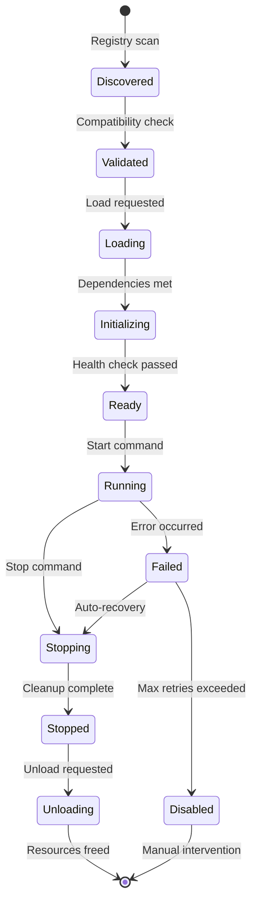

# Project Seldon Capability Architecture
## Plugin System for Modular Innovation

**Version**: 2.0  
**Date**: January 2025  
**Status**: Implementation Ready  
**Audience**: Capability Developers  

---

## 📋 Executive Summary

The Capability Architecture enables **rapid, safe innovation** through a plugin system that allows new features to be developed, tested, and deployed without affecting the stable foundation. Each capability is a self-contained module that extends Project Seldon's functionality while adhering to strict interface contracts.

**Key Benefits**:
- **Parallel Development**: Multiple teams work independently
- **Safe Experimentation**: Failures don't affect other capabilities
- **Hot Deployment**: Add/remove capabilities without downtime
- **Version Independence**: Capabilities evolve at their own pace
- **Resource Isolation**: Guaranteed performance boundaries

---

## 🎯 Capability Design Principles

### 1. Self-Contained Modules
Each capability must be fully self-contained with:
- Own dependencies
- Own data schemas
- Own API endpoints
- Own UI components
- Own documentation

### 2. Interface Contracts
All capabilities interact through:
- Versioned APIs only
- Event bus for async communication
- No direct code dependencies
- No shared mutable state
- Clear boundary definitions

### 3. Graceful Degradation
Capabilities must:
- Handle missing dependencies
- Provide fallback behavior
- Emit meaningful error events
- Never crash the foundation
- Support partial functionality

### 4. Observable Behavior
Every capability provides:
- Health endpoints
- Metrics emission
- Structured logging
- Distributed tracing
- Performance benchmarks

---

## 🏗️ Capability Lifecycle



---

## 🔌 Capability Interface Specification

### Core Interface
Every capability must implement:

```typescript
interface ISeldonCapability {
    // Unique identifier
    readonly id: string;
    
    // Metadata for registry
    readonly metadata: CapabilityMetadata;
    
    // Lifecycle management
    readonly lifecycle: CapabilityLifecycle;
    
    // API surface
    readonly api: CapabilityAPI;
    
    // Event integration
    readonly events: CapabilityEvents;
    
    // Resource requirements
    readonly resources: ResourceRequirements;
    
    // Configuration schema
    readonly configuration: ConfigurationSchema;
}
```

### Metadata Structure
```typescript
interface CapabilityMetadata {
    // Basic Information
    name: string;                    // Human-readable name
    version: SemanticVersion;        // Current version
    author: string;                  // Author/team name
    description: string;             // What it does
    category: CapabilityCategory;    // Classification
    tags: string[];                  // Searchable tags
    license: string;                 // License type
    
    // Dependencies
    foundationVersion: VersionRange; // Required foundation version
    requiredCapabilities: Dependency[]; // Other capabilities needed
    optionalCapabilities: Dependency[]; // Enhanced functionality
    
    // Resources
    documentation: URL;              // Docs location
    repository: URL;                 // Source code
    issues: URL;                     // Bug tracker
    
    // Feature Flags
    experimental: boolean;           // Beta status
    deprecated: boolean;             // Sunset status
    security: SecurityLevel;         // Required clearance
}
```

### Lifecycle Management
```typescript
interface CapabilityLifecycle {
    // Initialization Phase
    validate(context: ValidationContext): Promise<ValidationResult>;
    install(context: InstallContext): Promise<void>;
    configure(config: Configuration): Promise<void>;
    
    // Runtime Phase
    start(context: RuntimeContext): Promise<void>;
    stop(reason: StopReason): Promise<void>;
    
    // Health Management
    healthCheck(): Promise<HealthStatus>;
    diagnose(issue: Issue): Promise<Diagnosis>;
    recover(error: Error): Promise<RecoveryAction>;
    
    // Cleanup Phase
    suspend(): Promise<SuspendState>;
    resume(state: SuspendState): Promise<void>;
    uninstall(): Promise<void>;
}
```

---

## 📦 Capability Categories

### Analysis Capabilities
**Purpose**: Extend analytical and prediction capabilities

```typescript
interface AnalysisCapability extends ISeldonCapability {
    analyze(data: AnalysisInput): Promise<AnalysisResult>;
    predict(model: PredictionModel): Promise<Prediction>;
    explain(result: AnalysisResult): Promise<Explanation>;
}
```

Examples:
- Organizational Psyche Engine (OPE)
- Threat Actor Profiler
- Vulnerability Correlator

### Simulation Capabilities
**Purpose**: Model interactions and scenarios

```typescript
interface SimulationCapability extends ISeldonCapability {
    createScenario(config: ScenarioConfig): Promise<Scenario>;
    runSimulation(scenario: Scenario): Promise<SimulationResult>;
    adjustParameters(params: Parameters): Promise<void>;
}
```

Examples:
- Dialectic Simulation Core (DSC)
- Attack Path Simulator
- Cascade Failure Modeler

### Visualization Capabilities
**Purpose**: Make data comprehensible

```typescript
interface VisualizationCapability extends ISeldonCapability {
    render(data: VisualizationData): Promise<Rendering>;
    interact(event: InteractionEvent): Promise<Response>;
    export(format: ExportFormat): Promise<ExportedData>;
}
```

Examples:
- Musical Score Visualizer (MSV)
- Graph Network Viewer
- Timeline Animator

### Integration Capabilities
**Purpose**: Connect with external systems

```typescript
interface IntegrationCapability extends ISeldonCapability {
    connect(config: ConnectionConfig): Promise<Connection>;
    sync(source: DataSource): Promise<SyncResult>;
    transform(data: ExternalData): Promise<InternalData>;
}
```

Examples:
- CISA KEV Integrator
- Threat Feed Connector
- SIEM Bridge

### Meta Capabilities
**Purpose**: Enhance the system itself

```typescript
interface MetaCapability extends ISeldonCapability {
    analyze(system: SystemState): Promise<Analysis>;
    optimize(target: OptimizationTarget): Promise<Optimization>;
    evolve(feedback: Feedback): Promise<Evolution>;
}
```

Examples:
- InfiniteLoop Meta System
- Performance Optimizer
- Learning Engine

---

## 🛠️ Capability Development Kit (CDK)

### Project Structure
```
my-capability/
├── package.json           # Node.js manifest
├── capability.json        # Capability manifest
├── README.md             # Documentation
├── LICENSE               # License file
├── src/
│   ├── index.ts          # Entry point
│   ├── lifecycle.ts      # Lifecycle implementation
│   ├── api/              # REST/GraphQL endpoints
│   ├── events/           # Event handlers
│   ├── services/         # Business logic
│   ├── models/           # Data models
│   └── utils/            # Utilities
├── test/
│   ├── unit/             # Unit tests
│   ├── integration/      # Integration tests
│   └── fixtures/         # Test data
├── config/
│   ├── default.json      # Default config
│   ├── schema.json       # Config schema
│   └── examples/         # Config examples
└── docs/
    ├── api.md            # API documentation
    ├── events.md         # Event documentation
    └── tutorial.md       # Getting started
```

### Capability Manifest
```json
{
  "id": "org-psyche-engine",
  "name": "Organizational Psyche Engine",
  "version": "1.0.0",
  "author": "Seldon Team",
  "description": "Digital twin modeling for organizations",
  "category": "analysis",
  "tags": ["psychology", "modeling", "prediction"],
  
  "foundation": {
    "minVersion": "2.0.0",
    "maxVersion": "3.0.0"
  },
  
  "dependencies": {
    "required": [],
    "optional": ["dialectic-simulation-core"]
  },
  
  "exports": {
    "api": {
      "rest": "/api/capabilities/ope/v1",
      "graphql": "ope.graphql"
    },
    "events": {
      "publishes": ["ope.profile.created", "ope.trait.updated"],
      "subscribes": ["foundation.data.imported"]
    }
  },
  
  "resources": {
    "compute": {
      "cpu": "2 cores",
      "memory": "4GB"
    },
    "storage": {
      "persistent": "10GB",
      "cache": "2GB"
    }
  }
}
```

### Development Tools

#### Capability CLI
```bash
# Create new capability from template
seldon capability create my-capability --template analysis

# Validate capability
seldon capability validate ./my-capability

# Test capability locally
seldon capability test ./my-capability

# Package capability
seldon capability package ./my-capability

# Deploy capability
seldon capability deploy my-capability.zip
```

#### Local Development Environment
```typescript
// Local test harness
import { TestHarness } from '@seldon/cdk';

const harness = new TestHarness({
    foundation: 'mock',
    capabilities: ['mock-neo4j', 'mock-events']
});

// Test your capability
const capability = await harness.loadCapability('./dist');
const result = await capability.api.analyze(testData);
expect(result).toMatchSnapshot();
```

---

## 🔄 Communication Patterns

### Event-Driven Architecture
```typescript
// Publishing events
class MyCapability implements ISeldonCapability {
    async processData(data: Data) {
        // Process data
        const result = await this.analyze(data);
        
        // Publish event
        await this.eventBus.publish({
            type: 'analysis.completed',
            payload: {
                id: result.id,
                summary: result.summary,
                confidence: result.confidence
            },
            metadata: {
                capability: this.id,
                timestamp: new Date(),
                version: this.version
            }
        });
    }
}

// Subscribing to events
class AnotherCapability implements ISeldonCapability {
    async onLoad(context: FoundationContext) {
        // Subscribe to events
        context.eventBus.subscribe(
            'analysis.completed',
            this.handleAnalysisCompleted.bind(this)
        );
    }
    
    async handleAnalysisCompleted(event: Event) {
        // React to event
        if (event.payload.confidence > 0.8) {
            await this.triggerWorkflow(event.payload.id);
        }
    }
}
```

### API Communication
```typescript
// Calling another capability's API
class MyCapability implements ISeldonCapability {
    async enhanceAnalysis(data: Data) {
        // Discover capability
        const psycheEngine = await this.registry.discover('org-psyche-engine');
        
        if (psycheEngine) {
            // Call API
            const profile = await psycheEngine.api.createProfile({
                organization: data.organization,
                traits: data.extractedTraits
            });
            
            // Use result
            return this.combineAnalysis(data, profile);
        } else {
            // Graceful degradation
            return this.basicAnalysis(data);
        }
    }
}
```

### Shared Storage Patterns
```typescript
// Namespace isolation
class MyCapability implements ISeldonCapability {
    private namespace = `capability:${this.id}`;
    
    async storeData(key: string, data: any) {
        // Automatically namespaced
        await this.storage.put(
            `${this.namespace}:${key}`,
            data
        );
    }
    
    async shareData(key: string, data: any) {
        // Explicitly shared namespace
        await this.storage.put(
            `shared:${key}`,
            data,
            { 
                permissions: ['read:*', 'write:admin'],
                ttl: 3600
            }
        );
    }
}
```

---

## 🚀 Advanced Capability Features

### Hot Reloading
```typescript
interface HotReloadable extends ISeldonCapability {
    // Preserve state during reload
    serialize(): Promise<SerializedState>;
    deserialize(state: SerializedState): Promise<void>;
    
    // Handle version changes
    migrate(fromVersion: Version, toVersion: Version): Promise<void>;
}
```

### Distributed Capabilities
```typescript
interface DistributedCapability extends ISeldonCapability {
    // Scaling
    readonly scaling: {
        min: number;
        max: number;
        metric: ScalingMetric;
        threshold: number;
    };
    
    // Partitioning
    partition(data: Data): PartitionKey;
    merge(results: PartialResult[]): Result;
    
    // Coordination
    coordinate(instances: Instance[]): Promise<void>;
}
```

### Multi-Tenant Capabilities
```typescript
interface MultiTenantCapability extends ISeldonCapability {
    // Tenant isolation
    setTenantContext(tenant: TenantId): void;
    
    // Resource limits per tenant
    getTenantLimits(tenant: TenantId): ResourceLimits;
    
    // Data isolation
    getTenantStorage(tenant: TenantId): Storage;
}
```

---

## 🛡️ Security Considerations

### Capability Sandboxing
```yaml
security:
  sandbox:
    - filesystem: restricted to capability directory
    - network: whitelist only
    - process: no fork/exec
    - memory: cgroup limits
    
  permissions:
    - data: read own, write own
    - events: publish allowed, subscribe filtered
    - api: rate limited
    - resources: hard limits
```

### Code Signing
```typescript
interface SignedCapability extends ISeldonCapability {
    // Signature verification
    readonly signature: {
        algorithm: 'RSA-SHA256';
        publicKey: string;
        signature: string;
    };
    
    // Integrity check
    verify(): Promise<boolean>;
}
```

### Audit Trail
```typescript
interface AuditableCapability extends ISeldonCapability {
    // Log all actions
    readonly audit: {
        logLevel: 'all' | 'modifications' | 'errors';
        retention: Duration;
        encryption: boolean;
    };
    
    // Compliance reports
    generateAuditReport(period: DateRange): Promise<AuditReport>;
}
```

---

## 📊 Performance Guidelines

### Resource Budgets
```yaml
budgets:
  startup:
    time: < 5 seconds
    memory: < 100MB
  
  runtime:
    cpu: < 2 cores sustained
    memory: < 4GB
    disk_io: < 100MB/s
  
  api:
    latency_p99: < 200ms
    throughput: > 100 req/s
```

### Optimization Strategies
1. **Lazy Loading**: Initialize only what's needed
2. **Caching**: Use foundation cache service
3. **Batch Processing**: Group operations
4. **Async Operations**: Non-blocking I/O
5. **Resource Pooling**: Reuse connections

---

## 🧪 Testing Requirements

### Test Coverage
```yaml
coverage:
  unit: > 90%
  integration: > 80%
  api: 100%
  error_paths: 100%
```

### Test Types
```typescript
// Unit tests
describe('MyCapability', () => {
    it('should analyze data correctly', async () => {
        const capability = new MyCapability();
        const result = await capability.analyze(testData);
        expect(result.confidence).toBeGreaterThan(0.8);
    });
});

// Integration tests
describe('MyCapability Integration', () => {
    it('should integrate with event bus', async () => {
        const harness = new TestHarness();
        await harness.loadCapability(MyCapability);
        
        const event = await harness.waitForEvent('analysis.completed');
        expect(event).toBeDefined();
    });
});

// Load tests
describe('MyCapability Performance', () => {
    it('should handle 1000 req/s', async () => {
        const results = await loadTest({
            capability: MyCapability,
            rate: 1000,
            duration: 60
        });
        
        expect(results.errors).toBeLessThan(10);
        expect(results.p99).toBeLessThan(200);
    });
});
```

---

## 📚 Example Capabilities

### Minimal Capability
```typescript
import { ISeldonCapability, CapabilityBase } from '@seldon/cdk';

export class MinimalCapability extends CapabilityBase {
    metadata = {
        id: 'minimal-example',
        name: 'Minimal Example',
        version: '1.0.0',
        author: 'Example Team',
        description: 'Simplest possible capability'
    };
    
    async onStart() {
        this.logger.info('Minimal capability started');
    }
    
    async analyze(data: any) {
        return { processed: true, data };
    }
}
```

### Advanced Capability
```typescript
import { 
    ISeldonCapability, 
    CapabilityBase,
    GraphQLSchema,
    RestEndpoint 
} from '@seldon/cdk';

export class AdvancedCapability extends CapabilityBase {
    metadata = {
        id: 'advanced-example',
        name: 'Advanced Example',
        version: '2.0.0',
        author: 'Advanced Team',
        description: 'Full-featured capability example'
    };
    
    api = {
        rest: [
            {
                method: 'POST',
                path: '/analyze',
                handler: this.handleAnalyze.bind(this)
            }
        ],
        graphql: this.buildGraphQLSchema()
    };
    
    events = {
        publishes: ['analysis.completed'],
        subscribes: ['data.imported']
    };
    
    async onStart() {
        // Initialize services
        await this.initializeML();
        await this.connectToDatabase();
        
        // Start background jobs
        this.startPeriodicAnalysis();
    }
    
    private async handleAnalyze(req: Request): Promise<Response> {
        const result = await this.analyze(req.body);
        
        await this.eventBus.publish({
            type: 'analysis.completed',
            payload: result
        });
        
        return { status: 200, body: result };
    }
}
```

---

## 🎯 Best Practices

### Do's
✅ Keep capabilities focused on one thing  
✅ Handle all error cases gracefully  
✅ Emit meaningful events for observability  
✅ Document all APIs thoroughly  
✅ Test edge cases and error paths  
✅ Use semantic versioning properly  
✅ Implement health checks comprehensively  
✅ Respect resource limits  

### Don'ts
❌ Don't access foundation internals  
❌ Don't modify global state  
❌ Don't assume other capabilities exist  
❌ Don't bypass security controls  
❌ Don't ignore resource limits  
❌ Don't skip error handling  
❌ Don't couple to specific versions  
❌ Don't block the event loop  

---

## 📞 Support Resources

- **Documentation**: [Capability Development Guide](../03_Implementation/CAPABILITY_DEVELOPMENT_GUIDE.md)
- **Examples**: [Example Capabilities](../08_Appendices/EXAMPLE_CAPABILITIES.md)
- **Templates**: [Capability Templates](../08_Appendices/TEMPLATES.md)
- **Community**: GitHub Discussions
- **Support**: capability-support@seldon.io

---

**Next Steps**: Choose a capability from the [Capability Registry](../02_Capabilities/CAPABILITY_REGISTRY.md) to implement.

**Document Version**: 2.0  
**Last Updated**: January 2025  
**Review Cycle**: Quarterly