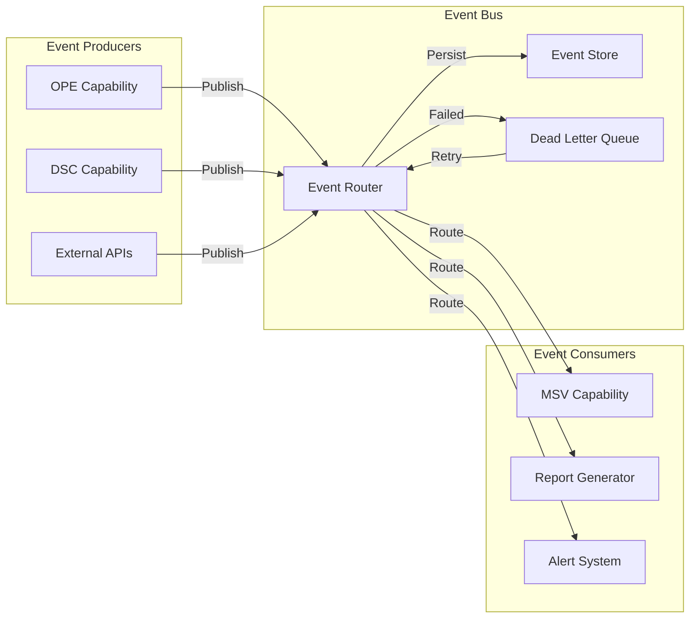

# Project Seldon Event-Driven Patterns
## Asynchronous Capability Communication

**Version**: 2.0  
**Date**: January 2025  
**Status**: Pattern Catalog Complete  
**Audience**: Capability Developers & Architects  

---

## 📋 Executive Summary

Event-driven architecture enables **loose coupling** between Project Seldon capabilities while maintaining system coherence. This document provides patterns, best practices, and implementation guidelines for asynchronous communication that scales, recovers from failures, and maintains data consistency.

**Key Benefits**:
- **Decoupling**: Capabilities don't need to know about each other
- **Scalability**: Asynchronous processing handles load spikes
- **Resilience**: System continues despite component failures
- **Flexibility**: New capabilities can tap into existing event streams
- **Auditability**: Complete event history for compliance

---

## 🎯 Core Event Principles

### 1. Event First Design
- Events represent facts that have occurred
- Events are immutable once published
- Events carry enough context to be useful
- Events follow a consistent schema
- Events enable replay and recovery

### 2. Event Categories

```typescript
enum EventCategory {
    // Domain Events (Business Logic)
    ORGANIZATION_PROFILED = "domain.organization.profiled",
    THREAT_DETECTED = "domain.threat.detected",
    VULNERABILITY_IDENTIFIED = "domain.vulnerability.identified",
    SIMULATION_COMPLETED = "domain.simulation.completed",
    
    // Integration Events (External Systems)
    DATA_IMPORTED = "integration.data.imported",
    FEED_UPDATED = "integration.feed.updated",
    ALERT_SENT = "integration.alert.sent",
    REPORT_GENERATED = "integration.report.generated",
    
    // System Events (Infrastructure)
    CAPABILITY_STARTED = "system.capability.started",
    RESOURCE_EXHAUSTED = "system.resource.exhausted",
    HEALTH_DEGRADED = "system.health.degraded",
    CONFIG_UPDATED = "system.config.updated",
    
    // Command Events (Actions to Take)
    ANALYZE_ORGANIZATION = "command.analyze.organization",
    GENERATE_REPORT = "command.generate.report",
    UPDATE_PROFILE = "command.update.profile",
    TRIGGER_SIMULATION = "command.trigger.simulation"
}
```

### 3. Event Anatomy

```typescript
interface Event<T = any> {
    // Identity
    id: string;                    // Unique event ID
    type: EventCategory;           // Event category/type
    version: string;              // Schema version
    
    // Temporal
    timestamp: number;            // When it occurred
    sequence: number;             // Global ordering
    
    // Context
    source: {
        capability: string;       // Publishing capability
        instance: string;         // Instance ID
        version: string;          // Capability version
    };
    
    // Causality
    correlationId: string;        // Tracks related events
    causationId?: string;         // What caused this event
    
    // Payload
    data: T;                      // Event-specific data
    
    // Metadata
    metadata: {
        userId?: string;          // Who triggered it
        tenantId?: string;        // Multi-tenancy
        tags?: string[];          // Searchable tags
        sensitive?: boolean;      // Contains PII/secrets
    };
}
```

---

## 🏗️ Event Flow Architecture



---

## 📚 Event Patterns Catalog

### 1. Event Notification Pattern
**Use Case**: Notify interested parties that something happened

```typescript
// Producer: Organization Psyche Engine
class OPECapability {
    async createOrganizationProfile(data: OrgData): Promise<Profile> {
        // Business logic
        const profile = await this.buildProfile(data);
        await this.saveProfile(profile);
        
        // Emit notification event
        await this.eventBus.publish({
            type: EventCategory.ORGANIZATION_PROFILED,
            data: {
                organizationId: profile.id,
                organizationName: profile.name,
                traits: profile.traits,
                timestamp: new Date()
            },
            correlationId: this.context.correlationId
        });
        
        return profile;
    }
}

// Consumer: Report Generator
class ReportGenerator {
    async onOrganizationProfiled(event: Event): Promise<void> {
        // React to event
        const { organizationId } = event.data;
        
        // Generate default reports
        await this.generateExecutiveSummary(organizationId);
        await this.generateRiskAssessment(organizationId);
    }
}
```

### 2. Event-Carried State Transfer Pattern
**Use Case**: Include all necessary data in the event

```typescript
// Rich event with full state
interface ThreatDetectedEvent {
    threat: {
        id: string;
        type: ThreatType;
        severity: Severity;
        confidence: number;
        indicators: Indicator[];
        affectedAssets: Asset[];
        timeline: Timeline;
        mitigations: Mitigation[];
    };
    context: {
        detectionMethod: string;
        dataSource: string;
        analyst?: string;
    };
}

// Producer includes everything needed
await this.eventBus.publish({
    type: EventCategory.THREAT_DETECTED,
    data: comprehensiveThreatData,
    metadata: { sensitive: true }
});

// Consumer doesn't need to query back
async handleThreatDetected(event: Event<ThreatDetectedEvent>) {
    // All data is in the event
    const { threat } = event.data;
    await this.createIncident(threat);
    await this.notifySOC(threat);
    await this.updateDashboard(threat);
}
```

### 3. Event Sourcing Pattern
**Use Case**: Store all changes as events for replay

```typescript
// Event store for organizational changes
class OrganizationEventStore {
    async appendEvent(event: Event): Promise<void> {
        await this.store.append({
            streamId: `org-${event.data.organizationId}`,
            event: event,
            expectedVersion: event.sequence - 1
        });
    }
    
    async getOrganizationHistory(
        orgId: string,
        fromVersion?: number
    ): Promise<Event[]> {
        return this.store.readStream(
            `org-${orgId}`,
            fromVersion ?? 0
        );
    }
    
    async rebuildOrganizationState(orgId: string): Promise<OrgState> {
        const events = await this.getOrganizationHistory(orgId);
        
        return events.reduce((state, event) => {
            return this.applyEvent(state, event);
        }, this.getInitialState());
    }
}
```

### 4. Command Query Responsibility Segregation (CQRS)
**Use Case**: Separate write and read models

```typescript
// Command side (writes)
class OrganizationCommandHandler {
    async handle(command: Command): Promise<void> {
        switch (command.type) {
            case 'UPDATE_TRAITS':
                await this.updateTraits(command);
                break;
            case 'ADD_INCIDENT':
                await this.addIncident(command);
                break;
        }
    }
    
    private async updateTraits(command: UpdateTraitsCommand) {
        // Validate command
        const validation = await this.validate(command);
        if (!validation.valid) throw new ValidationError(validation);
        
        // Apply change
        const events = await this.applyTraitUpdate(command);
        
        // Publish events
        for (const event of events) {
            await this.eventBus.publish(event);
        }
    }
}

// Query side (reads)
class OrganizationQueryHandler {
    async getOrganizationView(orgId: string): Promise<OrgView> {
        // Read from optimized read model
        return this.readModel.getOrganization(orgId);
    }
    
    // Read model updated by event projections
    async projectEvent(event: Event): Promise<void> {
        switch (event.type) {
            case EventCategory.ORGANIZATION_PROFILED:
                await this.readModel.createOrganization(event.data);
                break;
            case 'TRAITS_UPDATED':
                await this.readModel.updateTraits(event.data);
                break;
        }
    }
}
```

### 5. Saga Pattern
**Use Case**: Coordinate multi-step processes

```typescript
// Incident response saga
class IncidentResponseSaga {
    private steps = [
        'DETECT_THREAT',
        'ANALYZE_IMPACT',
        'NOTIFY_STAKEHOLDERS',
        'IMPLEMENT_MITIGATION',
        'VERIFY_RESOLUTION',
        'GENERATE_REPORT'
    ];
    
    async handle(event: Event): Promise<void> {
        const saga = await this.loadSaga(event.correlationId);
        
        switch (saga.currentStep) {
            case 'DETECT_THREAT':
                if (event.type === EventCategory.THREAT_DETECTED) {
                    await this.analyzeImpact(event.data);
                    saga.currentStep = 'ANALYZE_IMPACT';
                }
                break;
                
            case 'ANALYZE_IMPACT':
                if (event.type === 'IMPACT_ANALYZED') {
                    await this.notifyStakeholders(event.data);
                    saga.currentStep = 'NOTIFY_STAKEHOLDERS';
                }
                break;
                
            // ... more steps
        }
        
        await this.saveSaga(saga);
    }
    
    // Compensation for failures
    async compensate(saga: Saga, failedStep: string): Promise<void> {
        const compensations = {
            'IMPLEMENT_MITIGATION': this.rollbackMitigation,
            'NOTIFY_STAKEHOLDERS': this.sendCorrectionNotice,
            // ... more compensations
        };
        
        await compensations[failedStep]?.(saga);
    }
}
```

### 6. Streaming Pattern
**Use Case**: Process continuous event streams

```typescript
// Real-time threat stream processing
class ThreatStreamProcessor {
    private windows: Map<string, TimeWindow>;
    
    async processStream(): Promise<void> {
        const stream = await this.eventBus.createStream({
            types: [
                EventCategory.THREAT_DETECTED,
                EventCategory.VULNERABILITY_IDENTIFIED
            ],
            fromNow: true
        });
        
        for await (const event of stream) {
            await this.processEvent(event);
        }
    }
    
    private async processEvent(event: Event): Promise<void> {
        // Windowed aggregation
        const window = this.getWindow(event.data.organizationId);
        window.addEvent(event);
        
        // Check patterns
        if (window.getEventCount() > 10) {
            await this.raiseAlert({
                type: 'UNUSUAL_ACTIVITY',
                organization: event.data.organizationId,
                eventCount: window.getEventCount(),
                timeframe: window.duration
            });
        }
        
        // Slide window
        window.slide();
    }
}
```

---

## 🔄 Event Flow Patterns

### Fan-Out Pattern
```typescript
// One event triggers multiple consumers
eventBus.publish({
    type: 'CRITICAL_VULNERABILITY_FOUND'
});

// Multiple independent reactions
// Consumer 1: Create incident ticket
// Consumer 2: Send executive alert  
// Consumer 3: Trigger automated patching
// Consumer 4: Update risk score
// Consumer 5: Generate report
```

### Fan-In Pattern
```typescript
// Multiple events aggregate to one outcome
class RiskAggregator {
    private factors: Map<string, RiskFactor> = new Map();
    
    async handle(event: Event): Promise<void> {
        // Collect risk factors from various sources
        if (event.type === 'VULNERABILITY_FOUND') {
            this.factors.set('vuln', event.data);
        }
        if (event.type === 'THREAT_INTELLIGENCE_UPDATE') {
            this.factors.set('threat', event.data);
        }
        if (event.type === 'ASSET_IMPORTANCE_CHANGED') {
            this.factors.set('asset', event.data);
        }
        
        // When all factors present, calculate risk
        if (this.hasAllFactors()) {
            const risk = this.calculateRisk();
            await this.publishRiskScore(risk);
        }
    }
}
```

### Pipeline Pattern
```typescript
// Events flow through processing stages
const pipeline = [
    DataValidation,
    Enrichment,
    Analysis,
    Storage,
    Notification
];

// Each stage subscribes to previous stage's output
class Enrichment {
    constructor() {
        eventBus.subscribe('data.validated', this.enrich.bind(this));
    }
    
    async enrich(event: Event): Promise<void> {
        const enriched = await this.addContext(event.data);
        await eventBus.publish({
            type: 'data.enriched',
            data: enriched,
            causationId: event.id
        });
    }
}
```

---

## 🛡️ Error Handling Patterns

### Dead Letter Queue Pattern
```typescript
class DeadLetterQueueHandler {
    async handleFailedEvent(failure: EventFailure): Promise<void> {
        // Log failure
        this.logger.error('Event processing failed', {
            event: failure.event,
            error: failure.error,
            attempts: failure.attempts
        });
        
        // Categorize failure
        const category = this.categorizeFailure(failure);
        
        switch (category) {
            case 'TRANSIENT':
                // Retry with exponential backoff
                await this.scheduleRetry(failure, {
                    delay: Math.pow(2, failure.attempts) * 1000,
                    maxAttempts: 5
                });
                break;
                
            case 'POISON_MESSAGE':
                // Move to poison queue for manual inspection
                await this.moveToPoisonQueue(failure);
                await this.alertOperations(failure);
                break;
                
            case 'INVALID_SCHEMA':
                // Try schema migration
                const migrated = await this.migrateSchema(failure.event);
                if (migrated) {
                    await this.eventBus.publish(migrated);
                } else {
                    await this.moveToPoisonQueue(failure);
                }
                break;
        }
    }
}
```

### Circuit Breaker Pattern
```typescript
class EventConsumerCircuitBreaker {
    private state: 'CLOSED' | 'OPEN' | 'HALF_OPEN' = 'CLOSED';
    private failures = 0;
    private lastFailure?: Date;
    
    async consume(event: Event): Promise<void> {
        if (this.state === 'OPEN') {
            if (this.shouldAttemptReset()) {
                this.state = 'HALF_OPEN';
            } else {
                throw new CircuitOpenError();
            }
        }
        
        try {
            await this.processEvent(event);
            this.onSuccess();
        } catch (error) {
            this.onFailure();
            throw error;
        }
    }
    
    private onSuccess(): void {
        if (this.state === 'HALF_OPEN') {
            this.state = 'CLOSED';
        }
        this.failures = 0;
    }
    
    private onFailure(): void {
        this.failures++;
        this.lastFailure = new Date();
        
        if (this.failures >= 5) {
            this.state = 'OPEN';
            this.scheduleHealthCheck();
        }
    }
}
```

---

## 🎭 Event Schema Evolution

### Schema Versioning
```typescript
// Version 1
interface OrganizationProfiledV1 {
    version: '1.0.0';
    organizationId: string;
    name: string;
    sector: string;
}

// Version 2 - Added new field
interface OrganizationProfiledV2 {
    version: '2.0.0';
    organizationId: string;
    name: string;
    sector: string;
    riskScore?: number;  // New optional field
}

// Schema migration
class SchemaEvolution {
    migrate(event: Event): Event {
        switch (event.version) {
            case '1.0.0':
                return this.migrateV1toV2(event);
            default:
                return event;
        }
    }
    
    private migrateV1toV2(event: Event): Event {
        return {
            ...event,
            version: '2.0.0',
            data: {
                ...event.data,
                riskScore: this.calculateDefaultRiskScore(event.data)
            }
        };
    }
}
```

### Backward Compatibility
```typescript
class BackwardCompatibleConsumer {
    async handle(event: Event): Promise<void> {
        // Handle multiple versions
        const normalizedData = this.normalize(event);
        
        // Process with version-agnostic logic
        await this.processOrganization(normalizedData);
    }
    
    private normalize(event: Event): NormalizedOrgData {
        switch (event.version) {
            case '1.0.0':
                return {
                    id: event.data.organizationId,
                    name: event.data.name,
                    sector: event.data.sector,
                    riskScore: 50  // Default for v1
                };
            case '2.0.0':
                return {
                    id: event.data.organizationId,
                    name: event.data.name,
                    sector: event.data.sector,
                    riskScore: event.data.riskScore ?? 50
                };
            default:
                throw new UnknownVersionError(event.version);
        }
    }
}
```

---

## 📊 Event Monitoring & Observability

### Event Metrics
```typescript
interface EventMetrics {
    // Publishing metrics
    eventsPublished: Counter;
    publishLatency: Histogram;
    publishErrors: Counter;
    
    // Consumption metrics
    eventsConsumed: Counter;
    processingLatency: Histogram;
    consumerLag: Gauge;
    
    // Stream metrics
    eventRate: Gauge;
    backpressure: Gauge;
    partitionLag: Gauge;
    
    // DLQ metrics
    dlqSize: Gauge;
    dlqAge: Gauge;
    retryRate: Counter;
}
```

### Event Tracing
```typescript
class EventTracer {
    async traceEvent(event: Event): Promise<void> {
        const span = this.tracer.startSpan('event.process', {
            attributes: {
                'event.id': event.id,
                'event.type': event.type,
                'event.correlation_id': event.correlationId
            }
        });
        
        try {
            // Trace through the system
            await this.processWithTracing(event, span);
        } finally {
            span.end();
        }
    }
}
```

---

## 🚀 Performance Optimization

### Batching Pattern
```typescript
class BatchingEventPublisher {
    private batch: Event[] = [];
    private batchSize = 100;
    private flushInterval = 100; // ms
    
    async publish(event: Event): Promise<void> {
        this.batch.push(event);
        
        if (this.batch.length >= this.batchSize) {
            await this.flush();
        }
    }
    
    private async flush(): Promise<void> {
        if (this.batch.length === 0) return;
        
        const events = this.batch.splice(0);
        await this.eventBus.publishBatch(events);
    }
}
```

### Parallel Processing
```typescript
class ParallelEventProcessor {
    private concurrency = 10;
    
    async processEvents(events: Event[]): Promise<void> {
        const semaphore = new Semaphore(this.concurrency);
        
        await Promise.all(
            events.map(async (event) => {
                await semaphore.acquire();
                try {
                    await this.processEvent(event);
                } finally {
                    semaphore.release();
                }
            })
        );
    }
}
```

---

## 🎯 Best Practices

### Event Design
✅ Use past tense for event names (OrderPlaced, not PlaceOrder)  
✅ Include enough context in events  
✅ Keep events immutable  
✅ Version events from the start  
✅ Use correlation IDs for tracking  
✅ Include timestamps and sequence numbers  
✅ Design for idempotency  

### Event Publishing
✅ Publish events after state changes  
✅ Use transactions where needed  
✅ Handle publishing failures gracefully  
✅ Don't publish sensitive data  
✅ Batch when appropriate  
✅ Monitor publishing metrics  

### Event Consumption  
✅ Make consumers idempotent  
✅ Handle out-of-order delivery  
✅ Implement proper error handling  
✅ Use circuit breakers  
✅ Monitor consumer lag  
✅ Design for eventual consistency  

### Testing
✅ Test event contracts  
✅ Test error scenarios  
✅ Test event ordering  
✅ Test schema evolution  
✅ Load test event throughput  
✅ Chaos test failure modes  

---

## 📚 Implementation Examples

### Complete Event-Driven Capability
```typescript
import { 
    ISeldonCapability, 
    EventBus, 
    Event,
    CapabilityBase 
} from '@seldon/cdk';

export class ThreatAnalysisCapability extends CapabilityBase {
    private subscriptions: Subscription[] = [];
    
    async onStart(): Promise<void> {
        // Subscribe to relevant events
        this.subscriptions.push(
            await this.eventBus.subscribe(
                'organization.profiled',
                this.analyzeNewOrganization.bind(this)
            ),
            
            await this.eventBus.subscribe(
                'threat.intelligence.updated',
                this.updateAnalysis.bind(this)
            ),
            
            await this.eventBus.subscribe(
                'vulnerability.discovered',
                this.assessImpact.bind(this)
            )
        );
    }
    
    async onStop(): Promise<void> {
        // Unsubscribe from all events
        for (const sub of this.subscriptions) {
            await sub.unsubscribe();
        }
    }
    
    private async analyzeNewOrganization(event: Event): Promise<void> {
        const { organizationId } = event.data;
        
        try {
            // Perform analysis
            const threats = await this.identifyThreats(organizationId);
            const vulnerabilities = await this.findVulnerabilities(organizationId);
            const riskScore = await this.calculateRisk(threats, vulnerabilities);
            
            // Publish results
            await this.eventBus.publish({
                type: 'threat.analysis.completed',
                data: {
                    organizationId,
                    threats,
                    vulnerabilities,
                    riskScore,
                    analyzedAt: new Date()
                },
                correlationId: event.correlationId
            });
            
        } catch (error) {
            // Publish failure event
            await this.eventBus.publish({
                type: 'threat.analysis.failed',
                data: {
                    organizationId,
                    error: error.message,
                    failedAt: new Date()
                },
                correlationId: event.correlationId
            });
            
            throw error;
        }
    }
}
```

---

## 📞 Resources

- **Event Catalog**: [Event Type Registry](../02_Capabilities/EVENT_CATALOG.md)
- **Schema Registry**: [Event Schemas](../04_Integration/EVENT_SCHEMAS.md)
- **Testing Guide**: [Event Testing](../03_Implementation/EVENT_TESTING_GUIDE.md)
- **Monitoring**: [Event Monitoring Dashboard](../07_Living_Wiki/EVENT_MONITORING.md)

---

**Next**: Review [Capability Registry](../02_Capabilities/CAPABILITY_REGISTRY.md) for available capabilities.

**Document Version**: 2.0  
**Last Updated**: January 2025  
**Review Cycle**: Quarterly