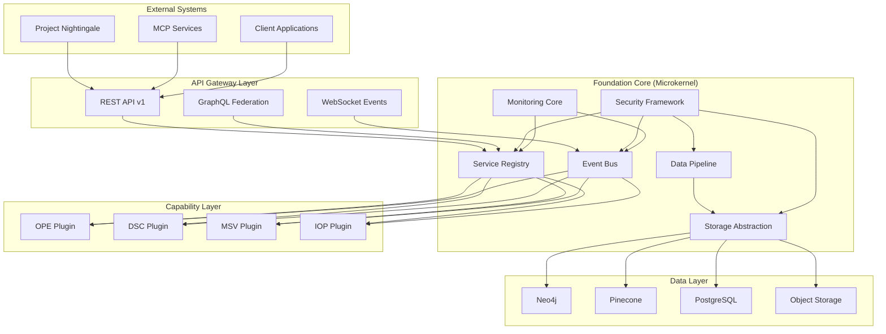
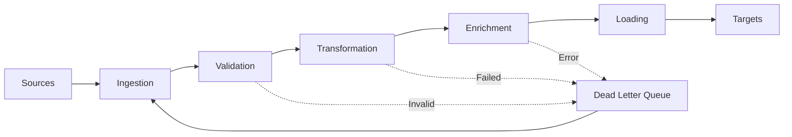

# Project Seldon Foundational Architecture
## Stable Core Platform for Organizational Psychology Navigation

**Version**: 2.0  
**Date**: January 2025  
**Status**: Implementation Ready  
**Review Cycle**: Quarterly  

---

## 📋 Executive Summary

The Project Seldon Foundation provides a **stable, versioned, and extensible core platform** that enables rapid capability development while maintaining system reliability. Built on microkernel architecture principles, it separates essential services from innovative capabilities, ensuring that experimentation never compromises core functionality.

**Key Principles**:
- **Stability First**: Core never breaks, capabilities may fail gracefully
- **Clean Interfaces**: All interaction through versioned APIs
- **Event-Driven**: Loose coupling via asynchronous messaging
- **Observable**: Complete visibility into system behavior
- **Extensible**: New capabilities without core changes

---

## 🏗️ Architecture Overview



---

## 🎯 Core Components

### 1. Service Registry
**Purpose**: Central catalog of all services and capabilities

```typescript
interface ServiceRegistry {
    // Service Registration
    register(service: ServiceDefinition): Promise<ServiceId>;
    unregister(serviceId: ServiceId): Promise<void>;
    
    // Service Discovery
    discover(query: ServiceQuery): Promise<ServiceInstance[]>;
    getHealthStatus(serviceId: ServiceId): Promise<HealthStatus>;
    
    // Capability Management
    loadCapability(capability: CapabilityDefinition): Promise<void>;
    unloadCapability(capabilityId: string): Promise<void>;
    listCapabilities(): Promise<CapabilityInfo[]>;
    
    // Version Management
    checkCompatibility(capability: CapabilityDefinition): VersionCheck;
    getAPIVersion(): SemanticVersion;
}
```

**Implementation Details**:
- Consul-based service discovery
- Health checks every 10 seconds
- Automatic failover handling
- Version compatibility matrix

### 2. Event Bus
**Purpose**: Asynchronous communication backbone

```typescript
interface EventBus {
    // Publishing
    publish<T extends Event>(event: T): Promise<void>;
    publishBatch<T extends Event>(events: T[]): Promise<void>;
    
    // Subscription
    subscribe<T extends Event>(
        pattern: EventPattern,
        handler: EventHandler<T>
    ): Subscription;
    
    // Stream Processing
    createStream(name: string, config: StreamConfig): EventStream;
    
    // Event Sourcing
    getEventHistory(
        aggregate: AggregateId,
        fromVersion?: number
    ): Promise<Event[]>;
}
```

**Event Categories**:
```typescript
enum EventCategory {
    // System Events
    CAPABILITY_LOADED = "system.capability.loaded",
    CAPABILITY_UNLOADED = "system.capability.unloaded",
    SERVICE_HEALTH_CHANGED = "system.service.health_changed",
    
    // Data Events
    ENTITY_CREATED = "data.entity.created",
    ENTITY_UPDATED = "data.entity.updated",
    RELATIONSHIP_ADDED = "data.relationship.added",
    
    // Analysis Events
    PREDICTION_GENERATED = "analysis.prediction.generated",
    SIMULATION_COMPLETED = "analysis.simulation.completed",
    INTERVENTION_SUGGESTED = "analysis.intervention.suggested",
    
    // Business Events
    CLIENT_ONBOARDED = "business.client.onboarded",
    REPORT_GENERATED = "business.report.generated",
    ALERT_TRIGGERED = "business.alert.triggered"
}
```

### 3. Security Framework
**Purpose**: Zero-trust security for all operations

```typescript
interface SecurityFramework {
    // Authentication
    authenticate(credentials: Credentials): Promise<AuthToken>;
    validateToken(token: AuthToken): Promise<Claims>;
    refreshToken(token: AuthToken): Promise<AuthToken>;
    
    // Authorization
    authorize(
        principal: Principal,
        resource: Resource,
        action: Action
    ): Promise<Decision>;
    
    // Encryption
    encryptData(data: any, classification: DataClassification): Promise<Encrypted>;
    decryptData(encrypted: Encrypted): Promise<any>;
    
    // Audit
    logAccess(access: AccessEvent): Promise<void>;
    logModification(modification: ModificationEvent): Promise<void>;
}
```

**Security Policies**:
```yaml
policies:
  authentication:
    - type: mTLS
      required: true
      ca_bundle: /etc/ssl/seldon-ca.pem
    
  authorization:
    - type: RBAC
      roles:
        - admin: full_access
        - analyst: read_analysis_write
        - viewer: read_only
    
  encryption:
    - at_rest: AES-256-GCM
    - in_transit: TLS 1.3
    - key_management: HSM
```

### 4. Data Pipeline
**Purpose**: Unified data ingestion and processing

```typescript
interface DataPipeline {
    // Ingestion
    ingest(source: DataSource, config: IngestionConfig): Promise<JobId>;
    
    // Transformation
    transform(data: RawData, rules: TransformRules): Promise<ProcessedData>;
    
    // Validation
    validate(data: ProcessedData, schema: Schema): ValidationResult;
    
    // Loading
    load(data: ValidatedData, target: DataTarget): Promise<LoadResult>;
    
    // Monitoring
    getJobStatus(jobId: JobId): Promise<JobStatus>;
    getMetrics(): Promise<PipelineMetrics>;
}
```

**Pipeline Stages**:


### 5. Storage Abstraction
**Purpose**: Unified interface to multiple storage backends

```typescript
interface StorageAbstraction {
    // Graph Operations (Neo4j)
    graph: {
        createNode(node: NodeDefinition): Promise<NodeId>;
        createRelationship(rel: RelationshipDefinition): Promise<RelId>;
        query(cypher: string, params?: any): Promise<QueryResult>;
        traverse(start: NodeId, pattern: TraversalPattern): Promise<Path[]>;
    };
    
    // Vector Operations (Pinecone)
    vector: {
        upsert(vectors: Vector[]): Promise<UpsertResult>;
        query(vector: number[], topK: number): Promise<Match[]>;
        delete(ids: string[]): Promise<void>;
        getStats(): Promise<IndexStats>;
    };
    
    // Relational Operations (PostgreSQL)
    relational: {
        query(sql: string, params?: any[]): Promise<QueryResult>;
        transaction<T>(work: TransactionWork<T>): Promise<T>;
        migrate(migrations: Migration[]): Promise<void>;
    };
    
    // Object Storage (S3-compatible)
    object: {
        put(key: string, data: Buffer, metadata?: any): Promise<void>;
        get(key: string): Promise<ObjectData>;
        delete(key: string): Promise<void>;
        list(prefix: string): Promise<ObjectInfo[]>;
    };
}
```

### 6. Monitoring Core
**Purpose**: System observability and health tracking

```typescript
interface MonitoringCore {
    // Metrics
    metrics: {
        counter(name: string, tags?: Tags): Counter;
        gauge(name: string, tags?: Tags): Gauge;
        histogram(name: string, tags?: Tags): Histogram;
        timer(name: string, tags?: Tags): Timer;
    };
    
    // Logging
    logger: {
        debug(message: string, context?: any): void;
        info(message: string, context?: any): void;
        warn(message: string, context?: any): void;
        error(message: string, error?: Error, context?: any): void;
    };
    
    // Tracing
    tracer: {
        startSpan(name: string, parent?: Span): Span;
        inject(span: Span, carrier: any): void;
        extract(carrier: any): SpanContext;
    };
    
    // Health Checks
    health: {
        register(name: string, check: HealthCheck): void;
        checkAll(): Promise<HealthReport>;
        getStatus(): HealthStatus;
    };
}
```

---

## 🔌 Capability Interface

All capabilities must implement this interface to integrate with the foundation:

```typescript
interface ISeldonCapability {
    // Metadata
    metadata: {
        id: string;
        name: string;
        version: SemanticVersion;
        author: string;
        description: string;
        category: CapabilityCategory;
        dependencies: Dependency[];
        foundationVersion: VersionRequirement;
    };
    
    // Lifecycle Hooks
    lifecycle: {
        // Called when capability is loaded
        onLoad(context: FoundationContext): Promise<void>;
        
        // Called when capability is starting
        onStart(): Promise<void>;
        
        // Called when capability is stopping
        onStop(): Promise<void>;
        
        // Called when capability is unloaded
        onUnload(): Promise<void>;
        
        // Health check
        healthCheck(): Promise<HealthStatus>;
    };
    
    // API Definition
    api: {
        // REST endpoints provided
        endpoints: RestEndpoint[];
        
        // GraphQL schema extensions
        graphqlSchema?: GraphQLSchema;
        
        // WebSocket handlers
        websocketHandlers?: WebSocketHandler[];
    };
    
    // Event Integration
    events: {
        // Events this capability subscribes to
        subscriptions: EventSubscription[];
        
        // Events this capability publishes
        publications: EventPublication[];
    };
    
    // Resource Requirements
    resources: {
        // CPU/Memory requirements
        compute: ComputeRequirements;
        
        // Storage requirements
        storage: StorageRequirements;
        
        // Network requirements
        network: NetworkRequirements;
    };
}
```

---

## 🚀 Foundation Services

### API Gateway
**Purpose**: Unified entry point for all external communication

```yaml
api_gateway:
  protocols:
    - REST: 
        version: v1
        base_path: /api/v1
        documentation: OpenAPI 3.0
    
    - GraphQL:
        endpoint: /graphql
        playground: enabled
        federation: true
    
    - WebSocket:
        endpoint: /ws
        protocols: ['wss']
        heartbeat: 30s
  
  features:
    - rate_limiting: 1000 req/min
    - authentication: JWT + mTLS
    - cors: configurable
    - compression: gzip, brotli
    - caching: Redis-backed
```

### Configuration Management
**Purpose**: Centralized configuration with hot reloading

```typescript
interface ConfigurationManager {
    // Configuration Loading
    loadConfig(path: string): Promise<Config>;
    reloadConfig(): Promise<void>;
    
    // Feature Flags
    isFeatureEnabled(feature: string): boolean;
    getFeatureConfig(feature: string): any;
    
    // Environment Management
    getEnvironment(): Environment;
    getSecrets(keys: string[]): Promise<Secrets>;
    
    // Capability Configuration
    getCapabilityConfig(capabilityId: string): CapabilityConfig;
    updateCapabilityConfig(
        capabilityId: string, 
        config: Partial<CapabilityConfig>
    ): Promise<void>;
}
```

### Scheduling Service
**Purpose**: Cron-like job scheduling for periodic tasks

```typescript
interface SchedulingService {
    // Job Management
    scheduleJob(job: JobDefinition): Promise<JobId>;
    cancelJob(jobId: JobId): Promise<void>;
    
    // Execution
    runJobNow(jobId: JobId): Promise<ExecutionId>;
    getExecutionStatus(executionId: ExecutionId): Promise<ExecutionStatus>;
    
    // History
    getJobHistory(jobId: JobId, limit?: number): Promise<Execution[]>;
    
    // Common Schedules
    schedules: {
        everyMinute: "*/1 * * * *";
        everyHour: "0 * * * *";
        everyDay: "0 0 * * *";
        everyWeek: "0 0 * * 0";
        everyMonth: "0 0 1 * *";
    };
}
```

---

## 📊 Performance Specifications

### Latency Requirements
```yaml
performance:
  api_gateway:
    p50: < 10ms
    p95: < 50ms
    p99: < 100ms
  
  event_bus:
    publish: < 1ms
    delivery: < 10ms
  
  storage:
    graph_query: < 100ms
    vector_search: < 50ms
    relational_query: < 20ms
    object_storage: < 200ms
```

### Throughput Targets
```yaml
throughput:
  requests_per_second: 10,000
  events_per_second: 100,000
  concurrent_connections: 50,000
  concurrent_capabilities: 100
```

### Resource Limits
```yaml
resources:
  foundation_core:
    cpu: 4 cores
    memory: 8GB
    disk: 100GB
  
  per_capability:
    cpu: 2 cores
    memory: 4GB
    disk: 50GB
```

---

## 🔄 Versioning Strategy

### Semantic Versioning
```
MAJOR.MINOR.PATCH

MAJOR: Breaking API changes
MINOR: New features, backward compatible
PATCH: Bug fixes, backward compatible
```

### API Versioning
```typescript
// Version in URL
GET /api/v1/capabilities
GET /api/v2/capabilities  // New version

// Version in Header
GET /api/capabilities
Headers: {
    "Accept-Version": "v1"
}
```

### Compatibility Matrix
```yaml
compatibility:
  foundation_v2.0:
    capabilities:
      - ope: ">=1.0.0 <2.0.0"
      - dsc: ">=1.0.0 <2.0.0"
      - msv: ">=1.0.0 <2.0.0"
    
    dependencies:
      - neo4j: ">=5.0.0"
      - pinecone: ">=0.1.0"
      - nodejs: ">=18.0.0"
```

---

## 🛡️ Stability Guarantees

### Core Stability
1. **No Breaking Changes**: Within major version
2. **Backward Compatibility**: 2 major versions
3. **Deprecation Cycle**: 6 months notice
4. **Zero Downtime Updates**: Rolling deployments

### Capability Isolation
1. **Failure Isolation**: Capability crashes don't affect core
2. **Resource Isolation**: CPU/memory limits enforced
3. **Security Isolation**: Separate security contexts
4. **Data Isolation**: Capability-specific namespaces

### Recovery Mechanisms
1. **Auto-restart**: Failed services restart automatically
2. **Circuit Breakers**: Prevent cascade failures
3. **Fallback Modes**: Graceful degradation
4. **State Recovery**: Event sourcing enables replay

---

## 🔧 Deployment Architecture

### Container Structure
```dockerfile
# Foundation Base Image
FROM node:18-alpine AS foundation
WORKDIR /app
COPY foundation/ ./
RUN npm install --production
EXPOSE 8080 8443
CMD ["node", "server.js"]

# Capability Template
FROM foundation AS capability
ARG CAPABILITY_NAME
COPY capabilities/${CAPABILITY_NAME}/ ./capabilities/
RUN npm install --production
```

### Kubernetes Deployment
```yaml
apiVersion: apps/v1
kind: Deployment
metadata:
  name: seldon-foundation
spec:
  replicas: 3
  strategy:
    type: RollingUpdate
    rollingUpdate:
      maxSurge: 1
      maxUnavailable: 0
  template:
    spec:
      containers:
      - name: foundation
        image: seldon/foundation:2.0.0
        resources:
          requests:
            memory: "4Gi"
            cpu: "2"
          limits:
            memory: "8Gi"
            cpu: "4"
        livenessProbe:
          httpGet:
            path: /health
            port: 8080
          initialDelaySeconds: 30
          periodSeconds: 10
```

---

## 📝 Development Guidelines

### Core Development Rules
1. **Never Break the Core**: All changes must be backward compatible
2. **Test Everything**: 95% coverage minimum
3. **Document APIs**: OpenAPI/GraphQL schemas required
4. **Performance First**: Benchmark before and after
5. **Security by Design**: Threat model all changes

### Capability Development Best Practices
1. **Use Foundation Services**: Don't reinvent the wheel
2. **Handle Failures Gracefully**: Expect and plan for errors
3. **Emit Meaningful Events**: For system observability
4. **Resource Consciousness**: Stay within limits
5. **Version Properly**: Follow semantic versioning

---

## 🎯 Success Metrics

### Foundation Health
- **Uptime**: 99.99% availability
- **Latency**: <100ms p99
- **Error Rate**: <0.01%
- **Resource Usage**: <50% capacity

### Capability Ecosystem
- **Active Capabilities**: 10+
- **Capability Uptime**: >99.9%
- **Integration Success**: >99%
- **Developer Satisfaction**: >4.5/5

---

## 📚 Related Documentation

- [Capability Architecture](CAPABILITY_ARCHITECTURE.md)
- [Microkernel Design](MICROKERNEL_DESIGN.md)
- [Event-Driven Patterns](EVENT_DRIVEN_PATTERNS.md)
- [API Specifications](../04_Integration/API_SPECIFICATIONS.md)
- [Deployment Guide](../03_Implementation/DEPLOYMENT_GUIDE.md)

---

**Next Steps**: Review [Capability Architecture](CAPABILITY_ARCHITECTURE.md) for building on this foundation.

**Document Version**: 2.0  
**Last Updated**: January 2025  
**Review Cycle**: Quarterly