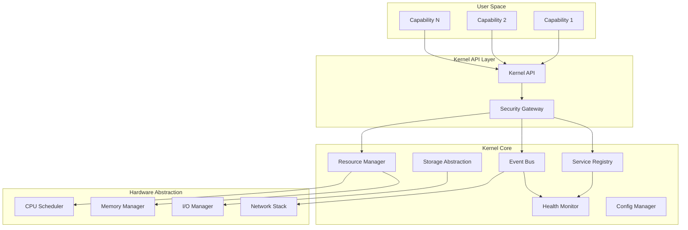

# Project Seldon Microkernel Design
## Core Services and Extension Points

**Version**: 2.0  
**Date**: January 2025  
**Status**: Architecture Approved  
**Audience**: Core Platform Engineers  

---

## 📋 Executive Summary

Project Seldon's microkernel architecture provides a **minimal, stable core** with well-defined extension points for capabilities. This design ensures system stability while enabling unlimited innovation through plugins, similar to successful platforms like Eclipse, VS Code, and operating system kernels.

**Core Philosophy**:
- **Minimal Core**: Only essential services in kernel
- **Everything Else is a Plugin**: Features are capabilities
- **Stable Interfaces**: Breaking changes are forbidden
- **Resource Protection**: Kernel protects itself
- **Graceful Degradation**: System survives capability failures

---

## 🎯 Microkernel Principles

### 1. Separation of Concerns
```
Kernel Space (Protected)          User Space (Capabilities)
├── Service Registry             ├── Analysis Capabilities
├── Event Bus                    ├── Simulation Capabilities  
├── Security Framework           ├── Visualization Capabilities
├── Resource Manager             ├── Integration Capabilities
├── Storage Abstraction          └── Meta Capabilities
└── Health Monitor
```

### 2. Minimal Attack Surface
- Small codebase to audit
- Limited functionality to exploit
- Clear security boundaries
- Reduced complexity

### 3. Maximum Extensibility
- Everything beyond core is a plugin
- Multiple extension mechanisms
- Version-independent capabilities
- Hot-swappable components

---

## 🏗️ Kernel Architecture



---

## 🔧 Core Kernel Services

### 1. Service Registry (SR)
**Purpose**: Capability discovery and lifecycle management

```typescript
class KernelServiceRegistry {
    private capabilities: Map<CapabilityId, CapabilityRecord>;
    private hooks: Map<HookPoint, HookHandler[]>;
    
    // Registration
    async registerCapability(
        manifest: CapabilityManifest,
        implementation: ISeldonCapability
    ): Promise<RegistrationResult> {
        // Validate manifest
        const validation = await this.validateManifest(manifest);
        if (!validation.success) {
            return { success: false, errors: validation.errors };
        }
        
        // Check dependencies
        const deps = await this.checkDependencies(manifest.dependencies);
        if (!deps.satisfied) {
            return { success: false, missing: deps.missing };
        }
        
        // Allocate resources
        const resources = await this.resourceManager.allocate(
            manifest.resources
        );
        
        // Create capability record
        const record: CapabilityRecord = {
            id: manifest.id,
            manifest,
            implementation,
            resources,
            state: CapabilityState.REGISTERED,
            hooks: new Map()
        };
        
        // Store and announce
        this.capabilities.set(manifest.id, record);
        await this.eventBus.emit('capability.registered', record);
        
        return { success: true, id: manifest.id };
    }
    
    // Discovery
    async discoverCapabilities(
        query: CapabilityQuery
    ): Promise<CapabilityInfo[]> {
        return Array.from(this.capabilities.values())
            .filter(cap => this.matchesQuery(cap, query))
            .map(cap => this.toCapabilityInfo(cap));
    }
    
    // Lifecycle
    async startCapability(id: CapabilityId): Promise<void> {
        const record = this.capabilities.get(id);
        if (!record) throw new Error('Capability not found');
        
        try {
            // Initialize
            await record.implementation.lifecycle.onLoad({
                kernel: this.kernelAPI,
                config: await this.configManager.getConfig(id)
            });
            
            // Start
            await record.implementation.lifecycle.onStart();
            record.state = CapabilityState.RUNNING;
            
            // Register hooks
            this.registerHooks(record);
            
            await this.eventBus.emit('capability.started', id);
        } catch (error) {
            record.state = CapabilityState.FAILED;
            await this.handleCapabilityError(id, error);
            throw error;
        }
    }
}
```

### 2. Event Bus (EB)
**Purpose**: Asynchronous communication backbone

```typescript
class KernelEventBus {
    private subscribers: Map<EventPattern, Set<Subscriber>>;
    private eventStore: EventStore;
    private dlq: DeadLetterQueue;
    
    // Publishing
    async emit<T extends Event>(
        event: T,
        options?: EmitOptions
    ): Promise<void> {
        // Add kernel metadata
        const kernelEvent = {
            ...event,
            metadata: {
                ...event.metadata,
                timestamp: Date.now(),
                kernelVersion: KERNEL_VERSION,
                sequenceNumber: this.nextSequence()
            }
        };
        
        // Store event (event sourcing)
        if (options?.persistent) {
            await this.eventStore.append(kernelEvent);
        }
        
        // Find matching subscribers
        const subscribers = this.findSubscribers(kernelEvent.type);
        
        // Deliver asynchronously
        await Promise.allSettled(
            subscribers.map(sub => this.deliver(sub, kernelEvent))
        );
    }
    
    // Subscription
    subscribe(
        pattern: EventPattern,
        handler: EventHandler,
        options?: SubscribeOptions
    ): Subscription {
        const subscriber: Subscriber = {
            id: generateId(),
            pattern,
            handler,
            options,
            metrics: new SubscriberMetrics()
        };
        
        // Add to registry
        if (!this.subscribers.has(pattern)) {
            this.subscribers.set(pattern, new Set());
        }
        this.subscribers.get(pattern)!.add(subscriber);
        
        // Return subscription handle
        return {
            unsubscribe: () => {
                this.subscribers.get(pattern)?.delete(subscriber);
            },
            pause: () => subscriber.paused = true,
            resume: () => subscriber.paused = false,
            getMetrics: () => subscriber.metrics.snapshot()
        };
    }
    
    // Delivery with retry
    private async deliver(
        subscriber: Subscriber,
        event: KernelEvent
    ): Promise<void> {
        const maxRetries = subscriber.options?.maxRetries ?? 3;
        let lastError: Error;
        
        for (let attempt = 0; attempt <= maxRetries; attempt++) {
            try {
                // Check if paused
                if (subscriber.paused) return;
                
                // Deliver with timeout
                await withTimeout(
                    subscriber.handler(event),
                    subscriber.options?.timeout ?? 5000
                );
                
                // Update metrics
                subscriber.metrics.delivered++;
                return;
                
            } catch (error) {
                lastError = error as Error;
                subscriber.metrics.errors++;
                
                // Exponential backoff
                if (attempt < maxRetries) {
                    await sleep(Math.pow(2, attempt) * 100);
                }
            }
        }
        
        // Send to DLQ
        await this.dlq.send({
            event,
            subscriber: subscriber.id,
            error: lastError!,
            attempts: maxRetries + 1
        });
    }
}
```

### 3. Resource Manager (RM)
**Purpose**: Capability resource allocation and limits

```typescript
class KernelResourceManager {
    private allocations: Map<CapabilityId, ResourceAllocation>;
    private limits: ResourceLimits;
    
    // Resource allocation
    async allocate(
        request: ResourceRequest
    ): Promise<ResourceAllocation> {
        // Check availability
        const available = await this.checkAvailability(request);
        if (!available) {
            throw new ResourceExhaustedError(request);
        }
        
        // Create allocation
        const allocation: ResourceAllocation = {
            id: generateId(),
            capability: request.capability,
            resources: {
                cpu: this.allocateCPU(request.cpu),
                memory: this.allocateMemory(request.memory),
                disk: this.allocateDisk(request.disk),
                network: this.allocateNetwork(request.network)
            },
            limits: this.calculateLimits(request),
            created: Date.now()
        };
        
        // Track allocation
        this.allocations.set(request.capability, allocation);
        
        // Enforce limits
        await this.enforcer.applyLimits(allocation);
        
        return allocation;
    }
    
    // Resource monitoring
    async monitor(): Promise<void> {
        setInterval(async () => {
            for (const [capabilityId, allocation] of this.allocations) {
                const usage = await this.measureUsage(capabilityId);
                
                // Check limits
                if (this.exceedsLimits(usage, allocation.limits)) {
                    await this.handleLimitViolation(capabilityId, usage);
                }
                
                // Update metrics
                await this.metrics.record(capabilityId, usage);
            }
        }, 1000); // Check every second
    }
    
    // Enforcement
    private async handleLimitViolation(
        capabilityId: CapabilityId,
        usage: ResourceUsage
    ): Promise<void> {
        const violation: LimitViolation = {
            capability: capabilityId,
            usage,
            timestamp: Date.now()
        };
        
        // Emit warning
        await this.eventBus.emit('resource.limit.exceeded', violation);
        
        // Take action based on policy
        switch (this.policy.onViolation) {
            case 'throttle':
                await this.throttleCapability(capabilityId);
                break;
            case 'suspend':
                await this.suspendCapability(capabilityId);
                break;
            case 'terminate':
                await this.terminateCapability(capabilityId);
                break;
        }
    }
}
```

### 4. Storage Abstraction (SA)
**Purpose**: Unified storage interface with isolation

```typescript
class KernelStorageAbstraction {
    private storageProviders: Map<StorageType, StorageProvider>;
    private namespaces: Map<CapabilityId, Namespace>;
    
    // Namespace management
    createNamespace(capabilityId: CapabilityId): Namespace {
        const namespace: Namespace = {
            id: `capability:${capabilityId}`,
            quotas: this.defaultQuotas,
            isolation: IsolationLevel.STRICT,
            encryption: true
        };
        
        this.namespaces.set(capabilityId, namespace);
        return namespace;
    }
    
    // Storage operations
    async store(
        namespace: Namespace,
        key: string,
        value: any,
        options?: StorageOptions
    ): Promise<void> {
        // Validate namespace access
        this.validateAccess(namespace, 'write');
        
        // Check quotas
        const size = this.calculateSize(value);
        if (!this.checkQuota(namespace, size)) {
            throw new QuotaExceededError(namespace);
        }
        
        // Select provider
        const provider = this.selectProvider(options?.type);
        
        // Store with namespace isolation
        const namespacedKey = `${namespace.id}:${key}`;
        await provider.put(namespacedKey, value, {
            ...options,
            encryption: namespace.encryption
        });
        
        // Update quota usage
        await this.updateQuotaUsage(namespace, size);
    }
    
    // Shared storage
    async shareData(
        owner: CapabilityId,
        key: string,
        value: any,
        permissions: Permission[]
    ): Promise<SharedDataHandle> {
        const sharedKey = `shared:${generateId()}`;
        
        // Store in shared namespace
        await this.store(
            this.sharedNamespace,
            sharedKey,
            value,
            { permissions }
        );
        
        // Create handle
        const handle: SharedDataHandle = {
            key: sharedKey,
            owner,
            permissions,
            created: Date.now()
        };
        
        // Emit event
        await this.eventBus.emit('storage.data.shared', handle);
        
        return handle;
    }
}
```

### 5. Health Monitor (HM)
**Purpose**: System-wide health tracking

```typescript
class KernelHealthMonitor {
    private checks: Map<string, HealthCheck>;
    private history: CircularBuffer<HealthSnapshot>;
    private alerts: AlertManager;
    
    // Health check registration
    registerCheck(
        name: string,
        check: HealthCheck
    ): void {
        this.checks.set(name, {
            ...check,
            lastRun: 0,
            lastResult: null,
            consecutiveFailures: 0
        });
    }
    
    // Continuous monitoring
    async startMonitoring(): Promise<void> {
        setInterval(async () => {
            const snapshot = await this.captureSnapshot();
            this.history.push(snapshot);
            
            // Analyze trends
            const analysis = this.analyzeTrends();
            
            // Generate alerts
            if (analysis.degrading) {
                await this.alerts.send({
                    severity: 'warning',
                    message: 'System health degrading',
                    details: analysis
                });
            }
            
            // Publish metrics
            await this.publishMetrics(snapshot);
            
        }, 10000); // Every 10 seconds
    }
    
    // Comprehensive health check
    private async captureSnapshot(): Promise<HealthSnapshot> {
        const results = new Map<string, HealthResult>();
        
        // Run all checks in parallel
        const checkPromises = Array.from(this.checks.entries()).map(
            async ([name, check]) => {
                try {
                    const result = await withTimeout(
                        check.check(),
                        check.timeout ?? 5000
                    );
                    
                    results.set(name, {
                        status: result.healthy ? 'healthy' : 'unhealthy',
                        message: result.message,
                        metrics: result.metrics
                    });
                    
                    // Reset failure counter on success
                    if (result.healthy) {
                        check.consecutiveFailures = 0;
                    }
                    
                } catch (error) {
                    check.consecutiveFailures++;
                    
                    results.set(name, {
                        status: 'error',
                        message: error.message,
                        error
                    });
                    
                    // Circuit breaker
                    if (check.consecutiveFailures > 5) {
                        await this.disableCheck(name);
                    }
                }
            }
        );
        
        await Promise.allSettled(checkPromises);
        
        return {
            timestamp: Date.now(),
            overall: this.calculateOverallHealth(results),
            checks: results,
            metrics: await this.gatherMetrics()
        };
    }
}
```

### 6. Configuration Manager (CM)
**Purpose**: Centralized configuration with hot reload

```typescript
class KernelConfigManager {
    private configs: Map<string, Configuration>;
    private watchers: Map<string, ConfigWatcher>;
    private validators: Map<string, ConfigValidator>;
    
    // Configuration loading
    async loadConfiguration(
        source: ConfigSource
    ): Promise<void> {
        const rawConfig = await source.load();
        
        // Validate against schema
        const validation = await this.validate(rawConfig);
        if (!validation.valid) {
            throw new ConfigValidationError(validation.errors);
        }
        
        // Parse and store
        const config = this.parse(rawConfig);
        this.configs.set(config.id, config);
        
        // Set up hot reload
        if (source.watchable) {
            this.setupWatcher(config.id, source);
        }
        
        // Notify subscribers
        await this.eventBus.emit('config.loaded', config);
    }
    
    // Hot reload
    private setupWatcher(
        configId: string,
        source: ConfigSource
    ): void {
        const watcher = source.watch(async (change) => {
            try {
                // Load new config
                const newConfig = await source.load();
                
                // Validate
                const validation = await this.validate(newConfig);
                if (!validation.valid) {
                    this.logger.error('Invalid config update', validation.errors);
                    return;
                }
                
                // Check if reload is safe
                const safety = await this.checkReloadSafety(configId, newConfig);
                if (!safety.safe) {
                    this.logger.warn('Unsafe config reload', safety.reasons);
                    return;
                }
                
                // Apply new config
                const oldConfig = this.configs.get(configId);
                this.configs.set(configId, newConfig);
                
                // Notify subscribers
                await this.eventBus.emit('config.changed', {
                    id: configId,
                    old: oldConfig,
                    new: newConfig
                });
                
            } catch (error) {
                this.logger.error('Config reload failed', error);
            }
        });
        
        this.watchers.set(configId, watcher);
    }
}
```

---

## 🔐 Kernel Security

### Protection Rings
```
Ring 0: Kernel Core
├── Critical services
├── Security enforcement  
└── Resource allocation

Ring 1: System Capabilities
├── Core analysis engine
├── Storage services
└── API gateway

Ring 2: User Capabilities
├── Analysis plugins
├── Visualization tools
└── Integration connectors

Ring 3: External Access
├── Client applications
├── API consumers
└── Web interfaces
```

### Security Enforcement
```typescript
class KernelSecurity {
    // Capability isolation
    async createSecurityContext(
        capability: CapabilityId
    ): Promise<SecurityContext> {
        return {
            // Process isolation
            process: {
                uid: this.allocateUID(capability),
                gid: this.allocateGID(capability),
                namespaces: ['pid', 'net', 'mnt'],
                capabilities: this.getCapabilities(capability)
            },
            
            // Resource limits
            limits: {
                cpu: this.getCPULimit(capability),
                memory: this.getMemoryLimit(capability),
                fileDescriptors: 1024,
                processes: 10
            },
            
            // Access control
            permissions: {
                syscalls: this.getAllowedSyscalls(capability),
                filesystem: this.getFilesystemACL(capability),
                network: this.getNetworkPolicy(capability)
            }
        };
    }
    
    // System call filtering
    private getAllowedSyscalls(capability: CapabilityId): string[] {
        const base = [
            'read', 'write', 'open', 'close',
            'mmap', 'munmap', 'brk',
            'gettimeofday', 'clock_gettime'
        ];
        
        // Add capability-specific syscalls
        const specific = this.capabilityProfiles.get(capability)?.syscalls ?? [];
        
        return [...base, ...specific];
    }
}
```

---

## 🚀 Kernel Optimization

### Performance Critical Paths
```typescript
// Fast path for event delivery
class OptimizedEventBus {
    private ringBuffer: RingBuffer<Event>;
    private subscribers: SubscriberIndex;
    
    async emit<T extends Event>(event: T): Promise<void> {
        // Zero-copy event addition
        const slot = this.ringBuffer.claim();
        slot.write(event);
        slot.commit();
        
        // Parallel subscriber notification
        const subscribers = this.subscribers.lookup(event.type);
        await Promise.all(
            subscribers.map(sub => sub.notify(slot.sequence))
        );
    }
}

// Memory-mapped configuration
class OptimizedConfigManager {
    private mmap: MemoryMappedFile;
    private index: ConfigIndex;
    
    get(key: string): any {
        // O(1) lookup via memory map
        const offset = this.index.getOffset(key);
        return this.mmap.readAt(offset);
    }
}
```

### Zero-Copy Operations
```typescript
// Efficient data passing
interface ZeroCopyBuffer {
    // Reference counting
    ref(): void;
    unref(): void;
    
    // View creation (no copy)
    slice(start: number, end: number): ZeroCopyBuffer;
    
    // Direct memory access
    readonly ptr: ArrayBuffer;
    readonly length: number;
}
```

---

## 🔄 Kernel Extension Points

### Hook System
```typescript
enum HookPoint {
    // Lifecycle hooks
    PRE_CAPABILITY_LOAD = 'pre:capability:load',
    POST_CAPABILITY_LOAD = 'post:capability:load',
    PRE_CAPABILITY_START = 'pre:capability:start',
    POST_CAPABILITY_START = 'post:capability:start',
    
    // Event hooks
    PRE_EVENT_PUBLISH = 'pre:event:publish',
    POST_EVENT_PUBLISH = 'post:event:publish',
    PRE_EVENT_DELIVER = 'pre:event:deliver',
    POST_EVENT_DELIVER = 'post:event:deliver',
    
    // Storage hooks
    PRE_STORAGE_WRITE = 'pre:storage:write',
    POST_STORAGE_WRITE = 'post:storage:write',
    PRE_STORAGE_READ = 'pre:storage:read',
    POST_STORAGE_READ = 'post:storage:read'
}

interface Hook {
    // Hook metadata
    point: HookPoint;
    priority: number;
    capability: CapabilityId;
    
    // Hook handler
    handler: (context: HookContext) => Promise<HookResult>;
}
```

### Extension API
```typescript
interface KernelExtensionAPI {
    // Hook registration
    registerHook(hook: Hook): HookHandle;
    
    // Custom protocols
    registerProtocol(protocol: Protocol): ProtocolHandle;
    
    // Custom storage providers
    registerStorageProvider(provider: StorageProvider): void;
    
    // Custom health checks
    registerHealthCheck(check: HealthCheck): void;
    
    // Custom metrics
    registerMetric(metric: Metric): MetricHandle;
}
```

---

## 🏁 Kernel Boot Sequence

```typescript
class Kernel {
    async boot(): Promise<void> {
        // Phase 1: Core initialization
        this.logger.info('Initializing kernel core...');
        await this.initializeCore();
        
        // Phase 2: Load configuration
        this.logger.info('Loading configuration...');
        await this.configManager.loadConfiguration();
        
        // Phase 3: Initialize security
        this.logger.info('Initializing security framework...');
        await this.security.initialize();
        
        // Phase 4: Start core services
        this.logger.info('Starting core services...');
        await this.startCoreServices();
        
        // Phase 5: Load system capabilities
        this.logger.info('Loading system capabilities...');
        await this.loadSystemCapabilities();
        
        // Phase 6: Start monitoring
        this.logger.info('Starting health monitoring...');
        await this.healthMonitor.startMonitoring();
        
        // Phase 7: Open API gateway
        this.logger.info('Opening API gateway...');
        await this.apiGateway.start();
        
        // Phase 8: Load user capabilities
        this.logger.info('Loading user capabilities...');
        await this.loadUserCapabilities();
        
        this.logger.info('Kernel boot complete');
        await this.eventBus.emit('kernel.ready');
    }
}
```

---

## 📊 Kernel Metrics

### Performance Metrics
```yaml
metrics:
  event_bus:
    - events_per_second
    - delivery_latency_ms
    - subscriber_queue_depth
    - dlq_size
  
  service_registry:
    - capability_count
    - registration_time_ms
    - discovery_time_ms
    - lifecycle_operations_per_second
  
  resource_manager:
    - cpu_utilization_percent
    - memory_usage_bytes
    - allocation_time_ms
    - limit_violations_per_minute
  
  storage:
    - operations_per_second
    - latency_by_operation
    - cache_hit_rate
    - quota_usage_percent
```

---

## 🎯 Design Decisions

### Why Microkernel?
1. **Stability**: Small core = fewer bugs
2. **Security**: Minimal attack surface
3. **Flexibility**: Everything is extensible
4. **Maintainability**: Clear boundaries
5. **Performance**: Optimized hot paths

### Trade-offs
1. **Complexity**: More moving parts
2. **Overhead**: Inter-process communication
3. **Debugging**: Distributed system challenges
4. **Learning Curve**: New mental model

### Mitigation Strategies
1. **Tooling**: Comprehensive debugging tools
2. **Documentation**: Clear examples
3. **Monitoring**: Deep observability
4. **Testing**: Extensive test suites

---

## 📚 References

- [Microkernel Architecture Pattern](https://microservices.io/patterns/microkernel.html)
- [L4 Microkernel Family](https://en.wikipedia.org/wiki/L4_microkernel_family)
- [MINIX 3 Design](https://www.minix3.org/doc/design.pdf)
- [seL4 Microkernel](https://sel4.systems/)

---

**Next**: See [Event-Driven Patterns](EVENT_DRIVEN_PATTERNS.md) for capability communication.

**Document Version**: 2.0  
**Last Updated**: January 2025  
**Review Cycle**: Quarterly