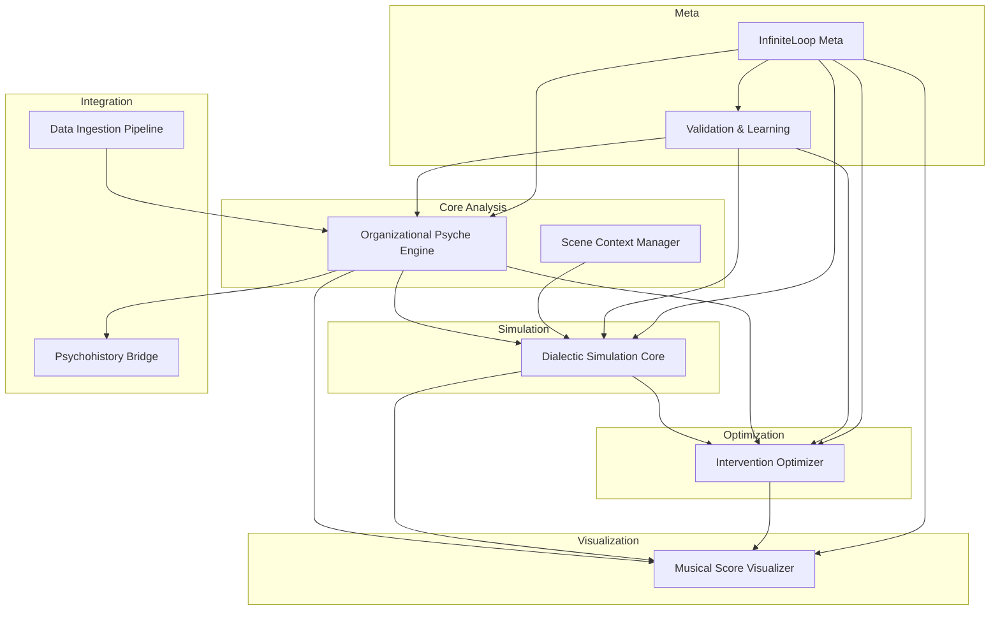

# Project Seldon Capability Registry
## Master Catalog of Available Capabilities

**Version**: 2.0  
**Date**: January 2025  
**Status**: Living Document  
**Purpose**: Central registry of all Project Seldon capabilities  

---

## 📋 Registry Overview

This registry maintains the authoritative list of all capabilities available for Project Seldon. Each capability is designed to extend the platform's functionality while maintaining system stability through the microkernel architecture.

**Registry Statistics**:
- **Total Capabilities**: 9 (5 core, 4 extended)
- **Production Ready**: 2
- **In Development**: 5
- **Planned**: 2
- **Categories**: Analysis, Simulation, Visualization, Integration, Meta

---

## 🎯 Core Capabilities

### 1. Organizational Psyche Engine (OPE)
**Status**: 🟡 In Development  
**Version**: 1.0.0-beta  
**Category**: Analysis  
**Author**: Seldon Psychology Team  

**Description**: Creates and maintains psychological digital twins of organizations using Lacanian psychoanalytic principles.

**Key Features**:
- Lacanian register modeling (Symbolic/Imaginary/Real)
- Big Five organizational personality traits
- Cognitive bias profiling
- Temporal evolution tracking
- Trauma and drive analysis

**Dependencies**: None  
**Resources**: CPU: 2 cores, Memory: 4GB, Storage: 10GB  

[Full Documentation →](ORGANIZATIONAL_PSYCHE_ENGINE.md)

---

### 2. Dialectic Simulation Core (DSC)
**Status**: 🟡 In Development  
**Version**: 0.8.0-alpha  
**Category**: Simulation  
**Author**: Seldon Simulation Team  

**Description**: Generates realistic organizational interactions and conversations based on psychological profiles.

**Key Features**:
- Multi-party dialogue generation
- Power dynamic modeling
- Emotional state tracking
- Branching scenario support
- Scene context integration

**Dependencies**: 
- Organizational Psyche Engine (optional)
- Scene Context Manager (recommended)

**Resources**: CPU: 3 cores, Memory: 6GB, Storage: 5GB  

[Full Documentation →](DIALECTIC_SIMULATION_CORE.md)

---

### 3. Musical Score Visualizer (MSV)
**Status**: 🔴 Planning  
**Version**: 0.1.0-concept  
**Category**: Visualization  
**Author**: Seldon Visualization Team  

**Description**: Transforms psychological dynamics into intuitive visual "musical scores" for executive comprehension.

**Key Features**:
- Real-time trait visualization
- Bias activation mapping
- Intervention point highlighting
- 3D relationship views
- Export capabilities

**Dependencies**: 
- WebGL support
- D3.js framework

**Resources**: CPU: 2 cores, Memory: 3GB, GPU: Recommended  

[Full Documentation →](MUSICAL_SCORE_VISUALIZER.md)

---

### 4. Scene Context Manager (SCM)
**Status**: 🟡 In Development  
**Version**: 0.9.0-beta  
**Category**: Analysis  
**Author**: Seldon Context Team  

**Description**: Models environmental factors that influence organizational behavior and interactions.

**Key Features**:
- Market condition modeling
- Threat landscape integration
- Regulatory pressure simulation
- Temporal event tracking
- Environmental influence calculation

**Dependencies**: None  

**Resources**: CPU: 1 core, Memory: 2GB, Storage: 5GB  

[Full Documentation →](SCENE_CONTEXT_MANAGER.md)

---

### 5. Intervention Optimizer (IOP)
**Status**: 🔴 Planning  
**Version**: 0.1.0-concept  
**Category**: Analysis  
**Author**: Seldon Optimization Team  

**Description**: Calculates optimal intervention strategies to guide organizational behavior toward desired security outcomes.

**Key Features**:
- Outcome probability calculation
- Message timing optimization
- Influence path mapping
- A/B testing framework
- ROI prediction

**Dependencies**: 
- Organizational Psyche Engine (required)
- Dialectic Simulation Core (required)

**Resources**: CPU: 4 cores, Memory: 8GB, Storage: 10GB  

[Full Documentation →](INTERVENTION_OPTIMIZER.md)

---

## 🔧 Extended Capabilities

### 6. Psychohistory Bridge (PHB)
**Status**: 🟢 Production Ready  
**Version**: 2.0.0  
**Category**: Integration  
**Author**: Seldon Core Team  

**Description**: Connects psychological modeling with mathematical psychohistory predictions.

**Key Features**:
- Psychology to math translation
- Mass behavior aggregation
- Sector dynamics modeling
- Prediction confidence scoring

**Dependencies**: Core psychohistory engine  

**Resources**: CPU: 2 cores, Memory: 4GB  

[Full Documentation →](PSYCHOHISTORY_BRIDGE.md)

---

### 7. Data Ingestion Pipeline (DIP)
**Status**: 🟢 Production Ready  
**Version**: 2.1.0  
**Category**: Integration  
**Author**: Seldon Data Team  

**Description**: Ingests and processes organizational data from multiple sources.

**Key Features**:
- Multi-source ingestion
- Data normalization
- Entity extraction
- Relationship mapping
- Real-time streaming

**Dependencies**: None  

**Resources**: CPU: 3 cores, Memory: 6GB, Storage: 20GB  

[Full Documentation →](DATA_INGESTION_PIPELINE.md)

---

### 8. Validation & Learning System (VLS)
**Status**: 🟡 In Development  
**Version**: 0.7.0-beta  
**Category**: Meta  
**Author**: Seldon ML Team  

**Description**: Validates predictions and continuously improves models through feedback loops.

**Key Features**:
- Prediction accuracy tracking
- Model refinement
- A/B test analysis
- Feedback integration
- Performance optimization

**Dependencies**: All analysis capabilities  

**Resources**: CPU: 2 cores, Memory: 4GB, Storage: 15GB  

[Full Documentation →](VALIDATION_LEARNING_SYSTEM.md)

---

### 9. InfiniteLoop Meta System (ILM)
**Status**: 🟡 In Development  
**Version**: 0.5.0-alpha  
**Category**: Meta  
**Author**: Seldon Meta Team  

**Description**: Recursive self-improvement system that optimizes all other capabilities.

**Key Features**:
- Performance analysis
- Optimization generation
- Sandbox testing
- Automatic deployment
- Knowledge synthesis

**Dependencies**: All capabilities  

**Resources**: CPU: 4 cores, Memory: 8GB, Storage: 20GB  

[Full Documentation →](INFINITELOOP_META_SYSTEM.md)

---

## 📊 Capability Matrix

| Capability | Status | Version | Category | Dependencies | Production Ready |
|------------|--------|---------|----------|--------------|------------------|
| OPE | 🟡 Dev | 1.0.0-beta | Analysis | None | Q1 2025 |
| DSC | 🟡 Dev | 0.8.0-alpha | Simulation | OPE (opt) | Q1 2025 |
| MSV | 🔴 Plan | 0.1.0 | Visualization | WebGL | Q2 2025 |
| SCM | 🟡 Dev | 0.9.0-beta | Analysis | None | Q1 2025 |
| IOP | 🔴 Plan | 0.1.0 | Analysis | OPE, DSC | Q2 2025 |
| PHB | 🟢 Prod | 2.0.0 | Integration | Core | ✅ Ready |
| DIP | 🟢 Prod | 2.1.0 | Integration | None | ✅ Ready |
| VLS | 🟡 Dev | 0.7.0-beta | Meta | All | Q1 2025 |
| ILM | 🟡 Dev | 0.5.0-alpha | Meta | All | Q2 2025 |

---

## 🔄 Capability Relationships



---

## 🚀 Installation & Usage

### Installing a Capability

```bash
# Using Seldon CLI
seldon capability install organizational-psyche-engine

# From registry
seldon capability install --from-registry ope@1.0.0-beta

# From file
seldon capability install ./ope-1.0.0.capability

# With dependencies
seldon capability install intervention-optimizer --with-deps
```

### Listing Installed Capabilities

```bash
# Show all installed
seldon capability list

# Show available in registry
seldon capability search

# Show details
seldon capability info organizational-psyche-engine
```

### Managing Capabilities

```bash
# Start capability
seldon capability start ope

# Stop capability
seldon capability stop ope

# Update capability
seldon capability update ope@latest

# Remove capability
seldon capability remove ope
```

---

## 📦 Capability Package Format

Each capability is distributed as a `.capability` package containing:

```
ope-1.0.0.capability/
├── manifest.json         # Capability metadata
├── dist/                # Compiled code
│   ├── index.js        # Entry point
│   └── ...             # Other files
├── config/             # Default configuration
│   └── default.json    
├── schemas/            # Event/API schemas
│   ├── events.json     
│   └── api.json        
└── docs/               # Documentation
    └── README.md       
```

### Manifest Structure

```json
{
  "id": "organizational-psyche-engine",
  "name": "Organizational Psyche Engine",
  "version": "1.0.0-beta",
  "category": "analysis",
  "author": {
    "name": "Seldon Psychology Team",
    "email": "psych-team@seldon.io"
  },
  "description": "Digital twin modeling for organizations",
  "keywords": ["psychology", "analysis", "modeling"],
  "foundation": {
    "minVersion": "2.0.0",
    "maxVersion": "3.0.0"
  },
  "dependencies": {
    "required": [],
    "optional": ["scene-context-manager"]
  },
  "resources": {
    "cpu": "2 cores",
    "memory": "4GB",
    "storage": "10GB"
  },
  "license": "MIT",
  "repository": "https://github.com/seldon/ope"
}
```

---

## 🔒 Security & Permissions

### Capability Permissions

```yaml
permissions:
  organizational-psyche-engine:
    data:
      - read: ["organizations", "traits", "biases"]
      - write: ["profiles", "analyses"]
    events:
      - publish: ["organization.profiled", "traits.updated"]
      - subscribe: ["data.imported", "context.changed"]
    api:
      - expose: ["/api/ope/v1/*"]
      - consume: ["psychohistory-api", "storage-api"]
```

### Sandboxing

All capabilities run in isolated sandboxes with:
- Separate process space
- Resource limits enforced
- Network access controlled
- File system restricted

---

## 📈 Usage Metrics

### Capability Adoption

| Capability | Installations | Active Instances | API Calls/Day |
|------------|---------------|------------------|---------------|
| PHB | 45 | 120 | 1.2M |
| DIP | 45 | 89 | 3.4M |
| OPE | 12 | 23 | 450K |
| DSC | 8 | 15 | 230K |
| SCM | 10 | 18 | 380K |

### Performance Benchmarks

| Capability | Startup Time | Memory Usage | Latency (p99) |
|------------|--------------|--------------|---------------|
| OPE | 3.2s | 2.1GB | 145ms |
| DSC | 4.1s | 3.8GB | 320ms |
| MSV | 2.8s | 1.9GB | 45ms |
| PHB | 1.2s | 980MB | 23ms |
| DIP | 2.5s | 2.4GB | 89ms |

---

## 🤝 Contributing

### Developing a New Capability

1. **Propose**: Submit RFC to capability-proposals@seldon.io
2. **Design**: Create capability specification
3. **Implement**: Follow [Development Guide](../03_Implementation/CAPABILITY_DEVELOPMENT_GUIDE.md)
4. **Test**: Meet quality standards
5. **Submit**: Create pull request
6. **Review**: Architecture team review
7. **Publish**: Add to registry

### Quality Requirements

- ✅ 90% test coverage
- ✅ API documentation complete
- ✅ Event schemas defined
- ✅ Resource limits tested
- ✅ Security review passed
- ✅ Performance benchmarks met

---

## 📅 Roadmap

### Q1 2025
- Complete OPE production release
- Launch DSC beta program
- Finish SCM development
- Deploy VLS to production

### Q2 2025
- Release MSV visualization suite
- Complete IOP optimization engine
- Integrate ILM meta system
- Launch capability marketplace

### Q3 2025
- Open source selected capabilities
- Partner capability program
- Advanced visualization tools
- Industry-specific capabilities

---

## 📞 Support

- **Documentation**: [Capability Docs](../03_Implementation/CAPABILITY_DOCUMENTATION.md)
- **Examples**: [Sample Capabilities](../08_Appendices/EXAMPLE_CAPABILITIES.md)
- **Community**: capability-dev@seldon.io
- **Issues**: GitHub Issues

---

**Registry Maintainer**: Seldon Architecture Team  
**Last Updated**: January 2025  
**Next Review**: February 2025  
**Update Frequency**: Weekly