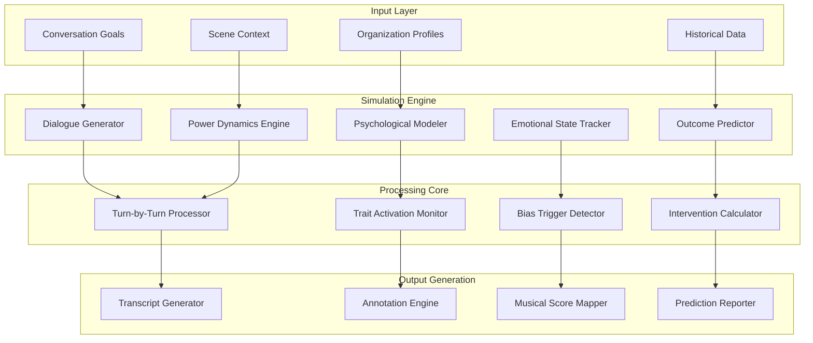

# Dialectic Simulation Core (DSC)
## Organizational Interaction and Conversation Generation

**Capability ID**: dialectic-simulation-core  
**Version**: 0.8.0-alpha  
**Category**: Simulation  
**Status**: In Development  
**Author**: Seldon Simulation Team  

---

## 📋 Executive Summary

The Dialectic Simulation Core (DSC) generates **realistic organizational interactions** based on psychological profiles, enabling prediction of conversational outcomes and identification of optimal influence strategies. By simulating how organizations communicate, negotiate, and influence each other, DSC provides actionable insights for security engagement strategies.

**Key Innovation**: Organizations don't just have psychology—they express it through dialectical interactions that can be modeled, simulated, and optimized.

---

## 🎯 Core Concepts

### Dialectical Framework

```typescript
interface Dialectic {
    // Hegelian Structure
    thesis: Position;          // Initial position
    antithesis: Response;      // Counter-position
    synthesis: Resolution;     // Emergent outcome
    
    // Lacanian Dynamics
    demand: Desire;           // What they ask for
    desire: UnconDesire;      // What they really want
    drive: Compulsion;        // What compels them
    
    // Power Relations
    authority: PowerPosition;  // Who has power
    resistance: Opposition;    // Forms of pushback
    negotiation: Dynamic;      // How power shifts
}
```

### Conversation as Psychological Expression

```typescript
interface ConversationDynamics {
    // Surface Level
    explicit: {
        topic: string;
        positions: Position[];
        arguments: Argument[];
        agreements: Agreement[];
    };
    
    // Psychological Level
    implicit: {
        powerPlays: PowerMove[];
        anxieties: Anxiety[];
        defenses: DefenseMechanism[];
        projections: Projection[];
    };
    
    // Unconscious Level
    unconscious: {
        transferrences: Transference[];
        repetitions: CompulsionToRepeat[];
        slips: FreudianSlip[];
        resistances: Resistance[];
    };
}
```

### Scene Impact on Dialectic

```typescript
interface SceneInfluence {
    // External Pressures
    market: MarketConditions;
    regulatory: ComplianceRequirements;
    threats: ThreatLandscape;
    
    // Relational Context
    history: InteractionHistory;
    power: PowerDifferential;
    stakes: WhatAtStake;
    
    // Temporal Factors
    urgency: UrgencyLevel;
    timing: MarketTiming;
    cycles: BusinessCycles;
}
```

---

## 🏗️ Architecture

### System Components



---

## 🔧 Implementation Details

### Simulation Initialization

```typescript
class DialecticSimulationCore implements ISeldonCapability {
    async createSimulation(config: SimulationConfig): Promise<Simulation> {
        // Load participant profiles
        const participants = await this.loadParticipants(config.participants);
        
        // Establish scene context
        const scene = await this.sceneManager.createScene(config.scene);
        
        // Initialize psychological states
        const psychStates = await this.initializePsychStates(
            participants,
            scene
        );
        
        // Set conversation parameters
        const convParams = this.setupConversationParams({
            topic: config.topic,
            goals: config.goals,
            constraints: config.constraints,
            duration: config.duration
        });
        
        // Create simulation instance
        const simulation = new Simulation({
            id: generateId(),
            participants,
            scene,
            psychStates,
            convParams,
            created: new Date()
        });
        
        // Initialize tracking
        await this.initializeTracking(simulation);
        
        return simulation;
    }
}
```

### Dialogue Generation Engine

```typescript
class DialogueGenerator {
    async generateTurn(
        speaker: Participant,
        context: ConversationContext,
        psychState: PsychologicalState
    ): Promise<Turn> {
        // Analyze current context
        const situation = await this.analyzeSituation(context);
        
        // Determine psychological response
        const psychResponse = await this.calculatePsychResponse(
            speaker.profile,
            psychState,
            situation
        );
        
        // Generate response options
        const options = await this.generateResponseOptions(
            speaker,
            psychResponse,
            context.constraints
        );
        
        // Select optimal response
        const selected = await this.selectResponse(
            options,
            speaker.goals,
            psychState.currentMood
        );
        
        // Apply personality filters
        const filtered = await this.applyPersonalityFilters(
            selected,
            speaker.profile.personality
        );
        
        // Generate actual text
        const text = await this.generateText(
            filtered,
            speaker.profile.discourse_style
        );
        
        // Add non-verbal elements
        const nonVerbal = await this.addNonVerbalElements(
            text,
            psychState.emotionalState
        );
        
        return {
            speaker: speaker.id,
            text,
            nonVerbal,
            psychState: psychState.snapshot(),
            timestamp: this.simTime.current()
        };
    }
}
```

### Psychological State Evolution

```typescript
class PsychologicalStateTracker {
    async updateState(
        participant: Participant,
        turn: Turn,
        reactions: Reaction[]
    ): Promise<PsychStateUpdate> {
        const currentState = this.getState(participant.id);
        
        // Calculate trait activations
        const traitActivations = await this.calculateTraitActivations(
            participant.profile,
            turn,
            reactions
        );
        
        // Detect bias triggers
        const biasActivations = await this.detectBiasActivations(
            participant.profile.biases,
            turn.content,
            currentState.priming
        );
        
        // Update emotional state
        const emotionalShift = await this.calculateEmotionalShift(
            currentState.emotionalState,
            turn.impact,
            reactions
        );
        
        // Check for defensive reactions
        const defenses = await this.checkDefensiveMechanisms(
            participant.profile.real,
            turn.threats,
            currentState.anxiety
        );
        
        // Calculate power dynamics shift
        const powerShift = await this.calculatePowerShift(
            currentState.perceivedPower,
            turn.powerMoves,
            reactions
        );
        
        // Apply updates
        const newState = {
            ...currentState,
            traits: this.applyTraitActivations(currentState.traits, traitActivations),
            biases: this.applyBiasActivations(currentState.biases, biasActivations),
            emotional: this.applyEmotionalShift(currentState.emotional, emotionalShift),
            defenses: [...currentState.defenses, ...defenses],
            power: this.applyPowerShift(currentState.power, powerShift),
            timestamp: this.simTime.current()
        };
        
        // Store state update
        await this.storeStateUpdate(participant.id, newState);
        
        // Emit state change event
        await this.eventBus.publish({
            type: 'dsc.state.updated',
            data: {
                participantId: participant.id,
                changes: this.summarizeChanges(currentState, newState)
            }
        });
        
        return { previousState: currentState, newState };
    }
}
```

### Power Dynamics Engine

```typescript
class PowerDynamicsEngine {
    async modelPowerRelations(
        participants: Participant[],
        scene: Scene
    ): Promise<PowerStructure> {
        // Initial power assessment
        const basePower = await this.assessBasePower(participants, scene);
        
        // Relational power modifiers
        const relationalPower = await this.calculateRelationalPower(
            participants,
            scene.relationships
        );
        
        // Contextual power factors
        const contextualPower = await this.assessContextualPower(
            participants,
            scene.context
        );
        
        // Create power matrix
        const powerMatrix = this.createPowerMatrix(
            basePower,
            relationalPower,
            contextualPower
        );
        
        // Identify power dynamics
        const dynamics = {
            hierarchy: this.extractHierarchy(powerMatrix),
            coalitions: this.identifyCoalitions(powerMatrix),
            conflicts: this.identifyConflicts(powerMatrix),
            dependencies: this.mapDependencies(powerMatrix)
        };
        
        return {
            matrix: powerMatrix,
            dynamics,
            stability: this.assessStability(dynamics)
        };
    }
    
    async trackPowerShift(
        turn: Turn,
        currentPower: PowerStructure
    ): Promise<PowerShift> {
        // Identify power moves
        const powerMoves = await this.identifyPowerMoves(turn);
        
        // Calculate impact
        const impact = await this.calculatePowerImpact(
            powerMoves,
            currentPower
        );
        
        // Update power structure
        const newPower = await this.updatePowerStructure(
            currentPower,
            impact
        );
        
        // Detect significant shifts
        const significantShifts = this.detectSignificantShifts(
            currentPower,
            newPower
        );
        
        return {
            moves: powerMoves,
            impact,
            newStructure: newPower,
            significantShifts
        };
    }
}
```

### Emotional Dynamics Modeling

```typescript
class EmotionalDynamicsModeler {
    async modelEmotionalFlow(
        conversation: Conversation
    ): Promise<EmotionalFlow> {
        const emotionalStates: EmotionalState[] = [];
        const emotionalContagion: ContagionEvent[] = [];
        const emotionalRegulation: RegulationEvent[] = [];
        
        for (const turn of conversation.turns) {
            // Track individual emotional states
            const turnEmotions = await this.analyzeEmotions(turn);
            emotionalStates.push(turnEmotions);
            
            // Model emotional contagion
            const contagion = await this.modelContagion(
                turn,
                conversation.participants,
                emotionalStates
            );
            if (contagion) emotionalContagion.push(contagion);
            
            // Track regulation attempts
            const regulation = await this.detectRegulation(
                turn,
                turnEmotions
            );
            if (regulation) emotionalRegulation.push(regulation);
        }
        
        // Analyze overall flow
        const flow = {
            trajectory: this.calculateTrajectory(emotionalStates),
            volatility: this.calculateVolatility(emotionalStates),
            synchrony: this.calculateSynchrony(emotionalStates),
            dominantEmotions: this.identifyDominant(emotionalStates),
            criticalMoments: this.identifyCriticalMoments(emotionalStates)
        };
        
        return {
            states: emotionalStates,
            contagion: emotionalContagion,
            regulation: emotionalRegulation,
            analysis: flow
        };
    }
}
```

### Outcome Prediction

```typescript
class OutcomePredictor {
    async predictOutcomes(
        simulation: Simulation
    ): Promise<OutcomePrediction> {
        // Analyze conversation trajectory
        const trajectory = await this.analyzeTrajectory(simulation);
        
        // Assess goal achievement probability
        const goalAchievement = await this.assessGoalAchievement(
            simulation.goals,
            trajectory
        );
        
        // Predict relationship changes
        const relationshipChanges = await this.predictRelationshipChanges(
            simulation.participants,
            simulation.interactions
        );
        
        // Identify decision points
        const decisionPoints = await this.identifyDecisionPoints(
            simulation.transcript
        );
        
        // Calculate outcome probabilities
        const outcomes = await this.calculateOutcomeProbabilities(
            trajectory,
            goalAchievement,
            relationshipChanges,
            decisionPoints
        );
        
        // Generate confidence scores
        const confidence = await this.calculateConfidence(
            simulation.dataQuality,
            simulation.participants.length,
            simulation.duration
        );
        
        return {
            primaryOutcome: outcomes[0],
            alternativeOutcomes: outcomes.slice(1),
            confidence,
            keyFactors: this.identifyKeyFactors(outcomes),
            interventionPoints: this.identifyInterventionPoints(decisionPoints)
        };
    }
}
```

### Musical Score Generation

```typescript
class MusicalScoreMapper {
    async generateMusicalScore(
        conversation: Conversation,
        annotations: PsychologicalAnnotations
    ): Promise<MusicalScore> {
        const score: MusicalScore = {
            tempo: this.calculateTempo(conversation.pace),
            key: this.determineKey(conversation.mood),
            measures: []
        };
        
        for (let i = 0; i < conversation.turns.length; i++) {
            const turn = conversation.turns[i];
            const annotation = annotations[i];
            
            const measure: Measure = {
                number: i + 1,
                timeSignature: this.calculateTimeSignature(turn.rhythm),
                notes: []
            };
            
            // Map traits to instruments
            for (const [trait, activation] of annotation.traitActivations) {
                const note = {
                    instrument: this.traitToInstrument(trait),
                    pitch: this.activationToPitch(activation),
                    volume: this.activationToVolume(activation),
                    duration: turn.duration,
                    articulation: this.emotionToArticulation(annotation.emotion)
                };
                measure.notes.push(note);
            }
            
            // Add bias percussion
            for (const bias of annotation.biasActivations) {
                measure.notes.push({
                    instrument: 'percussion',
                    type: this.biasToPercussion(bias.type),
                    intensity: bias.strength,
                    timing: bias.timing
                });
            }
            
            score.measures.push(measure);
        }
        
        // Add dynamics markings
        score.dynamics = this.calculateDynamics(annotations);
        
        // Add crescendos/diminuendos
        score.expressions = this.identifyExpressions(annotations);
        
        return score;
    }
}
```

---

## 🔌 API Reference

### REST Endpoints

```typescript
// Create simulation
POST /api/v1/dsc/simulations
Body: {
    participants: ParticipantConfig[];
    scene: SceneConfig;
    topic: string;
    goals?: Goal[];
    constraints?: Constraint[];
}

// Run simulation
POST /api/v1/dsc/simulations/{simId}/run
Body: {
    mode: 'auto' | 'guided' | 'interactive';
    maxTurns?: number;
    timeLimit?: number;
}

// Get simulation state
GET /api/v1/dsc/simulations/{simId}/state

// Add manual turn
POST /api/v1/dsc/simulations/{simId}/turns
Body: {
    speakerId: string;
    content: string;
    nonVerbal?: NonVerbalCues;
}

// Get predictions
GET /api/v1/dsc/simulations/{simId}/predictions

// Generate alternatives
POST /api/v1/dsc/simulations/{simId}/alternatives
Body: {
    fromTurn: number;
    variations: VariationConfig[];
}
```

### GraphQL Schema

```graphql
type Simulation {
    id: ID!
    status: SimulationStatus!
    participants: [Participant!]!
    scene: Scene!
    conversation: Conversation!
    predictions: OutcomePrediction
    created: DateTime!
    updated: DateTime!
}

type Conversation {
    id: ID!
    turns: [Turn!]!
    annotations: [Annotation!]!
    emotionalFlow: EmotionalFlow!
    powerDynamics: PowerDynamics!
    musicalScore: MusicalScore
}

type Turn {
    id: ID!
    number: Int!
    speaker: Participant!
    content: String!
    nonVerbal: NonVerbalCues
    psychState: PsychologicalSnapshot!
    timestamp: DateTime!
    alternatives: [AlternativeTurn!]
}

type Query {
    simulation(id: ID!): Simulation
    simulations(filter: SimulationFilter): [Simulation!]!
    
    # Analyze specific aspect
    analyzeInteraction(
        simulationId: ID!
        aspect: AnalysisAspect!
    ): AnalysisResult!
}

type Mutation {
    # Create and configure
    createSimulation(input: SimulationInput!): Simulation!
    configureScene(simId: ID!, scene: SceneInput!): Simulation!
    
    # Run simulation
    runSimulation(
        simId: ID!
        config: RunConfig!
    ): SimulationResult!
    
    # Interact with simulation
    addTurn(
        simId: ID!
        turn: TurnInput!
    ): Turn!
    
    # Modify simulation
    adjustParticipantState(
        simId: ID!
        participantId: ID!
        adjustments: StateAdjustments!
    ): PsychologicalState!
}

type Subscription {
    # Real-time updates
    simulationUpdates(simId: ID!): SimulationUpdate!
    turnGenerated(simId: ID!): Turn!
    stateChanged(simId: ID!): StateChange!
}
```

### Event Publications

```typescript
// Simulation created
{
    type: "dsc.simulation.created",
    data: {
        simulationId: string;
        participantCount: number;
        topic: string;
        scene: string;
    }
}

// Turn generated
{
    type: "dsc.turn.generated",
    data: {
        simulationId: string;
        turnNumber: number;
        speakerId: string;
        traitActivations: Record<string, number>;
        emotionalState: string;
    }
}

// Critical moment detected
{
    type: "dsc.critical.moment",
    data: {
        simulationId: string;
        turnNumber: number;
        type: 'breakthrough' | 'breakdown' | 'shift';
        description: string;
    }
}

// Simulation completed
{
    type: "dsc.simulation.completed",
    data: {
        simulationId: string;
        duration: number;
        turnCount: number;
        primaryOutcome: string;
        confidence: number;
    }
}
```

---

## 🎮 Interaction Modes

### Auto Mode
Fully automated conversation generation

```typescript
const simulation = await dsc.runSimulation({
    mode: 'auto',
    maxTurns: 50,
    endConditions: [
        { type: 'goal_achieved', confidence: 0.8 },
        { type: 'stalemate', turns: 10 },
        { type: 'breakdown', threshold: 0.9 }
    ]
});
```

### Guided Mode
AI-assisted with human oversight

```typescript
const simulation = await dsc.createGuidedSimulation({
    mode: 'guided',
    humanRole: 'security_vendor',
    aiRoles: ['prospect_ciso', 'prospect_cfo'],
    suggestions: true,
    autoRespond: false
});

// Human provides input
await dsc.addHumanTurn(simulation.id, {
    content: "Let me show you our zero-trust solution...",
    intent: 'demonstrate_value'
});

// AI suggests responses
const suggestions = await dsc.getSuggestions(simulation.id);
```

### Interactive Mode
Multiple humans with AI mediation

```typescript
const simulation = await dsc.createInteractiveSimulation({
    mode: 'interactive',
    participants: [
        { id: 'user1', role: 'vendor_sales' },
        { id: 'user2', role: 'prospect_ciso' }
    ],
    aiMediation: true,
    turnTimeout: 120 // seconds
});
```

---

## 📊 Analysis Capabilities

### Conversation Metrics

```typescript
interface ConversationMetrics {
    // Structural metrics
    turnCount: number;
    averageTurnLength: number;
    speakerBalance: Record<string, number>;
    topicCoherence: number;
    
    // Psychological metrics
    emotionalVolatility: number;
    defensiveness: number;
    openness: number;
    resistance: number;
    
    // Outcome metrics
    goalProgress: number;
    agreementLevel: number;
    tensionLevel: number;
    breakthroughMoments: number;
}
```

### Pattern Recognition

```typescript
class PatternRecognizer {
    async identifyPatterns(conversation: Conversation): Promise<Pattern[]> {
        const patterns = [];
        
        // Defensive spirals
        patterns.push(...await this.findDefensiveSpirals(conversation));
        
        // Power struggles
        patterns.push(...await this.findPowerStruggles(conversation));
        
        // Emotional contagion
        patterns.push(...await this.findEmotionalContagion(conversation));
        
        // Repetition compulsions
        patterns.push(...await this.findRepetitions(conversation));
        
        // Breakthrough moments
        patterns.push(...await this.findBreakthroughs(conversation));
        
        return patterns;
    }
}
```

---

## 🚧 Current Limitations

1. **Complexity Ceiling**: Very complex multi-party dynamics may be simplified
2. **Cultural Models**: Limited to Western business communication patterns
3. **Nonverbal Modeling**: Text-based, limited gesture/tone modeling
4. **Real-time Performance**: Large simulations may have latency
5. **Validation Challenge**: Hard to validate psychological accuracy

---

## 🔧 Configuration

### Default Configuration

```json
{
    "dsc": {
        "simulation": {
            "maxTurns": 100,
            "defaultMode": "auto",
            "timeoutMinutes": 30,
            "parallelSimulations": 5
        },
        "generation": {
            "model": "gpt-4",
            "temperature": 0.7,
            "maxRetries": 3,
            "cacheResponses": true
        },
        "psychology": {
            "stateUpdateFrequency": "per_turn",
            "traitSensitivity": 0.6,
            "biasActivationThreshold": 0.7,
            "emotionalInertia": 0.3
        },
        "analysis": {
            "patternMinLength": 3,
            "criticalMomentThreshold": 0.8,
            "predictionConfidenceMin": 0.6
        }
    }
}
```

---

## 📈 Performance Benchmarks

| Operation | Average Time | P95 Time | P99 Time |
|-----------|--------------|----------|----------|
| Create Simulation | 1.2s | 2.1s | 3.5s |
| Generate Turn | 890ms | 1.5s | 2.3s |
| Update States | 120ms | 200ms | 350ms |
| Run Full Simulation (50 turns) | 45s | 72s | 95s |
| Generate Musical Score | 3.4s | 5.2s | 7.8s |

---

## 🎯 Use Cases

### 1. Sales Strategy Optimization
Simulate sales conversations to identify optimal approaches for different organizational psychologies.

### 2. Negotiation Preparation
Practice negotiations with realistic organizational responses based on psychological profiles.

### 3. Crisis Communication Planning
Simulate crisis scenarios to prepare effective communication strategies.

### 4. Partnership Dynamics
Model potential partnership interactions to identify compatibility and friction points.

### 5. Training Simulations
Create realistic training scenarios for security professionals.

---

## 🔄 Integration Examples

### With Organizational Psyche Engine

```typescript
// Use detailed profiles in simulations
const profile1 = await ope.getDigitalTwin(org1Id);
const profile2 = await ope.getDigitalTwin(org2Id);

const simulation = await dsc.createSimulation({
    participants: [
        { profile: profile1, goals: ['sell_solution'] },
        { profile: profile2, goals: ['minimize_cost'] }
    ],
    topic: 'security_modernization'
});
```

### With Intervention Optimizer

```typescript
// Test intervention strategies
const simulation = await dsc.runSimulation(baseConfig);
const intervention = await iop.optimizeIntervention(simulation);

// Run alternative with intervention
const altSimulation = await dsc.runAlternative({
    baseSimulation: simulation.id,
    intervention: intervention,
    fromTurn: intervention.optimalTurn
});
```

---

## 📚 Theory References

- [Hegelian Dialectics](https://plato.stanford.edu/entries/hegel-dialectics/)
- [Lacanian Discourse Theory](https://nosubject.com/Discourse)
- [Conversation Analysis](https://www.thoughtco.com/conversation-analysis-ca-1689927)
- [Power Dynamics in Communication](https://www.researchgate.net/publication/power-dynamics)

---

**Capability Version**: 0.8.0-alpha  
**Last Updated**: January 2025  
**Next Review**: February 2025  
**Maintainer**: simulation-team@seldon.io