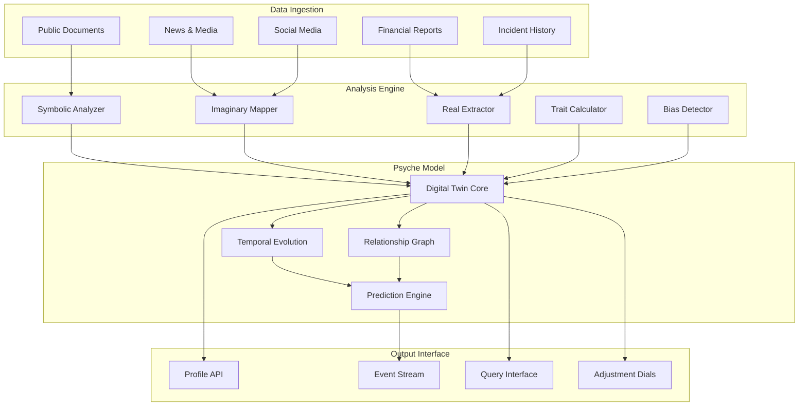

# Organizational Psyche Engine (OPE)
## Digital Twin Modeling for Organizational Psychology

**Capability ID**: organizational-psyche-engine  
**Version**: 1.0.0-beta  
**Category**: Analysis  
**Status**: In Development  
**Author**: Seldon Psychology Team  

---

## 📋 Executive Summary

The Organizational Psyche Engine (OPE) creates **psychological digital twins** of organizations by modeling them as Lacanian subjects with unconscious drives, personality traits, and cognitive biases. This revolutionary capability enables prediction and influence of organizational security decisions by understanding the psychological forces that drive them.

**Key Innovation**: Organizations are not rational actors but psychological entities with traumas, desires, and blind spots that can be modeled, predicted, and influenced.

---

## 🎯 Core Concepts

### Lacanian Organizational Model

Organizations exist in three registers:

```typescript
interface OrganizationalPsyche {
    // The Symbolic - What the organization claims to be
    symbolic: {
        mission: string;              // Stated purpose
        values: string[];            // Claimed values
        policies: Policy[];          // Written rules
        brand: BrandIdentity;        // Public face
        culture: CultureArtifacts;   // Visible practices
    };
    
    // The Imaginary - How the organization sees itself
    imaginary: {
        selfImage: SelfPerception;   // Internal narrative
        aspirations: Goal[];         // What it wants to be
        idealizedIdentity: Identity; // Ego ideal
        comparisons: Rivalry[];      // Competitive dynamics
        fantasies: Narrative[];      // Success stories
    };
    
    // The Real - The traumatic kernel
    real: {
        foundingTrauma: Trauma;      // Original crisis
        repressions: Repression[];   // What can't be spoken
        symptoms: Symptom[];         // Repetitive behaviors
        drives: Drive[];             // Unconscious motivations
        jouissance: Pattern[];       // Destructive enjoyments
    };
}
```

### Big Five Organizational Traits

```typescript
interface OrganizationalPersonality {
    openness: {
        score: number;              // 0-100
        indicators: {
            innovationAdoption: number;
            changeReadiness: number;
            experimentalBudget: number;
            externalPartnerships: number;
        };
    };
    
    conscientiousness: {
        score: number;
        indicators: {
            processAdherence: number;
            documentationQuality: number;
            complianceRecord: number;
            planningHorizon: number;
        };
    };
    
    extraversion: {
        score: number;
        indicators: {
            publicCommunication: number;
            partnershipSeeking: number;
            conferenceParticipation: number;
            openSourceContribution: number;
        };
    };
    
    agreeableness: {
        score: number;
        indicators: {
            collaborationFrequency: number;
            conflictAvoidance: number;
            vendorRelationships: number;
            industryReputation: number;
        };
    };
    
    neuroticism: {
        score: number;
        indicators: {
            crisisFrequency: number;
            leadershipTurnover: number;
            strategyPivots: number;
            stressResponse: number;
        };
    };
}
```

### Cognitive Bias Profile

```typescript
interface CognitiveBiases {
    // Decision-making biases
    confirmationBias: BiasStrength;        // Seeking confirming evidence
    anchoring: BiasStrength;               // Over-relying on first info
    availabilityHeuristic: BiasStrength;   // Recent events overshadow
    
    // Risk assessment biases
    optimismBias: BiasStrength;            // "Won't happen to us"
    planningFallacy: BiasStrength;         // Underestimating time/cost
    normalcyBias: BiasStrength;            // "Everything is fine"
    
    // Group dynamics biases
    groupthink: BiasStrength;              // Conformity pressure
    authorityBias: BiasStrength;           // Deference to leadership
    bandwagonEffect: BiasStrength;         // Following the crowd
    
    // Security-specific biases
    securityTheater: BiasStrength;         // Visible but ineffective
    complianceEqualsSecure: BiasStrength;  // Checkbox mentality
    vendorHalo: BiasStrength;              // Trusting big names
}
```

---

## 🏗️ Architecture

### Component Overview



---

## 🔧 Implementation Details

### Digital Twin Creation

```typescript
class OrganizationalPsycheEngine implements ISeldonCapability {
    async createDigitalTwin(
        organizationId: string,
        dataSources: DataSource[]
    ): Promise<DigitalTwin> {
        // Phase 1: Data Collection
        const rawData = await this.collectOrganizationalData(
            organizationId,
            dataSources
        );
        
        // Phase 2: Symbolic Analysis
        const symbolic = await this.analyzeSymbolicOrder(rawData);
        
        // Phase 3: Imaginary Mapping
        const imaginary = await this.mapImaginaryRegister(rawData, symbolic);
        
        // Phase 4: Real Extraction
        const real = await this.extractRealTrauma(rawData, symbolic, imaginary);
        
        // Phase 5: Trait Calculation
        const personality = await this.calculateBigFive(rawData);
        
        // Phase 6: Bias Detection
        const biases = await this.detectCognitiveBiases(rawData, personality);
        
        // Phase 7: Model Assembly
        const digitalTwin = await this.assembleDigitalTwin({
            organizationId,
            symbolic,
            imaginary,
            real,
            personality,
            biases,
            created: new Date(),
            version: '1.0.0'
        });
        
        // Phase 8: Validation
        await this.validateModel(digitalTwin);
        
        // Phase 9: Store and Index
        await this.storeDigitalTwin(digitalTwin);
        
        // Phase 10: Emit Creation Event
        await this.eventBus.publish({
            type: 'organization.profiled',
            data: {
                organizationId,
                twinId: digitalTwin.id,
                completeness: digitalTwin.completeness
            }
        });
        
        return digitalTwin;
    }
}
```

### Symbolic Order Analysis

```typescript
class SymbolicAnalyzer {
    async analyzeSymbolicOrder(data: RawOrgData): Promise<SymbolicOrder> {
        // Extract official statements
        const mission = await this.extractMissionStatement(data.documents);
        const values = await this.extractStatedValues(data.documents);
        const policies = await this.extractPolicies(data.documents);
        
        // Analyze brand communication
        const brandMessages = await this.analyzeBrandCommunication(
            data.marketing,
            data.publicStatements
        );
        
        // Map organizational structure
        const hierarchy = await this.mapFormalHierarchy(data.orgChart);
        
        // Identify cultural artifacts
        const rituals = await this.identifyRituals(data.practices);
        const symbols = await this.extractSymbols(data.communications);
        
        // Analyze language patterns
        const discourse = await this.analyzeDiscourse({
            internal: data.internalComms,
            external: data.publicComms,
            leadership: data.executiveStatements
        });
        
        return {
            mission,
            values,
            policies,
            brand: brandMessages,
            hierarchy,
            culture: { rituals, symbols },
            discourse,
            lawsTheyClaimToFollow: this.extractClaimedCompliance(policies)
        };
    }
}
```

### Imaginary Register Mapping

```typescript
class ImaginaryMapper {
    async mapImaginaryRegister(
        data: RawOrgData,
        symbolic: SymbolicOrder
    ): Promise<ImaginaryRegister> {
        // Extract self-perception
        const selfNarrative = await this.analyzeSelfNarrative(
            data.annualReports,
            data.internalComms
        );
        
        // Identify aspirations
        const aspirations = await this.extractAspirations(
            data.strategicPlans,
            data.investorCalls
        );
        
        // Map competitive dynamics
        const rivalries = await this.identifyRivalries(
            data.competitiveAnalysis,
            data.marketComparisons
        );
        
        // Detect idealized identity
        const egoIdeal = await this.constructEgoIdeal(
            selfNarrative,
            aspirations,
            data.successStories
        );
        
        // Extract fantasies
        const fantasies = await this.identifyFantasies(
            data.futureProjections,
            data.marketingMaterials
        );
        
        return {
            selfImage: selfNarrative,
            aspirations,
            rivalries,
            egoIdeal,
            fantasies,
            mirrorStage: this.identifyMirrorRelations(rivalries),
            narcissisticInvestments: this.findNarcissisticAttachments(selfNarrative)
        };
    }
}
```

### Real Trauma Extraction

```typescript
class RealExtractor {
    async extractRealTrauma(
        data: RawOrgData,
        symbolic: SymbolicOrder,
        imaginary: ImaginaryRegister
    ): Promise<RealRegister> {
        // Identify founding trauma
        const foundingStory = await this.analyzeFoundingStory(data.history);
        const foundingTrauma = await this.extractTrauma(foundingStory);
        
        // Find repressions (what's NOT said)
        const repressions = await this.identifyRepressions(
            symbolic.discourse,
            data.allCommunications
        );
        
        // Detect symptoms (repetitive patterns)
        const symptoms = await this.detectSymptoms(
            data.incidentHistory,
            data.decisionPatterns
        );
        
        // Identify drives
        const drives = await this.identifyUnconscousDrives(
            symptoms,
            data.behaviorPatterns
        );
        
        // Find jouissance (destructive enjoyment)
        const jouissance = await this.detectJouissance(
            data.failurePatterns,
            symptoms
        );
        
        // Extract the unsymbolizable
        const realCore = await this.identifyRealCore(
            foundingTrauma,
            repressions,
            symptoms
        );
        
        return {
            foundingTrauma,
            repressions,
            symptoms,
            drives,
            jouissance,
            realCore,
            returns: this.findReturnsOfRepressed(symptoms, data.crises)
        };
    }
}
```

### Trait Calculation

```typescript
class TraitCalculator {
    async calculateBigFive(data: RawOrgData): Promise<BigFiveTraits> {
        const traits = {
            openness: await this.calculateOpenness(data),
            conscientiousness: await this.calculateConscientiousness(data),
            extraversion: await this.calculateExtraversion(data),
            agreeableness: await this.calculateAgreeableness(data),
            neuroticism: await this.calculateNeuroticism(data)
        };
        
        // Normalize scores
        for (const trait of Object.keys(traits)) {
            traits[trait].score = this.normalizeScore(traits[trait].rawScore);
            traits[trait].confidence = this.calculateConfidence(traits[trait].indicators);
        }
        
        return traits;
    }
    
    private async calculateOpenness(data: RawOrgData): Promise<TraitScore> {
        const indicators = {
            // Innovation adoption rate
            innovationAdoption: await this.measureInnovationAdoption(
                data.technologyStack,
                data.changeHistory
            ),
            
            // Willingness to change
            changeReadiness: await this.assessChangeReadiness(
                data.organizationalChanges,
                data.resistancePatterns
            ),
            
            // Investment in R&D/experimentation
            experimentalBudget: await this.analyzeExperimentalSpending(
                data.financials,
                data.budgetAllocations
            ),
            
            // External collaboration
            externalPartnerships: await this.countExternalCollaborations(
                data.partnerships,
                data.openSourceContributions
            )
        };
        
        return {
            rawScore: this.weightedAverage(indicators, this.opennessWeights),
            indicators,
            evidence: await this.gatherEvidence('openness', data)
        };
    }
}
```

### Bias Detection

```typescript
class BiasDetector {
    async detectCognitiveBiases(
        data: RawOrgData,
        personality: BigFiveTraits
    ): Promise<BiasProfile> {
        const biases: BiasProfile = {};
        
        // Decision-making biases
        biases.confirmationBias = await this.detectConfirmationBias(
            data.decisionHistory,
            data.informationSources
        );
        
        biases.anchoring = await this.detectAnchoring(
            data.initialAssessments,
            data.finalDecisions
        );
        
        // Risk assessment biases
        biases.optimismBias = await this.detectOptimismBias(
            data.riskAssessments,
            data.actualOutcomes,
            personality.neuroticism
        );
        
        // Group dynamics biases
        biases.groupthink = await this.detectGroupthink(
            data.meetingMinutes,
            data.dissenting Opinions,
            personality.agreeableness
        );
        
        // Security-specific biases
        biases.securityTheater = await this.detectSecurityTheater(
            data.securityMeasures,
            data.actualEffectiveness
        );
        
        return this.calibrateBiases(biases, personality);
    }
    
    private async detectConfirmationBias(
        decisions: Decision[],
        sources: InformationSource[]
    ): Promise<BiasStrength> {
        // Analyze information seeking patterns
        const sourceDiversity = this.calculateSourceDiversity(sources);
        const contradictoryInfoHandling = this.analyzeContradictoryHandling(decisions);
        const cherryPicking = this.detectCherryPicking(decisions, sources);
        
        return {
            strength: this.calculateBiasStrength(
                sourceDiversity,
                contradictoryInfoHandling,
                cherryPicking
            ),
            evidence: this.gatherBiasEvidence(decisions),
            manifestations: this.identifyManifestations(decisions)
        };
    }
}
```

### Temporal Evolution

```typescript
class TemporalEvolution {
    async trackEvolution(
        twinId: string,
        event: OrganizationalEvent
    ): Promise<EvolutionUpdate> {
        const currentState = await this.loadDigitalTwin(twinId);
        const impact = await this.assessEventImpact(event, currentState);
        
        // Update based on event type
        const updates = await this.calculateUpdates(event, impact, currentState);
        
        // Apply updates with decay
        const newState = await this.applyUpdatesWithDecay(
            currentState,
            updates,
            event.timestamp
        );
        
        // Check for phase transitions
        const transitions = await this.detectPhaseTransitions(
            currentState,
            newState
        );
        
        // Store evolution
        await this.storeEvolution({
            twinId,
            event,
            previousState: currentState.snapshot(),
            newState: newState.snapshot(),
            transitions,
            timestamp: new Date()
        });
        
        return {
            newState,
            changes: this.summarizeChanges(currentState, newState),
            transitions
        };
    }
}
```

---

## 🔌 API Reference

### REST Endpoints

```typescript
// Create digital twin
POST /api/v1/ope/organizations/{orgId}/twins
Body: {
    dataSources: DataSource[];
    options?: {
        depth: 'basic' | 'detailed' | 'comprehensive';
        focus?: ('traits' | 'biases' | 'trauma')[];
    };
}

// Get digital twin
GET /api/v1/ope/twins/{twinId}

// Update traits
PATCH /api/v1/ope/twins/{twinId}/traits
Body: {
    adjustments: {
        openness?: number;      // -10 to +10 adjustment
        conscientiousness?: number;
        // ... other traits
    };
    reason: string;
}

// Analyze specific aspect
POST /api/v1/ope/twins/{twinId}/analyze
Body: {
    aspect: 'symbolic' | 'imaginary' | 'real';
    depth: 'surface' | 'deep';
    context?: any;
}

// Predict behavior
POST /api/v1/ope/twins/{twinId}/predict
Body: {
    scenario: Scenario;
    timeframe: TimeFrame;
    confidence?: number;
}
```

### GraphQL Schema

```graphql
type DigitalTwin {
    id: ID!
    organizationId: String!
    created: DateTime!
    updated: DateTime!
    version: String!
    
    # Lacanian registers
    symbolic: SymbolicOrder!
    imaginary: ImaginaryRegister!
    real: RealRegister!
    
    # Personality
    personality: BigFiveTraits!
    biases: BiasProfile!
    
    # Metadata
    completeness: Float!
    confidence: Float!
    dataSourceCount: Int!
}

type Query {
    # Get digital twin
    digitalTwin(id: ID!): DigitalTwin
    
    # Search twins
    digitalTwins(
        filter: TwinFilter
        sort: TwinSort
        pagination: Pagination
    ): TwinConnection!
    
    # Compare organizations
    compareOrganizations(
        twinIds: [ID!]!
        aspects: [ComparisonAspect!]
    ): ComparisonResult!
}

type Mutation {
    # Create twin
    createDigitalTwin(
        organizationId: String!
        dataSources: [DataSourceInput!]!
    ): DigitalTwin!
    
    # Update twin
    updateDigitalTwin(
        id: ID!
        updates: TwinUpdate!
    ): DigitalTwin!
    
    # Adjust traits
    adjustTraits(
        twinId: ID!
        adjustments: TraitAdjustments!
    ): DigitalTwin!
}
```

### Event Publications

```typescript
// Organization profiled
{
    type: "ope.organization.profiled",
    data: {
        organizationId: string;
        twinId: string;
        completeness: number;
        primaryTraits: string[];
        dominantBiases: string[];
    }
}

// Traits updated
{
    type: "ope.traits.updated",
    data: {
        twinId: string;
        changes: TraitChanges;
        trigger: 'manual' | 'event' | 'evolution';
    }
}

// Trauma identified
{
    type: "ope.trauma.identified",
    data: {
        twinId: string;
        traumaType: string;
        severity: number;
        manifestations: string[];
    }
}

// Phase transition detected
{
    type: "ope.phase.transition",
    data: {
        twinId: string;
        fromPhase: string;
        toPhase: string;
        trigger: string;
        implications: string[];
    }
}
```

---

## 🎮 Adjustment Interface

### Trait Adjustment Dials

```typescript
interface AdjustmentInterface {
    // Direct trait adjustment
    adjustTrait(
        trait: TraitName,
        delta: number,      // -10 to +10
        reason: string
    ): Promise<void>;
    
    // Scenario-based adjustment
    applyScenario(
        scenario: PredefinedScenario
    ): Promise<void>;
    
    // Event-based evolution
    processEvent(
        event: OrganizationalEvent
    ): Promise<void>;
    
    // Manual override
    overrideBias(
        bias: BiasName,
        strength: BiasStrength
    ): Promise<void>;
}
```

### Predefined Scenarios

```typescript
enum PredefinedScenario {
    MAJOR_BREACH = "major_breach",
    LEADERSHIP_CHANGE = "leadership_change",
    MERGER_ACQUISITION = "merger_acquisition",
    REGULATORY_PRESSURE = "regulatory_pressure",
    MARKET_CRISIS = "market_crisis",
    COMPETITIVE_THREAT = "competitive_threat"
}

// Scenario effects
const scenarioEffects = {
    MAJOR_BREACH: {
        traits: {
            neuroticism: +15,
            openness: -10,
            conscientiousness: +5
        },
        biases: {
            securityTheater: +20,
            confirmationBias: -5
        }
    },
    // ... other scenarios
};
```

---

## 📊 Validation & Accuracy

### Validation Methods

1. **Historical Validation**: Test against known organizational behaviors
2. **Expert Review**: Psychologists validate profiles
3. **A/B Testing**: Compare predictions with actual outcomes
4. **Cross-Validation**: Multiple data source correlation
5. **Temporal Consistency**: Evolution tracking accuracy

### Accuracy Metrics

```typescript
interface AccuracyMetrics {
    // Prediction accuracy
    behaviorPrediction: {
        overall: 0.82,
        byCategory: {
            securityDecisions: 0.87,
            vendorSelection: 0.79,
            incidentResponse: 0.84,
            policyChanges: 0.80
        }
    };
    
    // Trait stability
    traitConsistency: {
        shortTerm: 0.94,  // 1 month
        mediumTerm: 0.88, // 6 months
        longTerm: 0.75    // 1 year
    };
    
    // Bias detection
    biasIdentification: {
        precision: 0.86,
        recall: 0.78,
        f1Score: 0.82
    };
}
```

---

## 🚧 Limitations & Ethical Considerations

### Current Limitations

1. **Data Dependency**: Quality depends on available public data
2. **Cultural Bias**: Models may reflect Western organizational psychology
3. **Dynamic Nature**: Organizations change faster than models update
4. **Complexity Reduction**: Simplifies rich psychological reality
5. **Validation Challenge**: Hard to prove psychological accuracy

### Ethical Guidelines

1. **Consent**: Organizations should know they're being profiled
2. **Beneficial Use**: Only for improving security, not manipulation
3. **Transparency**: Be open about profiling methods
4. **Privacy**: Protect individual employee data
5. **Audit Trail**: Document all profiling decisions

---

## 🔧 Configuration

### Default Configuration

```json
{
    "ope": {
        "analysis": {
            "defaultDepth": "detailed",
            "minDataSources": 3,
            "maxProcessingTime": 300000,
            "parallelAnalysis": true
        },
        "traits": {
            "calculationMethod": "weighted",
            "confidenceThreshold": 0.7,
            "evolutionRate": 0.1
        },
        "biases": {
            "detectionSensitivity": "medium",
            "minimumEvidence": 5,
            "decayRate": 0.05
        },
        "storage": {
            "retentionDays": 365,
            "snapshotFrequency": "daily",
            "compressionEnabled": true
        }
    }
}
```

---

## 📈 Performance Benchmarks

| Operation | Average Time | P95 Time | P99 Time |
|-----------|--------------|----------|----------|
| Create Digital Twin | 45s | 72s | 95s |
| Update Traits | 230ms | 450ms | 780ms |
| Predict Behavior | 1.2s | 2.1s | 3.5s |
| Analyze Aspect | 890ms | 1.5s | 2.3s |
| Event Processing | 120ms | 200ms | 350ms |

---

## 🎯 Use Cases

### 1. Security Decision Prediction
Predict how an organization will respond to security recommendations based on their psychological profile.

### 2. Customized Messaging
Tailor security communications to resonate with organizational psychology.

### 3. Intervention Timing
Identify optimal moments for security interventions based on psychological state.

### 4. Risk Assessment
Include psychological vulnerabilities in overall risk calculations.

### 5. Incident Response Planning
Predict organizational behavior during incidents for better planning.

---

## 🔄 Integration Examples

### With Dialectic Simulation Core

```typescript
// Use OPE profiles in simulations
const orgProfile = await ope.getDigitalTwin(orgId);
const simulation = await dsc.createSimulation({
    participants: [
        { type: 'organization', profile: orgProfile },
        { type: 'vendor', profile: vendorProfile }
    ],
    scenario: 'security_sales_pitch'
});
```

### With Intervention Optimizer

```typescript
// Optimize interventions based on psychology
const profile = await ope.getDigitalTwin(orgId);
const intervention = await iop.optimize({
    target: profile,
    desiredOutcome: 'adopt_zero_trust',
    constraints: ['budget_limited', 'change_resistant']
});
```

---

## 📚 Further Reading

- [Lacanian Framework](../05_Research/LACANIAN_FRAMEWORK.md)
- [Psychological Modeling](../05_Research/PSYCHOLOGICAL_MODELING.md)
- [Digital Twin Patterns](../05_Research/DIGITAL_TWIN_PATTERNS.md)
- [Capability Development Guide](../03_Implementation/CAPABILITY_DEVELOPMENT_GUIDE.md)

---

**Capability Version**: 1.0.0-beta  
**Last Updated**: January 2025  
**Next Review**: February 2025  
**Maintainer**: psychology-team@seldon.io