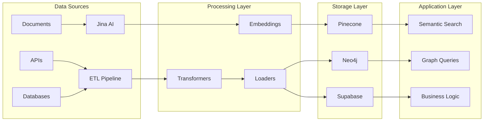

# Ontological Framework Integration Plan
## Bridging Enhanced Knowledge Graphs with Project Seldon Infrastructure

**Version**: 1.0  
**Date**: June 14, 2025  
**Status**: Integration Blueprint  
**Dependencies**: ONTOLOGICAL_FRAMEWORK.md, KNOWLEDGE_GRAPH_SCHEMAS.md  

---

## 📋 Executive Summary

This document outlines the integration strategy for implementing the enhanced ontological framework within Project Seldon's existing infrastructure. It addresses how to evolve from the current flat data structures to rich, multi-dimensional knowledge graphs while maintaining system stability and performance.

**Integration Priorities**:
1. Preserve existing ETL pipeline functionality
2. Enhance vector embeddings with semantic richness
3. Extend Neo4j schema without breaking changes
4. Add temporal tracking to all data flows
5. Implement confidence scoring across the stack

---

## 🏗️ Current State Analysis

### Existing Infrastructure Components



### Gap Analysis

| Component | Current State | Required Enhancement | Priority |
|-----------|--------------|---------------------|----------|
| **Neo4j Schema** | Flat nodes/edges | Multi-dimensional nodes, temporal tracking | High |
| **Vector Embeddings** | Document-level only | Entity-aware, relationship-aware embeddings | High |
| **ETL Pipeline** | Static transformation | Dynamic schema adaptation | Medium |
| **Confidence Tracking** | Not implemented | Multi-factor scoring system | High |
| **Temporal Data** | Basic timestamps | Full temporal evolution model | Medium |
| **Reasoning Engine** | Not implemented | Semantic inference system | Low |

---

## 🔄 Phased Integration Approach

### Phase 1: Schema Enhancement (Current → +2 weeks)

#### Neo4j Schema Migration

```cypher
// Current Simple Schema
CREATE (o:Organization {
    id: 'org:acme-corp',
    name: 'ACME Corporation',
    type: 'energy',
    created: datetime()
})

// Enhanced Multi-Dimensional Schema
CREATE (o:Organization {
    id: 'org:acme-corp',
    name: 'ACME Corporation',
    type: 'energy',
    created: datetime(),
    version: '2.0'
})
CREATE (p:PsychologicalProfile {
    id: 'psych:acme-corp',
    archetype_primary: 'Ruler',
    archetype_shadow: 'Tyrant',
    big_five: {
        openness: 45,
        conscientiousness: 78,
        extraversion: 62,
        agreeableness: 34,
        neuroticism: 56
    }
})
CREATE (o)-[:HAS_PROFILE {since: datetime(), confidence: 0.85}]->(p)

// Temporal State Node
CREATE (s:StateSnapshot {
    id: 'state:acme-corp:2025-06-14',
    node_id: 'org:acme-corp',
    timestamp: datetime(),
    attributes: {/* serialized state */}
})
CREATE (o)-[:HAS_STATE {current: true}]->(s)
```

#### Migration Script

```typescript
class Neo4jSchemaMigration {
  async migrate() {
    // Step 1: Add version tracking
    await this.addVersioning();
    
    // Step 2: Create profile nodes for existing orgs
    await this.createProfileNodes();
    
    // Step 3: Establish temporal tracking
    await this.initializeTemporalTracking();
    
    // Step 4: Add confidence scoring
    await this.addConfidenceProperties();
    
    // Step 5: Create indexes for performance
    await this.createIndexes();
  }
  
  private async createProfileNodes() {
    const query = `
      MATCH (o:Organization)
      WHERE NOT EXISTS((o)-[:HAS_PROFILE]->())
      CREATE (p:PsychologicalProfile {
        id: 'psych:' + o.id,
        created: datetime(),
        archetype_primary: 'Unknown',
        confidence: 0.0
      })
      CREATE (o)-[:HAS_PROFILE {since: datetime()}]->(p)
    `;
    await this.neo4j.run(query);
  }
}
```

### Phase 2: Enhanced Embeddings (Weeks 3-4)

#### Multi-Aspect Embedding Generation

```typescript
class EnhancedEmbeddingService {
  private jinaClient: JinaClient;
  private ontologyEngine: OntologyEngine;
  
  async generateEmbeddings(entity: EnhancedNode): Promise<MultiAspectEmbedding> {
    // Generate base embedding from text content
    const baseEmbedding = await this.jinaClient.encode(entity.content);
    
    // Generate psychological aspect embedding
    const psychEmbedding = await this.encodePsychologicalProfile(
      entity.dimensions.psychological
    );
    
    // Generate temporal aspect embedding
    const temporalEmbedding = await this.encodeTemporalEvolution(
      entity.timeline
    );
    
    // Generate relationship context embedding
    const relationshipEmbedding = await this.encodeRelationshipContext(
      entity.relationships
    );
    
    // Combine embeddings with learned weights
    return this.combineEmbeddings({
      base: baseEmbedding,
      psychological: psychEmbedding,
      temporal: temporalEmbedding,
      relational: relationshipEmbedding
    });
  }
  
  private async encodePsychologicalProfile(profile: PsychologicalProfile) {
    // Convert psychological attributes to embedding space
    const features = this.extractPsychologicalFeatures(profile);
    const text = this.generatePsychologicalNarrative(profile);
    
    // Encode narrative with psychological context
    return await this.jinaClient.encode(text, {
      context: 'organizational-psychology',
      features: features
    });
  }
}
```

#### Pinecone Index Structure Update

```typescript
interface EnhancedPineconeMetadata {
  // Existing fields
  id: string;
  type: string;
  source: string;
  
  // New ontology-aware fields
  entity_type: EntityType;
  psychological_archetype: string;
  confidence_score: number;
  temporal_relevance: number;
  relationship_density: number;
  
  // Multi-dimensional scores
  dimensions: {
    psychological: number;
    behavioral: number;
    structural: number;
    temporal: number;
  };
  
  // Semantic tags
  semantic_tags: string[];
  inferred_attributes: string[];
}
```

### Phase 3: Confidence System Implementation (Weeks 5-6)

#### Confidence Scoring Pipeline

```typescript
class ConfidenceScoreEngine {
  private bayesianEngine: BayesianInference;
  private sourceEvaluator: SourceReliabilityEvaluator;
  
  async calculateConfidence(
    entity: EnhancedNode,
    evidence: Evidence[]
  ): Promise<MultiFactorConfidence> {
    // Evaluate source reliability
    const sourceScore = await this.sourceEvaluator.evaluate(
      evidence.map(e => e.source)
    );
    
    // Calculate temporal decay
    const recencyScore = this.calculateTemporalDecay(
      evidence.map(e => e.timestamp)
    );
    
    // Find corroborating evidence
    const corroborationScore = await this.findCorroboration(
      entity,
      evidence
    );
    
    // Perform Bayesian update
    const bayesianScore = await this.bayesianEngine.update(
      entity.priorConfidence || 0.5,
      evidence
    );
    
    // Aggregate scores
    const aggregate = this.aggregateScores({
      source: sourceScore,
      recency: recencyScore,
      corroboration: corroborationScore,
      bayesian: bayesianScore
    });
    
    // Store confidence history
    await this.storeConfidenceHistory(entity.id, aggregate);
    
    return aggregate;
  }
}
```

#### Integration with ETL Pipeline

```typescript
class EnhancedETLPipeline {
  private confidenceEngine: ConfidenceScoreEngine;
  private ontologyMapper: OntologyMapper;
  
  async processDocument(document: Document): Promise<ProcessedEntity[]> {
    // Existing extraction
    const entities = await this.extractEntities(document);
    
    // New: Map to ontology
    const ontologyEntities = await this.ontologyMapper.map(entities);
    
    // New: Calculate confidence
    for (const entity of ontologyEntities) {
      entity.confidence = await this.confidenceEngine.calculateConfidence(
        entity,
        [{ source: document.source, timestamp: new Date() }]
      );
    }
    
    // New: Extract temporal information
    const temporalData = await this.extractTemporalData(document);
    
    // New: Infer relationships
    const relationships = await this.inferRelationships(
      ontologyEntities,
      document.context
    );
    
    // Enhanced loading with all new data
    await this.loadToGraphDB(ontologyEntities, relationships, temporalData);
    
    return ontologyEntities;
  }
}
```

### Phase 4: Temporal Tracking System (Weeks 7-8)

#### Time Series Integration

```typescript
class TemporalTrackingService {
  private stateManager: StateManager;
  private predictionEngine: PredictionEngine;
  
  async trackEntityEvolution(
    entityId: string,
    newState: EntityState
  ): Promise<TemporalEvolution> {
    // Get historical states
    const history = await this.stateManager.getHistory(entityId);
    
    // Detect changes
    const changes = this.detectChanges(
      history.latest,
      newState
    );
    
    // Store new state
    await this.stateManager.saveState(entityId, newState, changes);
    
    // Update state transitions
    const transitions = await this.updateTransitions(
      entityId,
      history,
      newState
    );
    
    // Generate predictions
    const predictions = await this.predictionEngine.predict(
      history,
      transitions,
      newState
    );
    
    // Create evolution object
    return {
      stateHistory: [...history.states, newState],
      transitions: transitions,
      predictions: predictions,
      patterns: this.detectPatterns(history)
    };
  }
}
```

### Phase 5: Query Enhancement (Weeks 9-10)

#### Ontology-Aware Query Interface

```typescript
class OntologyQueryService {
  async executeSemanticQuery(
    query: SemanticQuery
  ): Promise<QueryResult> {
    // Parse natural language to SPARQL/Cypher
    const structuredQuery = await this.parseQuery(query);
    
    // Apply ontological reasoning
    const expandedQuery = await this.applyReasoning(structuredQuery);
    
    // Execute across databases
    const results = await Promise.all([
      this.queryNeo4j(expandedQuery),
      this.queryPinecone(expandedQuery),
      this.querySupabase(expandedQuery)
    ]);
    
    // Merge and rank results
    const merged = this.mergeResults(results);
    
    // Apply confidence filtering
    const filtered = this.filterByConfidence(
      merged,
      query.minConfidence || 0.7
    );
    
    // Enrich with temporal context
    const enriched = await this.enrichWithTemporal(filtered);
    
    return {
      results: enriched,
      confidence: this.calculateResultConfidence(enriched),
      reasoning: expandedQuery.reasoning
    };
  }
}
```

---

## 🔧 Technical Implementation Details

### Database Adapter Layer

```typescript
abstract class DatabaseAdapter {
  abstract async mapToOntology(data: any): Promise<EnhancedNode>;
  abstract async mapFromOntology(node: EnhancedNode): Promise<any>;
  abstract async supportsMigration(): Promise<boolean>;
}

class Neo4jOntologyAdapter extends DatabaseAdapter {
  async mapToOntology(cypherResult: any): Promise<EnhancedNode> {
    return {
      id: cypherResult.id,
      type: this.mapNodeType(cypherResult.labels),
      dimensions: await this.extractDimensions(cypherResult),
      temporal: await this.getTemporalData(cypherResult.id),
      confidence: await this.getConfidenceScore(cypherResult.id)
    };
  }
}

class PineconeOntologyAdapter extends DatabaseAdapter {
  async mapToOntology(vector: PineconeVector): Promise<EnhancedNode> {
    return {
      id: vector.metadata.id,
      type: vector.metadata.entity_type,
      embedding: vector.values,
      dimensions: this.extractFromMetadata(vector.metadata),
      confidence: vector.metadata.confidence_score
    };
  }
}
```

### Performance Optimization Strategies

```typescript
class PerformanceOptimizer {
  // Caching layer for complex ontological queries
  private cache: OntologyCache;
  
  // Batch processing for temporal updates
  private batchProcessor: BatchProcessor;
  
  // Lazy loading for nested structures
  private lazyLoader: LazyLoader;
  
  async optimizeQuery(query: ComplexQuery): Promise<OptimizedQuery> {
    // Check cache first
    const cached = await this.cache.get(query.hash);
    if (cached) return cached;
    
    // Optimize query plan
    const plan = this.createQueryPlan(query);
    
    // Parallelize where possible
    const parallelized = this.parallelizeOperations(plan);
    
    // Add indexing hints
    const indexed = this.addIndexHints(parallelized);
    
    return indexed;
  }
}
```

---

## 📊 Migration Metrics and Monitoring

### Success Metrics

```yaml
performance_metrics:
  query_latency:
    baseline: 100ms
    target: 150ms  # Allow 50% increase for richer data
    
  embedding_generation:
    baseline: 50ms/doc
    target: 200ms/doc  # Multi-aspect embeddings
    
  storage_overhead:
    baseline: 1x
    target: 2.5x  # Acceptable for enhanced features
    
quality_metrics:
  semantic_richness:
    baseline: 10 relationship types
    target: 100+ relationship types
    
  temporal_coverage:
    baseline: current state only
    target: 5 year history + predictions
    
  confidence_accuracy:
    baseline: not measured
    target: 90% correlation with outcomes
```

### Monitoring Dashboard

```typescript
interface OntologyMonitoringDashboard {
  // Real-time metrics
  realtime: {
    queryPerformance: LatencyMetric;
    confidenceDistribution: DistributionMetric;
    temporalCoverage: CoverageMetric;
    reasoningUtilization: UtilizationMetric;
  };
  
  // Daily aggregates
  daily: {
    entitiesProcessed: CountMetric;
    relationshipsInferred: CountMetric;
    predictionsGenerated: CountMetric;
    confidenceUpdates: CountMetric;
  };
  
  // Quality indicators
  quality: {
    schemaCompleteness: PercentageMetric;
    temporalConsistency: ConsistencyMetric;
    reasoningAccuracy: AccuracyMetric;
    confidenceCalibration: CalibrationMetric;
  };
}
```

---

## 🚀 Rollout Strategy

### Progressive Rollout Plan

1. **Week 1-2**: Schema migration in test environment
2. **Week 3-4**: Enhanced embeddings for subset of data
3. **Week 5-6**: Confidence scoring pilot
4. **Week 7-8**: Temporal tracking activation
5. **Week 9-10**: Query enhancement deployment
6. **Week 11-12**: Full production rollout

### Rollback Procedures

```bash
# Automated rollback script
#!/bin/bash
if [ "$ONTOLOGY_HEALTH_CHECK" == "FAILED" ]; then
    echo "Initiating ontology rollback..."
    neo4j-admin restore --from=backup/pre-ontology
    kubectl rollout undo deployment/etl-pipeline
    kubectl rollout undo deployment/query-service
fi
```

---

## ✅ Integration Checklist

- [ ] Neo4j schema migration scripts tested
- [ ] Embedding service updates deployed
- [ ] Confidence engine integrated with ETL
- [ ] Temporal tracking database tables created
- [ ] Query parser updated for ontology
- [ ] Performance benchmarks established
- [ ] Monitoring dashboards configured
- [ ] Rollback procedures tested
- [ ] Documentation updated
- [ ] Team training completed

---

*"Integration is not just connection, but harmonious evolution of systems."*

**Last Updated**: June 14, 2025  
**Next Review**: July 2025