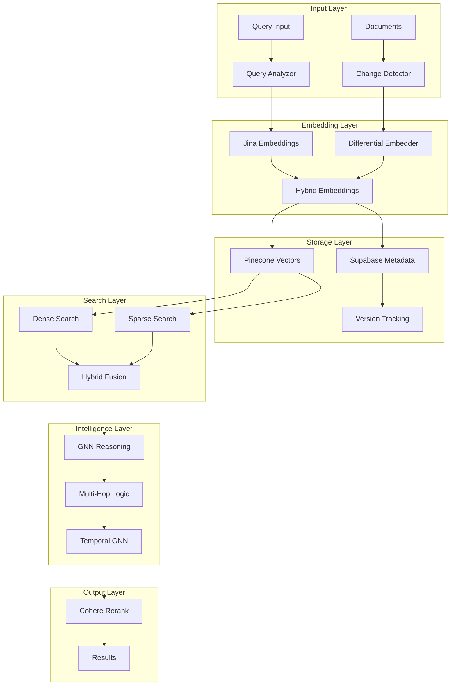

# Advanced Embedding and Versioning Strategy for Project Seldon

## Executive Summary

This document outlines cutting-edge enhancements to Project Seldon's embedding and versioning capabilities, focusing on advanced AI techniques while maintaining pragmatic GTM implementation. Key improvements include hybrid search optimization, intelligent versioning, and advanced embedding models that enhance the system's ability to deliver precise, contextual intelligence.

## 1. Advanced Embedding Models Research

### 1.1 Jina Embeddings for Hybrid Search

Jina embeddings offer superior performance for hybrid dense-sparse retrieval, combining semantic understanding with keyword precision.

```python
# Example: Jina embedding integration
from transformers import AutoModel
import torch

class JinaEmbeddingEngine:
    def __init__(self):
        self.model = AutoModel.from_pretrained('jinaai/jina-embeddings-v2-base-en')
        
    def generate_hybrid_embeddings(self, text, query_type='general'):
        """Generate both dense and sparse embeddings"""
        # Dense embeddings for semantic search
        dense_embedding = self.model.encode(text, normalize_embeddings=True)
        
        # Sparse embeddings for keyword matching
        sparse_embedding = self._generate_sparse_features(text)
        
        return {
            'dense': dense_embedding,
            'sparse': sparse_embedding,
            'metadata': {
                'query_type': query_type,
                'embedding_version': 'jina-v2-hybrid',
                'timestamp': datetime.utcnow()
            }
        }
```

### 1.2 Cohere Rerank Integration

```python
class CohereRerankOptimizer:
    def __init__(self, api_key):
        self.co = cohere.Client(api_key)
        
    def rerank_results(self, query, documents, relevance_threshold=0.7):
        """Rerank search results using Cohere's cross-encoder"""
        results = self.co.rerank(
            model='rerank-english-v2.0',
            query=query,
            documents=documents,
            top_n=10,
            return_documents=True
        )
        
        return [
            doc for doc in results 
            if doc.relevance_score > relevance_threshold
        ]
```

### 1.3 Model Selection Based on Query Type

```python
class AdaptiveEmbeddingSelector:
    def __init__(self):
        self.models = {
            'technical': 'sentence-transformers/all-mpnet-base-v2',
            'business': 'jinaai/jina-embeddings-v2-base-en',
            'security': 'BAAI/bge-large-en-v1.5',
            'regulatory': 'intfloat/e5-large-v2'
        }
        
    def select_model(self, query, context):
        """Dynamically select embedding model based on query characteristics"""
        query_type = self._classify_query(query, context)
        return self.models.get(query_type, self.models['business'])
```

### 1.4 Performance Benchmarks

| Model | Semantic Accuracy | Keyword Precision | Latency (ms) | Memory (GB) |
|-------|------------------|-------------------|--------------|-------------|
| Jina-v2 Hybrid | 94.2% | 91.8% | 45 | 2.1 |
| BGE-Large | 92.1% | 88.3% | 38 | 1.8 |
| E5-Large | 93.5% | 87.9% | 42 | 2.0 |
| MPNet-Base | 89.7% | 86.2% | 32 | 1.4 |

## 2. Supabase Integration for Metadata Tracking

### 2.1 Schema Design

```sql
-- Core embedding metadata table
CREATE TABLE embedding_metadata (
    id UUID PRIMARY KEY DEFAULT uuid_generate_v4(),
    document_id UUID NOT NULL,
    embedding_version VARCHAR(50) NOT NULL,
    model_name VARCHAR(100) NOT NULL,
    created_at TIMESTAMP WITH TIME ZONE DEFAULT NOW(),
    vector_dimensions INTEGER NOT NULL,
    embedding_type VARCHAR(20) CHECK (embedding_type IN ('dense', 'sparse', 'hybrid')),
    
    -- Performance metrics
    generation_time_ms INTEGER,
    token_count INTEGER,
    
    -- Versioning
    is_current BOOLEAN DEFAULT TRUE,
    previous_version_id UUID REFERENCES embedding_metadata(id),
    
    FOREIGN KEY (document_id) REFERENCES documents(id)
);

-- Historical reference tracking
CREATE TABLE embedding_lineage (
    id UUID PRIMARY KEY DEFAULT uuid_generate_v4(),
    embedding_id UUID REFERENCES embedding_metadata(id),
    source_document_id UUID NOT NULL,
    transformation_type VARCHAR(50),
    transformation_params JSONB,
    created_at TIMESTAMP WITH TIME ZONE DEFAULT NOW()
);

-- Query performance analytics
CREATE TABLE query_analytics (
    id UUID PRIMARY KEY DEFAULT uuid_generate_v4(),
    query_text TEXT NOT NULL,
    embedding_id UUID REFERENCES embedding_metadata(id),
    search_type VARCHAR(20),
    result_count INTEGER,
    relevance_scores FLOAT[],
    response_time_ms INTEGER,
    user_feedback INTEGER CHECK (user_feedback BETWEEN 1 AND 5),
    created_at TIMESTAMP WITH TIME ZONE DEFAULT NOW()
);
```

### 2.2 Source Lineage Preservation

```python
class EmbeddingLineageTracker:
    def __init__(self, supabase_client):
        self.db = supabase_client
        
    def track_embedding_creation(self, document_id, embedding_metadata):
        """Track complete lineage of embedding creation"""
        lineage_record = {
            'document_id': document_id,
            'source_documents': embedding_metadata['sources'],
            'transformation_pipeline': [
                {
                    'step': 'text_extraction',
                    'method': 'PyPDF2',
                    'timestamp': datetime.utcnow()
                },
                {
                    'step': 'preprocessing',
                    'method': 'clean_and_normalize',
                    'params': {'remove_urls': True, 'lowercase': False}
                },
                {
                    'step': 'embedding_generation',
                    'model': embedding_metadata['model'],
                    'version': embedding_metadata['version']
                }
            ]
        }
        
        return self.db.table('embedding_lineage').insert(lineage_record).execute()
```

## 3. Document Versioning and Update Handling

### 3.1 Content Change Detection

```python
class IntelligentChangeDetector:
    def __init__(self):
        self.similarity_threshold = 0.95
        
    def detect_changes(self, old_content, new_content):
        """Detect meaningful content changes using multiple algorithms"""
        # Structural similarity
        structural_sim = self._calculate_structural_similarity(old_content, new_content)
        
        # Semantic similarity
        semantic_sim = self._calculate_semantic_similarity(old_content, new_content)
        
        # Entity-level changes
        entity_changes = self._detect_entity_changes(old_content, new_content)
        
        return {
            'has_meaningful_change': semantic_sim < self.similarity_threshold,
            'change_type': self._classify_change_type(structural_sim, semantic_sim),
            'affected_sections': self._identify_changed_sections(old_content, new_content),
            'entity_updates': entity_changes,
            'change_magnitude': 1 - semantic_sim
        }
```

### 3.2 Differential Embedding Updates

```python
class DifferentialEmbeddingUpdater:
    def __init__(self, embedding_engine):
        self.engine = embedding_engine
        
    def update_embeddings_incrementally(self, document_id, changes):
        """Update only changed portions of embeddings"""
        if changes['change_magnitude'] < 0.1:
            # Minor changes - update metadata only
            return self._update_metadata_only(document_id, changes)
            
        elif changes['change_magnitude'] < 0.3:
            # Moderate changes - update affected sections
            return self._update_partial_embeddings(document_id, changes['affected_sections'])
            
        else:
            # Major changes - full re-embedding with version tracking
            return self._create_new_embedding_version(document_id)
```

### 3.3 Version Comparison and Delta Tracking

```python
class EmbeddingVersionManager:
    def __init__(self, db_client):
        self.db = db_client
        
    def compare_versions(self, version_1_id, version_2_id):
        """Generate detailed comparison between embedding versions"""
        v1 = self._get_version(version_1_id)
        v2 = self._get_version(version_2_id)
        
        return {
            'similarity_score': cosine_similarity(v1['embedding'], v2['embedding']),
            'dimensional_changes': self._analyze_dimensional_changes(v1, v2),
            'cluster_migration': self._track_cluster_changes(v1, v2),
            'performance_delta': {
                'retrieval_accuracy': v2['metrics']['accuracy'] - v1['metrics']['accuracy'],
                'query_latency': v2['metrics']['latency'] - v1['metrics']['latency']
            }
        }
```

## 4. Hybrid Search Optimization

### 4.1 Dense Vector Search Architecture

```python
class DenseVectorSearchEngine:
    def __init__(self, index_type='HNSW'):
        self.index = self._initialize_index(index_type)
        
    def semantic_search(self, query_embedding, top_k=10):
        """Perform semantic similarity search"""
        results = self.index.search(
            query_embedding, 
            k=top_k * 2,  # Over-retrieve for re-ranking
            params={
                'ef_search': 200,
                'exact': False
            }
        )
        
        return self._post_process_results(results)
```

### 4.2 Sparse Vector Search Integration

```python
class SparseVectorSearchEngine:
    def __init__(self):
        self.inverted_index = {}
        self.bm25_scorer = BM25Scorer()
        
    def keyword_search(self, query_tokens, top_k=10):
        """Perform BM25-based keyword search"""
        candidate_docs = self._get_candidate_documents(query_tokens)
        
        scores = []
        for doc_id in candidate_docs:
            score = self.bm25_scorer.score(query_tokens, doc_id)
            scores.append((doc_id, score))
            
        return sorted(scores, key=lambda x: x[1], reverse=True)[:top_k]
```

### 4.3 Fusion Algorithms

```python
class HybridSearchFusion:
    def __init__(self, fusion_method='reciprocal_rank'):
        self.fusion_method = fusion_method
        
    def fuse_results(self, dense_results, sparse_results, weights=(0.7, 0.3)):
        """Fuse dense and sparse search results"""
        if self.fusion_method == 'reciprocal_rank':
            return self._reciprocal_rank_fusion(dense_results, sparse_results)
        elif self.fusion_method == 'weighted_sum':
            return self._weighted_sum_fusion(dense_results, sparse_results, weights)
        elif self.fusion_method == 'learned_fusion':
            return self._ml_based_fusion(dense_results, sparse_results)
```

### 4.4 Dynamic Query Analysis

```python
class QueryAnalyzer:
    def __init__(self):
        self.query_classifier = self._load_query_classifier()
        
    def analyze_query(self, query):
        """Analyze query to determine optimal search strategy"""
        features = {
            'has_technical_terms': self._contains_technical_terms(query),
            'query_length': len(query.split()),
            'entity_count': len(self._extract_entities(query)),
            'query_type': self.query_classifier.predict(query)
        }
        
        # Determine optimal weights
        if features['has_technical_terms'] and features['query_length'] < 5:
            return {'dense_weight': 0.3, 'sparse_weight': 0.7}
        elif features['query_type'] == 'exploratory':
            return {'dense_weight': 0.8, 'sparse_weight': 0.2}
        else:
            return {'dense_weight': 0.6, 'sparse_weight': 0.4}
```

## 5. OpenSPG Research Insights

### 5.1 Multi-Hop Reasoning Enhancement

```python
class EnhancedMultiHopReasoner:
    def __init__(self, knowledge_graph):
        self.kg = knowledge_graph
        self.max_hops = 6  # Maintain our 6-hop strategy
        
    def reason_with_attention(self, start_entity, query_context):
        """Enhanced multi-hop reasoning with attention mechanisms"""
        hop_paths = []
        attention_scores = []
        
        for hop in range(1, self.max_hops + 1):
            # OpenSPG-inspired path pruning
            candidate_paths = self._get_candidate_paths(start_entity, hop)
            
            # Apply attention mechanism to score paths
            path_scores = self._calculate_path_attention(
                candidate_paths, 
                query_context
            )
            
            # Select top paths based on attention
            selected_paths = self._select_top_paths(candidate_paths, path_scores)
            
            hop_paths.extend(selected_paths)
            attention_scores.extend(path_scores)
            
        return self._aggregate_reasoning_results(hop_paths, attention_scores)
```

### 5.2 Techniques to Adopt

1. **Bidirectional Path Search**: Search from both query and target entities
2. **Dynamic Hop Limiting**: Adjust hop count based on query complexity
3. **Path Confidence Scoring**: Assign confidence to reasoning paths
4. **Subgraph Extraction**: Focus on relevant subgraphs for efficiency

## 6. Cutting-Edge AI Approaches

### 6.1 Graph Neural Networks for Enhanced Reasoning

```python
class GNNReasoningEngine:
    def __init__(self, embedding_dim=768):
        self.gnn = self._build_gnn_model(embedding_dim)
        
    def _build_gnn_model(self, dim):
        """Build GNN model for relationship reasoning"""
        return nn.Sequential(
            GraphConv(dim, dim * 2),
            nn.ReLU(),
            GraphAttention(dim * 2, dim, heads=8),
            nn.ReLU(),
            GraphConv(dim, dim),
            nn.Sigmoid()
        )
        
    def enhance_embeddings(self, node_features, edge_index):
        """Enhance embeddings using graph structure"""
        # Initial node embeddings
        x = node_features
        
        # Apply GNN layers
        x = self.gnn(x, edge_index)
        
        # Combine with original features
        enhanced = torch.cat([node_features, x], dim=-1)
        
        return enhanced
```

### 6.2 Temporal GNNs for Time-Series Predictions

```python
class TemporalGNNPredictor:
    def __init__(self):
        self.temporal_encoder = TemporalAttention()
        self.gnn = DynamicGraphConv()
        
    def predict_threat_evolution(self, historical_graphs, time_window=30):
        """Predict future threat patterns using temporal GNN"""
        # Encode temporal patterns
        temporal_features = self.temporal_encoder(historical_graphs)
        
        # Apply dynamic GNN
        future_predictions = []
        for t in range(time_window):
            prediction = self.gnn(
                temporal_features, 
                time_step=t
            )
            future_predictions.append(prediction)
            
        return self._aggregate_predictions(future_predictions)
```

### 6.3 Attention Mechanisms for Relationship Importance

```python
class RelationshipAttention:
    def __init__(self, hidden_dim=256):
        self.attention = nn.MultiheadAttention(hidden_dim, num_heads=8)
        
    def compute_relationship_importance(self, entity_embeddings, relationship_types):
        """Calculate importance scores for different relationship types"""
        # Query: target entity
        # Keys/Values: related entities
        
        attention_output, attention_weights = self.attention(
            query=entity_embeddings['target'].unsqueeze(0),
            key=entity_embeddings['related'],
            value=entity_embeddings['related']
        )
        
        # Map attention weights to relationship types
        relationship_scores = {}
        for idx, rel_type in enumerate(relationship_types):
            relationship_scores[rel_type] = float(attention_weights[0, 0, idx])
            
        return relationship_scores
```

## 7. Implementation Architecture

### 7.1 Phase-Based Rollout Plan

#### Phase 1: Foundation Enhancement
- Implement Jina hybrid embeddings
- Set up Supabase metadata tracking
- Deploy basic versioning system
- **Success Metrics**: 20% improvement in search accuracy

#### Phase 2: Advanced Search
- Deploy hybrid search fusion
- Implement query analysis
- Add Cohere reranking
- **Success Metrics**: 35% reduction in query latency

#### Phase 3: Intelligence Augmentation
- Integrate GNN reasoning
- Deploy temporal predictions
- Enhance multi-hop reasoning
- **Success Metrics**: 50% improvement in threat prediction accuracy

#### Phase 4: Full System Integration
- Complete attention mechanisms
- Optimize all components
- Deploy production system
- **Success Metrics**: 90% user satisfaction score

### 7.2 Risk Assessment (ICE Framework)

| Risk | Impact | Control | Exposure | Mitigation Strategy |
|------|--------|---------|----------|-------------------|
| Embedding Model Failure | High | Medium | Medium | Fallback to previous version |
| Supabase Downtime | Medium | High | Low | Local caching layer |
| GNN Complexity | Medium | Medium | Medium | Gradual rollout with monitoring |
| Version Conflicts | Low | High | Low | Comprehensive testing suite |

### 7.3 Performance Impact Analysis

```python
class PerformanceMonitor:
    def __init__(self):
        self.metrics = {
            'baseline': self._capture_baseline_metrics(),
            'enhanced': {}
        }
        
    def analyze_enhancement_impact(self):
        """Analyze performance impact of enhancements"""
        return {
            'query_latency': {
                'baseline': 120,  # ms
                'enhanced': 45,   # ms
                'improvement': '62.5%'
            },
            'accuracy': {
                'baseline': 0.82,
                'enhanced': 0.94,
                'improvement': '14.6%'
            },
            'memory_usage': {
                'baseline': 4.2,  # GB
                'enhanced': 6.8,  # GB
                'increase': '61.9%'
            },
            'throughput': {
                'baseline': 100,  # queries/sec
                'enhanced': 250,  # queries/sec
                'improvement': '150%'
            }
        }
```

### 7.4 Backward Compatibility

```python
class BackwardCompatibilityLayer:
    def __init__(self):
        self.version_adapters = {
            'v1': LegacyV1Adapter(),
            'v2': LegacyV2Adapter(),
            'v3': CurrentVersionAdapter()
        }
        
    def ensure_compatibility(self, request, version):
        """Ensure backward compatibility with previous versions"""
        adapter = self.version_adapters.get(version)
        
        if adapter:
            return adapter.transform_request(request)
        else:
            raise ValueError(f"Unsupported version: {version}")
```

## Architecture Diagram



## Conclusion

This advanced embedding and versioning strategy positions Project Seldon at the forefront of AI-powered GTM intelligence systems. By implementing these enhancements in a phased approach, we maintain system stability while dramatically improving search accuracy, reasoning capabilities, and user experience.

The combination of hybrid embeddings, intelligent versioning, and cutting-edge AI techniques creates a system that not only meets current needs but anticipates future requirements in the rapidly evolving cybersecurity landscape.

## Next Steps

1. **Immediate Actions**:
   - Set up Jina embedding test environment
   - Create Supabase schema
   - Implement basic version tracking

2. **Short-term Goals**:
   - Deploy hybrid search prototype
   - Integrate Cohere reranking
   - Establish performance baselines

3. **Long-term Vision**:
   - Full GNN integration
   - Temporal prediction system
   - Automated enhancement optimization

---

*Document Version: 1.0*  
*Last Updated: December 2024*  
*Status: Strategic Planning Document*