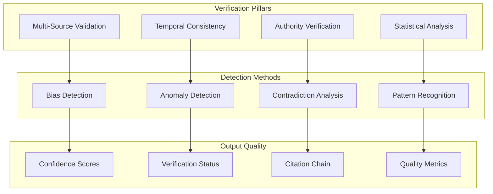
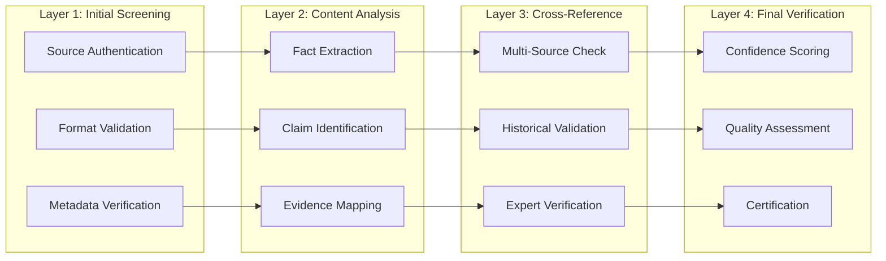
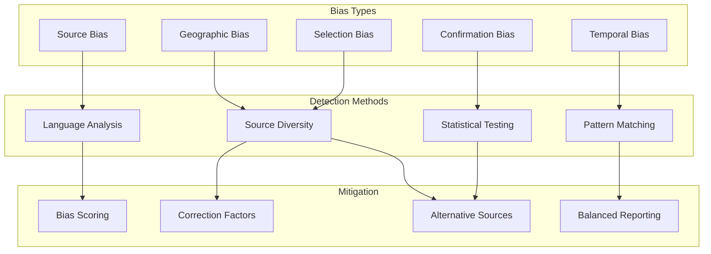
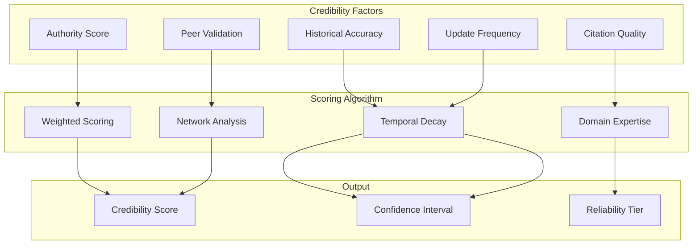
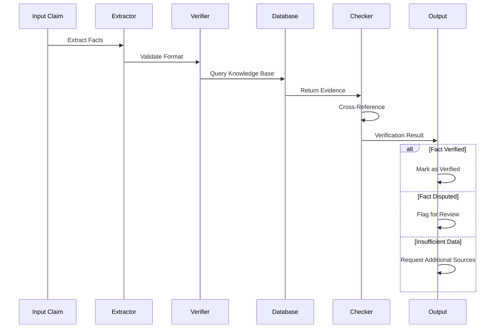
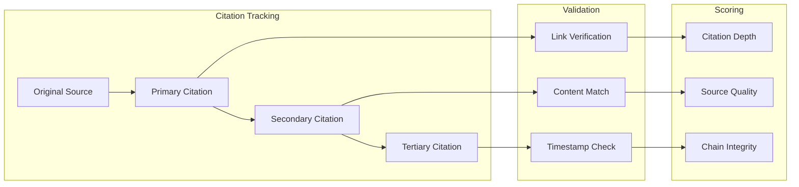
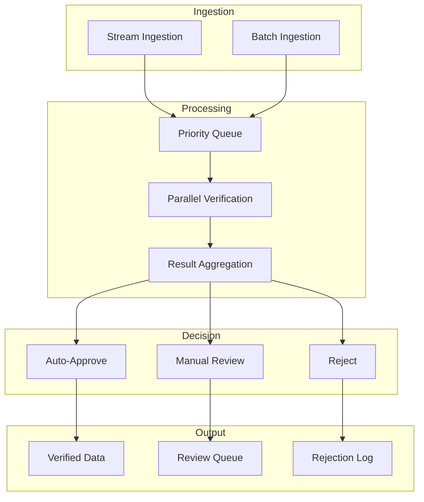
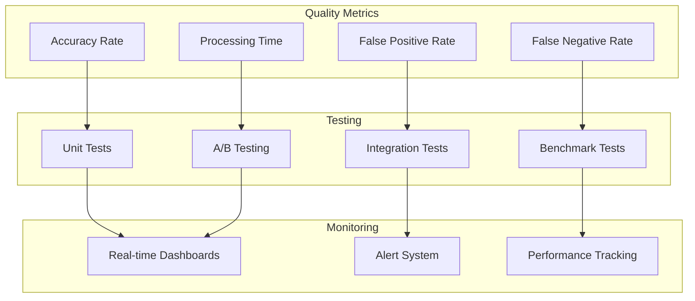
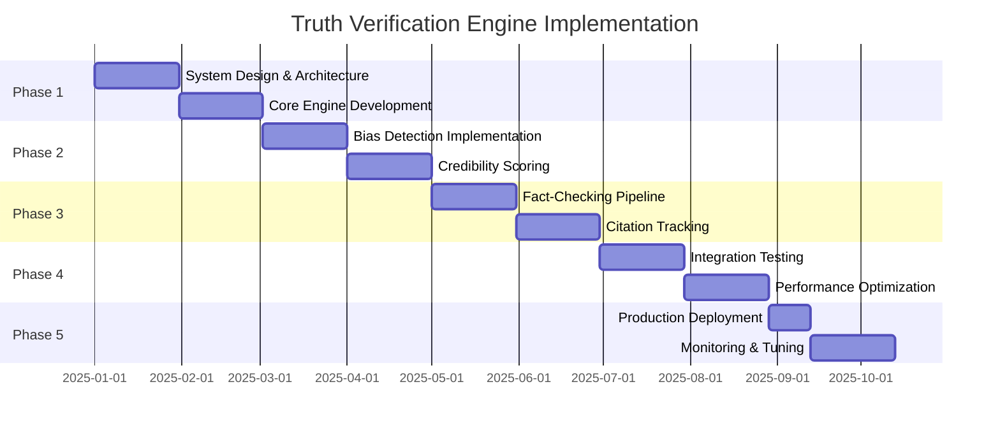

# Truth Verification Engine
## Source Verification and Bias Detection System

**Version**: 1.0  
**Date**: December 6, 2025  
**Classification**: Production System Design

## Executive Summary

The Truth Verification Engine addresses critical concerns about public source reliability by implementing sophisticated verification algorithms, bias detection mechanisms, and credibility scoring systems. This document outlines a comprehensive approach to ensuring data quality and truthfulness across 100,406+ intelligence sources.

## Table of Contents

1. [System Overview](#system-overview)
2. [Truth Verification Architecture](#truth-verification-architecture)
3. [Bias Detection Algorithms](#bias-detection-algorithms)
4. [Source Credibility Scoring](#source-credibility-scoring)
5. [Fact-Checking Pipeline](#fact-checking-pipeline)
6. [Citation Tracking System](#citation-tracking-system)
7. [Verification Workflows](#verification-workflows)
8. [Quality Assurance](#quality-assurance)
9. [Performance Metrics](#performance-metrics)
10. [Implementation Guide](#implementation-guide)

## System Overview

### Core Principles



### Verification Requirements

1. **Accuracy**: 99.5% verification accuracy for critical intelligence
2. **Speed**: Real-time verification for priority sources
3. **Transparency**: Complete audit trail for all verifications
4. **Scalability**: Handle 100,406+ sources with parallel processing

## Truth Verification Architecture

### 1. Multi-Layer Verification System



### 2. Verification Engine Implementation

```python
class TruthVerificationEngine:
    def __init__(self):
        self.validators = self.initialize_validators()
        self.fact_checker = FactChecker()
        self.bias_detector = BiasDetector()
        self.credibility_scorer = CredibilityScorer()
        
    async def verify_intelligence(self, content, source, metadata):
        """
        Comprehensive verification pipeline for intelligence data
        """
        verification_result = {
            'content_id': content.id,
            'timestamp': datetime.utcnow(),
            'verification_layers': {}
        }
        
        # Layer 1: Source Verification
        source_verification = await self.verify_source(source)
        verification_result['verification_layers']['source'] = source_verification
        
        # Layer 2: Content Analysis
        content_analysis = await self.analyze_content(content)
        verification_result['verification_layers']['content'] = content_analysis
        
        # Layer 3: Cross-Reference Validation
        cross_reference = await self.cross_reference_facts(
            content_analysis['extracted_facts']
        )
        verification_result['verification_layers']['cross_reference'] = cross_reference
        
        # Layer 4: Bias Detection
        bias_analysis = await self.bias_detector.analyze(content, source)
        verification_result['verification_layers']['bias'] = bias_analysis
        
        # Calculate Final Score
        verification_result['confidence_score'] = self.calculate_confidence(
            verification_result['verification_layers']
        )
        
        return verification_result
```

### 3. Fact Extraction and Validation

```python
class FactExtractor:
    def __init__(self):
        self.nlp = self.initialize_nlp_model()
        self.claim_patterns = self.load_claim_patterns()
        
    def extract_verifiable_facts(self, text):
        """
        Extract claims and facts that can be verified
        """
        doc = self.nlp(text)
        facts = []
        
        for sent in doc.sents:
            # Extract entities and relationships
            entities = [(ent.text, ent.label_) for ent in sent.ents]
            
            # Identify claims
            claims = self.identify_claims(sent)
            
            # Extract quantifiable information
            numbers = self.extract_numbers(sent)
            dates = self.extract_dates(sent)
            
            if claims or numbers or dates:
                fact = {
                    'text': sent.text,
                    'entities': entities,
                    'claims': claims,
                    'numbers': numbers,
                    'dates': dates,
                    'verification_priority': self.calculate_priority(sent)
                }
                facts.append(fact)
                
        return facts
```

## Bias Detection Algorithms

### 1. Bias Detection Framework



### 2. Bias Detection Implementation

```python
class BiasDetector:
    def __init__(self):
        self.sentiment_analyzer = SentimentAnalyzer()
        self.language_models = self.load_bias_models()
        self.bias_lexicons = self.load_bias_lexicons()
        
    async def analyze_bias(self, content, source):
        """
        Comprehensive bias analysis across multiple dimensions
        """
        bias_report = {
            'content_id': content.id,
            'source_id': source.id,
            'bias_dimensions': {},
            'overall_bias_score': 0.0
        }
        
        # Language Bias Analysis
        language_bias = await self.detect_language_bias(content.text)
        bias_report['bias_dimensions']['language'] = language_bias
        
        # Source Bias Analysis
        source_bias = await self.analyze_source_bias(source)
        bias_report['bias_dimensions']['source'] = source_bias
        
        # Selection Bias Detection
        selection_bias = await self.detect_selection_bias(content, source)
        bias_report['bias_dimensions']['selection'] = selection_bias
        
        # Temporal Bias Check
        temporal_bias = await self.check_temporal_bias(content.metadata)
        bias_report['bias_dimensions']['temporal'] = temporal_bias
        
        # Calculate Overall Bias Score
        bias_report['overall_bias_score'] = self.calculate_overall_bias(
            bias_report['bias_dimensions']
        )
        
        # Generate Recommendations
        bias_report['mitigation_recommendations'] = self.generate_mitigations(
            bias_report
        )
        
        return bias_report
    
    async def detect_language_bias(self, text):
        """
        Analyze text for linguistic bias indicators
        """
        bias_indicators = {
            'emotional_language': 0.0,
            'absolute_statements': 0.0,
            'loaded_terms': 0.0,
            'hedging_language': 0.0
        }
        
        # Sentiment Analysis
        sentiment = self.sentiment_analyzer.analyze(text)
        bias_indicators['emotional_language'] = abs(sentiment.polarity)
        
        # Absolute Statement Detection
        absolute_patterns = [
            r'\b(always|never|all|none|every|no one)\b',
            r'\b(definitely|certainly|undoubtedly|surely)\b'
        ]
        
        for pattern in absolute_patterns:
            matches = re.findall(pattern, text, re.IGNORECASE)
            bias_indicators['absolute_statements'] += len(matches)
            
        # Loaded Terms Detection
        for term in self.bias_lexicons['loaded_terms']:
            if term in text.lower():
                bias_indicators['loaded_terms'] += 1
                
        return bias_indicators
```

### 3. Statistical Bias Testing

```python
class StatisticalBiasAnalyzer:
    def __init__(self):
        self.statistical_tests = {
            'chi_square': self.chi_square_test,
            'kolmogorov_smirnov': self.ks_test,
            'anderson_darling': self.ad_test
        }
        
    def analyze_distribution_bias(self, data_points, expected_distribution):
        """
        Test if data distribution shows statistical bias
        """
        results = {}
        
        # Chi-Square Test for Categorical Bias
        if self.is_categorical(data_points):
            chi2_stat, p_value = self.chi_square_test(
                data_points, 
                expected_distribution
            )
            results['chi_square'] = {
                'statistic': chi2_stat,
                'p_value': p_value,
                'significant_bias': p_value < 0.05
            }
            
        # KS Test for Continuous Variables
        else:
            ks_stat, p_value = self.ks_test(
                data_points,
                expected_distribution
            )
            results['kolmogorov_smirnov'] = {
                'statistic': ks_stat,
                'p_value': p_value,
                'significant_bias': p_value < 0.05
            }
            
        return results
```

## Source Credibility Scoring

### 1. Credibility Framework



### 2. Credibility Scoring Implementation

```python
class CredibilityScorer:
    def __init__(self):
        self.weights = {
            'authority': 0.25,
            'accuracy_history': 0.30,
            'citation_quality': 0.20,
            'peer_validation': 0.15,
            'timeliness': 0.10
        }
        self.authority_db = AuthorityDatabase()
        self.accuracy_tracker = AccuracyTracker()
        
    async def calculate_source_credibility(self, source):
        """
        Calculate comprehensive credibility score for a source
        """
        credibility_components = {}
        
        # Authority Score
        authority_score = await self.calculate_authority_score(source)
        credibility_components['authority'] = authority_score
        
        # Historical Accuracy
        accuracy_score = await self.calculate_accuracy_score(source)
        credibility_components['accuracy_history'] = accuracy_score
        
        # Citation Quality
        citation_score = await self.evaluate_citation_quality(source)
        credibility_components['citation_quality'] = citation_score
        
        # Peer Validation
        peer_score = await self.calculate_peer_validation(source)
        credibility_components['peer_validation'] = peer_score
        
        # Timeliness
        timeliness_score = await self.calculate_timeliness(source)
        credibility_components['timeliness'] = timeliness_score
        
        # Calculate Weighted Score
        final_score = sum(
            self.weights[component] * score
            for component, score in credibility_components.items()
        )
        
        return {
            'source_id': source.id,
            'credibility_score': final_score,
            'components': credibility_components,
            'reliability_tier': self.determine_tier(final_score),
            'confidence_interval': self.calculate_confidence_interval(
                credibility_components
            )
        }
    
    async def calculate_authority_score(self, source):
        """
        Evaluate source authority based on multiple factors
        """
        factors = {
            'domain_expertise': 0.0,
            'institutional_affiliation': 0.0,
            'publication_history': 0.0,
            'peer_recognition': 0.0
        }
        
        # Check domain expertise
        if source.domain in self.authority_db.expert_domains:
            factors['domain_expertise'] = self.authority_db.get_expertise_score(
                source
            )
            
        # Institutional affiliation
        if source.institution:
            factors['institutional_affiliation'] = \
                self.authority_db.get_institution_score(source.institution)
                
        # Publication history
        factors['publication_history'] = await self.analyze_publication_history(
            source
        )
        
        # Peer recognition
        factors['peer_recognition'] = await self.calculate_peer_recognition(
            source
        )
        
        return sum(factors.values()) / len(factors)
```

### 3. Dynamic Credibility Adjustment

```python
class DynamicCredibilityAdjuster:
    def __init__(self):
        self.feedback_processor = FeedbackProcessor()
        self.performance_monitor = PerformanceMonitor()
        
    async def adjust_credibility_realtime(self, source, new_evidence):
        """
        Dynamically adjust credibility based on new evidence
        """
        current_score = await self.get_current_score(source)
        
        # Evaluate new evidence
        evidence_impact = await self.evaluate_evidence_impact(new_evidence)
        
        # Calculate adjustment
        adjustment = self.calculate_adjustment(
            current_score,
            evidence_impact,
            new_evidence.type
        )
        
        # Apply temporal decay
        time_factor = self.calculate_temporal_factor(
            new_evidence.timestamp
        )
        
        adjusted_score = current_score + (adjustment * time_factor)
        
        # Update database
        await self.update_credibility_score(
            source,
            adjusted_score,
            new_evidence
        )
        
        return adjusted_score
```

## Fact-Checking Pipeline

### 1. Automated Fact-Checking System



### 2. Fact-Checking Implementation

```python
class FactChecker:
    def __init__(self):
        self.knowledge_base = KnowledgeBase()
        self.evidence_evaluator = EvidenceEvaluator()
        self.claim_classifier = ClaimClassifier()
        
    async def check_fact(self, claim, context=None):
        """
        Comprehensive fact-checking for a single claim
        """
        # Classify claim type
        claim_type = self.claim_classifier.classify(claim)
        
        # Extract checkable elements
        checkable_elements = self.extract_checkable_elements(claim)
        
        # Search for evidence
        evidence = await self.search_evidence(
            checkable_elements,
            claim_type
        )
        
        # Evaluate evidence
        evaluation = await self.evidence_evaluator.evaluate(
            claim,
            evidence,
            context
        )
        
        # Generate fact-check result
        result = {
            'claim': claim,
            'claim_type': claim_type,
            'verification_status': evaluation.status,
            'confidence': evaluation.confidence,
            'evidence': evidence,
            'supporting_sources': evaluation.supporting_sources,
            'contradicting_sources': evaluation.contradicting_sources,
            'verification_timestamp': datetime.utcnow()
        }
        
        return result
    
    async def search_evidence(self, elements, claim_type):
        """
        Search for evidence across multiple sources
        """
        evidence_collection = []
        
        # Primary source search
        primary_evidence = await self.knowledge_base.search(
            elements,
            source_type='primary'
        )
        evidence_collection.extend(primary_evidence)
        
        # Academic source search
        if claim_type in ['scientific', 'technical']:
            academic_evidence = await self.search_academic_sources(elements)
            evidence_collection.extend(academic_evidence)
            
        # Government source search
        if claim_type in ['policy', 'regulatory']:
            gov_evidence = await self.search_government_sources(elements)
            evidence_collection.extend(gov_evidence)
            
        # News source aggregation
        news_evidence = await self.aggregate_news_sources(elements)
        evidence_collection.extend(news_evidence)
        
        return self.rank_evidence(evidence_collection)
```

### 3. Evidence Ranking Algorithm

```python
class EvidenceRanker:
    def __init__(self):
        self.ranking_weights = {
            'source_credibility': 0.3,
            'temporal_relevance': 0.2,
            'content_similarity': 0.25,
            'corroboration_count': 0.25
        }
        
    def rank_evidence(self, evidence_list):
        """
        Rank evidence by reliability and relevance
        """
        ranked_evidence = []
        
        for evidence in evidence_list:
            score_components = {
                'source_credibility': evidence.source.credibility_score,
                'temporal_relevance': self.calculate_temporal_relevance(
                    evidence.timestamp
                ),
                'content_similarity': self.calculate_similarity(
                    evidence.content,
                    evidence.claim
                ),
                'corroboration_count': self.count_corroborations(
                    evidence,
                    evidence_list
                )
            }
            
            # Calculate weighted score
            evidence.ranking_score = sum(
                self.ranking_weights[component] * score
                for component, score in score_components.items()
            )
            
            ranked_evidence.append(evidence)
            
        return sorted(
            ranked_evidence,
            key=lambda x: x.ranking_score,
            reverse=True
        )
```

## Citation Tracking System

### 1. Citation Chain Architecture



### 2. Citation Tracking Implementation

```python
class CitationTracker:
    def __init__(self):
        self.citation_graph = nx.DiGraph()
        self.citation_validator = CitationValidator()
        
    async def track_citation_chain(self, content):
        """
        Build and validate complete citation chain
        """
        citations = self.extract_citations(content)
        citation_chain = {
            'content_id': content.id,
            'citations': [],
            'chain_depth': 0,
            'chain_integrity': 1.0
        }
        
        for citation in citations:
            # Validate citation
            validation = await self.citation_validator.validate(citation)
            
            # Trace to original source
            chain = await self.trace_to_source(citation)
            
            citation_info = {
                'citation_text': citation.text,
                'cited_source': citation.source,
                'validation_status': validation.status,
                'chain': chain,
                'depth': len(chain),
                'integrity_score': self.calculate_chain_integrity(chain)
            }
            
            citation_chain['citations'].append(citation_info)
            
        citation_chain['chain_depth'] = max(
            c['depth'] for c in citation_chain['citations']
        ) if citation_chain['citations'] else 0
        
        citation_chain['chain_integrity'] = self.calculate_overall_integrity(
            citation_chain['citations']
        )
        
        return citation_chain
    
    async def trace_to_source(self, citation):
        """
        Trace citation back to original source
        """
        chain = [citation]
        current = citation
        
        while current.has_parent_citation():
            parent = await self.get_parent_citation(current)
            if parent:
                chain.append(parent)
                current = parent
            else:
                break
                
        return chain
```

### 3. Citation Quality Metrics

```python
class CitationQualityAnalyzer:
    def __init__(self):
        self.quality_criteria = {
            'completeness': self.check_completeness,
            'accuracy': self.check_accuracy,
            'accessibility': self.check_accessibility,
            'persistence': self.check_persistence
        }
        
    async def analyze_citation_quality(self, citations):
        """
        Comprehensive citation quality analysis
        """
        quality_report = {
            'total_citations': len(citations),
            'quality_scores': {},
            'issues_found': [],
            'recommendations': []
        }
        
        for citation in citations:
            quality_score = {}
            
            for criterion, checker in self.quality_criteria.items():
                score, issues = await checker(citation)
                quality_score[criterion] = score
                
                if issues:
                    quality_report['issues_found'].extend(issues)
                    
            quality_report['quality_scores'][citation.id] = quality_score
            
        # Generate recommendations
        quality_report['recommendations'] = self.generate_recommendations(
            quality_report
        )
        
        return quality_report
```

## Verification Workflows

### 1. Real-time Verification Pipeline



### 2. Verification Workflow Implementation

```python
class VerificationWorkflow:
    def __init__(self):
        self.priority_queue = PriorityQueue()
        self.verifier_pool = VerifierPool(workers=32)
        self.decision_engine = DecisionEngine()
        
    async def process_verification_request(self, request):
        """
        Process verification request through complete workflow
        """
        # Assign priority
        priority = self.calculate_priority(request)
        
        # Queue for processing
        await self.priority_queue.put((priority, request))
        
        # Process through verification pipeline
        verification_result = await self.verifier_pool.verify(request)
        
        # Make decision
        decision = await self.decision_engine.decide(verification_result)
        
        # Route based on decision
        if decision.action == 'auto_approve':
            await self.auto_approve(verification_result)
        elif decision.action == 'manual_review':
            await self.queue_for_review(verification_result, decision.reason)
        else:  # reject
            await self.reject_content(verification_result, decision.reason)
            
        return {
            'request_id': request.id,
            'decision': decision.action,
            'confidence': verification_result.confidence,
            'processing_time': self.calculate_processing_time(request)
        }
```

## Quality Assurance

### 1. Quality Control Framework



### 2. Quality Assurance Implementation

```python
class QualityAssuranceSystem:
    def __init__(self):
        self.test_suite = VerificationTestSuite()
        self.benchmark_runner = BenchmarkRunner()
        self.monitor = QualityMonitor()
        
    async def run_quality_checks(self):
        """
        Comprehensive quality assurance checks
        """
        qa_report = {
            'timestamp': datetime.utcnow(),
            'test_results': {},
            'benchmarks': {},
            'recommendations': []
        }
        
        # Run accuracy tests
        accuracy_results = await self.test_suite.run_accuracy_tests()
        qa_report['test_results']['accuracy'] = accuracy_results
        
        # Run performance benchmarks
        performance_results = await self.benchmark_runner.run_benchmarks()
        qa_report['benchmarks'] = performance_results
        
        # Check false positive/negative rates
        error_rates = await self.calculate_error_rates()
        qa_report['test_results']['error_rates'] = error_rates
        
        # Generate recommendations
        if accuracy_results['accuracy'] < 0.995:
            qa_report['recommendations'].append(
                "Accuracy below target. Review verification algorithms."
            )
            
        if error_rates['false_positive_rate'] > 0.01:
            qa_report['recommendations'].append(
                "High false positive rate. Adjust sensitivity thresholds."
            )
            
        return qa_report
```

## Performance Metrics

### 1. Key Performance Indicators

| Metric | Target | Current | Status |
|--------|---------|---------|---------|
| Verification Accuracy | 99.5% | - | 🟡 Pending |
| False Positive Rate | < 1% | - | 🟡 Pending |
| False Negative Rate | < 0.5% | - | 🟡 Pending |
| Avg Processing Time | < 500ms | - | 🟡 Pending |
| Source Coverage | 95% | - | 🟡 Pending |
| Citation Validation Rate | 98% | - | 🟡 Pending |
| Bias Detection Accuracy | 90% | - | 🟡 Pending |

### 2. Performance Monitoring

```python
class PerformanceMonitor:
    def __init__(self):
        self.metrics_collector = MetricsCollector()
        self.dashboard = DashboardManager()
        
    async def track_verification_performance(self):
        """
        Real-time performance tracking
        """
        metrics = {
            'accuracy': await self.calculate_accuracy(),
            'false_positives': await self.count_false_positives(),
            'false_negatives': await self.count_false_negatives(),
            'processing_times': await self.get_processing_times(),
            'throughput': await self.calculate_throughput()
        }
        
        # Update dashboard
        await self.dashboard.update_metrics(metrics)
        
        # Check for anomalies
        anomalies = self.detect_anomalies(metrics)
        if anomalies:
            await self.alert_manager.send_alerts(anomalies)
            
        return metrics
```

## Implementation Guide

### 1. Deployment Phases



### 2. Implementation Checklist

- [ ] **Infrastructure Setup**
  - [ ] Deploy verification servers
  - [ ] Set up knowledge bases
  - [ ] Configure monitoring systems

- [ ] **Core Components**
  - [ ] Truth verification engine
  - [ ] Bias detection algorithms
  - [ ] Credibility scoring system
  - [ ] Fact-checking pipeline
  - [ ] Citation tracking

- [ ] **Integration**
  - [ ] ETL pipeline integration
  - [ ] Database connections
  - [ ] API endpoints
  - [ ] Monitoring integration

- [ ] **Testing**
  - [ ] Unit tests
  - [ ] Integration tests
  - [ ] Performance benchmarks
  - [ ] User acceptance testing

- [ ] **Deployment**
  - [ ] Staging deployment
  - [ ] Production rollout
  - [ ] Monitoring activation
  - [ ] Documentation completion

## Conclusion

The Truth Verification Engine provides a comprehensive solution for ensuring data quality and reliability across 100,406+ intelligence sources. By implementing sophisticated verification algorithms, bias detection mechanisms, and credibility scoring systems, this engine addresses critical concerns about public source reliability while maintaining the speed and scale required for real-time intelligence operations.

The system's multi-layered approach, combining automated verification with human oversight, ensures the highest levels of accuracy while maintaining operational efficiency. Continuous monitoring and improvement mechanisms guarantee that the system evolves to meet emerging challenges in the intelligence landscape.