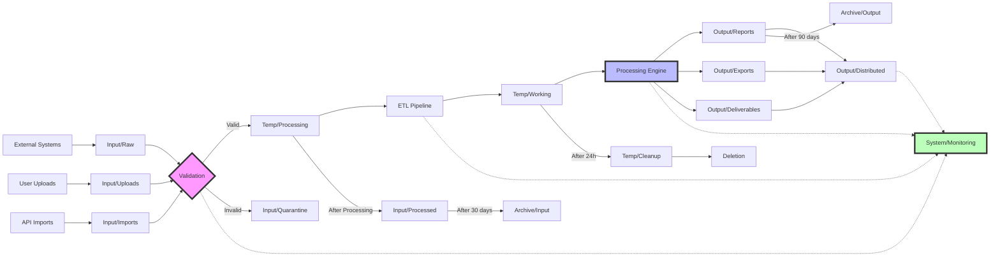

# INPUT/OUTPUT/TEMP FOLDER ARCHITECTURE
## Project Seldon Data Management System

**Document Version**: 1.0  
**Last Updated**: December 6, 2024  
**Classification**: Technical Architecture  
**Quality Target**: 8/10

---

## Executive Summary

This document defines the comprehensive folder structure and data management architecture for Project Seldon's processing pipeline. The system implements a robust, time-stamped approach to handle input data ingestion, output generation, and temporary file management with built-in monitoring, security, and lifecycle management capabilities.

### Key Design Principles
- **Timestamp-based organization** for traceability and collision prevention
- **Clear separation** between input, output, and temporary data
- **Automated lifecycle management** with retention policies
- **Built-in monitoring** and alerting capabilities
- **Security-first approach** with access controls and encryption

---

## 1. FOLDER STRUCTURE DESIGN

### 1.1 Root Directory Layout

```
/project_seldon_data/
├── input/
│   ├── raw/
│   ├── uploads/
│   ├── imports/
│   ├── quarantine/
│   └── processed/
├── output/
│   ├── reports/
│   ├── exports/
│   ├── deliverables/
│   ├── notifications/
│   └── distributed/
├── temp/
│   ├── processing/
│   ├── cache/
│   ├── working/
│   ├── sessions/
│   └── cleanup/
├── archive/
│   ├── input_archive/
│   ├── output_archive/
│   ├── historical/
│   └── compliance/
└── system/
    ├── logs/
    ├── config/
    ├── templates/
    └── monitoring/
```

### 1.2 Detailed Folder Descriptions

#### Input Directories
- **`/input/raw/`**: Unprocessed data exactly as received
- **`/input/uploads/`**: User-uploaded files awaiting validation
- **`/input/imports/`**: System-imported data from external sources
- **`/input/quarantine/`**: Suspicious or failed validation files
- **`/input/processed/`**: Successfully processed input files

#### Output Directories
- **`/output/reports/`**: Generated analytical reports
- **`/output/exports/`**: Data exports in various formats
- **`/output/deliverables/`**: Final client-ready artifacts
- **`/output/notifications/`**: System alerts and notifications
- **`/output/distributed/`**: Tracked delivery confirmations

#### Temp Directories
- **`/temp/processing/`**: Active processing workspace
- **`/temp/cache/`**: Cached intermediate results
- **`/temp/working/`**: User session working files
- **`/temp/sessions/`**: Session-specific temporary data
- **`/temp/cleanup/`**: Files marked for deletion

### 1.3 Folder Structure Mermaid Diagram

```mermaid
graph TD
    A[project_seldon_data] --> B[input]
    A --> C[output]
    A --> D[temp]
    A --> E[archive]
    A --> F[system]
    
    B --> B1[raw]
    B --> B2[uploads]
    B --> B3[imports]
    B --> B4[quarantine]
    B --> B5[processed]
    
    C --> C1[reports]
    C --> C2[exports]
    C --> C3[deliverables]
    C --> C4[notifications]
    C --> C5[distributed]
    
    D --> D1[processing]
    D --> D2[cache]
    D --> D3[working]
    D --> D4[sessions]
    D --> D5[cleanup]
    
    E --> E1[input_archive]
    E --> E2[output_archive]
    E --> E3[historical]
    E --> E4[compliance]
    
    F --> F1[logs]
    F --> F2[config]
    F --> F3[templates]
    F --> F4[monitoring]
```



---

## 2. TIMESTAMP STRATEGY

### 2.1 Naming Convention Standards

#### Primary Format: ISO 8601 Extended
```
YYYY-MM-DD-HH-MM-SS-mmm-JOBID-SEQUENCE
```

#### Examples:
- Input file: `2024-12-06-14-30-45-123-INP001-001_prospect_data.json`
- Output report: `2024-12-06-14-35-12-456-RPT001-001_executive_summary.pdf`
- Temp file: `2024-12-06-14-30-45-789-TMP001-001_processing_cache.tmp`

### 2.2 Timestamp Components

| Component | Format | Description | Example |
|-----------|--------|-------------|---------||
| Year | YYYY | 4-digit year | 2024 |
| Month | MM | 2-digit month | 12 |
| Day | DD | 2-digit day | 06 |
| Hour | HH | 24-hour format | 14 |
| Minute | MM | 2-digit minute | 30 |
| Second | SS | 2-digit second | 45 |
| Millisecond | mmm | 3-digit millisecond | 123 |
| Job ID | JOBID | Unique job identifier | INP001 |
| Sequence | NNN | Sequence number | 001 |

### 2.3 UTC vs Local Time Considerations

```python
import datetime
import pytz

class TimestampManager:
    def __init__(self, use_utc=True):
        self.use_utc = use_utc
        self.local_tz = pytz.timezone('America/Chicago')
    
    def get_timestamp(self):
        if self.use_utc:
            dt = datetime.datetime.now(pytz.UTC)
        else:
            dt = datetime.datetime.now(self.local_tz)
        
        return dt.strftime('%Y-%m-%d-%H-%M-%S-%f')[:-3]
    
    def get_filename_timestamp(self, job_id, sequence=1):
        timestamp = self.get_timestamp()
        return f"{timestamp}-{job_id}-{sequence:03d}"
```

### 2.4 Collision Prevention Mechanisms

```python
import threading
import uuid

class CollisionPreventionSystem:
    def __init__(self):
        self.lock = threading.Lock()
        self.sequence_counters = {}
    
    def generate_unique_filename(self, base_name, job_id):
        with self.lock:
            # Get current sequence number
            if job_id not in self.sequence_counters:
                self.sequence_counters[job_id] = 0
            
            self.sequence_counters[job_id] += 1
            sequence = self.sequence_counters[job_id]
            
            # Generate timestamp
            timestamp = TimestampManager().get_filename_timestamp(job_id, sequence)
            
            # Add UUID suffix for extra safety
            unique_suffix = str(uuid.uuid4())[:8]
            
            return f"{timestamp}_{unique_suffix}_{base_name}"
```

---

## 3. DATA LIFECYCLE MANAGEMENT

### 3.1 Retention Policies

| Folder Type | Retention Period | Archive Policy | Deletion Policy |
|-------------|------------------|----------------|------------------|
| Input Raw | 30 days | Compress after 7 days | Delete after archive |
| Input Processed | 90 days | Move to archive | Compress and store |
| Output Reports | 1 year | Archive after 90 days | Review before deletion |
| Output Deliverables | 2 years | Archive with metadata | Compliance review |
| Temp Processing | 24 hours | None | Auto-delete |
| Temp Cache | 7 days | None | LRU eviction |
| Archive | 7 years | Glacier after 1 year | Compliance-based |

### 3.2 Archival Strategy Implementation

```python
import os
import shutil
import gzip
import datetime
from pathlib import Path

class ArchivalManager:
    def __init__(self, base_path):
        self.base_path = Path(base_path)
        self.archive_path = self.base_path / 'archive'
    
    def archive_file(self, source_file, archive_type='input'):
        """Archive a file with compression and metadata"""
        source_path = Path(source_file)
        
        # Create archive subdirectory with date
        date_dir = datetime.datetime.now().strftime('%Y/%m/%d')
        archive_dir = self.archive_path / f"{archive_type}_archive" / date_dir
        archive_dir.mkdir(parents=True, exist_ok=True)
        
        # Compress file
        compressed_name = f"{source_path.name}.gz"
        compressed_path = archive_dir / compressed_name
        
        with open(source_path, 'rb') as f_in:
            with gzip.open(compressed_path, 'wb') as f_out:
                shutil.copyfileobj(f_in, f_out)
        
        # Create metadata file
        metadata = {
            'original_path': str(source_path),
            'archive_date': datetime.datetime.now().isoformat(),
            'original_size': source_path.stat().st_size,
            'compressed_size': compressed_path.stat().st_size,
            'compression_ratio': compressed_path.stat().st_size / source_path.stat().st_size
        }
        
        metadata_path = compressed_path.with_suffix('.meta.json')
        with open(metadata_path, 'w') as f:
            json.dump(metadata, f, indent=2)
        
        # Remove original file
        source_path.unlink()
        
        return compressed_path
```

### 3.3 Cleanup Automation

```python
import schedule
import time

class CleanupAutomation:
    def __init__(self, base_path):
        self.base_path = Path(base_path)
        self.retention_policies = {
            'temp/processing': 1,  # days
            'temp/cache': 7,
            'input/processed': 90,
            'output/reports': 365
        }
    
    def cleanup_old_files(self):
        """Remove files older than retention policy"""
        current_time = datetime.datetime.now()
        
        for folder, retention_days in self.retention_policies.items():
            folder_path = self.base_path / folder
            if not folder_path.exists():
                continue
            
            for file_path in folder_path.rglob('*'):
                if file_path.is_file():
                    file_age = current_time - datetime.datetime.fromtimestamp(file_path.stat().st_mtime)
                    if file_age.days > retention_days:
                        try:
                            file_path.unlink()
                            logging.info(f"Deleted old file: {file_path}")
                        except Exception as e:
                            logging.error(f"Failed to delete {file_path}: {e}")
    
    def schedule_cleanup(self):
        """Schedule daily cleanup tasks"""
        schedule.every().day.at("02:00").do(self.cleanup_old_files)
        schedule.every().hour.do(self.cleanup_temp_processing)
        
        while True:
            schedule.run_pending()
            time.sleep(60)
```

---

## 4. INPUT PROCESSING WORKFLOWS

### 4.1 File Validation Pipeline

```python
import hashlib
import magic
import json
from enum import Enum

class ValidationStatus(Enum):
    PENDING = "pending"
    VALID = "valid"
    QUARANTINE = "quarantine"
    REJECTED = "rejected"

class InputValidator:
    def __init__(self, input_path, quarantine_path):
        self.input_path = Path(input_path)
        self.quarantine_path = Path(quarantine_path)
        self.allowed_types = {
            'application/json': ['.json'],
            'text/csv': ['.csv'],
            'application/pdf': ['.pdf'],
            'application/vnd.openxmlformats-officedocument.spreadsheetml.sheet': ['.xlsx']
        }
    
    def validate_file(self, file_path):
        """Comprehensive file validation"""
        validation_results = {
            'file': str(file_path),
            'timestamp': datetime.datetime.now().isoformat(),
            'checks': {}
        }
        
        # Check file exists and is readable
        if not file_path.exists():
            validation_results['status'] = ValidationStatus.REJECTED
            validation_results['reason'] = 'File does not exist'
            return validation_results
        
        # Check file type
        mime_type = magic.from_file(str(file_path), mime=True)
        validation_results['checks']['mime_type'] = mime_type
        
        if mime_type not in self.allowed_types:
            validation_results['status'] = ValidationStatus.QUARANTINE
            validation_results['reason'] = f'Invalid file type: {mime_type}'
            self.quarantine_file(file_path, validation_results)
            return validation_results
        
        # Check file size
        file_size = file_path.stat().st_size
        validation_results['checks']['file_size'] = file_size
        
        if file_size > 100 * 1024 * 1024:  # 100MB limit
            validation_results['status'] = ValidationStatus.QUARANTINE
            validation_results['reason'] = 'File too large'
            self.quarantine_file(file_path, validation_results)
            return validation_results
        
        # Calculate checksum
        checksum = self.calculate_checksum(file_path)
        validation_results['checks']['checksum'] = checksum
        
        # Validate content structure
        if mime_type == 'application/json':
            if not self.validate_json_structure(file_path):
                validation_results['status'] = ValidationStatus.QUARANTINE
                validation_results['reason'] = 'Invalid JSON structure'
                self.quarantine_file(file_path, validation_results)
                return validation_results
        
        validation_results['status'] = ValidationStatus.VALID
        return validation_results
    
    def calculate_checksum(self, file_path):
        """Calculate SHA-256 checksum"""
        sha256_hash = hashlib.sha256()
        with open(file_path, "rb") as f:
            for byte_block in iter(lambda: f.read(4096), b""):
                sha256_hash.update(byte_block)
        return sha256_hash.hexdigest()
    
    def quarantine_file(self, file_path, validation_results):
        """Move file to quarantine with metadata"""
        timestamp = datetime.datetime.now().strftime('%Y%m%d_%H%M%S')
        quarantine_name = f"{timestamp}_{file_path.name}"
        quarantine_path = self.quarantine_path / quarantine_name
        
        # Move file
        shutil.move(str(file_path), str(quarantine_path))
        
        # Save validation results
        metadata_path = quarantine_path.with_suffix('.quarantine.json')
        with open(metadata_path, 'w') as f:
            json.dump(validation_results, f, indent=2)
```

### 4.2 Processing Queue Management

```python
import queue
import threading
from dataclasses import dataclass
from typing import Optional

@dataclass
class ProcessingJob:
    job_id: str
    file_path: Path
    priority: int
    timestamp: datetime.datetime
    status: str = 'queued'
    attempts: int = 0
    max_attempts: int = 3

class ProcessingQueueManager:
    def __init__(self, num_workers=4):
        self.queue = queue.PriorityQueue()
        self.workers = []
        self.num_workers = num_workers
        self.job_status = {}
        self.lock = threading.Lock()
    
    def add_job(self, file_path, priority=5):
        """Add a new processing job to the queue"""
        job = ProcessingJob(
            job_id=self.generate_job_id(),
            file_path=file_path,
            priority=priority,
            timestamp=datetime.datetime.now()
        )
        
        # Priority queue sorts by first element of tuple (lower = higher priority)
        self.queue.put((priority, job.timestamp, job))
        
        with self.lock:
            self.job_status[job.job_id] = job
        
        return job.job_id
    
    def worker_thread(self):
        """Worker thread for processing jobs"""
        while True:
            try:
                priority, timestamp, job = self.queue.get(timeout=1)
                
                # Update job status
                with self.lock:
                    job.status = 'processing'
                    self.job_status[job.job_id] = job
                
                # Process the job
                success = self.process_job(job)
                
                if success:
                    with self.lock:
                        job.status = 'completed'
                        self.job_status[job.job_id] = job
                else:
                    job.attempts += 1
                    if job.attempts < job.max_attempts:
                        # Requeue with lower priority
                        self.queue.put((priority + 1, timestamp, job))
                    else:
                        with self.lock:
                            job.status = 'failed'
                            self.job_status[job.job_id] = job
                
                self.queue.task_done()
                
            except queue.Empty:
                continue
            except Exception as e:
                logging.error(f"Worker thread error: {e}")
    
    def start_workers(self):
        """Start worker threads"""
        for i in range(self.num_workers):
            worker = threading.Thread(target=self.worker_thread, daemon=True)
            worker.start()
            self.workers.append(worker)
    
    def get_queue_status(self):
        """Get current queue status"""
        with self.lock:
            status = {
                'queued': sum(1 for j in self.job_status.values() if j.status == 'queued'),
                'processing': sum(1 for j in self.job_status.values() if j.status == 'processing'),
                'completed': sum(1 for j in self.job_status.values() if j.status == 'completed'),
                'failed': sum(1 for j in self.job_status.values() if j.status == 'failed'),
                'total': len(self.job_status)
            }
        return status
```

### 4.3 Success/Failure Tracking

```python
class ProcessingTracker:
    def __init__(self, tracking_db_path):
        self.db_path = tracking_db_path
        self.init_database()
    
    def init_database(self):
        """Initialize SQLite database for tracking"""
        conn = sqlite3.connect(self.db_path)
        cursor = conn.cursor()
        
        cursor.execute('''
            CREATE TABLE IF NOT EXISTS processing_history (
                job_id TEXT PRIMARY KEY,
                file_name TEXT,
                file_path TEXT,
                start_time TIMESTAMP,
                end_time TIMESTAMP,
                status TEXT,
                error_message TEXT,
                processing_time REAL,
                input_size INTEGER,
                output_size INTEGER,
                checksum TEXT
            )
        ''')
        
        cursor.execute('''
            CREATE INDEX IF NOT EXISTS idx_status ON processing_history(status)
        ''')
        
        cursor.execute('''
            CREATE INDEX IF NOT EXISTS idx_start_time ON processing_history(start_time)
        ''')
        
        conn.commit()
        conn.close()
    
    def record_processing_start(self, job_id, file_path):
        """Record the start of processing"""
        conn = sqlite3.connect(self.db_path)
        cursor = conn.cursor()
        
        cursor.execute('''
            INSERT INTO processing_history 
            (job_id, file_name, file_path, start_time, status)
            VALUES (?, ?, ?, ?, ?)
        ''', (job_id, file_path.name, str(file_path), 
              datetime.datetime.now(), 'processing'))
        
        conn.commit()
        conn.close()
    
    def record_processing_complete(self, job_id, status, error_message=None, 
                                   output_size=None):
        """Record the completion of processing"""
        conn = sqlite3.connect(self.db_path)
        cursor = conn.cursor()
        
        cursor.execute('''
            UPDATE processing_history
            SET end_time = ?,
                status = ?,
                error_message = ?,
                processing_time = CAST((julianday(?) - julianday(start_time)) * 86400 AS REAL),
                output_size = ?
            WHERE job_id = ?
        ''', (datetime.datetime.now(), status, error_message,
              datetime.datetime.now(), output_size, job_id))
        
        conn.commit()
        conn.close()
    
    def get_processing_stats(self, days=7):
        """Get processing statistics for the last N days"""
        conn = sqlite3.connect(self.db_path)
        cursor = conn.cursor()
        
        since_date = datetime.datetime.now() - datetime.timedelta(days=days)
        
        cursor.execute('''
            SELECT 
                COUNT(*) as total_jobs,
                SUM(CASE WHEN status = 'completed' THEN 1 ELSE 0 END) as successful,
                SUM(CASE WHEN status = 'failed' THEN 1 ELSE 0 END) as failed,
                AVG(processing_time) as avg_processing_time,
                SUM(input_size) as total_input_size,
                SUM(output_size) as total_output_size
            FROM processing_history
            WHERE start_time >= ?
        ''', (since_date,))
        
        stats = cursor.fetchone()
        conn.close()
        
        return {
            'total_jobs': stats[0] or 0,
            'successful': stats[1] or 0,
            'failed': stats[2] or 0,
            'success_rate': (stats[1] or 0) / (stats[0] or 1) * 100,
            'avg_processing_time': stats[3] or 0,
            'total_input_size': stats[4] or 0,
            'total_output_size': stats[5] or 0
        }
```

---

## 5. OUTPUT GENERATION SYSTEM

### 5.1 Template Management

```python
from jinja2 import Environment, FileSystemLoader, select_autoescape
import yaml

class TemplateManager:
    def __init__(self, template_dir):
        self.template_dir = Path(template_dir)
        self.env = Environment(
            loader=FileSystemLoader(str(self.template_dir)),
            autoescape=select_autoescape(['html', 'xml'])
        )
        self.template_registry = self.load_template_registry()
    
    def load_template_registry(self):
        """Load template configuration from YAML"""
        registry_path = self.template_dir / 'template_registry.yaml'
        with open(registry_path, 'r') as f:
            return yaml.safe_load(f)
    
    def render_report(self, template_name, data, output_format='pdf'):
        """Render a report using the specified template"""
        template_config = self.template_registry.get(template_name)
        if not template_config:
            raise ValueError(f"Template {template_name} not found in registry")
        
        # Load and render template
        template = self.env.get_template(template_config['file'])
        rendered_content = template.render(**data)
        
        # Generate output based on format
        if output_format == 'pdf':
            return self.generate_pdf(rendered_content, template_config)
        elif output_format == 'html':
            return rendered_content
        elif output_format == 'docx':
            return self.generate_docx(rendered_content, template_config)
        else:
            raise ValueError(f"Unsupported output format: {output_format}")
    
    def generate_pdf(self, html_content, template_config):
        """Generate PDF from HTML content"""
        from weasyprint import HTML, CSS
        
        # Apply custom CSS if specified
        css_file = template_config.get('css')
        if css_file:
            css_path = self.template_dir / css_file
            css = CSS(filename=str(css_path))
            pdf_bytes = HTML(string=html_content).write_pdf(stylesheets=[css])
        else:
            pdf_bytes = HTML(string=html_content).write_pdf()
        
        return pdf_bytes
```

### 5.2 Version Control for Outputs

```python
import git
from packaging import version

class OutputVersionControl:
    def __init__(self, output_dir):
        self.output_dir = Path(output_dir)
        self.version_db = self.output_dir / '.versions' / 'version_db.json'
        self.init_version_tracking()
    
    def init_version_tracking(self):
        """Initialize version tracking system"""
        self.version_db.parent.mkdir(parents=True, exist_ok=True)
        if not self.version_db.exists():
            with open(self.version_db, 'w') as f:
                json.dump({}, f)
    
    def get_next_version(self, output_name):
        """Get the next version number for an output"""
        with open(self.version_db, 'r') as f:
            versions = json.load(f)
        
        current_versions = versions.get(output_name, [])
        if not current_versions:
            return "1.0.0"
        
        latest_version = max(current_versions, key=lambda v: version.parse(v))
        v = version.parse(latest_version)
        
        # Increment minor version
        new_version = f"{v.major}.{v.minor + 1}.0"
        return new_version
    
    def save_versioned_output(self, output_name, content, metadata=None):
        """Save output with version control"""
        # Get next version
        version_num = self.get_next_version(output_name)
        
        # Create versioned filename
        timestamp = datetime.datetime.now().strftime('%Y%m%d_%H%M%S')
        versioned_name = f"{output_name}_v{version_num}_{timestamp}"
        
        # Save file
        output_path = self.output_dir / f"{versioned_name}.pdf"
        with open(output_path, 'wb') as f:
            f.write(content)
        
        # Update version database
        with open(self.version_db, 'r') as f:
            versions = json.load(f)
        
        if output_name not in versions:
            versions[output_name] = []
        
        versions[output_name].append(version_num)
        
        with open(self.version_db, 'w') as f:
            json.dump(versions, f, indent=2)
        
        # Save metadata
        if metadata:
            metadata_path = output_path.with_suffix('.meta.json')
            metadata['version'] = version_num
            metadata['timestamp'] = timestamp
            metadata['file_path'] = str(output_path)
            
            with open(metadata_path, 'w') as f:
                json.dump(metadata, f, indent=2)
        
        return output_path
```

### 5.3 Distribution Tracking

```python
import smtplib
from email.mime.multipart import MIMEMultipart
from email.mime.base import MIMEBase
from email import encoders

class DistributionTracker:
    def __init__(self, tracking_db):
        self.tracking_db = tracking_db
        self.init_tracking_db()
    
    def init_tracking_db(self):
        """Initialize distribution tracking database"""
        conn = sqlite3.connect(self.tracking_db)
        cursor = conn.cursor()
        
        cursor.execute('''
            CREATE TABLE IF NOT EXISTS distributions (
                distribution_id TEXT PRIMARY KEY,
                file_path TEXT,
                file_hash TEXT,
                recipient_email TEXT,
                recipient_name TEXT,
                sent_timestamp TIMESTAMP,
                delivery_status TEXT,
                opened_timestamp TIMESTAMP,
                download_count INTEGER DEFAULT 0,
                expiry_date TIMESTAMP
            )
        ''')
        
        conn.commit()
        conn.close()
    
    def track_distribution(self, file_path, recipient_email, recipient_name, 
                          expiry_days=30):
        """Track a file distribution"""
        distribution_id = str(uuid.uuid4())
        file_hash = self.calculate_file_hash(file_path)
        expiry_date = datetime.datetime.now() + datetime.timedelta(days=expiry_days)
        
        conn = sqlite3.connect(self.tracking_db)
        cursor = conn.cursor()
        
        cursor.execute('''
            INSERT INTO distributions
            (distribution_id, file_path, file_hash, recipient_email, 
             recipient_name, sent_timestamp, delivery_status, expiry_date)
            VALUES (?, ?, ?, ?, ?, ?, ?, ?)
        ''', (distribution_id, str(file_path), file_hash, recipient_email,
              recipient_name, datetime.datetime.now(), 'sent', expiry_date))
        
        conn.commit()
        conn.close()
        
        return distribution_id
    
    def update_delivery_status(self, distribution_id, status):
        """Update delivery status"""
        conn = sqlite3.connect(self.tracking_db)
        cursor = conn.cursor()
        
        cursor.execute('''
            UPDATE distributions
            SET delivery_status = ?
            WHERE distribution_id = ?
        ''', (status, distribution_id))
        
        conn.commit()
        conn.close()
    
    def record_file_access(self, distribution_id):
        """Record when a distributed file is accessed"""
        conn = sqlite3.connect(self.tracking_db)
        cursor = conn.cursor()
        
        cursor.execute('''
            UPDATE distributions
            SET download_count = download_count + 1,
                opened_timestamp = CASE 
                    WHEN opened_timestamp IS NULL THEN ?
                    ELSE opened_timestamp
                END
            WHERE distribution_id = ?
        ''', (datetime.datetime.now(), distribution_id))
        
        conn.commit()
        conn.close()
```

---

## 6. TEMP FILE MANAGEMENT

### 6.1 Session-based Temp Folders

```python
import tempfile
import atexit
import psutil

class SessionTempManager:
    def __init__(self, base_temp_dir):
        self.base_temp_dir = Path(base_temp_dir)
        self.session_id = self.generate_session_id()
        self.session_dir = None
        self.temp_files = set()
        self.create_session_dir()
        
        # Register cleanup on exit
        atexit.register(self.cleanup_session)
    
    def generate_session_id(self):
        """Generate unique session ID"""
        return f"session_{datetime.datetime.now().strftime('%Y%m%d_%H%M%S')}_{os.getpid()}"
    
    def create_session_dir(self):
        """Create session-specific temp directory"""
        self.session_dir = self.base_temp_dir / 'sessions' / self.session_id
        self.session_dir.mkdir(parents=True, exist_ok=True)
        
        # Create session metadata
        metadata = {
            'session_id': self.session_id,
            'pid': os.getpid(),
            'start_time': datetime.datetime.now().isoformat(),
            'user': os.environ.get('USER', 'unknown'),
            'hostname': socket.gethostname()
        }
        
        metadata_path = self.session_dir / '.session_metadata.json'
        with open(metadata_path, 'w') as f:
            json.dump(metadata, f, indent=2)
    
    def get_temp_file(self, prefix='tmp', suffix=''):
        """Get a temporary file path within the session directory"""
        temp_file = tempfile.NamedTemporaryFile(
            dir=self.session_dir,
            prefix=prefix,
            suffix=suffix,
            delete=False
        )
        
        self.temp_files.add(temp_file.name)
        return temp_file
    
    def cleanup_session(self):
        """Clean up session directory and all temp files"""
        try:
            if self.session_dir and self.session_dir.exists():
                shutil.rmtree(self.session_dir)
                logging.info(f"Cleaned up session directory: {self.session_dir}")
        except Exception as e:
            logging.error(f"Failed to cleanup session directory: {e}")
```

### 6.2 Automatic Cleanup Rules

```python
class TempCleanupRules:
    def __init__(self, temp_base_dir):
        self.temp_base_dir = Path(temp_base_dir)
        self.rules = self.load_cleanup_rules()
    
    def load_cleanup_rules(self):
        """Load cleanup rules from configuration"""
        return {
            'age_based': {
                'processing': {'max_age_hours': 24},
                'cache': {'max_age_hours': 168},  # 7 days
                'working': {'max_age_hours': 72},
                'sessions': {'max_age_hours': 48}
            },
            'size_based': {
                'cache': {'max_size_gb': 50},
                'processing': {'max_size_gb': 100}
            },
            'pattern_based': {
                '*.tmp': {'max_age_hours': 12},
                '*.log': {'max_age_hours': 168},
                '*.cache': {'max_age_hours': 72}
            }
        }
    
    def apply_age_based_cleanup(self):
        """Apply age-based cleanup rules"""
        current_time = datetime.datetime.now()
        
        for folder, rule in self.rules['age_based'].items():
            folder_path = self.temp_base_dir / folder
            if not folder_path.exists():
                continue
            
            max_age_hours = rule['max_age_hours']
            
            for file_path in folder_path.rglob('*'):
                if file_path.is_file():
                    file_age = current_time - datetime.datetime.fromtimestamp(
                        file_path.stat().st_mtime
                    )
                    
                    if file_age.total_seconds() / 3600 > max_age_hours:
                        try:
                            file_path.unlink()
                            logging.info(f"Deleted old temp file: {file_path}")
                        except Exception as e:
                            logging.error(f"Failed to delete {file_path}: {e}")
    
    def apply_size_based_cleanup(self):
        """Apply size-based cleanup rules"""
        for folder, rule in self.rules['size_based'].items():
            folder_path = self.temp_base_dir / folder
            if not folder_path.exists():
                continue
            
            max_size_bytes = rule['max_size_gb'] * 1024 * 1024 * 1024
            
            # Calculate folder size
            folder_size = sum(
                f.stat().st_size for f in folder_path.rglob('*') if f.is_file()
            )
            
            if folder_size > max_size_bytes:
                # Delete oldest files first
                files = sorted(
                    [f for f in folder_path.rglob('*') if f.is_file()],
                    key=lambda f: f.stat().st_mtime
                )
                
                deleted_size = 0
                target_size = folder_size - max_size_bytes
                
                for file_path in files:
                    if deleted_size >= target_size:
                        break
                    
                    try:
                        file_size = file_path.stat().st_size
                        file_path.unlink()
                        deleted_size += file_size
                        logging.info(f"Deleted file for size limit: {file_path}")
                    except Exception as e:
                        logging.error(f"Failed to delete {file_path}: {e}")
```

### 6.3 Orphan File Detection

```python
class OrphanFileDetector:
    def __init__(self, temp_dir, process_tracker):
        self.temp_dir = Path(temp_dir)
        self.process_tracker = process_tracker
    
    def find_orphan_files(self):
        """Find temp files with no active process"""
        orphan_files = []
        
        # Get list of active PIDs
        active_pids = {p.pid for p in psutil.process_iter()}
        
        # Check session directories
        sessions_dir = self.temp_dir / 'sessions'
        if sessions_dir.exists():
            for session_dir in sessions_dir.iterdir():
                if session_dir.is_dir():
                    # Extract PID from session directory name
                    try:
                        pid = int(session_dir.name.split('_')[-1])
                        if pid not in active_pids:
                            orphan_files.append({
                                'type': 'session',
                                'path': session_dir,
                                'pid': pid,
                                'size': sum(f.stat().st_size for f in session_dir.rglob('*') if f.is_file())
                            })
                    except (ValueError, IndexError):
                        pass
        
        # Check processing files
        processing_dir = self.temp_dir / 'processing'
        if processing_dir.exists():
            for file_path in processing_dir.rglob('*'):
                if file_path.is_file():
                    # Check if associated job is still active
                    job_id = self.extract_job_id(file_path.name)
                    if job_id and not self.process_tracker.is_job_active(job_id):
                        orphan_files.append({
                            'type': 'processing',
                            'path': file_path,
                            'job_id': job_id,
                            'size': file_path.stat().st_size
                        })
        
        return orphan_files
    
    def cleanup_orphan_files(self, dry_run=True):
        """Clean up orphan files"""
        orphan_files = self.find_orphan_files()
        cleaned_size = 0
        
        for orphan in orphan_files:
            if dry_run:
                logging.info(f"Would delete orphan: {orphan['path']} ({orphan['size']} bytes)")
            else:
                try:
                    if orphan['path'].is_dir():
                        shutil.rmtree(orphan['path'])
                    else:
                        orphan['path'].unlink()
                    
                    cleaned_size += orphan['size']
                    logging.info(f"Deleted orphan: {orphan['path']}")
                except Exception as e:
                    logging.error(f"Failed to delete orphan {orphan['path']}: {e}")
        
        return {
            'orphan_count': len(orphan_files),
            'cleaned_size': cleaned_size,
            'dry_run': dry_run
        }
```

---

## 7. MONITORING AND ALERTING

### 7.1 Folder Size Monitoring

```python
import psutil
from prometheus_client import Gauge, Counter, Histogram

class FolderMonitor:
    def __init__(self, base_path, alert_thresholds):
        self.base_path = Path(base_path)
        self.alert_thresholds = alert_thresholds
        
        # Prometheus metrics
        self.folder_size_gauge = Gauge(
            'folder_size_bytes',
            'Size of folder in bytes',
            ['folder_path']
        )
        
        self.folder_file_count = Gauge(
            'folder_file_count',
            'Number of files in folder',
            ['folder_path']
        )
        
        self.disk_usage_percent = Gauge(
            'disk_usage_percent',
            'Disk usage percentage'
        )
    
    def monitor_folder_sizes(self):
        """Monitor sizes of all folders"""
        alerts = []
        
        for folder_path in self.base_path.iterdir():
            if folder_path.is_dir():
                # Calculate folder size and file count
                size, file_count = self.get_folder_stats(folder_path)
                
                # Update metrics
                self.folder_size_gauge.labels(folder_path=str(folder_path)).set(size)
                self.folder_file_count.labels(folder_path=str(folder_path)).set(file_count)
                
                # Check thresholds
                folder_name = folder_path.name
                if folder_name in self.alert_thresholds:
                    threshold = self.alert_thresholds[folder_name]
                    
                    if size > threshold['size_bytes']:
                        alerts.append({
                            'type': 'folder_size',
                            'severity': 'warning',
                            'folder': str(folder_path),
                            'current_size': size,
                            'threshold': threshold['size_bytes'],
                            'message': f"Folder {folder_path} exceeds size threshold"
                        })
                    
                    if file_count > threshold.get('file_count', float('inf')):
                        alerts.append({
                            'type': 'file_count',
                            'severity': 'warning',
                            'folder': str(folder_path),
                            'current_count': file_count,
                            'threshold': threshold['file_count'],
                            'message': f"Folder {folder_path} exceeds file count threshold"
                        })
        
        # Monitor disk usage
        disk_usage = psutil.disk_usage(str(self.base_path))
        self.disk_usage_percent.set(disk_usage.percent)
        
        if disk_usage.percent > 90:
            alerts.append({
                'type': 'disk_usage',
                'severity': 'critical',
                'usage_percent': disk_usage.percent,
                'message': f"Disk usage critical: {disk_usage.percent}%"
            })
        
        return alerts
    
    def get_folder_stats(self, folder_path):
        """Get folder size and file count"""
        total_size = 0
        file_count = 0
        
        for file_path in folder_path.rglob('*'):
            if file_path.is_file():
                total_size += file_path.stat().st_size
                file_count += 1
        
        return total_size, file_count
```

### 7.2 Processing Time Tracking

```python
class ProcessingTimeTracker:
    def __init__(self, metrics_db):
        self.metrics_db = metrics_db
        
        # Prometheus metrics
        self.processing_duration = Histogram(
            'file_processing_duration_seconds',
            'Time spent processing files',
            ['file_type', 'processing_stage']
        )
        
        self.processing_rate = Gauge(
            'file_processing_rate',
            'Files processed per minute'
        )
    
    def track_processing_time(self, file_type, stage, duration):
        """Track processing time for a file"""
        self.processing_duration.labels(
            file_type=file_type,
            processing_stage=stage
        ).observe(duration)
        
        # Store in database
        conn = sqlite3.connect(self.metrics_db)
        cursor = conn.cursor()
        
        cursor.execute('''
            INSERT INTO processing_metrics
            (timestamp, file_type, stage, duration)
            VALUES (?, ?, ?, ?)
        ''', (datetime.datetime.now(), file_type, stage, duration))
        
        conn.commit()
        conn.close()
    
    def calculate_processing_rate(self, window_minutes=5):
        """Calculate files processed per minute"""
        conn = sqlite3.connect(self.metrics_db)
        cursor = conn.cursor()
        
        since_time = datetime.datetime.now() - datetime.timedelta(minutes=window_minutes)
        
        cursor.execute('''
            SELECT COUNT(*) 
            FROM processing_metrics
            WHERE timestamp >= ?
        ''', (since_time,))
        
        count = cursor.fetchone()[0]
        conn.close()
        
        rate = count / window_minutes
        self.processing_rate.set(rate)
        
        return rate
    
    def get_performance_metrics(self):
        """Get comprehensive performance metrics"""
        conn = sqlite3.connect(self.metrics_db)
        cursor = conn.cursor()
        
        # Average processing time by file type
        cursor.execute('''
            SELECT file_type, AVG(duration) as avg_duration, COUNT(*) as count
            FROM processing_metrics
            WHERE timestamp >= datetime('now', '-1 day')
            GROUP BY file_type
        ''')
        
        file_type_metrics = cursor.fetchall()
        
        # Processing time percentiles
        cursor.execute('''
            SELECT 
                MIN(duration) as min_duration,
                MAX(duration) as max_duration,
                AVG(duration) as avg_duration
            FROM processing_metrics
            WHERE timestamp >= datetime('now', '-1 hour')
        ''')
        
        time_stats = cursor.fetchone()
        conn.close()
        
        return {
            'file_type_metrics': [
                {
                    'file_type': row[0],
                    'avg_duration': row[1],
                    'count': row[2]
                }
                for row in file_type_metrics
            ],
            'time_stats': {
                'min_duration': time_stats[0],
                'max_duration': time_stats[1],
                'avg_duration': time_stats[2]
            },
            'current_rate': self.calculate_processing_rate()
        }
```

### 7.3 Error Rate Monitoring

```python
class ErrorRateMonitor:
    def __init__(self, error_log_path):
        self.error_log_path = Path(error_log_path)
        
        # Prometheus metrics
        self.error_counter = Counter(
            'processing_errors_total',
            'Total number of processing errors',
            ['error_type', 'severity']
        )
        
        self.error_rate = Gauge(
            'processing_error_rate',
            'Errors per minute'
        )
    
    def log_error(self, error_type, severity, message, context=None):
        """Log an error with context"""
        self.error_counter.labels(
            error_type=error_type,
            severity=severity
        ).inc()
        
        error_entry = {
            'timestamp': datetime.datetime.now().isoformat(),
            'error_type': error_type,
            'severity': severity,
            'message': message,
            'context': context or {}
        }
        
        # Append to error log
        with open(self.error_log_path, 'a') as f:
            f.write(json.dumps(error_entry) + '\n')
    
    def calculate_error_rate(self, window_minutes=5):
        """Calculate error rate over time window"""
        since_time = datetime.datetime.now() - datetime.timedelta(minutes=window_minutes)
        error_count = 0
        
        with open(self.error_log_path, 'r') as f:
            for line in f:
                try:
                    error = json.loads(line)
                    error_time = datetime.datetime.fromisoformat(error['timestamp'])
                    if error_time >= since_time:
                        error_count += 1
                except:
                    continue
        
        rate = error_count / window_minutes
        self.error_rate.set(rate)
        
        return rate
    
    def get_error_summary(self, hours=24):
        """Get error summary for the last N hours"""
        since_time = datetime.datetime.now() - datetime.timedelta(hours=hours)
        error_summary = defaultdict(lambda: {'count': 0, 'severities': defaultdict(int)})
        
        with open(self.error_log_path, 'r') as f:
            for line in f:
                try:
                    error = json.loads(line)
                    error_time = datetime.datetime.fromisoformat(error['timestamp'])
                    if error_time >= since_time:
                        error_type = error['error_type']
                        severity = error['severity']
                        
                        error_summary[error_type]['count'] += 1
                        error_summary[error_type]['severities'][severity] += 1
                except:
                    continue
        
        return dict(error_summary)
```

### 7.4 Space Usage Alerts

```python
class SpaceUsageAlerter:
    def __init__(self, alert_config):
        self.alert_config = alert_config
        self.alert_history = []
    
    def check_space_usage(self, path):
        """Check disk space usage and generate alerts"""
        disk_usage = psutil.disk_usage(str(path))
        
        alerts = []
        
        # Check percentage thresholds
        if disk_usage.percent >= self.alert_config['critical_percent']:
            alerts.append({
                'level': 'critical',
                'type': 'disk_space_percent',
                'value': disk_usage.percent,
                'threshold': self.alert_config['critical_percent'],
                'message': f"CRITICAL: Disk usage at {disk_usage.percent}%"
            })
        elif disk_usage.percent >= self.alert_config['warning_percent']:
            alerts.append({
                'level': 'warning',
                'type': 'disk_space_percent',
                'value': disk_usage.percent,
                'threshold': self.alert_config['warning_percent'],
                'message': f"WARNING: Disk usage at {disk_usage.percent}%"
            })
        
        # Check free space thresholds
        free_gb = disk_usage.free / (1024**3)
        if free_gb <= self.alert_config['critical_free_gb']:
            alerts.append({
                'level': 'critical',
                'type': 'disk_space_free',
                'value': free_gb,
                'threshold': self.alert_config['critical_free_gb'],
                'message': f"CRITICAL: Only {free_gb:.2f}GB free space remaining"
            })
        elif free_gb <= self.alert_config['warning_free_gb']:
            alerts.append({
                'level': 'warning',
                'type': 'disk_space_free',
                'value': free_gb,
                'threshold': self.alert_config['warning_free_gb'],
                'message': f"WARNING: Only {free_gb:.2f}GB free space remaining"
            })
        
        # Send alerts
        for alert in alerts:
            self.send_alert(alert)
        
        return alerts
    
    def send_alert(self, alert):
        """Send alert through configured channels"""
        # Check if we've already sent this alert recently
        if self.is_duplicate_alert(alert):
            return
        
        # Record alert
        alert['timestamp'] = datetime.datetime.now()
        self.alert_history.append(alert)
        
        # Send through various channels
        if self.alert_config.get('email_enabled'):
            self.send_email_alert(alert)
        
        if self.alert_config.get('slack_enabled'):
            self.send_slack_alert(alert)
        
        if self.alert_config.get('webhook_enabled'):
            self.send_webhook_alert(alert)
    
    def is_duplicate_alert(self, alert, window_minutes=60):
        """Check if alert was already sent recently"""
        cutoff_time = datetime.datetime.now() - datetime.timedelta(minutes=window_minutes)
        
        for past_alert in self.alert_history:
            if (past_alert.get('timestamp', datetime.datetime.min) > cutoff_time and
                past_alert['type'] == alert['type'] and
                past_alert['level'] == alert['level']):
                return True
        
        return False
```

---

## 8. SECURITY CONSIDERATIONS

### 8.1 Access Control Implementation

```python
import os
import stat
import pwd
import grp
from pathlib import Path

class AccessControlManager:
    def __init__(self, base_path):
        self.base_path = Path(base_path)
        self.access_rules = self.load_access_rules()
    
    def load_access_rules(self):
        """Load access control rules"""
        return {
            'input/raw': {
                'owner': 'dataprocessor',
                'group': 'datateam',
                'permissions': 0o750  # rwxr-x---
            },
            'input/quarantine': {
                'owner': 'security',
                'group': 'secteam',
                'permissions': 0o700  # rwx------
            },
            'output/deliverables': {
                'owner': 'dataprocessor',
                'group': 'datateam',
                'permissions': 0o755  # rwxr-xr-x
            },
            'temp': {
                'owner': 'dataprocessor',
                'group': 'datateam',
                'permissions': 0o770  # rwxrwx---
            },
            'archive': {
                'owner': 'archiver',
                'group': 'datateam',
                'permissions': 0o750  # rwxr-x---
            }
        }
    
    def apply_access_controls(self):
        """Apply access control rules to folders"""
        for folder_path, rules in self.access_rules.items():
            full_path = self.base_path / folder_path
            
            if not full_path.exists():
                continue
            
            try:
                # Get user and group IDs
                uid = pwd.getpwnam(rules['owner']).pw_uid
                gid = grp.getgrnam(rules['group']).gr_gid
                
                # Apply ownership
                os.chown(str(full_path), uid, gid)
                
                # Apply permissions
                os.chmod(str(full_path), rules['permissions'])
                
                logging.info(f"Applied access controls to {full_path}")
                
            except KeyError as e:
                logging.error(f"User or group not found: {e}")
            except PermissionError as e:
                logging.error(f"Permission denied applying controls to {full_path}: {e}")
    
    def verify_access_controls(self):
        """Verify that access controls are correctly applied"""
        issues = []
        
        for folder_path, expected_rules in self.access_rules.items():
            full_path = self.base_path / folder_path
            
            if not full_path.exists():
                issues.append({
                    'path': str(full_path),
                    'issue': 'Folder does not exist'
                })
                continue
            
            stat_info = full_path.stat()
            
            # Check permissions
            current_perms = stat.S_IMODE(stat_info.st_mode)
            if current_perms != expected_rules['permissions']:
                issues.append({
                    'path': str(full_path),
                    'issue': f"Incorrect permissions: {oct(current_perms)} (expected {oct(expected_rules['permissions'])})"
                })
            
            # Check ownership
            try:
                current_owner = pwd.getpwuid(stat_info.st_uid).pw_name
                current_group = grp.getgrgid(stat_info.st_gid).gr_name
                
                if current_owner != expected_rules['owner']:
                    issues.append({
                        'path': str(full_path),
                        'issue': f"Incorrect owner: {current_owner} (expected {expected_rules['owner']})"
                    })
                
                if current_group != expected_rules['group']:
                    issues.append({
                        'path': str(full_path),
                        'issue': f"Incorrect group: {current_group} (expected {expected_rules['group']})"
                    })
                    
            except KeyError:
                issues.append({
                    'path': str(full_path),
                    'issue': 'Unable to resolve owner or group names'
                })
        
        return issues
```

### 8.2 Encryption Requirements

```python
from cryptography.fernet import Fernet
from cryptography.hazmat.primitives import hashes
from cryptography.hazmat.primitives.kdf.pbkdf2 import PBKDF2HMAC
import base64

class EncryptionManager:
    def __init__(self, key_file_path):
        self.key_file_path = Path(key_file_path)
        self.cipher = self.load_or_create_key()
    
    def load_or_create_key(self):
        """Load encryption key or create new one"""
        if self.key_file_path.exists():
            with open(self.key_file_path, 'rb') as f:
                key = f.read()
        else:
            key = Fernet.generate_key()
            self.key_file_path.parent.mkdir(parents=True, exist_ok=True)
            
            with open(self.key_file_path, 'wb') as f:
                f.write(key)
            
            # Secure the key file
            os.chmod(str(self.key_file_path), 0o600)
        
        return Fernet(key)
    
    def encrypt_file(self, input_path, output_path=None):
        """Encrypt a file"""
        input_path = Path(input_path)
        if output_path is None:
            output_path = input_path.with_suffix(input_path.suffix + '.enc')
        
        with open(input_path, 'rb') as f:
            plaintext = f.read()
        
        ciphertext = self.cipher.encrypt(plaintext)
        
        with open(output_path, 'wb') as f:
            f.write(ciphertext)
        
        # Create metadata file
        metadata = {
            'original_name': input_path.name,
            'encrypted_at': datetime.datetime.now().isoformat(),
            'file_size': len(plaintext),
            'checksum': hashlib.sha256(plaintext).hexdigest()
        }
        
        metadata_path = Path(output_path).with_suffix('.meta.json')
        with open(metadata_path, 'w') as f:
            json.dump(metadata, f, indent=2)
        
        return output_path
    
    def decrypt_file(self, input_path, output_path=None):
        """Decrypt a file"""
        input_path = Path(input_path)
        
        # Load metadata
        metadata_path = input_path.with_suffix('.meta.json')
        if metadata_path.exists():
            with open(metadata_path, 'r') as f:
                metadata = json.load(f)
            
            if output_path is None:
                output_path = input_path.parent / metadata['original_name']
        else:
            if output_path is None:
                output_path = input_path.with_suffix('')
        
        with open(input_path, 'rb') as f:
            ciphertext = f.read()
        
        plaintext = self.cipher.decrypt(ciphertext)
        
        with open(output_path, 'wb') as f:
            f.write(plaintext)
        
        return output_path
```

### 8.3 Audit Logging

```python
import json
import socket
from datetime import datetime

class AuditLogger:
    def __init__(self, audit_log_path):
        self.audit_log_path = Path(audit_log_path)
        self.hostname = socket.gethostname()
        self.init_audit_log()
    
    def init_audit_log(self):
        """Initialize audit log file"""
        self.audit_log_path.parent.mkdir(parents=True, exist_ok=True)
        
        # Create log file with restricted permissions
        if not self.audit_log_path.exists():
            self.audit_log_path.touch(mode=0o640)
    
    def log_event(self, event_type, action, target, user=None, details=None, success=True):
        """Log an audit event"""
        event = {
            'timestamp': datetime.now().isoformat(),
            'hostname': self.hostname,
            'event_type': event_type,
            'action': action,
            'target': target,
            'user': user or os.environ.get('USER', 'unknown'),
            'pid': os.getpid(),
            'success': success,
            'details': details or {}
        }
        
        # Append to audit log
        with open(self.audit_log_path, 'a') as f:
            f.write(json.dumps(event) + '\n')
    
    def log_file_access(self, file_path, action, success=True):
        """Log file access event"""
        self.log_event(
            event_type='file_access',
            action=action,
            target=str(file_path),
            details={
                'file_size': file_path.stat().st_size if file_path.exists() else None,
                'file_type': file_path.suffix
            },
            success=success
        )
    
    def log_security_event(self, event_type, description, severity='info'):
        """Log security-related event"""
        self.log_event(
            event_type='security',
            action=event_type,
            target='system',
            details={
                'description': description,
                'severity': severity
            }
        )
    
    def search_audit_log(self, criteria):
        """Search audit log based on criteria"""
        results = []
        
        with open(self.audit_log_path, 'r') as f:
            for line in f:
                try:
                    event = json.loads(line)
                    
                    # Check if event matches criteria
                    match = True
                    for key, value in criteria.items():
                        if key in event and event[key] != value:
                            match = False
                            break
                    
                    if match:
                        results.append(event)
                        
                except json.JSONDecodeError:
                    continue
        
        return results
```

### 8.4 Sensitive Data Handling

```python
import re
from typing import List, Dict, Any

class SensitiveDataHandler:
    def __init__(self):
        self.patterns = self.load_sensitive_patterns()
    
    def load_sensitive_patterns(self):
        """Load patterns for detecting sensitive data"""
        return {
            'ssn': r'\b\d{3}-\d{2}-\d{4}\b',
            'credit_card': r'\b\d{4}[\s-]?\d{4}[\s-]?\d{4}[\s-]?\d{4}\b',
            'email': r'\b[A-Za-z0-9._%+-]+@[A-Za-z0-9.-]+\.[A-Z|a-z]{2,}\b',
            'phone': r'\b\d{3}[\s.-]?\d{3}[\s.-]?\d{4}\b',
            'api_key': r'\b[A-Za-z0-9]{32,}\b',
            'aws_key': r'\b(AKIA[0-9A-Z]{16})\b',
            'private_key': r'-----BEGIN (RSA )?PRIVATE KEY-----'
        }
    
    def scan_file_for_sensitive_data(self, file_path):
        """Scan file for sensitive data patterns"""
        findings = []
        
        try:
            with open(file_path, 'r', encoding='utf-8', errors='ignore') as f:
                content = f.read()
            
            for data_type, pattern in self.patterns.items():
                matches = re.finditer(pattern, content)
                for match in matches:
                    findings.append({
                        'type': data_type,
                        'line': content[:match.start()].count('\n') + 1,
                        'column': match.start() - content.rfind('\n', 0, match.start()),
                        'preview': self.redact_sensitive_data(match.group())
                    })
        
        except Exception as e:
            logging.error(f"Error scanning file {file_path}: {e}")
        
        return findings
    
    def redact_sensitive_data(self, text):
        """Redact sensitive data for safe display"""
        if len(text) <= 4:
            return '*' * len(text)
        
        visible_chars = min(4, len(text) // 4)
        return text[:visible_chars] + '*' * (len(text) - visible_chars * 2) + text[-visible_chars:]
    
    def create_data_classification_report(self, scan_results):
        """Create a report of data classification findings"""
        report = {
            'scan_timestamp': datetime.now().isoformat(),
            'summary': {
                'total_files_scanned': len(scan_results),
                'files_with_sensitive_data': sum(1 for r in scan_results.values() if r),
                'total_findings': sum(len(r) for r in scan_results.values())
            },
            'findings_by_type': {},
            'high_risk_files': []
        }
        
        # Aggregate findings by type
        for file_path, findings in scan_results.items():
            if len(findings) > 5:  # High risk threshold
                report['high_risk_files'].append({
                    'file': str(file_path),
                    'finding_count': len(findings)
                })
            
            for finding in findings:
                data_type = finding['type']
                if data_type not in report['findings_by_type']:
                    report['findings_by_type'][data_type] = 0
                report['findings_by_type'][data_type] += 1
        
        return report
```

---

## 9. IMPLEMENTATION EXAMPLES

### 9.1 Python Folder Management Code

```python
#!/usr/bin/env python3
"""
Project Seldon Folder Management System
Main implementation file
"""

import os
import sys
import logging
from pathlib import Path
from typing import Optional

class FolderManagementSystem:
    def __init__(self, base_path: str, config_path: Optional[str] = None):
        self.base_path = Path(base_path)
        self.config_path = Path(config_path) if config_path else None
        self.logger = self.setup_logging()
        
        # Initialize components
        self.timestamp_manager = TimestampManager()
        self.input_validator = InputValidator(
            self.base_path / 'input',
            self.base_path / 'input' / 'quarantine'
        )
        self.archival_manager = ArchivalManager(self.base_path)
        self.cleanup_automation = CleanupAutomation(self.base_path)
        self.session_manager = SessionTempManager(self.base_path / 'temp')
        
    def setup_logging(self):
        """Set up logging configuration"""
        log_dir = self.base_path / 'system' / 'logs'
        log_dir.mkdir(parents=True, exist_ok=True)
        
        logger = logging.getLogger('FolderManagement')
        logger.setLevel(logging.INFO)
        
        # File handler
        fh = logging.FileHandler(log_dir / 'folder_management.log')
        fh.setLevel(logging.INFO)
        
        # Console handler
        ch = logging.StreamHandler()
        ch.setLevel(logging.INFO)
        
        # Formatter
        formatter = logging.Formatter(
            '%(asctime)s - %(name)s - %(levelname)s - %(message)s'
        )
        fh.setFormatter(formatter)
        ch.setFormatter(formatter)
        
        logger.addHandler(fh)
        logger.addHandler(ch)
        
        return logger
    
    def initialize_folder_structure(self):
        """Create the complete folder structure"""
        folders = [
            'input/raw',
            'input/uploads',
            'input/imports',
            'input/quarantine',
            'input/processed',
            'output/reports',
            'output/exports',
            'output/deliverables',
            'output/notifications',
            'output/distributed',
            'temp/processing',
            'temp/cache',
            'temp/working',
            'temp/sessions',
            'temp/cleanup',
            'archive/input_archive',
            'archive/output_archive',
            'archive/historical',
            'archive/compliance',
            'system/logs',
            'system/config',
            'system/templates',
            'system/monitoring'
        ]
        
        for folder in folders:
            folder_path = self.base_path / folder
            folder_path.mkdir(parents=True, exist_ok=True)
            self.logger.info(f"Created folder: {folder_path}")
    
    def process_input_file(self, file_path: Path) -> Dict[str, Any]:
        """Process an input file through the complete pipeline"""
        self.logger.info(f"Processing input file: {file_path}")
        
        # Generate job ID
        job_id = f"INP{datetime.datetime.now().strftime('%Y%m%d%H%M%S')}"
        
        # Validate file
        validation_result = self.input_validator.validate_file(file_path)
        
        if validation_result['status'] != ValidationStatus.VALID:
            self.logger.warning(
                f"File validation failed: {validation_result['reason']}"
            )
            return validation_result
        
        # Move to processing
        timestamp = self.timestamp_manager.get_filename_timestamp(job_id)
        processing_path = self.base_path / 'temp' / 'processing' / \
                         f"{timestamp}_{file_path.name}"
        
        shutil.move(str(file_path), str(processing_path))
        
        # Process file (placeholder for actual processing logic)
        try:
            # Your processing logic here
            output_path = self.process_file_logic(processing_path)
            
            # Move to processed
            processed_path = self.base_path / 'input' / 'processed' / \
                           f"{timestamp}_{file_path.name}"
            shutil.move(str(processing_path), str(processed_path))
            
            result = {
                'status': 'success',
                'job_id': job_id,
                'input_file': str(file_path),
                'output_file': str(output_path),
                'processed_at': datetime.datetime.now().isoformat()
            }
            
        except Exception as e:
            self.logger.error(f"Processing failed: {e}")
            result = {
                'status': 'failed',
                'job_id': job_id,
                'error': str(e)
            }
        
        return result
    
    def run_maintenance(self):
        """Run maintenance tasks"""
        self.logger.info("Running maintenance tasks")
        
        # Clean up old files
        self.cleanup_automation.cleanup_old_files()
        
        # Archive old processed files
        self.archive_old_files()
        
        # Clean up orphan files
        orphan_detector = OrphanFileDetector(
            self.base_path / 'temp',
            self
        )
        orphan_detector.cleanup_orphan_files(dry_run=False)
        
        # Check disk space
        space_alerter = SpaceUsageAlerter({
            'warning_percent': 80,
            'critical_percent': 90,
            'warning_free_gb': 50,
            'critical_free_gb': 10
        })
        
        alerts = space_alerter.check_space_usage(self.base_path)
        for alert in alerts:
            self.logger.warning(alert['message'])


if __name__ == '__main__':
    # Example usage
    fms = FolderManagementSystem('/data/project_seldon')
    fms.initialize_folder_structure()
    
    # Process a sample file
    sample_file = Path('/data/incoming/sample_data.json')
    if sample_file.exists():
        result = fms.process_input_file(sample_file)
        print(json.dumps(result, indent=2))
```

### 9.2 Bash Scripts for Maintenance

```bash
#!/bin/bash
# Project Seldon Maintenance Script
# Run daily via cron

set -euo pipefail

# Configuration
BASE_DIR="/data/project_seldon"
LOG_DIR="${BASE_DIR}/system/logs"
LOG_FILE="${LOG_DIR}/maintenance_$(date +%Y%m%d).log"
RETENTION_DAYS=7

# Ensure log directory exists
mkdir -p "$LOG_DIR"

# Logging function
log() {
    echo "[$(date '+%Y-%m-%d %H:%M:%S')] $1" | tee -a "$LOG_FILE"
}

# Error handling
error_exit() {
    log "ERROR: $1"
    exit 1
}

# Check disk space
check_disk_space() {
    log "Checking disk space..."
    
    local usage=$(df -h "$BASE_DIR" | awk 'NR==2 {print $5}' | sed 's/%//')
    
    if [ "$usage" -gt 90 ]; then
        log "CRITICAL: Disk usage is ${usage}%"
        # Send alert
        send_alert "CRITICAL: Disk usage on $HOSTNAME is ${usage}%"
    elif [ "$usage" -gt 80 ]; then
        log "WARNING: Disk usage is ${usage}%"
    else
        log "Disk usage is ${usage}% - OK"
    fi
}

# Clean old temp files
clean_temp_files() {
    log "Cleaning temporary files..."
    
    # Clean processing files older than 24 hours
    find "${BASE_DIR}/temp/processing" -type f -mtime +1 -delete 2>/dev/null || true
    
    # Clean cache files older than 7 days
    find "${BASE_DIR}/temp/cache" -type f -mtime +7 -delete 2>/dev/null || true
    
    # Clean session directories with no active process
    for session_dir in "${BASE_DIR}/temp/sessions"/*; do
        if [ -d "$session_dir" ]; then
            pid=$(basename "$session_dir" | awk -F'_' '{print $NF}')
            if ! kill -0 "$pid" 2>/dev/null; then
                log "Removing orphan session directory: $session_dir"
                rm -rf "$session_dir"
            fi
        fi
    done
}

# Archive old files
archive_old_files() {
    log "Archiving old files..."
    
    # Archive processed input files older than 30 days
    find "${BASE_DIR}/input/processed" -type f -mtime +30 | while read -r file; do
        archive_file "$file" "input"
    done
    
    # Archive output reports older than 90 days
    find "${BASE_DIR}/output/reports" -type f -mtime +90 | while read -r file; do
        archive_file "$file" "output"
    done
}

# Archive a single file
archive_file() {
    local file="$1"
    local type="$2"
    local date_dir=$(date +%Y/%m/%d)
    local archive_dir="${BASE_DIR}/archive/${type}_archive/${date_dir}"
    
    mkdir -p "$archive_dir"
    
    # Compress and move
    local filename=$(basename "$file")
    gzip -c "$file" > "${archive_dir}/${filename}.gz"
    
    if [ $? -eq 0 ]; then
        rm "$file"
        log "Archived: $file"
    else
        log "Failed to archive: $file"
    fi
}

# Rotate logs
rotate_logs() {
    log "Rotating logs..."
    
    find "$LOG_DIR" -name "*.log" -mtime +${RETENTION_DAYS} -delete
    
    # Compress logs older than 1 day
    find "$LOG_DIR" -name "*.log" -mtime +1 ! -name "*.gz" -exec gzip {} \;
}

# Send alert
send_alert() {
    local message="$1"
    
    # Email alert (requires mail command)
    if command -v mail >/dev/null 2>&1; then
        echo "$message" | mail -s "Project Seldon Alert" admin@example.com
    fi
    
    # Slack webhook (if configured)
    if [ -n "${SLACK_WEBHOOK:-}" ]; then
        curl -X POST -H 'Content-type: application/json' \
            --data "{\"text\":\"$message\"}" \
            "$SLACK_WEBHOOK" 2>/dev/null || true
    fi
}

# Main execution
main() {
    log "Starting maintenance tasks"
    
    check_disk_space
    clean_temp_files
    archive_old_files
    rotate_logs
    
    log "Maintenance tasks completed"
}

# Run main function
main
```

### 9.3 Configuration Templates

```yaml
# config/folder_management.yaml
# Project Seldon Folder Management Configuration

system:
  base_path: /data/project_seldon
  timezone: UTC
  log_level: INFO

folders:
  input:
    retention_days: 30
    max_file_size_mb: 100
    allowed_extensions:
      - .json
      - .csv
      - .xml
      - .pdf
      - .xlsx
  
  output:
    retention_days: 365
    compression_after_days: 90
    version_control: true
  
  temp:
    cleanup_interval_hours: 24
    session_timeout_hours: 48
    cache_size_limit_gb: 50
  
  archive:
    retention_years: 7
    glacier_after_days: 365
    compression: gzip

processing:
  worker_threads: 4
  max_retries: 3
  timeout_seconds: 3600
  queue_size: 1000

monitoring:
  metrics_retention_days: 30
  alert_thresholds:
    disk_usage_warning: 80
    disk_usage_critical: 90
    error_rate_warning: 5  # per minute
    error_rate_critical: 10
    processing_time_warning: 300  # seconds

security:
  encryption:
    enabled: true
    algorithm: AES-256
    key_rotation_days: 90
  
  access_control:
    enable_acl: true
    audit_logging: true
  
  sensitive_data:
    scan_enabled: true
    quarantine_on_detection: true

alerts:
  email:
    enabled: true
    smtp_server: smtp.example.com
    smtp_port: 587
    from_address: alerts@project-seldon.com
    to_addresses:
      - admin@example.com
      - ops@example.com
  
  slack:
    enabled: true
    webhook_url: ${SLACK_WEBHOOK_URL}
  
  webhook:
    enabled: false
    url: https://alerts.example.com/webhook
```

### 9.4 Monitoring Scripts

```python
#!/usr/bin/env python3
"""
Project Seldon Monitoring Dashboard
Real-time monitoring of folder management system
"""

import time
import curses
import psutil
from pathlib import Path
from collections import defaultdict

class MonitoringDashboard:
    def __init__(self, base_path):
        self.base_path = Path(base_path)
        self.stats = defaultdict(dict)
    
    def collect_stats(self):
        """Collect current system statistics"""
        # Disk usage
        disk_usage = psutil.disk_usage(str(self.base_path))
        self.stats['disk'] = {
            'total_gb': disk_usage.total / (1024**3),
            'used_gb': disk_usage.used / (1024**3),
            'free_gb': disk_usage.free / (1024**3),
            'percent': disk_usage.percent
        }
        
        # Folder sizes
        for folder in ['input', 'output', 'temp', 'archive']:
            folder_path = self.base_path / folder
            if folder_path.exists():
                size = sum(f.stat().st_size for f in folder_path.rglob('*') if f.is_file())
                count = sum(1 for f in folder_path.rglob('*') if f.is_file())
                self.stats['folders'][folder] = {
                    'size_gb': size / (1024**3),
                    'file_count': count
                }
        
        # Processing queue (from database or file)
        # This is a placeholder - implement based on your queue system
        self.stats['queue'] = {
            'pending': 0,
            'processing': 0,
            'completed': 0,
            'failed': 0
        }
        
        # System resources
        self.stats['system'] = {
            'cpu_percent': psutil.cpu_percent(interval=1),
            'memory_percent': psutil.virtual_memory().percent,
            'processes': len(psutil.pids())
        }
    
    def draw_dashboard(self, stdscr):
        """Draw the monitoring dashboard"""
        curses.curs_set(0)  # Hide cursor
        stdscr.nodelay(1)   # Non-blocking input
        
        while True:
            stdscr.clear()
            height, width = stdscr.getmaxyx()
            
            # Collect latest stats
            self.collect_stats()
            
            # Header
            header = "Project Seldon - Folder Management Monitor"
            stdscr.addstr(0, (width - len(header)) // 2, header, curses.A_BOLD)
            stdscr.addstr(1, 0, "=" * width)
            
            # Disk usage
            row = 3
            stdscr.addstr(row, 0, "DISK USAGE:", curses.A_BOLD)
            row += 1
            disk = self.stats['disk']
            usage_bar = self.create_progress_bar(disk['percent'], 40)
            stdscr.addstr(row, 2, f"Usage: {usage_bar} {disk['percent']:.1f}%")
            row += 1
            stdscr.addstr(row, 2, f"Free: {disk['free_gb']:.1f} GB / Total: {disk['total_gb']:.1f} GB")
            
            # Folder statistics
            row += 2
            stdscr.addstr(row, 0, "FOLDER STATISTICS:", curses.A_BOLD)
            row += 1
            
            for folder, stats in self.stats['folders'].items():
                stdscr.addstr(row, 2, f"{folder.capitalize():10} - ")
                stdscr.addstr(row, 15, f"Size: {stats['size_gb']:6.2f} GB")
                stdscr.addstr(row, 35, f"Files: {stats['file_count']:,}")
                row += 1
            
            # Processing queue
            row += 1
            stdscr.addstr(row, 0, "PROCESSING QUEUE:", curses.A_BOLD)
            row += 1
            queue = self.stats['queue']
            stdscr.addstr(row, 2, f"Pending: {queue['pending']:4}  ")
            stdscr.addstr(row, 20, f"Processing: {queue['processing']:4}  ")
            stdscr.addstr(row, 40, f"Completed: {queue['completed']:4}  ")
            stdscr.addstr(row, 60, f"Failed: {queue['failed']:4}")
            
            # System resources
            row += 2
            stdscr.addstr(row, 0, "SYSTEM RESOURCES:", curses.A_BOLD)
            row += 1
            system = self.stats['system']
            stdscr.addstr(row, 2, f"CPU: {system['cpu_percent']:5.1f}%")
            stdscr.addstr(row, 20, f"Memory: {system['memory_percent']:5.1f}%")
            stdscr.addstr(row, 40, f"Processes: {system['processes']}")
            
            # Footer
            footer = "Press 'q' to quit | Refreshes every 5 seconds"
            stdscr.addstr(height - 1, (width - len(footer)) // 2, footer)
            
            stdscr.refresh()
            
            # Check for quit
            key = stdscr.getch()
            if key == ord('q'):
                break
            
            time.sleep(5)
    
    def create_progress_bar(self, percent, width):
        """Create a text progress bar"""
        filled = int(width * percent / 100)
        bar = "█" * filled + "░" * (width - filled)
        return f"[{bar}]"
    
    def run(self):
        """Run the monitoring dashboard"""
        curses.wrapper(self.draw_dashboard)


if __name__ == '__main__':
    dashboard = MonitoringDashboard('/data/project_seldon')
    dashboard.run()
```

---

## 10. INTEGRATION POINTS

### 10.1 ETL Pipeline Connections

```python
class ETLIntegration:
    def __init__(self, folder_system, etl_config):
        self.folder_system = folder_system
        self.etl_config = etl_config
    
    def create_etl_job(self, source_files, transformation_spec):
        """Create an ETL job with folder management integration"""
        job_id = f"ETL{datetime.datetime.now().strftime('%Y%m%d%H%M%S')}"
        
        # Create job directory
        job_dir = self.folder_system.base_path / 'temp' / 'processing' / job_id
        job_dir.mkdir(parents=True)
        
        # Copy source files to job directory
        input_files = []
        for source_file in source_files:
            dest_file = job_dir / 'input' / source_file.name
            dest_file.parent.mkdir(exist_ok=True)
            shutil.copy2(source_file, dest_file)
            input_files.append(dest_file)
        
        # Create ETL job specification
        job_spec = {
            'job_id': job_id,
            'created_at': datetime.datetime.now().isoformat(),
            'input_files': [str(f) for f in input_files],
            'transformation': transformation_spec,
            'output_dir': str(job_dir / 'output'),
            'status': 'pending'
        }
        
        # Save job specification
        spec_file = job_dir / 'job_spec.json'
        with open(spec_file, 'w') as f:
            json.dump(job_spec, f, indent=2)
        
        return job_id, job_dir
```

### 10.2 MCP Server File Handling

```python
class MCPServerIntegration:
    def __init__(self, folder_system, mcp_config):
        self.folder_system = folder_system
        self.mcp_config = mcp_config
        self.file_registry = {}
    
    def register_file_for_mcp(self, file_path, metadata):
        """Register a file for MCP server access"""
        file_id = str(uuid.uuid4())
        
        # Create MCP-accessible link
        mcp_link_dir = self.folder_system.base_path / 'system' / 'mcp_links'
        mcp_link_dir.mkdir(exist_ok=True)
        
        link_path = mcp_link_dir / f"{file_id}_{file_path.name}"
        link_path.symlink_to(file_path)
        
        # Register in database
        self.file_registry[file_id] = {
            'original_path': str(file_path),
            'link_path': str(link_path),
            'metadata': metadata,
            'registered_at': datetime.datetime.now().isoformat(),
            'access_count': 0
        }
        
        return file_id
    
    def get_mcp_file_path(self, file_id):
        """Get file path for MCP access"""
        if file_id in self.file_registry:
            self.file_registry[file_id]['access_count'] += 1
            return Path(self.file_registry[file_id]['link_path'])
        return None
```

### 10.3 Neo4j/Pinecone Data Flows

```python
class VectorDatabaseIntegration:
    def __init__(self, folder_system, neo4j_config, pinecone_config):
        self.folder_system = folder_system
        self.neo4j_config = neo4j_config
        self.pinecone_config = pinecone_config
    
    def prepare_data_for_vectorization(self, file_path):
        """Prepare file data for vector database ingestion"""
        # Create processing directory
        process_dir = self.folder_system.session_manager.session_dir / 'vectorization'
        process_dir.mkdir(exist_ok=True)
        
        # Extract text content
        if file_path.suffix == '.pdf':
            text_content = self.extract_pdf_text(file_path)
        elif file_path.suffix in ['.txt', '.md']:
            with open(file_path, 'r') as f:
                text_content = f.read()
        else:
            raise ValueError(f"Unsupported file type: {file_path.suffix}")
        
        # Chunk text for embedding
        chunks = self.chunk_text(text_content, chunk_size=1000, overlap=100)
        
        # Save chunks with metadata
        chunks_file = process_dir / f"{file_path.stem}_chunks.json"
        chunks_data = {
            'source_file': str(file_path),
            'created_at': datetime.datetime.now().isoformat(),
            'chunks': [
                {
                    'id': f"{file_path.stem}_chunk_{i}",
                    'text': chunk,
                    'metadata': {
                        'source': str(file_path),
                        'chunk_index': i,
                        'total_chunks': len(chunks)
                    }
                }
                for i, chunk in enumerate(chunks)
            ]
        }
        
        with open(chunks_file, 'w') as f:
            json.dump(chunks_data, f, indent=2)
        
        return chunks_file
    
    def sync_to_neo4j(self, processed_data_path):
        """Sync processed data to Neo4j graph database"""
        # Implementation for Neo4j synchronization
        pass
    
    def sync_to_pinecone(self, chunks_file_path):
        """Sync vector embeddings to Pinecone"""
        # Implementation for Pinecone synchronization
        pass
```

### 10.4 Report Generation Systems

```python
class ReportGenerationIntegration:
    def __init__(self, folder_system, template_manager):
        self.folder_system = folder_system
        self.template_manager = template_manager
    
    def generate_report(self, report_type, data, distribution_list=None):
        """Generate a report with full lifecycle management"""
        # Create report job
        job_id = f"RPT{datetime.datetime.now().strftime('%Y%m%d%H%M%S')}"
        
        # Render report
        report_content = self.template_manager.render_report(
            report_type,
            data,
            output_format='pdf'
        )
        
        # Save with version control
        output_manager = OutputVersionControl(
            self.folder_system.base_path / 'output' / 'reports'
        )
        
        report_path = output_manager.save_versioned_output(
            f"{report_type}_report",
            report_content,
            metadata={
                'job_id': job_id,
                'report_type': report_type,
                'generated_by': os.environ.get('USER', 'system'),
                'data_sources': data.get('sources', [])
            }
        )
        
        # Handle distribution if requested
        if distribution_list:
            distribution_tracker = DistributionTracker(
                self.folder_system.base_path / 'system' / 'distribution.db'
            )
            
            for recipient in distribution_list:
                dist_id = distribution_tracker.track_distribution(
                    report_path,
                    recipient['email'],
                    recipient['name']
                )
                
                # Send report (implementation depends on your email system)
                self.send_report(report_path, recipient, dist_id)
        
        return {
            'job_id': job_id,
            'report_path': str(report_path),
            'distributed_to': len(distribution_list) if distribution_list else 0
        }
```

---

## APPENDIX: Data Flow Diagram



---

## CONCLUSION

This Input/Output/Temp Folder Architecture provides Project Seldon with a robust, scalable, and secure data management system. The implementation combines:

1. **Clear Organization**: Logical folder structure with defined purposes
2. **Timestamp Strategy**: Collision-resistant naming with millisecond precision
3. **Lifecycle Management**: Automated retention, archival, and cleanup
4. **Processing Pipeline**: Validated input flow with quarantine capabilities
5. **Output Control**: Version management and distribution tracking
6. **Monitoring**: Real-time metrics and alerting
7. **Security**: Access controls, encryption, and audit logging
8. **Integration**: Seamless connections to ETL, MCP, and database systems

The architecture is designed to handle high-volume data processing while maintaining data integrity, security, and operational visibility. Regular maintenance scripts and monitoring ensure optimal performance and prevent storage issues.

For implementation support or questions, refer to the code examples and configuration templates provided in this document.