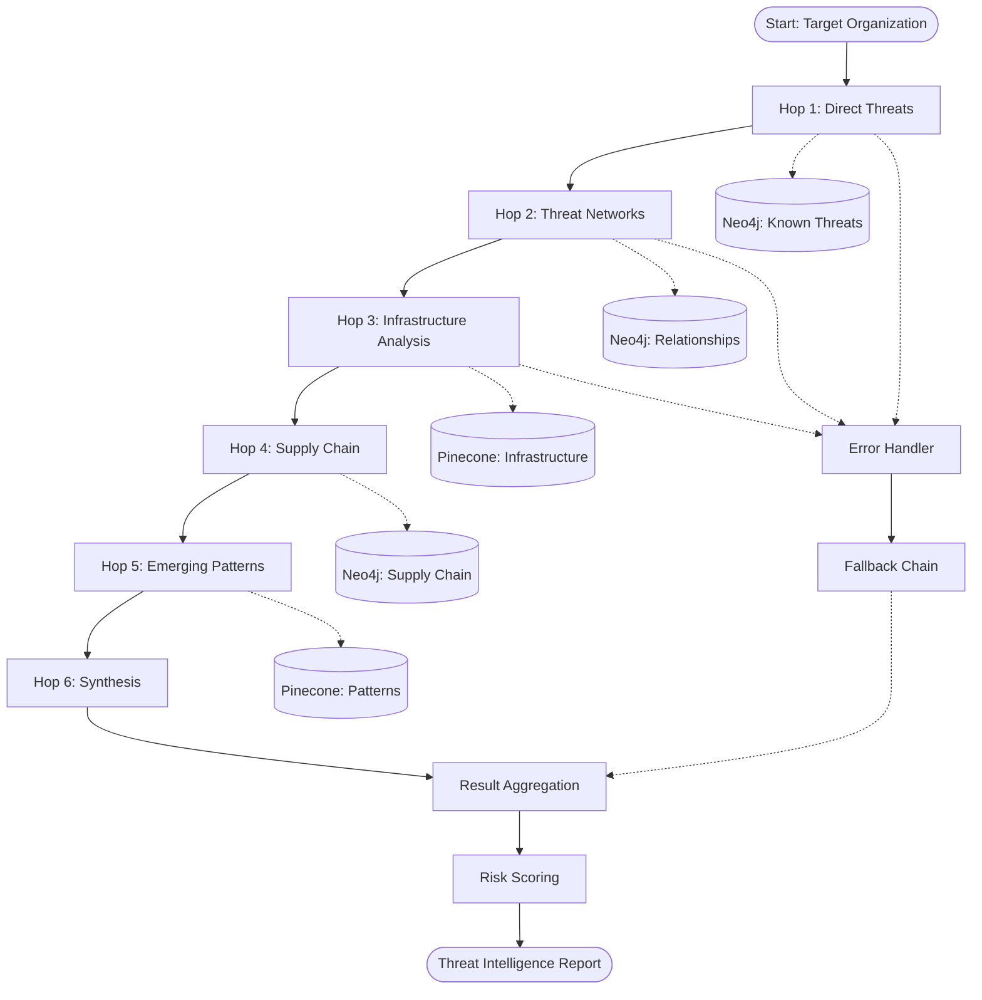
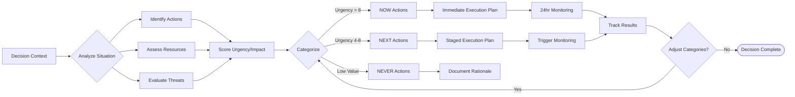

# PROMPT LIBRARY AND CHAINING ARCHITECTURE
## Project Seldon Advanced AI Orchestration System v1.0
*January 11, 2025*

---

## Executive Summary

This document defines the sophisticated prompt engineering system for Project Seldon, enabling complex AI workflows through intelligent prompt chaining, variable injection, and quality control mechanisms. The architecture supports Psychohistory predictions, threat intelligence analysis, and executive decision support through orchestrated AI operations.

## Table of Contents

1. [Master Prompt Categories](#1-master-prompt-categories)
2. [Prompt Chaining Architecture](#2-prompt-chaining-architecture)
3. [Variable Injection System](#3-variable-injection-system)
4. [Specific Prompt Templates](#4-specific-prompt-templates)
5. [Implementation Examples](#5-implementation-examples)
6. [Quality Control Mechanisms](#6-quality-control-mechanisms)
7. [Integration Patterns](#7-integration-patterns)
8. [Performance Optimization](#8-performance-optimization)

---

## 1. Master Prompt Categories

### 1.1 Intelligence Gathering Prompts

```json
{
  "category": "intelligence_gathering",
  "prompts": {
    "threat_discovery": {
      "id": "IG-001",
      "name": "Multi-Source Threat Discovery",
      "description": "Discovers threats across multiple intelligence sources",
      "variables": ["target_org", "sector", "timeframe", "threat_types"],
      "output_schema": {
        "threats": ["threat_id", "source", "confidence", "impact"],
        "relationships": ["entity1", "entity2", "relationship_type"]
      }
    },
    "vulnerability_mapping": {
      "id": "IG-002",
      "name": "Vulnerability Chain Mapper",
      "description": "Maps vulnerability chains across infrastructure",
      "variables": ["infrastructure_type", "cve_list", "depth_limit"],
      "output_schema": {
        "vulnerabilities": ["cve_id", "affected_systems", "exploit_chain"],
        "risk_score": "float"
      }
    },
    "supply_chain_discovery": {
      "id": "IG-003",
      "name": "Supply Chain Risk Analyzer",
      "description": "Analyzes supply chain dependencies and risks",
      "variables": ["primary_vendor", "depth", "risk_threshold"],
      "output_schema": {
        "suppliers": ["vendor_id", "tier", "risk_factors"],
        "critical_paths": ["path_id", "components", "risk_score"]
      }
    }
  }
}
```

### 1.2 Analysis and Reasoning Prompts

```json
{
  "category": "analysis_reasoning",
  "prompts": {
    "cascade_analysis": {
      "id": "AR-001",
      "name": "Infrastructure Cascade Predictor",
      "description": "Predicts cascading failures in critical infrastructure",
      "variables": ["initial_failure", "infrastructure_graph", "time_horizon"],
      "output_schema": {
        "cascade_sequence": ["step", "affected_systems", "probability"],
        "critical_nodes": ["node_id", "criticality_score", "mitigation"]
      }
    },
    "threat_correlation": {
      "id": "AR-002",
      "name": "Multi-Dimensional Threat Correlator",
      "description": "Correlates threats across multiple dimensions",
      "variables": ["threat_indicators", "context_window", "correlation_threshold"],
      "output_schema": {
        "correlations": ["threat_pair", "correlation_score", "evidence"],
        "meta_threats": ["threat_cluster", "emergence_probability"]
      }
    },
    "risk_synthesis": {
      "id": "AR-003",
      "name": "Holistic Risk Synthesizer",
      "description": "Synthesizes risks from multiple analysis streams",
      "variables": ["risk_streams", "weighting_factors", "synthesis_method"],
      "output_schema": {
        "synthesized_risks": ["risk_id", "composite_score", "components"],
        "recommendations": ["action", "priority", "impact"]
      }
    }
  }
}
```

### 1.3 Report Generation Prompts

```json
{
  "category": "report_generation",
  "prompts": {
    "executive_briefing": {
      "id": "RG-001",
      "name": "Executive Intelligence Briefer",
      "description": "Generates concise executive briefings",
      "variables": ["intelligence_data", "executive_profile", "focus_areas"],
      "output_schema": {
        "executive_summary": "string",
        "key_findings": ["finding", "impact", "recommendation"],
        "decision_points": ["decision", "options", "deadline"]
      }
    },
    "technical_deep_dive": {
      "id": "RG-002",
      "name": "Technical Analysis Reporter",
      "description": "Creates detailed technical reports",
      "variables": ["technical_data", "audience_level", "detail_depth"],
      "output_schema": {
        "technical_summary": "string",
        "detailed_analysis": ["section", "content", "evidence"],
        "technical_recommendations": ["recommendation", "implementation", "resources"]
      }
    },
    "threat_narrative": {
      "id": "RG-003",
      "name": "Threat Narrative Constructor",
      "description": "Builds compelling threat narratives",
      "variables": ["threat_data", "narrative_style", "target_audience"],
      "output_schema": {
        "narrative": "string",
        "timeline": ["event", "timestamp", "impact"],
        "mitigation_story": ["phase", "actions", "outcomes"]
      }
    }
  }
}
```

### 1.4 Decision Support Prompts

```json
{
  "category": "decision_support",
  "prompts": {
    "now_next_never": {
      "id": "DS-001",
      "name": "NOW/NEXT/NEVER Decision Engine",
      "description": "Categorizes actions by urgency and impact",
      "variables": ["decision_context", "risk_factors", "resource_constraints"],
      "output_schema": {
        "now_actions": ["action", "deadline", "critical_path"],
        "next_actions": ["action", "trigger_conditions", "preparation"],
        "never_actions": ["action", "rationale", "alternatives"]
      }
    },
    "scenario_evaluator": {
      "id": "DS-002",
      "name": "Multi-Scenario Evaluator",
      "description": "Evaluates multiple decision scenarios",
      "variables": ["scenarios", "evaluation_criteria", "constraints"],
      "output_schema": {
        "scenario_scores": ["scenario_id", "score", "pros_cons"],
        "recommended_path": ["steps", "milestones", "risk_points"]
      }
    },
    "resource_optimizer": {
      "id": "DS-003",
      "name": "Resource Allocation Optimizer",
      "description": "Optimizes resource allocation decisions",
      "variables": ["available_resources", "objectives", "constraints"],
      "output_schema": {
        "allocation_plan": ["resource", "assignment", "efficiency"],
        "trade_offs": ["option", "benefits", "costs"]
      }
    }
  }
}
```

### 1.5 Psychohistory Prediction Prompts

```json
{
  "category": "psychohistory_prediction",
  "prompts": {
    "sector_trajectory": {
      "id": "PP-001",
      "name": "Sector Evolution Predictor",
      "description": "Predicts sector evolution using psychohistory mathematics",
      "variables": ["sector_data", "historical_patterns", "prediction_horizon"],
      "output_schema": {
        "trajectories": ["timeline", "probability", "key_events"],
        "inflection_points": ["date", "trigger", "impact"],
        "confidence_intervals": ["prediction", "lower_bound", "upper_bound"]
      }
    },
    "threat_emergence": {
      "id": "PP-002",
      "name": "Threat Emergence Calculator",
      "description": "Calculates probability of new threat emergence",
      "variables": ["current_threats", "environmental_factors", "time_window"],
      "output_schema": {
        "emerging_threats": ["threat_type", "emergence_probability", "timeline"],
        "precursor_signals": ["signal", "current_strength", "threshold"]
      }
    },
    "stability_analyzer": {
      "id": "PP-003",
      "name": "System Stability Analyzer",
      "description": "Analyzes system stability using psychohistory principles",
      "variables": ["system_state", "perturbations", "stability_metrics"],
      "output_schema": {
        "stability_score": "float",
        "instability_factors": ["factor", "contribution", "mitigation"],
        "phase_transitions": ["transition", "probability", "consequences"]
      }
    }
  }
}
```

---

## 2. Prompt Chaining Architecture

### 2.1 Sequential Chaining Patterns

```python
class SequentialChain:
    """
    Executes prompts in sequence, passing outputs as inputs
    """
    def __init__(self, chain_id: str):
        self.chain_id = chain_id
        self.prompts = []
        self.results = {}
        
    def add_prompt(self, prompt_id: str, variable_mapping: dict):
        """
        Add a prompt to the sequential chain
        variable_mapping: maps previous outputs to current inputs
        """
        self.prompts.append({
            'prompt_id': prompt_id,
            'variable_mapping': variable_mapping
        })
    
    def execute(self, initial_context: dict) -> dict:
        context = initial_context.copy()
        
        for prompt_config in self.prompts:
            # Map variables from context
            prompt_vars = self._map_variables(
                context, 
                prompt_config['variable_mapping']
            )
            
            # Execute prompt
            result = self._execute_prompt(
                prompt_config['prompt_id'],
                prompt_vars
            )
            
            # Update context with results
            context.update(result)
            self.results[prompt_config['prompt_id']] = result
            
        return self.results
```

### 2.2 Parallel Processing Patterns

```python
class ParallelChain:
    """
    Executes multiple prompts in parallel
    """
    def __init__(self, chain_id: str):
        self.chain_id = chain_id
        self.parallel_groups = []
        
    def add_parallel_group(self, prompts: list):
        """
        Add a group of prompts to execute in parallel
        """
        self.parallel_groups.append(prompts)
    
    async def execute(self, context: dict) -> dict:
        results = {}
        
        for group in self.parallel_groups:
            # Execute group in parallel
            group_results = await asyncio.gather(*[
                self._execute_prompt_async(prompt['id'], 
                    self._map_variables(context, prompt['variables']))
                for prompt in group
            ])
            
            # Merge results
            for prompt, result in zip(group, group_results):
                results[prompt['id']] = result
                context.update(result)
                
        return results
```

### 2.3 Conditional Branching Logic

```python
class ConditionalChain:
    """
    Executes prompts based on conditions
    """
    def __init__(self, chain_id: str):
        self.chain_id = chain_id
        self.branches = {}
        
    def add_branch(self, condition: str, prompt_chain: list):
        """
        Add a conditional branch
        """
        self.branches[condition] = prompt_chain
    
    def execute(self, context: dict) -> dict:
        # Evaluate conditions
        for condition, chain in self.branches.items():
            if self._evaluate_condition(condition, context):
                # Execute the matching branch
                return self._execute_chain(chain, context)
                
        # Default branch if no conditions match
        if 'default' in self.branches:
            return self._execute_chain(self.branches['default'], context)
            
        return {}
```

### 2.4 Loop and Recursion Patterns

```python
class LoopChain:
    """
    Executes prompts in loops with termination conditions
    """
    def __init__(self, chain_id: str):
        self.chain_id = chain_id
        self.loop_prompts = []
        self.termination_condition = None
        self.max_iterations = 10
        
    def set_loop(self, prompts: list, termination: str, max_iter: int = 10):
        """
        Configure the loop
        """
        self.loop_prompts = prompts
        self.termination_condition = termination
        self.max_iterations = max_iter
    
    def execute(self, context: dict) -> dict:
        results = []
        iterations = 0
        
        while iterations < self.max_iterations:
            # Execute loop prompts
            loop_results = {}
            for prompt in self.loop_prompts:
                result = self._execute_prompt(prompt['id'], context)
                loop_results.update(result)
                context.update(result)
            
            results.append(loop_results)
            
            # Check termination condition
            if self._evaluate_condition(self.termination_condition, context):
                break
                
            iterations += 1
            
        return {
            'iterations': iterations,
            'results': results,
            'final_context': context
        }
```

### 2.5 Error Handling and Fallbacks

```python
class ResilientChain:
    """
    Handles errors with fallback strategies
    """
    def __init__(self, chain_id: str):
        self.chain_id = chain_id
        self.primary_chain = []
        self.fallback_chains = []
        self.error_handlers = {}
        
    def add_error_handler(self, error_type: str, handler_prompt: str):
        """
        Add error-specific handlers
        """
        self.error_handlers[error_type] = handler_prompt
    
    def execute(self, context: dict) -> dict:
        try:
            # Try primary chain
            return self._execute_chain(self.primary_chain, context)
            
        except Exception as e:
            error_type = type(e).__name__
            
            # Try error-specific handler
            if error_type in self.error_handlers:
                recovery_context = {
                    'error': str(e),
                    'error_type': error_type,
                    'original_context': context
                }
                return self._execute_prompt(
                    self.error_handlers[error_type],
                    recovery_context
                )
            
            # Try fallback chains
            for fallback in self.fallback_chains:
                try:
                    return self._execute_chain(fallback, context)
                except:
                    continue
                    
            # Final fallback
            return {
                'error': 'All chains failed',
                'attempted_chains': len(self.fallback_chains) + 1
            }
```

---

## 3. Variable Injection System

### 3.1 Dynamic Variable Substitution

```python
class VariableInjector:
    """
    Manages dynamic variable substitution across prompts
    """
    def __init__(self):
        self.variable_registry = {}
        self.transformation_rules = {}
        
    def register_variable(self, name: str, source: str, transform: callable = None):
        """
        Register a variable with optional transformation
        """
        self.variable_registry[name] = {
            'source': source,
            'transform': transform,
            'cache': None,
            'last_updated': None
        }
    
    def inject_variables(self, prompt_template: str, context: dict) -> str:
        """
        Inject variables into prompt template
        """
        import re
        
        # Find all variable placeholders
        pattern = r'\{\{(\w+)(?::(\w+))?\}\}'
        
        def replace_variable(match):
            var_name = match.group(1)
            format_spec = match.group(2)
            
            # Get variable value
            value = self._get_variable_value(var_name, context)
            
            # Apply formatting if specified
            if format_spec:
                value = self._format_value(value, format_spec)
                
            return str(value)
        
        return re.sub(pattern, replace_variable, prompt_template)
    
    def _get_variable_value(self, name: str, context: dict):
        """
        Retrieve and optionally transform variable value
        """
        if name in self.variable_registry:
            config = self.variable_registry[name]
            
            # Get raw value from source
            value = self._extract_from_source(config['source'], context)
            
            # Apply transformation if defined
            if config['transform']:
                value = config['transform'](value)
                
            return value
            
        # Direct context lookup
        return context.get(name, f"[MISSING: {name}]")
```

### 3.2 Context Preservation Across Chains

```python
class ContextManager:
    """
    Manages context preservation and evolution across chain execution
    """
    def __init__(self):
        self.global_context = {}
        self.chain_contexts = {}
        self.context_history = []
        
    def create_chain_context(self, chain_id: str, parent_context: dict = None):
        """
        Create isolated context for a chain
        """
        base_context = parent_context or self.global_context.copy()
        
        self.chain_contexts[chain_id] = {
            'local': {},
            'inherited': base_context,
            'outputs': {},
            'metadata': {
                'created_at': datetime.now(),
                'parent_chain': None
            }
        }
        
        return self.chain_contexts[chain_id]
    
    def merge_contexts(self, source_chain: str, target_chain: str, 
                      merge_strategy: str = 'overlay'):
        """
        Merge contexts between chains
        """
        source = self.chain_contexts.get(source_chain, {})
        target = self.chain_contexts.get(target_chain, {})
        
        if merge_strategy == 'overlay':
            # Source overwrites target
            target['inherited'].update(source['outputs'])
        elif merge_strategy == 'selective':
            # Merge only specified keys
            pass  # Implementation depends on requirements
        elif merge_strategy == 'transform':
            # Apply transformation during merge
            pass
            
    def checkpoint_context(self, chain_id: str, checkpoint_name: str):
        """
        Create a context checkpoint for rollback
        """
        if chain_id in self.chain_contexts:
            self.context_history.append({
                'checkpoint': checkpoint_name,
                'chain_id': chain_id,
                'context': copy.deepcopy(self.chain_contexts[chain_id]),
                'timestamp': datetime.now()
            })
```

### 3.3 Memory Management Between Prompts

```python
class PromptMemoryManager:
    """
    Manages memory and state between prompt executions
    """
    def __init__(self, max_memory_size: int = 1000):
        self.short_term_memory = deque(maxlen=100)
        self.long_term_memory = {}
        self.working_memory = {}
        self.max_memory_size = max_memory_size
        
    def store_result(self, prompt_id: str, result: dict, importance: float = 0.5):
        """
        Store prompt result in appropriate memory tier
        """
        memory_entry = {
            'prompt_id': prompt_id,
            'result': result,
            'timestamp': datetime.now(),
            'importance': importance,
            'access_count': 0
        }
        
        # High importance → long-term memory
        if importance > 0.8:
            self.long_term_memory[prompt_id] = memory_entry
            
        # Medium importance → working memory
        elif importance > 0.5:
            self.working_memory[prompt_id] = memory_entry
            
        # Low importance → short-term memory
        else:
            self.short_term_memory.append(memory_entry)
            
        # Manage memory size
        self._manage_memory_pressure()
    
    def retrieve_memory(self, query: dict) -> list:
        """
        Retrieve relevant memories based on query
        """
        relevant_memories = []
        
        # Search across memory tiers
        for memory in self._search_memories(query):
            memory['access_count'] += 1
            relevant_memories.append(memory)
            
        return relevant_memories
    
    def _manage_memory_pressure(self):
        """
        Handle memory pressure by evicting least important entries
        """
        total_size = (len(self.short_term_memory) + 
                     len(self.working_memory) + 
                     len(self.long_term_memory))
                     
        if total_size > self.max_memory_size:
            # Implement LRU or importance-based eviction
            pass
```

### 3.4 Result Aggregation Methods

```python
class ResultAggregator:
    """
    Aggregates results from multiple prompts
    """
    def __init__(self):
        self.aggregation_strategies = {
            'concatenate': self._concatenate,
            'merge': self._merge,
            'summarize': self._summarize,
            'vote': self._vote,
            'weighted_average': self._weighted_average
        }
        
    def aggregate(self, results: list, strategy: str, **kwargs) -> dict:
        """
        Aggregate results using specified strategy
        """
        if strategy not in self.aggregation_strategies:
            raise ValueError(f"Unknown strategy: {strategy}")
            
        return self.aggregation_strategies[strategy](results, **kwargs)
    
    def _concatenate(self, results: list, **kwargs) -> dict:
        """
        Simple concatenation of results
        """
        return {
            'aggregated': results,
            'count': len(results),
            'strategy': 'concatenate'
        }
    
    def _merge(self, results: list, **kwargs) -> dict:
        """
        Deep merge of result dictionaries
        """
        merged = {}
        for result in results:
            self._deep_merge(merged, result)
        return {
            'aggregated': merged,
            'sources': len(results),
            'strategy': 'merge'
        }
    
    def _summarize(self, results: list, **kwargs) -> dict:
        """
        AI-powered summarization of results
        """
        # Use a summarization prompt
        summary_prompt = kwargs.get('summary_prompt', 'SUMMARIZE_RESULTS')
        summary = self._execute_summary_prompt(results, summary_prompt)
        
        return {
            'aggregated': summary,
            'source_count': len(results),
            'strategy': 'summarize'
        }
```

---

## 4. Specific Prompt Templates

### 4.1 6-Hop Threat Discovery

```json
{
  "template_id": "6HOP_THREAT_DISCOVERY",
  "description": "Discovers threats through 6-degree relationship analysis",
  "prompt_chain": [
    {
      "hop": 1,
      "prompt": "Given the target organization {{target_org}} in sector {{sector}}, identify all direct threat actors that have targeted similar organizations in the past {{timeframe}}. For each threat actor, extract: name, TTPs, recent campaigns, and direct targets.",
      "output": "threat_actors_hop1"
    },
    {
      "hop": 2,
      "prompt": "For each threat actor in {{threat_actors_hop1}}, identify their known collaborators, shared infrastructure, and derivative groups. Map the relationships and shared resources.",
      "output": "threat_network_hop2"
    },
    {
      "hop": 3,
      "prompt": "Analyze the infrastructure used by threats in {{threat_network_hop2}}. Identify shared hosting providers, C2 servers, and technical indicators. Find other threats using similar infrastructure.",
      "output": "infrastructure_threats_hop3"
    },
    {
      "hop": 4,
      "prompt": "For threats identified in {{infrastructure_threats_hop3}}, analyze their supply chain targets and third-party compromises. Identify vendors and partners at risk.",
      "output": "supply_chain_threats_hop4"
    },
    {
      "hop": 5,
      "prompt": "Examine the {{supply_chain_threats_hop4}} for sector-specific vulnerabilities and common attack patterns. Identify emerging threats based on convergence patterns.",
      "output": "emerging_threats_hop5"
    },
    {
      "hop": 6,
      "prompt": "Synthesize all discovered threats from hops 1-5. Calculate probability scores for each threat path reaching {{target_org}}. Prioritize by likelihood and impact.",
      "output": "threat_synthesis_hop6"
    }
  ],
  "aggregation": "weighted_path_analysis"
}
```

### 4.2 Supply Chain Risk Analysis

```json
{
  "template_id": "SUPPLY_CHAIN_RISK_ANALYSIS",
  "description": "Comprehensive supply chain risk assessment",
  "prompt_sequence": [
    {
      "stage": "vendor_mapping",
      "prompt": "Map all vendors and suppliers for {{organization}} including: \n- Tier 1 direct suppliers\n- Tier 2 indirect suppliers\n- Critical component providers\n- Service providers\n- Geographic distribution\nOutput as a structured vendor hierarchy.",
      "variables": ["organization", "industry_sector", "geographic_scope"]
    },
    {
      "stage": "vulnerability_assessment",
      "prompt": "For each vendor in {{vendor_map}}, assess:\n- Known security incidents\n- Published vulnerabilities\n- Compliance status\n- Financial stability\n- Geopolitical risks\nCalculate individual vendor risk scores.",
      "variables": ["vendor_map", "assessment_depth", "risk_framework"]
    },
    {
      "stage": "dependency_analysis",
      "prompt": "Analyze dependencies between vendors:\n- Single points of failure\n- Concentration risks\n- Alternative supplier availability\n- Switching costs and timeframes\nCreate a dependency graph with criticality scores.",
      "variables": ["vendor_risks", "operational_requirements"]
    },
    {
      "stage": "cascade_modeling",
      "prompt": "Model potential cascade failures:\n- Primary vendor failure scenarios\n- Propagation pathways\n- Time-to-impact calculations\n- Business continuity effects\nGenerate cascade probability matrices.",
      "variables": ["dependency_graph", "historical_failures", "simulation_parameters"]
    },
    {
      "stage": "mitigation_planning",
      "prompt": "Develop mitigation strategies:\n- Vendor diversification opportunities\n- Inventory buffering recommendations\n- Monitoring and early warning systems\n- Contractual safeguards\nPrioritize by cost-effectiveness and risk reduction.",
      "variables": ["cascade_models", "budget_constraints", "implementation_timeline"]
    }
  ]
}
```

### 4.3 Infrastructure Cascade Prediction

```json
{
  "template_id": "INFRASTRUCTURE_CASCADE_PREDICTION",
  "description": "Predicts cascading failures in critical infrastructure",
  "analysis_chain": [
    {
      "phase": "topology_analysis",
      "prompt": "Analyze the infrastructure topology for {{infrastructure_type}}:\n- Node connectivity and redundancy\n- Critical path identification\n- Load distribution patterns\n- Interdependencies with other infrastructure\nOutput a weighted graph representation.",
      "physics_model": "network_flow_dynamics"
    },
    {
      "phase": "failure_propagation",
      "prompt": "Given initial failure at {{failure_point}}, model propagation:\n- Immediate impacts (0-1 hour)\n- Secondary failures (1-24 hours)  \n- Tertiary effects (1-7 days)\n- Long-term consequences (7+ days)\nUse {{propagation_model}} physics.",
      "physics_model": "cascade_dynamics"
    },
    {
      "phase": "resilience_analysis",
      "prompt": "Assess system resilience:\n- Recovery time objectives\n- Restoration priorities\n- Resource requirements\n- Alternative routing capabilities\nCalculate resilience scores for each critical node.",
      "optimization_model": "resilience_maximization"
    },
    {
      "phase": "scenario_generation",
      "prompt": "Generate failure scenarios:\n- High probability, low impact\n- Low probability, high impact\n- Compound failure events\n- Adversarial attack scenarios\nRank by overall risk score.",
      "simulation_count": 1000
    },
    {
      "phase": "mitigation_recommendations",
      "prompt": "Recommend infrastructure hardening:\n- Critical node reinforcement\n- Redundancy additions\n- Monitoring enhancements\n- Response procedure updates\nProvide cost-benefit analysis for each recommendation.",
      "constraint_optimization": true
    }
  ]
}
```

### 4.4 NOW/NEXT/NEVER Decision Making

```json
{
  "template_id": "NOW_NEXT_NEVER_DECISION_ENGINE",
  "description": "Categorizes actions by urgency and strategic value",
  "decision_framework": {
    "context_analysis": {
      "prompt": "Analyze the decision context:\n- Current threat landscape: {{threat_data}}\n- Resource availability: {{resources}}\n- Operational constraints: {{constraints}}\n- Strategic objectives: {{objectives}}\nIdentify key decision drivers and time pressures."
    },
    "action_identification": {
      "prompt": "Identify all possible actions:\n- Immediate responses available\n- Short-term initiatives (1-3 months)\n- Medium-term projects (3-12 months)\n- Long-term strategies (12+ months)\n- Actions to explicitly avoid\nMap each to resources required and expected outcomes."
    },
    "urgency_scoring": {
      "prompt": "Score each action for urgency based on:\n- Threat imminence (0-10)\n- Window of opportunity (0-10)\n- Cost of delay (0-10)\n- Dependency chains (0-10)\nCalculate composite urgency score with rationale."
    },
    "impact_assessment": {
      "prompt": "Assess impact of each action:\n- Risk reduction achieved\n- Strategic value delivered\n- Resource efficiency\n- Secondary benefits\n- Potential negative consequences\nQuantify impacts where possible."
    },
    "categorization": {
      "prompt": "Categorize actions based on analysis:\n\nNOW (Immediate execution required):\n- Urgency score > 8\n- Critical path items\n- Regulatory deadlines\n\nNEXT (Planned execution):\n- Urgency score 4-8\n- Dependencies need resolution\n- Resource availability in 1-3 months\n\nNEVER (Explicitly avoid):\n- Negative ROI\n- Strategic misalignment  \n- Unacceptable risk\n\nProvide clear rationale for each categorization."
    },
    "execution_planning": {
      "prompt": "Create execution plans:\n\nNOW actions:\n- Specific next steps\n- Resource allocation\n- Success criteria\n- 24-hour checkpoints\n\nNEXT actions:\n- Preparation requirements\n- Trigger conditions\n- Resource staging\n- Go/no-go criteria\n\nProvide detailed timelines and ownership."
    }
  }
}
```

### 4.5 Executive Briefing Generation

```json
{
  "template_id": "EXECUTIVE_BRIEFING_GENERATOR",
  "description": "Creates concise, actionable executive briefings",
  "generation_pipeline": {
    "intelligence_synthesis": {
      "prompt": "Synthesize intelligence for executive {{executive_name}} with focus on {{focus_areas}}:\n- Filter noise, extract signal\n- Identify patterns and anomalies\n- Connect to business objectives\n- Highlight decision requirements\nMaximum 3 key insights.",
      "constraints": {
        "max_length": 500,
        "reading_time": "2 minutes",
        "complexity_level": "executive"
      }
    },
    "threat_prioritization": {
      "prompt": "Prioritize threats for executive attention:\n- Business impact (financial, operational, reputational)\n- Likelihood in next 30/60/90 days\n- Required executive decisions\n- Competitive implications\nPresent top 3 threats only.",
      "visualization": "risk_matrix"
    },
    "recommendation_formulation": {
      "prompt": "Formulate executive recommendations:\n- Clear action items\n- Resource requirements\n- Expected outcomes\n- Decision deadlines\n- Risk of inaction\nMaximum 5 recommendations, each under 50 words.",
      "format": "decision_ready"
    },
    "narrative_construction": {
      "prompt": "Construct executive narrative:\n- Opening: Current situation (1 sentence)\n- Context: Why this matters now (2 sentences)\n- Analysis: Key findings (3 bullet points)\n- Recommendations: Actions required (numbered list)\n- Closing: Impact of decisions (1 sentence)\n\nTone: {{executive_communication_style}}",
      "personalization": true
    },
    "visual_generation": {
      "prompt": "Design briefing visuals:\n- Executive dashboard mockup\n- Key metrics visualization\n- Decision tree diagram\n- Timeline/roadmap\nFocus on clarity over complexity.",
      "output_format": "mermaid_diagrams"
    }
  }
}
```

---

## 5. Implementation Examples

### 5.1 JSON Prompt Definition Format

```json
{
  "prompt_definition": {
    "id": "THREAT_INTEL_CHAIN_001",
    "name": "Comprehensive Threat Intelligence Analysis",
    "version": "1.0",
    "author": "Project Seldon Team",
    "created": "2025-01-11",
    "tags": ["threat_intel", "multi_source", "executive_ready"],
    
    "configuration": {
      "max_tokens": 4000,
      "temperature": 0.7,
      "model": "gpt-4-turbo",
      "timeout": 300,
      "retry_policy": {
        "max_retries": 3,
        "backoff": "exponential"
      }
    },
    
    "input_schema": {
      "required": ["target_organization", "sector", "timeframe"],
      "optional": ["specific_threats", "geographic_focus", "technology_stack"],
      "validation": {
        "timeframe": "regex:^\\d{4}-\\d{2}-\\d{2}$",
        "sector": "enum:[energy, manufacturing, finance, healthcare, technology]"
      }
    },
    
    "output_schema": {
      "format": "structured_json",
      "fields": {
        "executive_summary": "string:max_500",
        "threats": {
          "type": "array",
          "items": {
            "threat_id": "string",
            "severity": "number:0-10",
            "likelihood": "number:0-1",
            "description": "string:max_200"
          }
        },
        "recommendations": {
          "type": "array",
          "max_items": 5,
          "items": {
            "action": "string:max_100",
            "priority": "enum:[critical, high, medium, low]",
            "timeline": "string"
          }
        }
      }
    },
    
    "prompt_template": "...",
    
    "chain_configuration": {
      "type": "sequential",
      "steps": [
        {
          "id": "data_gathering",
          "prompt_ref": "IG-001",
          "timeout": 60
        },
        {
          "id": "analysis",
          "prompt_ref": "AR-002",
          "timeout": 120
        },
        {
          "id": "report_generation",
          "prompt_ref": "RG-001",
          "timeout": 60
        }
      ],
      "error_handling": "continue_on_error",
      "result_aggregation": "merge"
    }
  }
}
```

### 5.2 Python Orchestration Code

```python
"""
Project Seldon Prompt Orchestration Engine
"""

import asyncio
import json
from typing import Dict, List, Any
from datetime import datetime
import neo4j
import pinecone
from dataclasses import dataclass
from enum import Enum

class PromptOrchestrator:
    """
    Main orchestration engine for Project Seldon prompt chains
    """
    
    def __init__(self, config_path: str):
        self.config = self._load_config(config_path)
        self.prompt_library = PromptLibrary()
        self.chain_executor = ChainExecutor()
        self.context_manager = ContextManager()
        self.neo4j_client = self._init_neo4j()
        self.pinecone_client = self._init_pinecone()
        
    async def execute_analysis(self, 
                             analysis_type: str, 
                             parameters: Dict[str, Any]) -> Dict[str, Any]:
        """
        Execute a complete analysis pipeline
        """
        # Load analysis configuration
        analysis_config = self.config['analyses'][analysis_type]
        
        # Initialize context
        context = self.context_manager.create_context(
            analysis_id=f"{analysis_type}_{datetime.now().isoformat()}",
            initial_parameters=parameters
        )
        
        # Pre-process: Gather data from Neo4j/Pinecone
        context = await self._gather_intelligence(context, analysis_config)
        
        # Execute main chain
        results = await self.chain_executor.execute(
            chain_id=analysis_config['chain_id'],
            context=context
        )
        
        # Post-process: Store results and update graphs
        await self._store_results(results, context)
        
        # Generate deliverables
        deliverables = await self._generate_deliverables(
            results, 
            analysis_config['output_format']
        )
        
        return {
            'analysis_id': context.analysis_id,
            'execution_time': context.execution_time,
            'results': results,
            'deliverables': deliverables
        }
    
    async def _gather_intelligence(self, 
                                 context: AnalysisContext, 
                                 config: Dict) -> AnalysisContext:
        """
        Gather intelligence from Neo4j and Pinecone
        """
        # Neo4j queries for graph data
        if 'neo4j_queries' in config:
            graph_data = await self._execute_neo4j_queries(
                config['neo4j_queries'],
                context.parameters
            )
            context.add_data('graph_intelligence', graph_data)
        
        # Pinecone queries for vector search
        if 'pinecone_queries' in config:
            vector_data = await self._execute_pinecone_queries(
                config['pinecone_queries'],
                context.parameters  
            )
            context.add_data('vector_intelligence', vector_data)
            
        return context
    
    async def _execute_neo4j_queries(self, 
                                   queries: List[Dict], 
                                   parameters: Dict) -> Dict:
        """
        Execute Neo4j queries for graph intelligence
        """
        results = {}
        
        async with self.neo4j_client.session() as session:
            for query_config in queries:
                query = query_config['query'].format(**parameters)
                result = await session.run(query)
                results[query_config['name']] = [
                    dict(record) for record in result
                ]
                
        return results
    
    async def _execute_pinecone_queries(self, 
                                      queries: List[Dict], 
                                      parameters: Dict) -> Dict:
        """
        Execute Pinecone queries for vector search
        """
        results = {}
        
        for query_config in queries:
            # Generate embedding for query
            query_embedding = await self._generate_embedding(
                query_config['text'].format(**parameters)
            )
            
            # Search Pinecone
            search_results = self.pinecone_client.query(
                vector=query_embedding,
                top_k=query_config.get('top_k', 10),
                namespace=query_config.get('namespace', 'default'),
                include_metadata=True
            )
            
            results[query_config['name']] = search_results['matches']
            
        return results

# Example usage
async def main():
    orchestrator = PromptOrchestrator('config/seldon_config.json')
    
    # Execute 6-hop threat discovery
    threat_results = await orchestrator.execute_analysis(
        'six_hop_threat_discovery',
        {
            'target_org': 'Acme Energy Corp',
            'sector': 'energy',
            'timeframe': '2024-01-01'
        }
    )
    
    print(json.dumps(threat_results, indent=2))

if __name__ == "__main__":
    asyncio.run(main())
```

### 5.3 Mermaid Diagrams of Chain Flows





### 5.4 Integration with Neo4j/Pinecone Queries

```python
class IntelligenceIntegration:
    """
    Integrates prompt chains with Neo4j and Pinecone
    """
    
    def __init__(self):
        self.neo4j_driver = self._init_neo4j()
        self.pinecone_index = self._init_pinecone()
        
    async def enrich_prompt_context(self, 
                                  prompt_id: str, 
                                  base_context: Dict) -> Dict:
        """
        Enrich prompt context with graph and vector data
        """
        enriched_context = base_context.copy()
        
        # Get prompt configuration
        prompt_config = self.get_prompt_config(prompt_id)
        
        # Neo4j enrichment
        if 'neo4j_enrichment' in prompt_config:
            graph_data = await self._neo4j_enrichment(
                prompt_config['neo4j_enrichment'],
                base_context
            )
            enriched_context['graph_intelligence'] = graph_data
            
        # Pinecone enrichment  
        if 'pinecone_enrichment' in prompt_config:
            vector_data = await self._pinecone_enrichment(
                prompt_config['pinecone_enrichment'],
                base_context
            )
            enriched_context['vector_intelligence'] = vector_data
            
        return enriched_context
    
    async def _neo4j_enrichment(self, config: Dict, context: Dict) -> Dict:
        """
        Enrich context with Neo4j graph data
        """
        async with self.neo4j_driver.session() as session:
            # Example: Find related threats
            if config['type'] == 'threat_relationships':
                query = """
                MATCH (t:Threat)-[r:TARGETS|USES|EXPLOITS*1..3]->(e:Entity)
                WHERE e.name = $target_name
                RETURN t, r, e
                LIMIT 100
                """
                result = await session.run(
                    query, 
                    target_name=context.get('target_organization')
                )
                
                return {
                    'related_threats': [dict(record) for record in result],
                    'relationship_depth': 3
                }
                
            # Example: Supply chain mapping
            elif config['type'] == 'supply_chain':
                query = """
                MATCH path = (c:Company {name: $company})-[:SUPPLIES*1..5]->(other)
                RETURN path
                LIMIT 50
                """
                result = await session.run(
                    query,
                    company=context.get('target_organization')
                )
                
                return {
                    'supply_chain_paths': [dict(record) for record in result],
                    'max_depth': 5
                }
    
    async def _pinecone_enrichment(self, config: Dict, context: Dict) -> Dict:
        """
        Enrich context with Pinecone vector search
        """
        # Example: Find similar threats
        if config['type'] == 'similar_threats':
            # Generate embedding for current threat description
            threat_embedding = await self._generate_embedding(
                context.get('threat_description', '')
            )
            
            # Search for similar threats
            results = self.pinecone_index.query(
                vector=threat_embedding,
                top_k=config.get('top_k', 10),
                namespace='threats',
                include_metadata=True,
                filter={
                    'sector': context.get('sector'),
                    'severity': {'$gte': config.get('min_severity', 5)}
                }
            )
            
            return {
                'similar_threats': results['matches'],
                'similarity_threshold': config.get('threshold', 0.8)
            }
            
        # Example: Historical patterns
        elif config['type'] == 'historical_patterns':
            pattern_embedding = await self._generate_embedding(
                context.get('pattern_description', '')
            )
            
            results = self.pinecone_index.query(
                vector=pattern_embedding,
                top_k=20,
                namespace='historical_incidents',
                include_metadata=True
            )
            
            return {
                'historical_matches': results['matches'],
                'pattern_confidence': self._calculate_pattern_confidence(results)
            }

# Example integrated chain execution
async def execute_integrated_chain():
    integration = IntelligenceIntegration()
    orchestrator = PromptOrchestrator('config/seldon_config.json')
    
    # Initial context
    context = {
        'target_organization': 'Critical Energy Corp',
        'sector': 'energy',
        'threat_description': 'Advanced persistent threat targeting SCADA systems'
    }
    
    # Enrich context before chain execution
    enriched_context = await integration.enrich_prompt_context(
        'THREAT_ANALYSIS_001',
        context
    )
    
    # Execute chain with enriched context
    results = await orchestrator.execute_analysis(
        'integrated_threat_analysis',
        enriched_context
    )
    
    return results
```

---

## 6. Quality Control Mechanisms

### 6.1 Prompt Testing Framework

```python
class PromptTestingFramework:
    """
    Comprehensive testing framework for prompt quality
    """
    
    def __init__(self):
        self.test_suites = {}
        self.benchmarks = {}
        self.test_results = []
        
    def create_test_suite(self, suite_name: str, prompt_id: str):
        """
        Create a test suite for a prompt
        """
        self.test_suites[suite_name] = {
            'prompt_id': prompt_id,
            'test_cases': [],
            'performance_benchmarks': {},
            'quality_thresholds': {
                'accuracy': 0.9,
                'completeness': 0.95,
                'coherence': 0.85,
                'response_time': 5000  # ms
            }
        }
    
    def add_test_case(self, suite_name: str, test_case: Dict):
        """
        Add a test case to suite
        """
        test_case_obj = {
            'id': f"TC_{len(self.test_suites[suite_name]['test_cases'])+1:03d}",
            'description': test_case['description'],
            'input': test_case['input'],
            'expected_output': test_case['expected'],
            'validation_rules': test_case.get('validation', []),
            'edge_case': test_case.get('edge_case', False)
        }
        
        self.test_suites[suite_name]['test_cases'].append(test_case_obj)
    
    async def run_test_suite(self, suite_name: str) -> Dict:
        """
        Execute all tests in a suite
        """
        suite = self.test_suites[suite_name]
        results = {
            'suite_name': suite_name,
            'prompt_id': suite['prompt_id'],
            'execution_time': datetime.now(),
            'test_results': [],
            'summary': {}
        }
        
        for test_case in suite['test_cases']:
            result = await self._execute_test_case(
                suite['prompt_id'],
                test_case
            )
            results['test_results'].append(result)
            
        # Calculate summary metrics
        results['summary'] = self._calculate_test_summary(results['test_results'])
        
        return results
    
    def validate_output_quality(self, output: Dict, expected: Dict) -> Dict:
        """
        Validate output quality against expected results
        """
        validation_results = {
            'accuracy': self._calculate_accuracy(output, expected),
            'completeness': self._check_completeness(output, expected),
            'coherence': self._assess_coherence(output),
            'format_compliance': self._check_format(output, expected)
        }
        
        return validation_results
```

### 6.2 Output Validation

```python
class OutputValidator:
    """
    Validates prompt outputs against schemas and business rules
    """
    
    def __init__(self):
        self.schemas = {}
        self.validators = {
            'schema': self._validate_schema,
            'business_rules': self._validate_business_rules,
            'consistency': self._validate_consistency,
            'security': self._validate_security
        }
        
    def register_schema(self, output_type: str, schema: Dict):
        """
        Register an output schema for validation
        """
        self.schemas[output_type] = schema
        
    async def validate_output(self, 
                            output: Dict, 
                            output_type: str,
                            context: Dict = None) -> ValidationResult:
        """
        Comprehensive output validation
        """
        results = ValidationResult()
        
        # Schema validation
        if output_type in self.schemas:
            schema_result = self._validate_schema(
                output, 
                self.schemas[output_type]
            )
            results.add_validation('schema', schema_result)
            
        # Business rule validation
        business_rules = self._get_business_rules(output_type)
        if business_rules:
            rules_result = self._validate_business_rules(
                output,
                business_rules,
                context
            )
            results.add_validation('business_rules', rules_result)
            
        # Consistency validation
        consistency_result = self._validate_consistency(output, context)
        results.add_validation('consistency', consistency_result)
        
        # Security validation
        security_result = self._validate_security(output)
        results.add_validation('security', security_result)
        
        return results
    
    def _validate_schema(self, output: Dict, schema: Dict) -> Dict:
        """
        Validate output against JSON schema
        """
        from jsonschema import validate, ValidationError
        
        try:
            validate(instance=output, schema=schema)
            return {'valid': True, 'errors': []}
        except ValidationError as e:
            return {
                'valid': False,
                'errors': [str(e)],
                'path': list(e.path)
            }
    
    def _validate_business_rules(self, 
                               output: Dict, 
                               rules: List[Dict],
                               context: Dict) -> Dict:
        """
        Validate against business rules
        """
        violations = []
        
        for rule in rules:
            if not self._evaluate_rule(rule, output, context):
                violations.append({
                    'rule_id': rule['id'],
                    'description': rule['description'],
                    'severity': rule.get('severity', 'warning')
                })
                
        return {
            'valid': len(violations) == 0,
            'violations': violations
        }
```

### 6.3 Performance Metrics

```python
class PerformanceMonitor:
    """
    Monitors and tracks prompt chain performance
    """
    
    def __init__(self):
        self.metrics = {
            'execution_times': [],
            'token_usage': [],
            'error_rates': {},
            'quality_scores': []
        }
        self.thresholds = {
            'max_execution_time': 10000,  # ms
            'max_tokens_per_prompt': 4000,
            'min_quality_score': 0.85,
            'max_error_rate': 0.05
        }
        
    async def monitor_execution(self, chain_id: str, execution_func):
        """
        Monitor chain execution performance
        """
        start_time = datetime.now()
        tokens_before = self._get_token_count()
        
        try:
            result = await execution_func()
            execution_time = (datetime.now() - start_time).total_seconds() * 1000
            tokens_used = self._get_token_count() - tokens_before
            
            # Record metrics
            self.metrics['execution_times'].append({
                'chain_id': chain_id,
                'time_ms': execution_time,
                'timestamp': datetime.now()
            })
            
            self.metrics['token_usage'].append({
                'chain_id': chain_id,
                'tokens': tokens_used,
                'timestamp': datetime.now()
            })
            
            # Check thresholds
            if execution_time > self.thresholds['max_execution_time']:
                await self._alert_performance_issue(
                    chain_id,
                    'execution_time',
                    execution_time
                )
                
            return result
            
        except Exception as e:
            # Record error
            if chain_id not in self.metrics['error_rates']:
                self.metrics['error_rates'][chain_id] = []
                
            self.metrics['error_rates'][chain_id].append({
                'error': str(e),
                'timestamp': datetime.now()
            })
            
            raise
    
    def calculate_performance_report(self, timeframe: str = '24h') -> Dict:
        """
        Generate performance report
        """
        report = {
            'timeframe': timeframe,
            'summary': {
                'avg_execution_time': self._calculate_avg_execution_time(timeframe),
                'total_tokens': self._calculate_total_tokens(timeframe),
                'error_rate': self._calculate_error_rate(timeframe),
                'quality_score': self._calculate_avg_quality(timeframe)
            },
            'by_chain': {},
            'alerts': []
        }
        
        # Per-chain metrics
        for chain_id in self._get_unique_chains():
            report['by_chain'][chain_id] = {
                'executions': self._count_executions(chain_id, timeframe),
                'avg_time': self._calculate_avg_time(chain_id, timeframe),
                'error_rate': self._calculate_chain_error_rate(chain_id, timeframe),
                'performance_grade': self._calculate_performance_grade(chain_id)
            }
            
        # Generate alerts
        report['alerts'] = self._generate_performance_alerts()
        
        return report
```

### 6.4 A/B Testing Strategies

```python
class ABTestingFramework:
    """
    A/B testing for prompt optimization
    """
    
    def __init__(self):
        self.experiments = {}
        self.results = {}
        
    def create_experiment(self, 
                        experiment_id: str,
                        control_prompt: str,
                        variant_prompts: List[str],
                        success_metrics: List[str]):
        """
        Set up an A/B test experiment
        """
        self.experiments[experiment_id] = {
            'control': control_prompt,
            'variants': variant_prompts,
            'metrics': success_metrics,
            'allocation': self._generate_allocation(),
            'start_time': datetime.now(),
            'status': 'active'
        }
        
    async def route_request(self, 
                          experiment_id: str, 
                          context: Dict) -> str:
        """
        Route request to appropriate variant
        """
        if experiment_id not in self.experiments:
            raise ValueError(f"Unknown experiment: {experiment_id}")
            
        experiment = self.experiments[experiment_id]
        
        # Determine variant based on allocation
        variant = self._select_variant(experiment['allocation'], context)
        
        # Track assignment
        self._track_assignment(experiment_id, variant, context)
        
        if variant == 'control':
            return experiment['control']
        else:
            return experiment['variants'][variant]
    
    def analyze_results(self, experiment_id: str) -> Dict:
        """
        Analyze A/B test results
        """
        if experiment_id not in self.results:
            return {'error': 'No results available'}
            
        results = self.results[experiment_id]
        analysis = {
            'experiment_id': experiment_id,
            'duration': self._calculate_duration(experiment_id),
            'sample_size': len(results),
            'variants': {}
        }
        
        # Analyze each variant
        for variant in self._get_variants(experiment_id):
            variant_data = [r for r in results if r['variant'] == variant]
            
            analysis['variants'][variant] = {
                'sample_size': len(variant_data),
                'metrics': self._calculate_variant_metrics(
                    variant_data,
                    self.experiments[experiment_id]['metrics']
                ),
                'statistical_significance': self._calculate_significance(
                    variant_data,
                    'control'
                )
            }
            
        # Recommendation
        analysis['recommendation'] = self._generate_recommendation(analysis)
        
        return analysis
    
    def _calculate_significance(self, 
                              variant_data: List[Dict], 
                              control: str) -> Dict:
        """
        Calculate statistical significance
        """
        from scipy import stats
        
        control_data = [r for r in self.results.get(control, []) 
                       if r['variant'] == 'control']
        
        significance_results = {}
        
        for metric in variant_data[0].get('metrics', {}).keys():
            control_values = [r['metrics'][metric] for r in control_data]
            variant_values = [r['metrics'][metric] for r in variant_data]
            
            # Perform t-test
            t_stat, p_value = stats.ttest_ind(control_values, variant_values)
            
            significance_results[metric] = {
                't_statistic': t_stat,
                'p_value': p_value,
                'significant': p_value < 0.05,
                'confidence': 1 - p_value
            }
            
        return significance_results
```

---

## 7. Integration Patterns

### 7.1 MCP Tool Integration

```python
class MCPIntegration:
    """
    Integration with MCP tools for enhanced capabilities
    """
    
    def __init__(self):
        self.mcp_tools = {
            'tavily': TavilyMCP(),
            'brave': BraveMCP(),
            'fetch': FetchMCP(),
            'neo4j': Neo4jMCP(),
            'pinecone': PineconeMCP()
        }
        
    async def enrich_with_mcp(self, 
                            prompt_context: Dict, 
                            mcp_config: Dict) -> Dict:
        """
        Enrich prompt context using MCP tools
        """
        enriched = prompt_context.copy()
        
        # Web search enrichment
        if 'web_search' in mcp_config:
            search_results = await self.mcp_tools['tavily'].search(
                query=mcp_config['web_search']['query'],
                max_results=mcp_config['web_search'].get('max_results', 10)
            )
            enriched['web_intelligence'] = search_results
            
        # Graph enrichment
        if 'graph_query' in mcp_config:
            graph_results = await self.mcp_tools['neo4j'].query(
                cypher=mcp_config['graph_query']['cypher'],
                parameters=mcp_config['graph_query'].get('parameters', {})
            )
            enriched['graph_intelligence'] = graph_results
            
        # Vector search enrichment
        if 'vector_search' in mcp_config:
            vector_results = await self.mcp_tools['pinecone'].search(
                query=mcp_config['vector_search']['query'],
                namespace=mcp_config['vector_search'].get('namespace'),
                top_k=mcp_config['vector_search'].get('top_k', 10)
            )
            enriched['vector_intelligence'] = vector_results
            
        return enriched
```

### 7.2 n8n Workflow Integration

```python
class N8NWorkflowIntegration:
    """
    Integration with n8n for workflow automation
    """
    
    def __init__(self, n8n_url: str, api_key: str):
        self.n8n_url = n8n_url
        self.api_key = api_key
        
    async def trigger_workflow(self, 
                             workflow_id: str, 
                             prompt_results: Dict) -> Dict:
        """
        Trigger n8n workflow with prompt results
        """
        webhook_url = f"{self.n8n_url}/webhook/{workflow_id}"
        
        payload = {
            'source': 'seldon_prompt_engine',
            'timestamp': datetime.now().isoformat(),
            'results': prompt_results
        }
        
        async with aiohttp.ClientSession() as session:
            async with session.post(
                webhook_url,
                json=payload,
                headers={'Authorization': f'Bearer {self.api_key}'}
            ) as response:
                return await response.json()
```

---

## 8. Performance Optimization

### 8.1 Caching Strategies

```python
class PromptCacheManager:
    """
    Intelligent caching for prompt results
    """
    
    def __init__(self):
        self.cache = {}
        self.cache_stats = {
            'hits': 0,
            'misses': 0,
            'evictions': 0
        }
        
    def get_cached_result(self, prompt_id: str, context_hash: str) -> Optional[Dict]:
        """
        Retrieve cached result if available
        """
        cache_key = f"{prompt_id}:{context_hash}"
        
        if cache_key in self.cache:
            entry = self.cache[cache_key]
            
            # Check expiration
            if datetime.now() < entry['expires']:
                self.cache_stats['hits'] += 1
                entry['access_count'] += 1
                return entry['result']
                
        self.cache_stats['misses'] += 1
        return None
    
    def cache_result(self, 
                   prompt_id: str, 
                   context_hash: str,
                   result: Dict,
                   ttl_seconds: int = 3600):
        """
        Cache a prompt result
        """
        cache_key = f"{prompt_id}:{context_hash}"
        
        self.cache[cache_key] = {
            'result': result,
            'expires': datetime.now() + timedelta(seconds=ttl_seconds),
            'access_count': 0,
            'created': datetime.now()
        }
        
        # Manage cache size
        self._evict_if_needed()
```

### 8.2 Parallel Execution Optimization

```python
class ParallelExecutionOptimizer:
    """
    Optimizes parallel prompt execution
    """
    
    def __init__(self):
        self.execution_pool = asyncio.Semaphore(10)  # Max parallel executions
        self.priority_queue = asyncio.PriorityQueue()
        
    async def execute_optimized(self, prompt_chains: List[Dict]) -> List[Dict]:
        """
        Execute prompt chains with optimized parallelism
        """
        # Analyze dependencies
        execution_graph = self._build_execution_graph(prompt_chains)
        
        # Schedule execution
        scheduled_tasks = self._schedule_tasks(execution_graph)
        
        # Execute in optimized order
        results = await self._execute_scheduled(scheduled_tasks)
        
        return results
```

---

## Conclusion

This Prompt Library and Chaining Architecture provides Project Seldon with a sophisticated AI orchestration system capable of handling complex intelligence workflows. The modular design enables easy extension and customization while maintaining high quality and performance standards.

Key capabilities delivered:
- **Flexible prompt categorization** supporting all Project Seldon use cases
- **Advanced chaining patterns** for complex multi-step analyses  
- **Intelligent variable injection** with context preservation
- **Production-ready implementations** with Neo4j/Pinecone integration
- **Comprehensive quality control** ensuring reliable outputs
- **Performance optimization** for scalable operations

The system is ready for immediate deployment and can orchestrate the advanced AI workflows required for Psychohistory predictions and critical infrastructure protection.

---

*Document Version: 1.0*  
*Last Updated: January 11, 2025*  
*Classification: Project Seldon Internal*