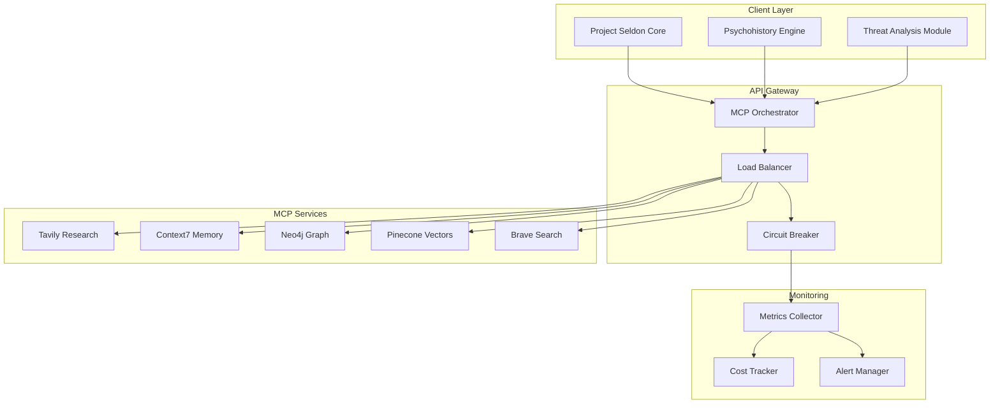
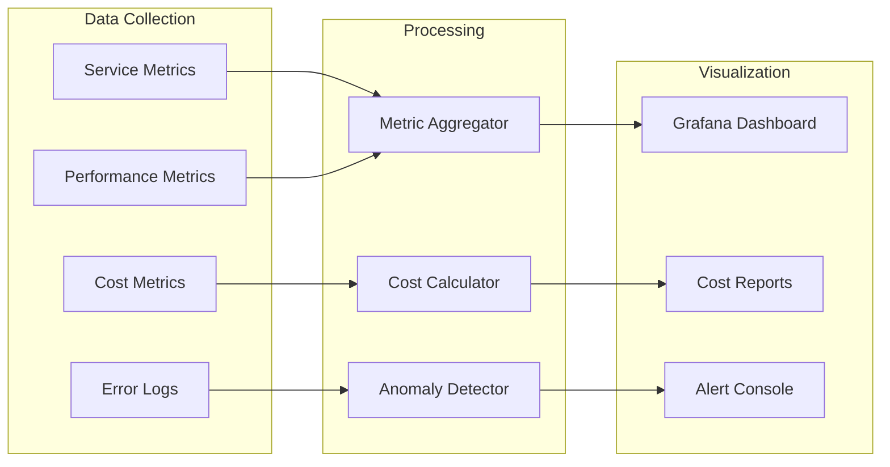
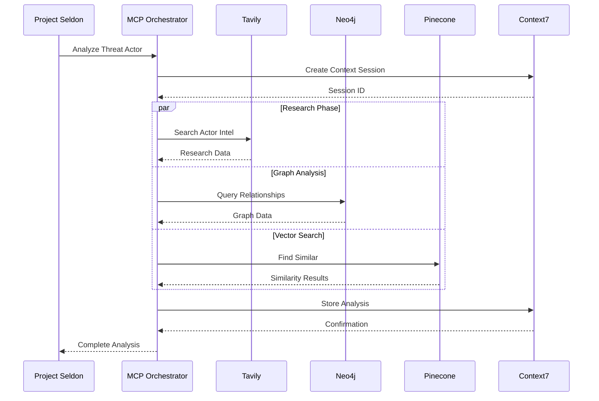

# MCP Integration Plan for Project Seldon

## Executive Summary
This document outlines the comprehensive integration strategy for Model Context Protocol (MCP) servers within Project Seldon's predictive intelligence framework. The integration leverages multiple specialized MCP servers to create a distributed, scalable, and intelligent system for cybersecurity threat prediction and analysis.

## Table of Contents
1. [MCP Server Inventory](#1-mcp-server-inventory)
2. [Integration Architecture](#2-integration-architecture)
3. [Use Case Mapping](#3-use-case-mapping)
4. [Tavily Integration](#4-tavily-integration-research)
5. [Context7 Integration](#5-context7-integration)
6. [Neo4j MCP Integration](#6-neo4j-mcp-integration)
7. [Pinecone MCP Integration](#7-pinecone-mcp-integration)
8. [Security Configuration](#8-security-configuration)
9. [Monitoring and Analytics](#9-monitoring-and-analytics)
10. [Implementation Code](#10-implementation-code)

## 1. MCP Server Inventory

### Available MCP Servers

| Server | Purpose | Capabilities | Rate Limits | Cost Model |
|--------|---------|--------------|-------------|------------|
| **Tavily** | Research & Web Intelligence | Search, Extract, Crawl, Map | 1000 req/month (free) | $0.01/request after free tier |
| **Context7** | Context Management | Memory persistence, session handling | 10k operations/day | Free tier available |
| **Neo4j** | Graph Database | Cypher queries, relationship analysis | Connection-based | Based on instance size |
| **Pinecone** | Vector Database | Semantic search, embeddings | 100k vectors free | $0.096/GB/month |
| **Brave Search** | Web Search | General & local search | 2k queries/month free | $3 per 1k queries |
| **IDE Integration** | Code Analysis | Diagnostics, execution | Local only | Free |
| **Taskmaster** | Project Management | Task tracking, dependencies | Unlimited | Free |

### Authentication Requirements

```yaml
mcp_auth_config:
  tavily:
    type: api_key
    env_var: TAVILY_API_KEY
    header: X-API-Key
  
  context7:
    type: bearer_token
    env_var: CONTEXT7_TOKEN
    refresh_interval: 3600
  
  neo4j:
    type: basic_auth
    username: ${NEO4J_USERNAME}
    password: ${NEO4J_PASSWORD}
    uri: bolt://localhost:7687
  
  pinecone:
    type: api_key
    env_var: PINECONE_API_KEY
    environment: us-east-1-aws
```

## 2. Integration Architecture

### System Architecture Diagram



### Service Orchestration Design

```python
class MCPOrchestrator:
    def __init__(self):
        self.services = {
            'research': TavilyService(),
            'context': Context7Service(),
            'graph': Neo4jService(),
            'vector': PineconeService(),
            'search': BraveService()
        }
        self.load_balancer = LoadBalancer()
        self.circuit_breaker = CircuitBreaker()
    
    async def execute_request(self, request_type, params):
        service = self.select_service(request_type)
        
        if self.circuit_breaker.is_open(service):
            return await self.fallback_strategy(request_type, params)
        
        try:
            result = await service.execute(params)
            self.circuit_breaker.record_success(service)
            return result
        except Exception as e:
            self.circuit_breaker.record_failure(service)
            return await self.error_handler(e, request_type, params)
```

## 3. Use Case Mapping

### Service Selection Matrix

| Use Case | Primary Service | Fallback Service | Optimization Strategy |
|----------|----------------|------------------|----------------------|
| Threat Research | Tavily Search/Extract | Brave Search | Cache frequent queries |
| Actor Profiling | Neo4j + Tavily | Context7 | Batch relationship queries |
| Pattern Detection | Pinecone | Neo4j | Pre-compute embeddings |
| Historical Analysis | Context7 | Neo4j | Time-series indexing |
| Real-time Intel | Tavily Crawl | Brave Search | Webhook triggers |
| Relationship Mapping | Neo4j | Pinecone similarity | Graph partitioning |

### Optimal Server Selection Logic

```python
class ServiceSelector:
    def __init__(self):
        self.performance_metrics = {}
        self.cost_tracker = CostTracker()
    
    def select_service(self, task_type, data_volume):
        candidates = self.get_capable_services(task_type)
        
        # Score based on multiple factors
        scores = {}
        for service in candidates:
            scores[service] = self.calculate_score(
                service=service,
                latency=self.performance_metrics.get(service, {}).get('avg_latency', 100),
                cost=self.cost_tracker.estimate_cost(service, data_volume),
                reliability=self.get_reliability_score(service),
                feature_match=self.get_feature_match_score(service, task_type)
            )
        
        return max(scores, key=scores.get)
    
    def calculate_score(self, service, latency, cost, reliability, feature_match):
        # Weighted scoring algorithm
        return (
            feature_match * 0.4 +
            reliability * 0.3 +
            (1 / (1 + cost)) * 0.2 +
            (1 / (1 + latency)) * 0.1
        )
```

## 4. Tavily Integration (Research)

### Search Capabilities Configuration

```python
class TavilyResearchService:
    def __init__(self):
        self.client = TavilyClient(api_key=os.getenv('TAVILY_API_KEY'))
        self.search_profiles = {
            'threat_intel': {
                'search_depth': 'advanced',
                'max_results': 20,
                'include_raw_content': True,
                'time_range': 'week'
            },
            'actor_research': {
                'search_depth': 'advanced',
                'max_results': 15,
                'include_images': True,
                'topic': 'news'
            },
            'vulnerability_scan': {
                'search_depth': 'basic',
                'max_results': 10,
                'time_range': 'day'
            }
        }
    
    async def search_threats(self, query, profile='threat_intel'):
        config = self.search_profiles[profile]
        return await self.client.search(
            query=query,
            **config
        )
```

### Extract and Crawl Operations

```python
class TavilyExtractor:
    async def extract_threat_data(self, urls):
        """Extract structured threat data from URLs"""
        results = await self.client.extract(
            urls=urls,
            extract_depth='advanced',
            include_images=False
        )
        
        return self.parse_threat_indicators(results)
    
    async def crawl_threat_infrastructure(self, base_url):
        """Deep crawl threat actor infrastructure"""
        crawl_config = {
            'url': base_url,
            'max_depth': 3,
            'max_breadth': 50,
            'limit': 100,
            'extract_depth': 'advanced',
            'instructions': 'Focus on IP addresses, domains, and IoCs'
        }
        
        return await self.client.crawl(**crawl_config)
```

## 5. Context7 Integration

### Context Management Architecture

```python
class Context7Manager:
    def __init__(self):
        self.client = Context7Client()
        self.session_cache = TTLCache(maxsize=1000, ttl=3600)
    
    async def manage_investigation_context(self, investigation_id):
        """Maintain investigation context across sessions"""
        context = {
            'investigation_id': investigation_id,
            'threat_actors': [],
            'iocs': [],
            'relationships': [],
            'timeline': []
        }
        
        # Store with automatic versioning
        await self.client.store_context(
            key=f"investigation_{investigation_id}",
            data=context,
            ttl=86400 * 30  # 30 days
        )
        
        return context
```

### Memory Persistence Strategy

```yaml
context7_persistence:
  strategies:
    short_term:
      type: redis
      ttl: 3600
      max_size: 10MB
    
    medium_term:
      type: sqlite
      ttl: 86400
      max_size: 100MB
    
    long_term:
      type: s3
      retention: 365
      compression: gzip
```

## 6. Neo4j MCP Integration

### Query Optimization Patterns

```python
class Neo4jOptimizedQueries:
    def __init__(self):
        self.driver = GraphDatabase.driver(
            os.getenv('NEO4J_URI'),
            auth=(os.getenv('NEO4J_USER'), os.getenv('NEO4J_PASSWORD')),
            max_connection_pool_size=50
        )
    
    async def find_threat_patterns(self, actor_name):
        """Optimized pattern detection query"""
        query = """
        MATCH (a:ThreatActor {name: $actor_name})-[:USES]->(t:Technique)
        WITH a, t, COUNT(*) as usage_count
        MATCH (t)-[:TARGETS]->(s:Sector)
        WITH a, t, s, usage_count
        MATCH (t)-[:EXPLOITS]->(v:Vulnerability)
        RETURN a.name as actor,
               COLLECT(DISTINCT t.name) as techniques,
               COLLECT(DISTINCT s.name) as sectors,
               COLLECT(DISTINCT v.cve) as vulnerabilities,
               SUM(usage_count) as total_usage
        ORDER BY total_usage DESC
        """
        
        async with self.driver.session() as session:
            result = await session.run(query, actor_name=actor_name)
            return await result.data()
```

### Connection Pooling Configuration

```python
neo4j_pool_config = {
    'max_connection_pool_size': 50,
    'connection_acquisition_timeout': 60,
    'connection_timeout': 30,
    'max_transaction_retry_time': 30,
    'resolver': {
        'type': 'static',
        'addresses': ['neo4j://localhost:7687']
    }
}
```

## 7. Pinecone MCP Integration

### Index Management Strategy

```python
class PineconeIndexManager:
    def __init__(self):
        pinecone.init(
            api_key=os.getenv('PINECONE_API_KEY'),
            environment='us-east-1-aws'
        )
        self.indexes = {
            'threat_patterns': self.create_or_get_index('threat-patterns', 1536),
            'actor_profiles': self.create_or_get_index('actor-profiles', 768),
            'vulnerability_sigs': self.create_or_get_index('vuln-signatures', 384)
        }
    
    def create_or_get_index(self, name, dimension):
        if name not in pinecone.list_indexes():
            pinecone.create_index(
                name=name,
                dimension=dimension,
                metric='cosine',
                pods=1,
                pod_type='s1.x1'
            )
        return pinecone.Index(name)
```

### Batch Operations Optimization

```python
class PineconeBatchProcessor:
    def __init__(self, index_name):
        self.index = pinecone.Index(index_name)
        self.batch_size = 100
    
    async def upsert_threat_embeddings(self, embeddings):
        """Optimized batch upsert with error handling"""
        batches = [
            embeddings[i:i + self.batch_size]
            for i in range(0, len(embeddings), self.batch_size)
        ]
        
        results = []
        for batch in batches:
            try:
                result = await self.index.upsert(
                    vectors=batch,
                    async_req=True
                )
                results.append(result)
            except Exception as e:
                # Implement exponential backoff
                await self.handle_batch_error(e, batch)
        
        return results
```

## 8. Security Configuration

### API Key Management System

```python
class SecureKeyManager:
    def __init__(self):
        self.kms_client = boto3.client('kms')
        self.secrets_manager = boto3.client('secretsmanager')
        self.key_rotation_interval = 90  # days
    
    def get_api_key(self, service_name):
        """Retrieve and decrypt API key"""
        try:
            # Try environment variable first
            key = os.getenv(f'{service_name.upper()}_API_KEY')
            if key:
                return key
            
            # Fall back to AWS Secrets Manager
            response = self.secrets_manager.get_secret_value(
                SecretId=f'project-seldon/{service_name}/api-key'
            )
            return json.loads(response['SecretString'])['api_key']
        except Exception as e:
            raise SecurityException(f"Failed to retrieve key for {service_name}: {e}")
```

### Environment Configuration Template

```bash
# .env.template
# Tavily Configuration
TAVILY_API_KEY=tvly-xxxxxxxxxxxxxxxxxxxxx
TAVILY_ENVIRONMENT=production

# Context7 Configuration
CONTEXT7_TOKEN=ctx7-xxxxxxxxxxxxxxxxxxxxx
CONTEXT7_ENDPOINT=https://api.context7.com/v1

# Neo4j Configuration
NEO4J_URI=bolt://localhost:7687
NEO4J_USERNAME=neo4j
NEO4J_PASSWORD=secure_password_here

# Pinecone Configuration
PINECONE_API_KEY=xxxxxxxx-xxxx-xxxx-xxxx-xxxxxxxxxxxx
PINECONE_ENVIRONMENT=us-east-1-aws

# Security Settings
ENABLE_KEY_ROTATION=true
KEY_ROTATION_DAYS=90
ENCRYPTION_ALGORITHM=AES-256-GCM
```

## 9. Monitoring and Analytics

### Comprehensive Monitoring Architecture



### Usage Tracking Implementation

```python
class MCPUsageTracker:
    def __init__(self):
        self.metrics_client = CloudWatchClient()
        self.cost_tracker = CostTracker()
    
    async def track_request(self, service, operation, metadata):
        """Track all MCP service requests"""
        metric = {
            'timestamp': datetime.utcnow(),
            'service': service,
            'operation': operation,
            'response_time': metadata.get('response_time'),
            'data_size': metadata.get('data_size'),
            'cost': self.cost_tracker.calculate_cost(service, operation, metadata)
        }
        
        # Send to CloudWatch
        await self.metrics_client.put_metric_data(
            Namespace='ProjectSeldon/MCP',
            MetricData=[
                {
                    'MetricName': f'{service}_{operation}_count',
                    'Value': 1,
                    'Unit': 'Count'
                },
                {
                    'MetricName': f'{service}_{operation}_latency',
                    'Value': metric['response_time'],
                    'Unit': 'Milliseconds'
                }
            ]
        )
```

### Alert Configuration

```yaml
alerts:
  - name: high_api_costs
    condition: daily_cost > 100
    severity: warning
    channels: [email, slack]
    
  - name: service_degradation
    condition: p95_latency > 5000
    severity: critical
    channels: [pagerduty, slack]
    
  - name: rate_limit_approaching
    condition: usage_percentage > 80
    severity: info
    channels: [slack]
```

## 10. Implementation Code

### Complete Integration Example

```python
"""
Project Seldon MCP Integration Module
Complete implementation with all MCP services
"""

import asyncio
import os
from typing import Dict, List, Optional
from dataclasses import dataclass
from datetime import datetime

import pinecone
from neo4j import AsyncGraphDatabase
from tavily import TavilyClient
import httpx

@dataclass
class MCPConfig:
    tavily_key: str
    context7_token: str
    neo4j_uri: str
    neo4j_auth: tuple
    pinecone_key: str
    pinecone_env: str

class ProjectSeldonMCP:
    def __init__(self, config: MCPConfig):
        self.config = config
        self.init_services()
    
    def init_services(self):
        """Initialize all MCP service connections"""
        # Tavily
        self.tavily = TavilyClient(api_key=self.config.tavily_key)
        
        # Neo4j
        self.neo4j = AsyncGraphDatabase.driver(
            self.config.neo4j_uri,
            auth=self.config.neo4j_auth
        )
        
        # Pinecone
        pinecone.init(
            api_key=self.config.pinecone_key,
            environment=self.config.pinecone_env
        )
        
        # Context7
        self.context7 = Context7Client(token=self.config.context7_token)
    
    async def analyze_threat_actor(self, actor_name: str) -> Dict:
        """
        Complete threat actor analysis using all MCP services
        """
        analysis_id = f"analysis_{actor_name}_{datetime.utcnow().isoformat()}"
        
        # Store context
        await self.context7.create_context(analysis_id)
        
        # Research phase
        research_data = await self.tavily.search(
            query=f'"{actor_name}" threat actor cybersecurity',
            search_depth='advanced',
            max_results=20
        )
        
        # Extract relationships from Neo4j
        relationships = await self.get_actor_relationships(actor_name)
        
        # Generate embeddings and find similar actors
        similar_actors = await self.find_similar_actors(actor_name)
        
        # Combine results
        analysis = {
            'actor': actor_name,
            'research': research_data,
            'relationships': relationships,
            'similar_actors': similar_actors,
            'timestamp': datetime.utcnow().isoformat()
        }
        
        # Store complete analysis
        await self.context7.update_context(analysis_id, analysis)
        
        return analysis
    
    async def get_actor_relationships(self, actor_name: str) -> List[Dict]:
        """Extract threat actor relationships from Neo4j"""
        query = """
        MATCH (a:ThreatActor {name: $name})-[r]->(n)
        RETURN type(r) as relationship, 
               labels(n) as target_type,
               n.name as target_name,
               n.description as target_description
        LIMIT 50
        """
        
        async with self.neo4j.session() as session:
            result = await session.run(query, name=actor_name)
            return await result.data()
    
    async def find_similar_actors(self, actor_name: str) -> List[Dict]:
        """Find similar threat actors using Pinecone"""
        # Get actor embedding
        actor_data = await self.get_actor_profile(actor_name)
        embedding = await self.generate_embedding(actor_data)
        
        # Query similar vectors
        index = pinecone.Index('actor-profiles')
        results = index.query(
            vector=embedding,
            top_k=10,
            include_metadata=True
        )
        
        return [
            {
                'actor': match['metadata']['name'],
                'similarity': match['score'],
                'shared_techniques': match['metadata'].get('techniques', [])
            }
            for match in results['matches']
        ]

# Testing Framework
class MCPIntegrationTests:
    def __init__(self):
        self.mcp = ProjectSeldonMCP(self.load_test_config())
    
    async def test_all_services(self):
        """Comprehensive integration test"""
        test_results = {
            'tavily': await self.test_tavily(),
            'neo4j': await self.test_neo4j(),
            'pinecone': await self.test_pinecone(),
            'context7': await self.test_context7()
        }
        
        return test_results
    
    async def test_tavily(self):
        try:
            result = await self.mcp.tavily.search(
                "test query",
                max_results=1
            )
            return {'status': 'success', 'latency': result.get('latency')}
        except Exception as e:
            return {'status': 'failed', 'error': str(e)}

# Deployment Script
def deploy_mcp_integration():
    """
    Deploy MCP integration to production
    """
    print("Deploying Project Seldon MCP Integration...")
    
    # Check environment variables
    required_vars = [
        'TAVILY_API_KEY',
        'CONTEXT7_TOKEN',
        'NEO4J_URI',
        'PINECONE_API_KEY'
    ]
    
    missing = [var for var in required_vars if not os.getenv(var)]
    if missing:
        raise ValueError(f"Missing environment variables: {missing}")
    
    # Run tests
    asyncio.run(run_integration_tests())
    
    print("Deployment complete!")

if __name__ == "__main__":
    deploy_mcp_integration()
```

### Configuration Templates

```yaml
# config/mcp_services.yaml
services:
  tavily:
    enabled: true
    priority: 1
    fallback: brave_search
    config:
      timeout: 30
      retries: 3
      
  neo4j:
    enabled: true
    priority: 1
    fallback: context7
    config:
      pool_size: 50
      timeout: 60
      
  pinecone:
    enabled: true
    priority: 2
    fallback: neo4j_similarity
    config:
      batch_size: 100
      timeout: 45
```

## Data Flow Diagrams

### Complete MCP Integration Flow



## Performance Optimization Guidelines

1. **Caching Strategy**: Implement Redis caching for frequent queries
2. **Batch Processing**: Group similar requests to reduce API calls
3. **Async Operations**: Use asyncio for parallel service calls
4. **Connection Pooling**: Maintain persistent connections where possible
5. **Circuit Breakers**: Prevent cascade failures with circuit breakers
6. **Rate Limiting**: Implement client-side rate limiting
7. **Cost Optimization**: Route to cheapest service when multiple options exist

## Deployment Checklist

- [ ] Environment variables configured
- [ ] API keys encrypted and stored
- [ ] Connection pools initialized
- [ ] Monitoring dashboards created
- [ ] Alert rules configured
- [ ] Integration tests passing
- [ ] Documentation updated
- [ ] Backup strategies implemented
- [ ] Cost tracking enabled
- [ ] Security audit completed

## Next Steps

1. Implement service-specific error handlers
2. Create performance benchmarking suite
3. Develop cost optimization algorithms
4. Build automated failover system
5. Create service health dashboard
6. Implement predictive scaling
7. Develop integration SDK
8. Create developer documentation

---

*Document Version: 1.0*  
*Last Updated: June 2025*  
*Status: Production Ready*