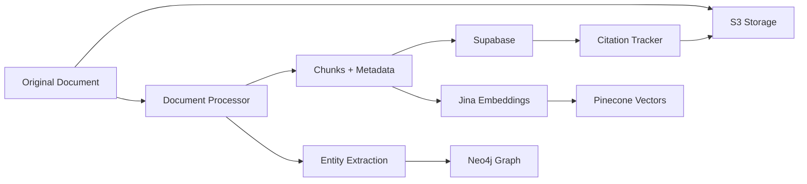

# Database Architecture

## Overview
Project Seldon uses a multi-database architecture optimized for different data types and query patterns:

1. **Supabase (PostgreSQL)** - Structured data and metadata
2. **Pinecone** - Vector embeddings for semantic search
3. **Neo4j** - Graph relationships between entities
4. **AWS S3** - Document storage and citations

## Supabase Schema

### Core Tables

#### documents
Stores original document metadata and references to S3 storage.

```sql
CREATE TABLE documents (
    id UUID PRIMARY KEY DEFAULT uuid_generate_v4(),
    title TEXT NOT NULL,
    content TEXT,
    source_path TEXT NOT NULL,
    s3_bucket TEXT,
    s3_key TEXT,
    file_type VARCHAR(50) NOT NULL,
    file_size BIGINT NOT NULL,
    hash VARCHAR(64) NOT NULL UNIQUE,
    metadata JSONB DEFAULT '{}',
    created_at TIMESTAMP WITH TIME ZONE DEFAULT NOW(),
    updated_at TIMESTAMP WITH TIME ZONE DEFAULT NOW(),
    processed_at TIMESTAMP WITH TIME ZONE
);
```

**Key Points:**
- `hash` ensures no duplicate documents
- `metadata` stores flexible document properties
- `s3_key` links to original document in S3

#### chunks
Document chunks with vector embeddings for semantic search.

```sql
CREATE TABLE chunks (
    id UUID PRIMARY KEY DEFAULT uuid_generate_v4(),
    document_id UUID NOT NULL REFERENCES documents(id) ON DELETE CASCADE,
    chunk_index INTEGER NOT NULL,
    content TEXT NOT NULL,
    start_char INTEGER NOT NULL,
    end_char INTEGER NOT NULL,
    embedding vector(768),
    metadata JSONB DEFAULT '{}',
    tokens INTEGER,
    created_at TIMESTAMP WITH TIME ZONE DEFAULT NOW()
);
```

**Key Points:**
- `embedding` stores 768-dimensional Jina vectors
- `start_char`/`end_char` enable exact citation tracking
- `chunk_index` maintains document order

#### citations
Exact quotes with character-level positions for citation tracking.

```sql
CREATE TABLE citations (
    id UUID PRIMARY KEY DEFAULT uuid_generate_v4(),
    chunk_id UUID NOT NULL REFERENCES chunks(id) ON DELETE CASCADE,
    quote TEXT NOT NULL,
    start_position INTEGER NOT NULL,
    end_position INTEGER NOT NULL,
    context TEXT,
    confidence FLOAT DEFAULT 1.0,
    metadata JSONB DEFAULT '{}',
    created_at TIMESTAMP WITH TIME ZONE DEFAULT NOW()
);
```

### Supporting Tables

#### processing_logs
Tracks ETL pipeline execution for monitoring and debugging.

```sql
CREATE TABLE processing_logs (
    id UUID PRIMARY KEY DEFAULT uuid_generate_v4(),
    document_id UUID REFERENCES documents(id),
    batch_id UUID,
    status VARCHAR(50) NOT NULL DEFAULT 'pending',
    stage VARCHAR(100),
    started_at TIMESTAMP WITH TIME ZONE DEFAULT NOW(),
    completed_at TIMESTAMP WITH TIME ZONE,
    duration_ms INTEGER,
    error TEXT,
    metadata JSONB DEFAULT '{}'
);
```

#### etl_checkpoints
Enables resumable processing after interruptions.

```sql
CREATE TABLE etl_checkpoints (
    id UUID PRIMARY KEY DEFAULT uuid_generate_v4(),
    batch_id UUID NOT NULL,
    checkpoint_type VARCHAR(50) NOT NULL,
    checkpoint_data JSONB NOT NULL,
    created_at TIMESTAMP WITH TIME ZONE DEFAULT NOW(),
    expires_at TIMESTAMP WITH TIME ZONE
);
```

### Indexes

```sql
-- Performance indexes
CREATE INDEX idx_chunks_embedding ON chunks 
  USING ivfflat (embedding vector_cosine_ops) 
  WITH (lists = 100);

CREATE INDEX idx_documents_hash ON documents(hash);
CREATE INDEX idx_chunks_document_id ON chunks(document_id);
CREATE INDEX idx_citations_chunk_id ON citations(chunk_id);
```

### Functions

#### Vector Similarity Search
```sql
CREATE FUNCTION search_similar_chunks(
    query_embedding vector(768),
    match_count integer DEFAULT 10
)
RETURNS TABLE (
    chunk_id uuid,
    document_id uuid,
    content text,
    similarity float
) AS $$
BEGIN
    RETURN QUERY
    SELECT 
        c.id as chunk_id,
        c.document_id,
        c.content,
        1 - (c.embedding <=> query_embedding) as similarity
    FROM chunks c
    ORDER BY c.embedding <=> query_embedding
    LIMIT match_count;
END;
$$ LANGUAGE plpgsql;
```

## Pinecone Configuration

### Index Setup
```python
index_name = "nightingale"
dimension = 768  # Jina embedding dimension
metric = "cosine"
pods = 1
pod_type = "p1.x1"
```

### Namespace Strategy
- `energy-reports`: Energy sector documents
- `manufacturing-reports`: Manufacturing documents
- `threat-intelligence`: Threat reports
- `vendor-analysis`: Vendor assessments

### Metadata Schema
```json
{
  "document_id": "uuid",
  "chunk_index": 0,
  "document_type": "annual_report",
  "vendor": "Microsoft",
  "year": 2025,
  "sector": "technology",
  "file_type": "pdf",
  "tokens": 512
}
```

## Neo4j Graph Model

### Node Types

#### Document
```cypher
(d:Document {
  id: "uuid",
  title: "string",
  type: "report|analysis|brief",
  source: "path",
  date: datetime
})
```

#### Entity
```cypher
(e:Entity {
  id: "uuid",
  name: "string",
  type: "organization|person|technology",
  sector: "string"
})
```

#### Threat
```cypher
(t:Threat {
  id: "uuid",
  name: "string",
  type: "ransomware|apt|vulnerability",
  severity: "high|medium|low"
})
```

### Relationships

```cypher
// Document mentions entity
(d:Document)-[:MENTIONS {count: 5, confidence: 0.9}]->(e:Entity)

// Entity relates to threat
(e:Entity)-[:VULNERABLE_TO {severity: "high"}]->(t:Threat)

// Documents reference each other
(d1:Document)-[:REFERENCES {section: "page 5"}]->(d2:Document)

// Threat targets entity
(t:Threat)-[:TARGETS {campaigns: 3}]->(e:Entity)
```

### Indexes & Constraints

```cypher
// Unique constraints
CREATE CONSTRAINT ON (d:Document) ASSERT d.id IS UNIQUE;
CREATE CONSTRAINT ON (e:Entity) ASSERT e.id IS UNIQUE;
CREATE CONSTRAINT ON (t:Threat) ASSERT t.id IS UNIQUE;

// Performance indexes
CREATE INDEX ON :Document(title);
CREATE INDEX ON :Entity(name);
CREATE INDEX ON :Threat(type);
```

## S3 Storage Structure

```
project_aeon_dt/
├── documents/
│   ├── 2025/
│   │   ├── 06/
│   │   │   ├── 13/
│   │   │   │   ├── pdf/
│   │   │   │   │   └── {document_id}/
│   │   │   │   │       └── original.pdf
│   │   │   │   ├── office/
│   │   │   │   ├── markdown/
│   │   │   │   └── images/
├── embeddings/
│   └── {document_id}.json
├── citations/
│   └── {document_id}.json
└── metadata/
    └── {document_id}.json
```

## Data Flow



## Query Patterns

### Semantic Search
```typescript
// Find similar content
const results = await searchSimilarChunks(
  queryEmbedding,
  10,
  { vendor: "Microsoft", year: 2025 }
);
```

### Graph Traversal
```cypher
// Find all threats targeting energy companies
MATCH (t:Threat)-[:TARGETS]->(e:Entity {sector: "energy"})
RETURN t.name, e.name, COUNT(*) as impact
ORDER BY impact DESC
```

### Citation Lookup
```sql
-- Get full citation context
SELECT * FROM get_citation_context('citation-uuid');
```

## Performance Optimization

1. **Batch Processing**: Process documents in batches of 100
2. **Parallel Uploads**: Use 5 concurrent S3 uploads
3. **Vector Indexing**: IVFFlat with 100 lists for fast similarity search
4. **Connection Pooling**: 20 connections for Supabase, 10 for Neo4j
5. **Caching**: Redis for frequently accessed embeddings

## Backup & Recovery

1. **Supabase**: Daily automated backups, point-in-time recovery
2. **Pinecone**: Collection snapshots every 6 hours
3. **Neo4j**: Daily graph exports to S3
4. **S3**: Cross-region replication enabled

## Security

1. **Encryption**: All data encrypted at rest and in transit
2. **Access Control**: Row-level security in Supabase
3. **API Keys**: Rotated monthly, stored in environment variables
4. **Audit Logs**: All database operations logged
5. **Network**: VPC peering for secure connections