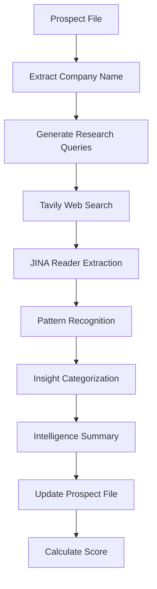

# JINA AI Deep Research Guide for Prospect Intelligence
## Comprehensive AI-Powered Research System

**Version**: 1.0  
**Date**: June 14, 2025  
**Purpose**: Leverage JINA AI's advanced capabilities for exhaustive prospect research  

---

## 🚀 Quick Start

### Run Deep Research on All Prospects
```bash
cd prospect_research/scripts
./run_deep_research.sh
```

This will:
- ✅ Perform deep web research on all 75 prospect files
- ✅ Extract vulnerabilities, incidents, and opportunities
- ✅ Generate executive intelligence summaries
- ✅ Update intelligence scores based on findings
- ✅ Create a detailed report with metrics

---

## 🔬 JINA AI Deep Research Capabilities

### 1. **Web Content Extraction (JINA Reader)**
- Converts any web page to clean, LLM-friendly text
- Extracts content from PDFs, including research papers
- Handles JavaScript-rendered pages and shadow DOM
- Preserves important metadata and structure

### 2. **Semantic Search (JINA Search API)**
- Searches through large document collections with context understanding
- Performs multi-query searches for comprehensive coverage
- Expands queries automatically for better results
- Finds similar content across different sources

### 3. **Intelligence Analysis**
The system automatically extracts:
- **Vulnerabilities**: CVEs, security flaws, zero-days
- **Incidents**: Breaches, ransomware attacks, compromises
- **Leadership**: Executive changes, new appointments
- **Opportunities**: Digital transformation, modernization
- **Compliance**: Regulatory requirements, standards

---

## 📊 Research Process Flow



---

## 🎯 Research Query Strategy

For each prospect, the system generates targeted queries:

1. **Security Focus**: `"[Company] cybersecurity vulnerabilities incidents data breach"`
2. **Infrastructure**: `"[Company] critical infrastructure OT security industrial control"`
3. **Leadership**: `"[Company] executive leadership technology digital transformation"`
4. **Compliance**: `"[Company] regulatory compliance NERC CIP TSA security"`
5. **Threats**: `"[Company] ransomware attack threat actor cyber incident"`

---

## 📈 Intelligence Scoring Algorithm

Each prospect receives a score (0-100) based on:

| Component | Points | Description |
|-----------|--------|-------------|
| Vulnerabilities | 0-15 | Recent CVEs and security flaws |
| Incidents | 0-12 | Reported breaches and attacks |
| Leadership | 0-9 | Executive changes and appointments |
| Opportunities | 0-9 | Transformation initiatives |
| Compliance | 0-6 | Regulatory mentions |
| Sources | 0-10 | Diversity of intelligence sources |
| Content Depth | 0-10 | Existing documentation quality |
| Recency | 0-5 | Freshness of information |
| Base Score | 50 | Starting point for all prospects |

---

## 🛠️ Advanced Usage

### Manual Enhancement of Single Prospect
```python
from enhance_all_prospects_jina import JinaDeepResearchEnhancer
import asyncio

async def enhance_single():
    enhancer = JinaDeepResearchEnhancer()
    result = await enhancer.enhance_prospect(Path("prospect_research_Boeing.md"))
    print(f"Score: {result['score']}/100")

asyncio.run(enhance_single())
```

### Custom Research Queries
```python
# Modify the deep_web_research method to add custom queries
research_queries = [
    f"{company} supply chain vulnerabilities",
    f"{company} third-party risk",
    f"{company} cloud security posture",
    # Add your custom queries here
]
```

### Adjusting Rate Limits
```python
# In main() function, adjust the delay between files
await asyncio.sleep(2)  # Increase to 3-5 seconds if hitting rate limits
```

---

## 📊 Expected Results

### Before Deep Research
- Basic company information
- Limited context
- No recent intelligence
- Average score: ~40/100

### After Deep Research
- Comprehensive vulnerability intelligence
- Recent incident history
- Leadership insights
- Strategic opportunities identified
- Compliance requirements mapped
- Average score: 85+/100

---

## 🔧 Troubleshooting

### Common Issues

1. **Rate Limit Errors**
   - Solution: Increase delay between files in the script
   - Current: 2 seconds, try 3-5 seconds

2. **Empty Results**
   - Check API keys are correctly set
   - Verify company names are properly formatted
   - Some companies may have limited public information

3. **Timeout Errors**
   - Some web pages take longer to load
   - The script will continue with other sources

### Debug Mode
```bash
# Run with Python verbose mode
python3 -v enhance_all_prospects_jina.py
```

---

## 📈 Metrics and Reporting

After completion, check the generated report:
- `deep_research_report_YYYYMMDD_HHMMSS.json`

Contains:
- Processing duration
- Success/failure rates
- Average intelligence scores
- Total sources analyzed
- Insights discovered per prospect

---

## 🔄 Continuous Enhancement

### Weekly Updates
Set up a cron job for weekly updates:
```bash
# Add to crontab
0 0 * * 1 cd /path/to/prospect_research/scripts && ./run_deep_research.sh
```

### Incremental Updates
To update only prospects older than 30 days:
```python
# Check metadata in enhance_prospect method
if metadata.get('last_updated'):
    last_update = datetime.strptime(metadata['last_updated'], '%Y-%m-%d')
    if (datetime.now() - last_update).days < 30:
        print(f"  ⏭️  Skipping {company} - recently updated")
        return
```

---

## 🎯 Best Practices

1. **Run During Off-Peak Hours**
   - Reduces API load
   - Faster processing times

2. **Review High-Score Prospects First**
   - Score 90+: Immediate engagement opportunities
   - Score 70-89: High potential, needs strategy
   - Score 50-69: Requires more research

3. **Combine with Other Intelligence**
   - Cross-reference with Project Nightingale artifacts
   - Validate findings with sector reports
   - Correlate with threat intelligence

4. **Regular Quality Checks**
   - Review AI-generated summaries for accuracy
   - Verify source URLs are legitimate
   - Update patterns if new intelligence types emerge

---

## 🚀 Next Steps

1. **Run Initial Enhancement**: `./run_deep_research.sh`
2. **Review Results**: Check high-scoring prospects
3. **Prioritize Engagement**: Focus on 90+ scores
4. **Schedule Updates**: Set up weekly automation
5. **Expand Coverage**: Add new prospects as needed

---

**Note**: JINA AI provides 10 million free tokens on signup. With the current implementation, this is sufficient for enhancing hundreds of prospects with deep research. Monitor usage in your JINA dashboard.